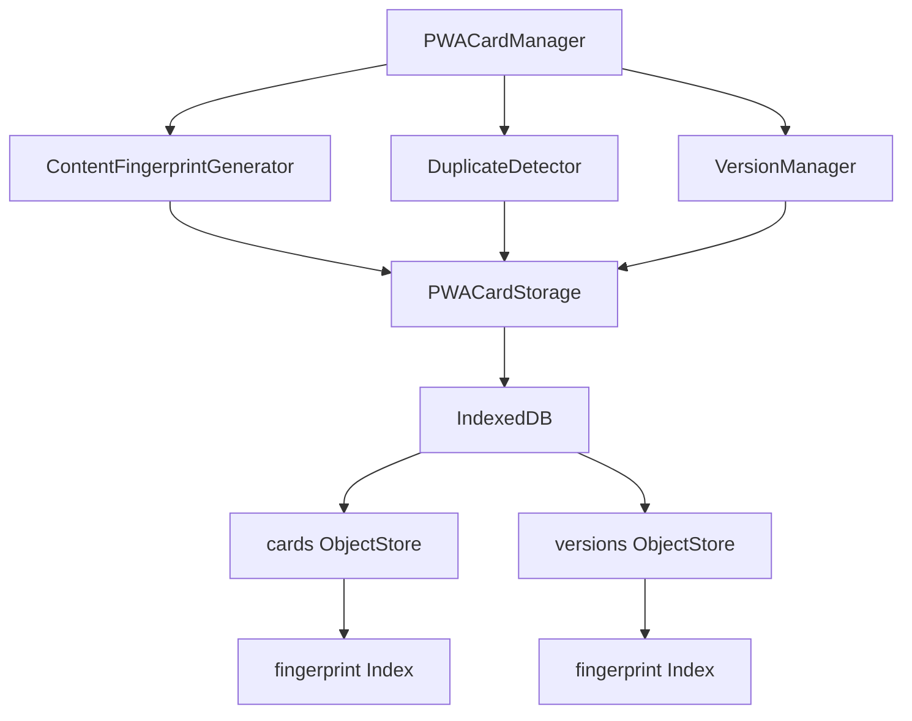

# PWA 版本管理與重複識別 API 文檔

## 概述

本文檔描述 PWA 名片儲存系統中版本管理與重複識別功能的 API 接口。系統基於 IndexedDB 提供完全離線的版本控制和重複檢測能力。

## 核心模組架構



## 1. ContentFingerprintGenerator

### 1.1 類別初始化

```javascript
const generator = new ContentFingerprintGenerator();
```

### 1.2 generateFingerprint()

生成名片內容指紋，基於 SHA-256 算法。

**語法**
```javascript
async generateFingerprint(cardData)
```

**參數**
- `cardData` (Object): 名片資料物件

**返回值**
- `Promise<string>`: 格式為 `fingerprint_[64字元hash]` 的指紋字串

**範例**
```javascript
const cardData = {
  name: "蔡孟諭~Tsai Meng-Yu",
  email: "mie66@moda.gov.tw"
};

const fingerprint = await generator.generateFingerprint(cardData);
// 返回: "fingerprint_1dacb8143d3872e6c92c94959d0974dbedb5a2c8e435a4b7b5026c89e2fbf997"
```

**錯誤處理**
- 輸入驗證失敗時拋出 `Error('Invalid card data')`
- SHA-256 計算失敗時自動使用備用算法
- 備用算法失敗時返回 `fingerprint_error_[timestamp]`

### 1.3 validateFingerprint()

驗證指紋格式是否正確。

**語法**
```javascript
validateFingerprint(fingerprint)
```

**參數**
- `fingerprint` (string): 待驗證的指紋字串

**返回值**
- `boolean`: 格式正確返回 `true`，否則返回 `false`

**支援格式**
- 標準格式: `fingerprint_[64字元hex]`
- 備用格式: `fingerprint_fallback_[8字元hex]_[timestamp]`
- 錯誤格式: `fingerprint_error_[timestamp]`

### 1.4 雙語標準化處理

系統自動處理以下雙語格式：

**字串格式**
```javascript
"蔡孟諭~Tsai Meng-Yu" → "蔡孟諭~Tsai Meng-Yu" (保持原格式)
```

**物件格式**
```javascript
{
  zh: "蔡孟諭",
  en: "Tsai Meng-Yu"
} → "蔡孟諭~Tsai Meng-Yu"
```

## 2. DuplicateDetector

### 2.1 類別初始化

```javascript
const detector = new DuplicateDetector(storage);
await detector.initialize();
```

### 2.2 detectDuplicates()

檢測重複名片。

**語法**
```javascript
async detectDuplicates(cardData)
```

**參數**
- `cardData` (Object): 待檢測的名片資料

**返回值**
```javascript
{
  isDuplicate: boolean,
  fingerprint: string,
  duplicateCount: number,
  existingCards: Array<{
    id: string,
    name: string,
    created: Date,
    modified: Date,
    version: number
  }>,
  recommendation: 'create' | 'overwrite' | 'version'
}
```

**範例**
```javascript
const result = await detector.detectDuplicates(cardData);

if (result.isDuplicate) {
  console.log(`發現 ${result.duplicateCount} 張重複名片`);
  console.log(`建議操作: ${result.recommendation}`);
}
```

### 2.3 handleDuplicate()

處理重複名片。

**語法**
```javascript
async handleDuplicate(cardData, action, existingCardId)
```

**參數**
- `cardData` (Object): 名片資料
- `action` (string): 處理動作 - `'skip'`, `'overwrite'`, `'version'`
- `existingCardId` (string): 現有名片ID（overwrite時必需）

**返回值**
```javascript
{
  success: boolean,
  action: string,
  cardId?: string,
  message: string,
  error?: string
}
```

**範例**
```javascript
// 建立新版本
const result = await detector.handleDuplicate(cardData, 'version');

// 覆蓋現有名片
const result = await detector.handleDuplicate(cardData, 'overwrite', 'card_123');

// 跳過重複名片
const result = await detector.handleDuplicate(cardData, 'skip');
```

## 3. VersionManager

### 3.1 類別初始化

```javascript
const versionManager = new VersionManager(storage);
```

### 3.2 incrementVersion()

自動遞增版本號。

**語法**
```javascript
async incrementVersion(cardId)
```

**參數**
- `cardId` (string): 名片ID

**返回值**
- `Promise<number>`: 新版本號

**版本規則**
- 語義化版本: 1.0 → 1.1 → 1.2 → 2.0
- 當 minor 版本達到 10 時，major 版本遞增

### 3.3 getVersionHistory()

獲取版本歷史。

**語法**
```javascript
async getVersionHistory(cardId)
```

**參數**
- `cardId` (string): 名片ID

**返回值**
```javascript
{
  cardId: string,
  versions: Array<{
    id: string,
    version: number,
    data: Object,
    timestamp: Date,
    changeType: string,
    description: string,
    checksum: string
  }>,
  currentVersion: number,
  totalVersions: number,
  maxVersions: number
}
```

### 3.4 restoreToVersion()

還原到指定版本。

**語法**
```javascript
async restoreToVersion(cardId, targetVersion)
```

**參數**
- `cardId` (string): 名片ID
- `targetVersion` (number): 目標版本號

**返回值**
```javascript
{
  success: boolean,
  restoredVersion?: number,
  data?: Object,
  error?: string
}
```

## 4. 資料模型

### 4.1 擴展的名片結構

```javascript
{
  id: "card_1754342513449_6xpymi9oi",
  type: "bilingual",
  fingerprint: "fingerprint_1dacb8143d3872e6c92c94959d0974dbedb5a2c8e435a4b7b5026c89e2fbf997",
  data: {
    name: "蔡孟諭~Tsai Meng-Yu",
    title: "分析師~Systems Analyst",
    department: "資訊處",
    email: "mie66@moda.gov.tw",
    phone: "02-23800432",
    mobile: "0977-0735-47"
  },
  created: "2025-08-04T21:21:53.449Z",
  modified: "2025-08-04T21:21:53.449Z",
  currentVersion: 1,
  version: "1.0",
  checksum: "...",
  encrypted: false
}
```

## 5. 效能考量

### 5.1 效能指標

- **指紋生成時間**: ≤ 100ms per card
- **重複檢測時間**: ≤ 200ms per card  
- **版本歷史載入**: ≤ 500ms for 10 versions
- **批量處理效率**: ≥ 50 cards/second

### 5.2 最佳化建議

1. **批量操作**: 使用 `generateBatchFingerprints()` 處理多張名片
2. **索引查詢**: 利用 fingerprint 索引加速重複檢測
3. **版本限制**: 保持版本歷史在 10 個以內
4. **事務管理**: 使用 `safeTransaction()` 確保資料一致性

---

**最後更新**: 2025-08-04  
**API 版本**: v3.1.1  
**相容性**: PWA Card Storage v1.1.0+