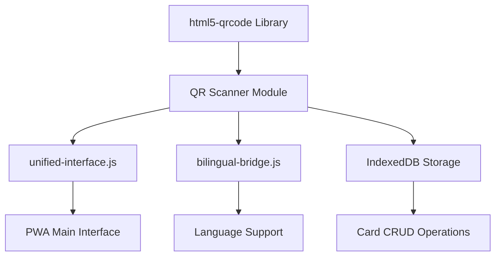
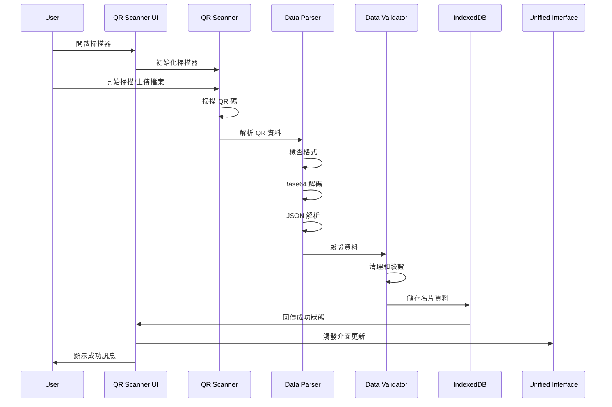
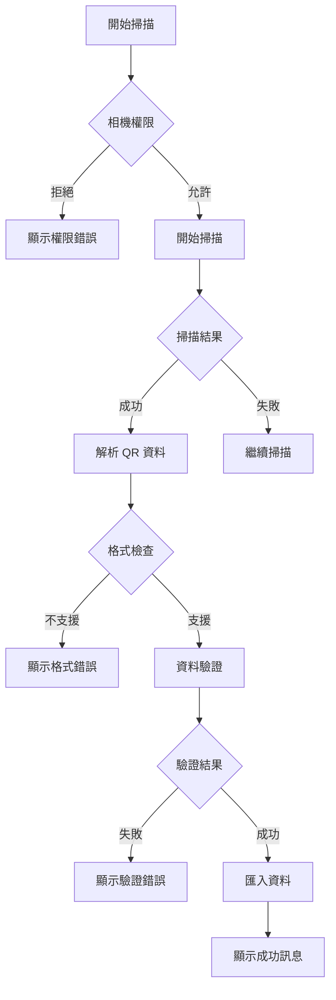

# PWA-19 QR 碼掃描功能整合技術規格

## 1. 系統架構概述

### 1.1 整合目標
整合 [html5-qrcode](https://github.com/mebjas/html5-qrcode) 函式庫到現有 PWA 架構中，實現：
- 相機即時掃描 QR 碼功能
- 檔案上傳掃描功能
- DB-Card 格式 QR 碼解析
- 掃描結果自動匯入到 IndexedDB

### 1.2 架構整合點



### 1.3 模組依賴關係
- **html5-qrcode**: 核心掃描功能
- **unified-interface.js**: UI 整合和事件管理
- **bilingual-bridge.js**: 雙語支援
- **card-manager.js**: 資料儲存和 CRUD 操作
- **data-validator.js**: 資料驗證和清理

## 2. 技術實作設計

### 2.1 QR 掃描器模組架構

```javascript
// qr-scanner.js - 核心掃描模組
class QRScanner {
    constructor(options = {}) {
        this.html5QrCode = null;
        this.isScanning = false;
        this.config = {
            fps: 10,
            qrbox: { width: 250, height: 250 },
            aspectRatio: 1.0,
            ...options
        };
        this.callbacks = {
            onSuccess: null,
            onError: null,
            onPermissionDenied: null
        };
    }

    // 初始化掃描器
    async initialize(elementId) {
        try {
            this.html5QrCode = new Html5Qrcode(elementId);
            return true;
        } catch (error) {
            console.error('QR Scanner initialization failed:', error);
            return false;
        }
    }

    // 開始相機掃描
    async startCameraScanning() {
        if (this.isScanning) return;
        
        try {
            await this.html5QrCode.start(
                { facingMode: "environment" },
                this.config,
                this.onScanSuccess.bind(this),
                this.onScanError.bind(this)
            );
            this.isScanning = true;
        } catch (error) {
            this.handlePermissionError(error);
        }
    }

    // 檔案掃描
    async scanFile(file) {
        try {
            const result = await this.html5QrCode.scanFile(file, true);
            this.onScanSuccess(result);
        } catch (error) {
            this.onScanError(error);
        }
    }

    // 停止掃描
    async stopScanning() {
        if (!this.isScanning) return;
        
        try {
            await this.html5QrCode.stop();
            this.isScanning = false;
        } catch (error) {
            console.error('Failed to stop scanning:', error);
        }
    }

    // 掃描成功處理
    onScanSuccess(decodedText, decodedResult) {
        this.processQRData(decodedText);
    }

    // 掃描錯誤處理
    onScanError(error) {
        // 靜默處理掃描錯誤，避免過多日誌
        if (this.callbacks.onError) {
            this.callbacks.onError(error);
        }
    }

    // 處理 QR 碼資料
    async processQRData(qrData) {
        try {
            const cardData = await this.parseDBCardData(qrData);
            if (cardData) {
                await this.importCardData(cardData);
                if (this.callbacks.onSuccess) {
                    this.callbacks.onSuccess(cardData);
                }
            }
        } catch (error) {
            console.error('QR data processing failed:', error);
            if (this.callbacks.onError) {
                this.callbacks.onError(error);
            }
        }
    }
}
```

### 2.2 DB-Card 資料解析器

```javascript
// qr-data-parser.js - DB-Card 格式解析器
class DBCardDataParser {
    constructor() {
        this.supportedFormats = [
            'nfc-generator',      // 標準生成器格式
            'nfc-generator-bilingual'  // 雙語生成器格式
        ];
    }

    // 解析 QR 碼資料
    async parseQRData(qrText) {
        try {
            // 檢查是否為 DB-Card URL 格式
            if (!this.isDBCardURL(qrText)) {
                throw new Error('不支援的 QR 碼格式');
            }

            // 提取資料參數
            const dataParam = this.extractDataParameter(qrText);
            if (!dataParam) {
                throw new Error('無法提取資料參數');
            }

            // Base64 解碼
            const decodedData = this.decodeBase64Data(dataParam);
            
            // JSON 解析
            const cardData = JSON.parse(decodedData);
            
            // 資料驗證
            const validatedData = await this.validateCardData(cardData);
            
            return validatedData;
        } catch (error) {
            console.error('QR data parsing failed:', error);
            throw error;
        }
    }

    // 檢查是否為 DB-Card URL
    isDBCardURL(url) {
        const dbCardPatterns = [
            /index\.html\?data=/,
            /index-en\.html\?data=/,
            /index1\.html\?data=/,
            /index1-en\.html\?data=/,
            /index-personal\.html\?data=/,
            /index-personal-en\.html\?data=/,
            /index-bilingual\.html\?data=/,
            /index-bilingual-personal\.html\?data=/
        ];
        
        return dbCardPatterns.some(pattern => pattern.test(url));
    }

    // 提取資料參數
    extractDataParameter(url) {
        const match = url.match(/[?&]data=([^&]+)/);
        return match ? decodeURIComponent(match[1]) : null;
    }

    // Base64 解碼
    decodeBase64Data(base64Data) {
        try {
            return atob(base64Data);
        } catch (error) {
            throw new Error('Base64 解碼失敗');
        }
    }

    // 資料驗證
    async validateCardData(cardData) {
        const validator = new DataValidator();
        
        // 基本結構驗證
        if (!cardData.data) {
            throw new Error('缺少資料結構');
        }

        const data = cardData.data;
        
        // 必要欄位驗證
        const requiredFields = ['name'];
        for (const field of requiredFields) {
            if (!data[field]) {
                throw new Error(`缺少必要欄位: ${field}`);
            }
        }

        // 資料清理和驗證
        const cleanedData = {
            name: validator.sanitizeText(data.name),
            title: validator.sanitizeText(data.title || ''),
            department: validator.sanitizeText(data.department || ''),
            organization: validator.sanitizeText(data.organization || ''),
            email: validator.validateEmail(data.email || ''),
            phone: validator.sanitizeText(data.phone || ''),
            mobile: validator.sanitizeText(data.mobile || ''),
            avatar: validator.validateURL(data.avatar || ''),
            address: validator.sanitizeText(data.address || ''),
            greetings: Array.isArray(data.greetings) ? 
                data.greetings.map(g => validator.sanitizeText(g)) : [],
            socialLinks: data.socialLinks || {}
        };

        return { data: cleanedData };
    }
}
```

### 2.3 使用者介面整合

```javascript
// qr-scanner-ui.js - 掃描介面管理
class QRScannerUI {
    constructor() {
        this.scanner = new QRScanner();
        this.parser = new DBCardDataParser();
        this.isInitialized = false;
        this.currentLanguage = 'zh';
    }

    // 初始化掃描介面
    async initialize() {
        if (this.isInitialized) return;

        try {
            await this.createScannerInterface();
            await this.scanner.initialize('qr-scanner-container');
            this.bindEvents();
            this.isInitialized = true;
        } catch (error) {
            console.error('Scanner UI initialization failed:', error);
            throw error;
        }
    }

    // 創建掃描介面
    async createScannerInterface() {
        const container = document.createElement('div');
        container.id = 'qr-scanner-modal';
        container.className = 'qr-scanner-modal';
        
        container.innerHTML = `
            <div class="qr-scanner-content">
                <div class="qr-scanner-header">
                    <h3 data-i18n="qr.scanner.title">掃描 QR 碼</h3>
                    <button class="close-btn" id="close-scanner">×</button>
                </div>
                
                <div class="qr-scanner-tabs">
                    <button class="tab-btn active" data-tab="camera" data-i18n="qr.scanner.camera">相機掃描</button>
                    <button class="tab-btn" data-tab="file" data-i18n="qr.scanner.file">檔案上傳</button>
                </div>
                
                <div class="qr-scanner-body">
                    <div id="camera-tab" class="tab-content active">
                        <div id="qr-scanner-container"></div>
                        <div class="scanner-controls">
                            <button id="start-scan" class="btn-primary" data-i18n="qr.scanner.start">開始掃描</button>
                            <button id="stop-scan" class="btn-secondary" data-i18n="qr.scanner.stop">停止掃描</button>
                        </div>
                    </div>
                    
                    <div id="file-tab" class="tab-content">
                        <div class="file-upload-area">
                            <input type="file" id="qr-file-input" accept="image/*" style="display: none;">
                            <div class="upload-zone" id="upload-zone">
                                <i class="upload-icon">📷</i>
                                <p data-i18n="qr.scanner.upload">點擊或拖拽上傳 QR 碼圖片</p>
                            </div>
                        </div>
                    </div>
                </div>
                
                <div class="qr-scanner-status" id="scanner-status"></div>
            </div>
        `;
        
        document.body.appendChild(container);
        
        // 應用雙語翻譯
        if (window.bilingualBridge) {
            window.bilingualBridge.translateElement(container);
        }
    }

    // 綁定事件
    bindEvents() {
        // 關閉按鈕
        document.getElementById('close-scanner').addEventListener('click', () => {
            this.closeScannerModal();
        });

        // 標籤切換
        document.querySelectorAll('.tab-btn').forEach(btn => {
            btn.addEventListener('click', (e) => {
                this.switchTab(e.target.dataset.tab);
            });
        });

        // 相機掃描控制
        document.getElementById('start-scan').addEventListener('click', () => {
            this.startCameraScanning();
        });

        document.getElementById('stop-scan').addEventListener('click', () => {
            this.stopScanning();
        });

        // 檔案上傳
        document.getElementById('upload-zone').addEventListener('click', () => {
            document.getElementById('qr-file-input').click();
        });

        document.getElementById('qr-file-input').addEventListener('change', (e) => {
            if (e.target.files.length > 0) {
                this.scanFile(e.target.files[0]);
            }
        });

        // 拖拽上傳
        const uploadZone = document.getElementById('upload-zone');
        uploadZone.addEventListener('dragover', (e) => {
            e.preventDefault();
            uploadZone.classList.add('drag-over');
        });

        uploadZone.addEventListener('dragleave', () => {
            uploadZone.classList.remove('drag-over');
        });

        uploadZone.addEventListener('drop', (e) => {
            e.preventDefault();
            uploadZone.classList.remove('drag-over');
            
            const files = e.dataTransfer.files;
            if (files.length > 0) {
                this.scanFile(files[0]);
            }
        });

        // 掃描回調
        this.scanner.callbacks = {
            onSuccess: this.onScanSuccess.bind(this),
            onError: this.onScanError.bind(this),
            onPermissionDenied: this.onPermissionDenied.bind(this)
        };
    }

    // 開啟掃描器
    openScannerModal() {
        const modal = document.getElementById('qr-scanner-modal');
        if (modal) {
            modal.style.display = 'flex';
            document.body.style.overflow = 'hidden';
        }
    }

    // 關閉掃描器
    closeScannerModal() {
        this.stopScanning();
        const modal = document.getElementById('qr-scanner-modal');
        if (modal) {
            modal.style.display = 'none';
            document.body.style.overflow = '';
        }
    }

    // 掃描成功處理
    async onScanSuccess(cardData) {
        try {
            // 停止掃描
            await this.stopScanning();
            
            // 顯示成功訊息
            this.showStatus('success', '掃描成功！正在匯入名片資料...');
            
            // 匯入資料到 IndexedDB
            const cardManager = window.cardManager;
            if (cardManager) {
                await cardManager.addCard(cardData.data);
                this.showStatus('success', '名片已成功匯入！');
                
                // 延遲關閉模態框
                setTimeout(() => {
                    this.closeScannerModal();
                    // 觸發介面更新
                    if (window.unifiedInterface) {
                        window.unifiedInterface.refreshCardList();
                    }
                }, 2000);
            }
        } catch (error) {
            console.error('Card import failed:', error);
            this.showStatus('error', '名片匯入失敗：' + error.message);
        }
    }

    // 掃描錯誤處理
    onScanError(error) {
        // 只顯示重要錯誤
        if (error.message && !error.message.includes('No QR code found')) {
            this.showStatus('error', '掃描錯誤：' + error.message);
        }
    }

    // 權限被拒處理
    onPermissionDenied(error) {
        this.showStatus('error', '相機權限被拒絕，請在瀏覽器設定中允許相機存取權限。');
    }

    // 顯示狀態訊息
    showStatus(type, message) {
        const statusElement = document.getElementById('scanner-status');
        if (statusElement) {
            statusElement.className = `qr-scanner-status ${type}`;
            statusElement.textContent = message;
            
            // 自動清除訊息
            setTimeout(() => {
                statusElement.textContent = '';
                statusElement.className = 'qr-scanner-status';
            }, 5000);
        }
    }
}
```

## 3. 資料流程設計

### 3.1 掃描流程圖



### 3.2 錯誤處理流程



## 4. 安全實作規範

### 4.1 資料驗證和清理

```javascript
// data-validator.js - 資料驗證器
class DataValidator {
    constructor() {
        this.maxTextLength = 500;
        this.maxURLLength = 2000;
        this.emailRegex = /^[^\s@]+@[^\s@]+\.[^\s@]+$/;
        this.urlRegex = /^https?:\/\/.+/;
    }

    // 文字清理
    sanitizeText(text) {
        if (typeof text !== 'string') return '';
        
        return text
            .trim()
            .substring(0, this.maxTextLength)
            .replace(/<script\b[^<]*(?:(?!<\/script>)<[^<]*)*<\/script>/gi, '') // 移除 script 標籤
            .replace(/javascript:/gi, '') // 移除 javascript: 協議
            .replace(/on\w+\s*=/gi, ''); // 移除事件處理器
    }

    // Email 驗證
    validateEmail(email) {
        if (!email) return '';
        
        const sanitized = this.sanitizeText(email);
        return this.emailRegex.test(sanitized) ? sanitized : '';
    }

    // URL 驗證
    validateURL(url) {
        if (!url) return '';
        
        const sanitized = this.sanitizeText(url);
        if (sanitized.length > this.maxURLLength) return '';
        
        return this.urlRegex.test(sanitized) ? sanitized : '';
    }

    // 陣列驗證
    validateArray(arr, maxItems = 10) {
        if (!Array.isArray(arr)) return [];
        
        return arr
            .slice(0, maxItems)
            .map(item => this.sanitizeText(item))
            .filter(item => item.length > 0);
    }
}
```

### 4.2 CSP 政策相容性

```javascript
// 確保所有事件綁定使用 addEventListener
// 避免內聯事件處理器和 eval()

// ✅ 正確做法
element.addEventListener('click', handleClick);

// ❌ 避免使用
// element.onclick = handleClick;
// element.innerHTML = '<button onclick="handleClick()">Click</button>';
```

### 4.3 權限管理

```javascript
// camera-permission.js - 相機權限管理
class CameraPermissionManager {
    constructor() {
        this.permissionStatus = 'unknown';
    }

    // 檢查相機權限
    async checkCameraPermission() {
        try {
            if (navigator.permissions) {
                const permission = await navigator.permissions.query({ name: 'camera' });
                this.permissionStatus = permission.state;
                return permission.state;
            }
            return 'unknown';
        } catch (error) {
            console.error('Permission check failed:', error);
            return 'unknown';
        }
    }

    // 請求相機權限
    async requestCameraPermission() {
        try {
            const stream = await navigator.mediaDevices.getUserMedia({ video: true });
            // 立即停止串流，只是為了獲取權限
            stream.getTracks().forEach(track => track.stop());
            this.permissionStatus = 'granted';
            return true;
        } catch (error) {
            this.permissionStatus = 'denied';
            console.error('Camera permission denied:', error);
            return false;
        }
    }

    // 顯示權限指導
    showPermissionGuide() {
        const guide = `
            <div class="permission-guide">
                <h4>需要相機權限</h4>
                <p>請按照以下步驟允許相機存取：</p>
                <ol>
                    <li>點擊瀏覽器網址列左側的鎖頭圖示</li>
                    <li>選擇「網站設定」或「權限」</li>
                    <li>將相機權限設為「允許」</li>
                    <li>重新整理頁面</li>
                </ol>
            </div>
        `;
        
        // 顯示指導內容
        this.showModal(guide);
    }
}
```

## 5. 效能優化策略

### 5.1 掃描頻率控制

```javascript
// 控制掃描頻率，避免過度消耗 CPU
const scanConfig = {
    fps: 10, // 每秒 10 幀
    qrbox: { width: 250, height: 250 }, // 限制掃描區域
    aspectRatio: 1.0
};
```

### 5.2 記憶體管理

```javascript
// 確保適當清理資源
class QRScannerManager {
    async cleanup() {
        if (this.scanner && this.scanner.isScanning) {
            await this.scanner.stopScanning();
        }
        
        // 清理 DOM 元素
        const modal = document.getElementById('qr-scanner-modal');
        if (modal) {
            modal.remove();
        }
        
        // 清理事件監聽器
        this.removeEventListeners();
    }
}
```

## 6. 測試策略

### 6.1 單元測試

```javascript
// qr-scanner.test.js
describe('QR Scanner', () => {
    let scanner;
    
    beforeEach(() => {
        scanner = new QRScanner();
    });
    
    afterEach(async () => {
        if (scanner.isScanning) {
            await scanner.stopScanning();
        }
    });
    
    test('should initialize successfully', async () => {
        const result = await scanner.initialize('test-container');
        expect(result).toBe(true);
    });
    
    test('should parse DB-Card QR data correctly', async () => {
        const parser = new DBCardDataParser();
        const testURL = 'https://example.com/index.html?data=eyJkYXRhIjp7Im5hbWUiOiLmuKzor5UifX0%3D';
        
        const result = await parser.parseQRData(testURL);
        expect(result.data.name).toBe('測試');
    });
    
    test('should validate and sanitize input data', () => {
        const validator = new DataValidator();
        const maliciousInput = '<script>alert("xss")</script>測試';
        
        const result = validator.sanitizeText(maliciousInput);
        expect(result).toBe('測試');
        expect(result).not.toContain('<script>');
    });
});
```

### 6.2 整合測試

```javascript
// integration.test.js
describe('QR Scanner Integration', () => {
    test('should integrate with unified interface', async () => {
        const scannerUI = new QRScannerUI();
        await scannerUI.initialize();
        
        // 模擬掃描成功
        const mockCardData = { data: { name: '測試名片' } };
        await scannerUI.onScanSuccess(mockCardData);
        
        // 驗證資���是否正確儲存
        const cards = await window.cardManager.getAllCards();
        expect(cards.some(card => card.name === '測試名片')).toBe(true);
    });
});
```

### 6.3 跨平台測試清單

- [ ] Chrome (Desktop/Mobile)
- [ ] Firefox (Desktop/Mobile)  
- [ ] Safari (Desktop/Mobile)
- [ ] Edge (Desktop)
- [ ] 不同解析度測試
- [ ] 相機權限測試
- [ ] 離線功能測試

## 7. 部署考量

### 7.1 CDN 整合

```html
<!-- 在 PWA 主頁面中引入 html5-qrcode -->
<script src="https://unpkg.com/html5-qrcode@2.3.8/html5-qrcode.min.js"></script>
```

### 7.2 Service Worker 快取

```javascript
// 在 sw.js 中添加 html5-qrcode 快取
const CACHE_URLS = [
    // 現有快取項目...
    'https://unpkg.com/html5-qrcode@2.3.8/html5-qrcode.min.js',
    '/js/qr-scanner.js',
    '/js/qr-data-parser.js',
    '/js/qr-scanner-ui.js'
];
```

### 7.3 漸進式載入

```javascript
// 延遲載入 QR 掃描功能
async function loadQRScanner() {
    if (!window.Html5Qrcode) {
        await loadScript('https://unpkg.com/html5-qrcode@2.3.8/html5-qrcode.min.js');
    }
    
    if (!window.qrScannerUI) {
        const { QRScannerUI } = await import('./js/qr-scanner-ui.js');
        window.qrScannerUI = new QRScannerUI();
        await window.qrScannerUI.initialize();
    }
    
    return window.qrScannerUI;
}
```

## 8. 實作檢查清單

### 8.1 核心功能
- [ ] html5-qrcode 函式庫整合
- [ ] 相機掃描功能實作
- [ ] 檔案上傳掃描功能實作
- [ ] DB-Card 格式解析器
- [ ] 資料驗證和清理機制

### 8.2 使用者介面
- [ ] 掃描模態框設計
- [ ] 相機/檔案切換標籤
- [ ] 權限請求處理
- [ ] 掃描狀態顯示
- [ ] 雙語支援整合

### 8.3 系統整合
- [ ] unified-interface.js 整合
- [ ] IndexedDB 資料儲存整合
- [ ] bilingual-bridge.js 整合
- [ ] 錯誤處理機制

### 8.4 安全性
- [ ] XSS 防護實作
- [ ] 資料驗證機制
- [ ] CSP 政策相容性
- [ ] 權限管理實作

### 8.5 測試
- [ ] 單元測試撰寫
- [ ] 整合測試撰寫
- [ ] 跨平台相容性測試
- [ ] 效能測試

### 8.6 文檔
- [ ] API 文檔更新
- [ ] 使用者指南更新
- [ ] 技術文檔完善

---

## 附錄

### A. 支援的 QR 碼格式

1. **標準生成器格式** (`nfc-generator.html`)
2. **雙語生成器格式** (`nfc-generator-bilingual.html`)
3. **個人版生成器格式** (`index-personal.html`)
4. **機關版生成器格式** (`index.html`, `index1.html`)

### B. 錯誤代碼對照表

| 錯誤代碼 | 描述 | 處理方式 |
|---------|------|---------|
| QR_001 | 相機權限被拒 | 顯示權限指導 |
| QR_002 | 不支援的格式 | 提示使用正確的 QR 碼 |
| QR_003 | 資料解析失敗 | 檢查 QR 碼完整性 |
| QR_004 | 資料驗證失敗 | 顯示具體驗證錯誤 |
| QR_005 | 儲存失敗 | 檢查儲存空間和權限 |

### C. 相關資源

- [html5-qrcode 官方文檔](https://github.com/mebjas/html5-qrcode)
- [MediaDevices API 文檔](https://developer.mozilla.org/en-US/docs/Web/API/MediaDevices)
- [Permissions API 文檔](https://developer.mozilla.org/en-US/docs/Web/API/Permissions_API)