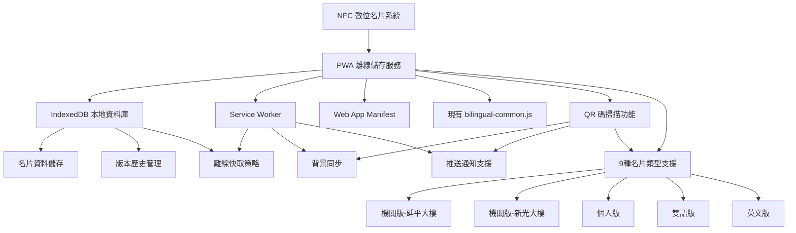
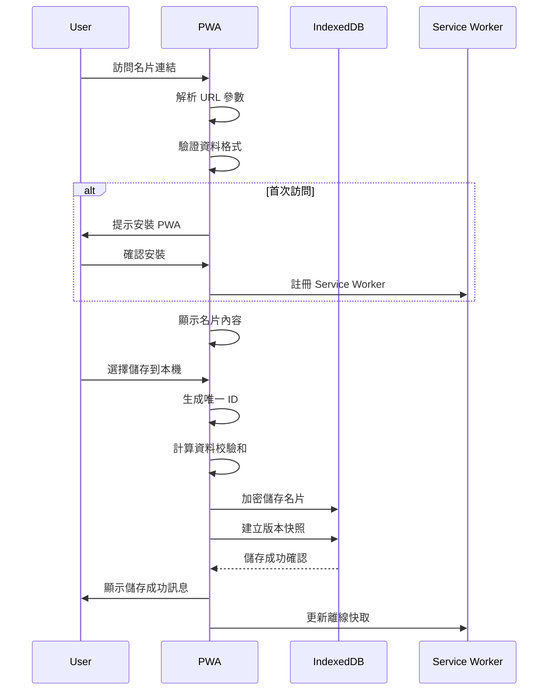
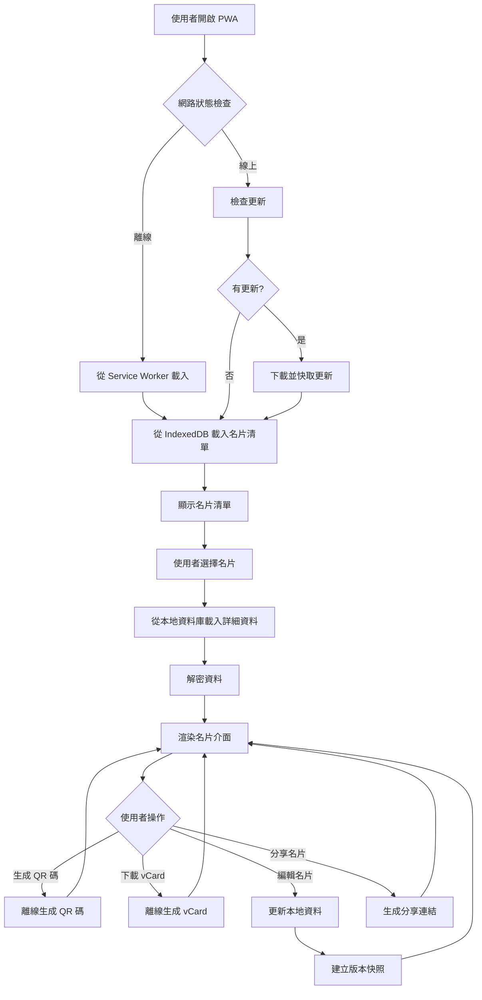
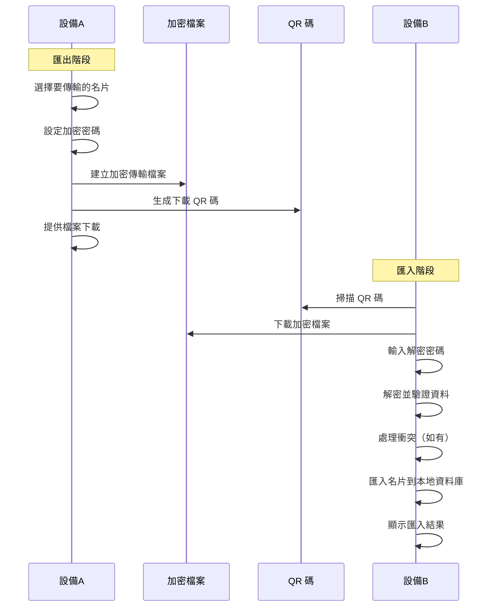
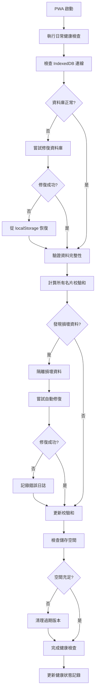

# PWA 名片離線儲存服務技術設計文件

## 1. System Architecture Overview

### 1.1 整體系統架構

基於現有 DB-Card 系統的 serverless 純前端架構，PWA 服務作為一個獨立的離線儲存容器，與現有名片系統形成協作關係。



### 1.2 技術架構層級

**展示層 (Presentation Layer)**
- PWA 使用者介面
- 響應式設計 (CSS Grid/Flexbox)
- 無障礙功能支援 (WCAG 2.1 AA)

**應用層 (Application Layer)**
- 名片資料管理邏輯
- 語言切換與國際化
- QR 碼生成與 vCard 匯出

**資料層 (Data Layer)**
- IndexedDB 離線資料庫
- localStorage 輕量備份
- Web Crypto API 加密

**網路層 (Network Layer)**
- Service Worker 快取策略
- 離線優先設計
- 檔案匯出/匯入傳輸

### 1.3 與現有系統整合方案

**資料格式相容性**
- 完全支援現有 `bilingual-common.js` 編碼格式
- 向後相容所有 9 種名片類型
- 支援現有 URL 參數傳遞方式

**共用程式庫整合**
- 繼承 `bilingual-common.js` 核心函數
- 擴展 IndexedDB 儲存功能
- 保持現有 QR 碼生成邏輯

## 2. Data Models

### 2.1 IndexedDB 資料庫結構

```typescript
// PWA 專用資料模型
interface PWACardDatabase {
  version: number;
  stores: {
    cards: CardStore;
    versions: VersionStore;
    settings: SettingsStore;
    backups: BackupStore;
  };
}

interface CardStore {
  keyPath: 'id';
  indexes: {
    type: string;
    created: Date;
    modified: Date;
    name: string;
  };
}

interface StoredCard {
  id: string;                    // UUID v4
  type: CardType;               // 名片類型
  data: CardData;               // 名片資料
  created: Date;                // 建立時間
  modified: Date;               // 修改時間
  version: number;              // 版本號
  checksum: string;             // 完整性驗證
  encrypted: boolean;           // 是否加密
  tags: string[];               // 分類標籤
  isFavorite: boolean;          // 是否為最愛
}

type CardType = 
  | 'gov-yp'                   // 機關版-延平大樓
  | 'gov-sg'                   // 機關版-新光大樓  
  | 'personal'                 // 個人版
  | 'bilingual'                // 雙語版
  | 'personal-bilingual'       // 個人雙語版
  | 'en'                       // 英文版
  | 'personal-en'              // 個人英文版
  | 'gov-yp-en'               // 機關版延平英文
  | 'gov-sg-en';              // 機關版新光英文

interface CardData {
  // 基本資訊
  name: string;                // 支援雙語格式 "中文~English"
  title: string;               // 職稱
  department?: string;         // 部門
  organization?: string;       // 組織名稱
  
  // 聯絡資訊
  email?: string;
  phone?: string;
  mobile?: string;
  
  // 多媒體
  avatar?: string;             // 頭像 URL
  
  // 社交資訊
  greetings?: string[];        // 問候語列表
  socialNote?: string;         // 社群媒體資訊
  
  // 地址資訊
  address?: string;            // 地址
  
  // 擴展欄位
  customFields?: Record<string, any>;
}
```

### 2.2 版本控制資料結構

```typescript
interface VersionHistory {
  cardId: string;              // 對應名片 ID
  versions: VersionSnapshot[]; // 版本快照（限制 10 個）
  currentVersion: number;      // 當前版本
  maxVersions: 10;            // 最大版本數
}

interface VersionSnapshot {
  version: number;             // 版本編號
  data: CardData;             // 該版本的資料快照
  timestamp: Date;            // 建立時間
  changeType: ChangeType;     // 變更類型
  changeDescription?: string; // 變更描述
  checksum: string;           // 資料校驗和
}

type ChangeType = 
  | 'create'                  // 新建
  | 'update'                  // 更新
  | 'import'                  // 匯入
  | 'restore';                // 還原
```

### 2.3 跨設備傳輸格式

```typescript
interface TransferPackage {
  version: string;             // 傳輸格式版本
  timestamp: Date;            // 建立時間
  encrypted: boolean;         // 是否加密
  password?: string;          // 加密密碼提示
  pairingCode?: string;       // 配對代碼
  
  // 資料內容
  cards: StoredCard[];        // 名片資料
  includeVersionHistory: boolean; // 是否包含版本歷史
  
  // 完整性驗證
  checksum: string;           // 整體校驗和
  signature?: string;         // 數位簽章
}

interface ExportOptions {
  cardIds?: string[];         // 指定匯出的名片 ID
  includeVersions: boolean;   // 是否包含版本歷史
  encryptWithPassword: boolean; // 是否密碼加密
  compressionLevel: 0 | 1 | 2; // 壓縮等級
}
```

### 2.4 應用程式設定資料

```typescript
interface PWASettings {
  // 使用者偏好
  preferredLanguage: 'zh' | 'en';
  theme: 'light' | 'dark' | 'auto';
  
  // 資料管理
  autoBackup: boolean;
  backupFrequency: 'daily' | 'weekly' | 'monthly';
  maxStorageSize: number;     // MB
  
  // 安全設定
  encryptionEnabled: boolean;
  biometricUnlock: boolean;
  autoLockTimeout: number;    // 分鐘
  
  // 功能開關
  offlineMode: boolean;
  debugMode: boolean;
  analyticsEnabled: boolean;
}
```

## 3. API Design

### 3.1 核心儲存 API

```typescript
class PWACardStorage {
  private db: IDBDatabase;
  private encryptionKey: CryptoKey;
  
  // 基本 CRUD 操作
  async storeCard(data: CardData): Promise<string>;
  async getCard(id: string): Promise<StoredCard | null>;
  async updateCard(id: string, data: Partial<CardData>): Promise<boolean>;
  async deleteCard(id: string): Promise<boolean>;
  async listCards(filter?: CardFilter): Promise<StoredCard[]>;
  
  // 進階查詢
  async searchCards(query: string): Promise<StoredCard[]>;
  async getCardsByType(type: CardType): Promise<StoredCard[]>;
  async getFavoriteCards(): Promise<StoredCard[]>;
  
  // 版本控制
  async getVersionHistory(cardId: string): Promise<VersionHistory>;
  async restoreVersion(cardId: string, version: number): Promise<boolean>;
  async createVersionSnapshot(cardId: string, changeType: ChangeType): Promise<void>;
}

interface CardFilter {
  type?: CardType;
  tags?: string[];
  dateRange?: [Date, Date];
  isFavorite?: boolean;
  searchTerm?: string;
}
```

### 3.2 離線功能 API

```typescript
class PWAOfflineManager {
  // QR 碼生成（純離線）
  async generateQRCode(cardId: string, options?: QROptions): Promise<string>;
  
  // vCard 匯出（支援雙語）
  async exportVCard(cardId: string, language: 'zh' | 'en'): Promise<Blob>;
  
  // 批次匯出
  async exportMultipleVCards(cardIds: string[], format: 'zip' | 'merged'): Promise<Blob>;
  
  // 離線分享
  async generateShareableLink(cardId: string): Promise<string>;
  async parseSharedData(url: string): Promise<CardData>;
}

interface QROptions {
  size: number;
  errorCorrectionLevel: 'L' | 'M' | 'Q' | 'H';
  margin: number;
  colorDark: string;
  colorLight: string;
}
```

### 3.3 跨設備傳輸 API

```typescript
class PWATransferManager {
  // 加密匯出
  async exportEncrypted(options: ExportOptions): Promise<ExportResult>;
  
  // 匯入資料
  async importData(file: File, password?: string): Promise<ImportResult>;
  
  // 配對傳輸
  async generatePairingCode(): Promise<string>;
  async connectWithPairingCode(code: string): Promise<boolean>;
  
  // 檔案處理
  async createTransferFile(data: TransferPackage): Promise<Blob>;
  async parseTransferFile(file: File): Promise<TransferPackage>;
}

interface ExportResult {
  success: boolean;
  file?: Blob;
  qrCode?: string;
  pairingCode?: string;
  error?: string;
}

interface ImportResult {
  success: boolean;
  importedCount: number;
  duplicates: number;
  errors: string[];
  conflictCards?: ConflictCard[];
}

interface ConflictCard {
  existingCard: StoredCard;
  importedCard: StoredCard;
  conflictType: 'duplicate' | 'newer_version' | 'data_mismatch';
}
```

### 3.4 QR 碼掃描 API

```typescript
class QRScannerManager {
  private html5QrCode: Html5Qrcode;
  private parser: DBCardDataParser;
  
  // 掃描功能
  async initializeScanner(elementId: string): Promise<boolean>;
  async startCameraScanning(): Promise<void>;
  async stopScanning(): Promise<void>;
  async scanFile(file: File): Promise<void>;
  
  // 資料處理
  async parseQRData(qrText: string): Promise<CardData | null>;
  async validateDBCardFormat(url: string): Promise<boolean>;
  async importScannedCard(cardData: CardData): Promise<string>;
  
  // 事件處理
  onScanSuccess(callback: (cardData: CardData) => void): void;
  onScanError(callback: (error: Error) => void): void;
  onPermissionDenied(callback: (error: Error) => void): void;
}

interface QRScannerOptions {
  fps: number;
  qrbox: { width: number; height: number };
  aspectRatio: number;
  facingMode: 'user' | 'environment';
}

interface ScanResult {
  success: boolean;
  cardData?: CardData;
  error?: string;
  timestamp: Date;
}
```

### 3.5 與現有系統整合 API

```typescript
class LegacyIntegration {
  // 解析現有 URL 格式
  async parseNFCUrl(url: string): Promise<CardData | null>;
  
  // 轉換為 PWA 格式
  async convertLegacyData(legacyData: any): Promise<StoredCard>;
  
  // 生成相容的分享連結
  async generateCompatibleUrl(cardId: string): Promise<string>;
  
  // bilingual-common.js 整合
  async integrateWithBilingualCommon(): Promise<void>;
  
  // QR 碼格式支援
  async detectCardType(url: string): Promise<CardType>;
  async parseAllSupportedFormats(qrData: string): Promise<CardData | null>;
}
```

## 4. Security Architecture

### 4.1 Content Security Policy (CSP) 實施

**嚴格 CSP 政策**
```html
<meta http-equiv="Content-Security-Policy" content="
  default-src 'self';
  script-src 'self';
  style-src 'self' https://fonts.googleapis.com;
  font-src 'self' https://fonts.gstatic.com;
  img-src 'self' data: https:;
  connect-src 'self';
  worker-src 'self';
  manifest-src 'self';
">
```

**安全實施措施**
- 移除所有內聯事件處理器 (`onclick`)
- 使用 `addEventListener()` 綁定事件
- 所有樣式使用外部 CSS 檔案
- 禁止內聯 `<script>` 標籤內容

**事件處理器安全模式**
```typescript
// 安全的事件綁定
class SecureEventHandler {
  bindEvents() {
    // 使用 addEventListener 取代 onclick
    document.getElementById('button').addEventListener('click', this.handleClick.bind(this));
    
    // 使用 data 屬性傳遞參數
    const cardId = event.target.dataset.cardId;
  }
  
  // 使用 DOM 方法取代 innerHTML
  createSecureElement(content: string) {
    const element = document.createElement('div');
    element.textContent = content; // 自動轉義
    return element;
  }
}
```

### 4.2 XSS 防護機制

**輸入清理與驗證**
```typescript
class InputSanitizer {
  sanitizeCardData(data: any): CardData {
    return {
      name: this.sanitizeString(data.name),
      title: this.sanitizeString(data.title),
      email: this.sanitizeEmail(data.email),
      // ...
    };
  }
  
  private sanitizeString(input: string): string {
    return input
      .replace(/[<>"'&]/g, '') // 移除危險字元
      .trim()
      .substring(0, 255); // 限制長度
  }
}
```

## 5. Process Design

### 5.1 名片儲存流程



### 4.2 離線瀏覽流程



### 4.3 跨設備傳輸流程



### 4.4 CSP 安全流程

```mermaid
flowchart TD
    A[載入 PWA 頁面] --> B{檢查 CSP 標頭}
    B -->|通過| C[載入外部 CSS/JS]
    B -->|違規| D[阻止載入並記錄錯誤]
    
    C --> E[初始化事件監聽器]
    E --> F[使用 addEventListener 綁定事件]
    F --> G[使用 DOM 方法操作元素]
    G --> H[安全的使用者互動]
    
    D --> I[顯示 CSP 錯誤]
    I --> J[檢查並修復違規內容]
    J --> A
``` QR 碼
    D2->>F: 下載傳輸檔案
    D2->>D2: 輸入解密密碼
    D2->>D2: 解密並驗證檔案
    
    alt 發現衝突
        D2->>D2: 顯示衝突解決選項
        D2->>D2: 使用者選擇處理方式
    end
    
    D2->>D2: 匯入名片到本地資料庫
    D2->>D2: 建立版本快照
    D2->>D2: 顯示匯入結果
```

### 4.4 資料完整性檢查流程



## 5. Module Structure

### 5.1 PWA 目錄結構

```
pwa-card-storage/
├── index.html                 # PWA 主頁面
├── manifest.json              # Web App Manifest
├── sw.js                      # Service Worker
├── 
├── src/
│   ├── core/                  # 核心功能模組
│   │   ├── storage.js         # IndexedDB 儲存管理
│   │   ├── encryption.js      # 加密解密功能
│   │   ├── versioning.js      # 版本控制
│   │   └── health-check.js    # 資料完整性檢查
│   │
│   ├── features/              # 功能模組
│   │   ├── card-manager.js    # 名片管理
│   │   ├── offline-tools.js   # 離線工具 (QR, vCard)
│   │   ├── qr-scanner.js      # QR 碼掃描功能
│   │   ├── transfer.js        # 跨設備傳輸
│   │   └── search.js          # 搜尋功能
│   │
│   ├── ui/                    # 使用者介面
│   │   ├── components/        # UI 元件
│   │   │   ├── card-list.js   # 名片清單元件
│   │   │   ├── card-detail.js # 名片詳細檢視
│   │   │   ├── qr-scanner-ui.js # QR 碼掃描介面
│   │   │   ├── import-export.js # 匯入匯出介面
│   │   │   └── settings.js    # 設定介面
│   │   │
│   │   └── pages/             # 頁面控制器
│   │       ├── home.js        # 首頁控制器
│   │       ├── search.js      # 搜尋頁面
│   │       └── settings.js    # 設定頁面
│   │
│   ├── integration/           # 整合模組
│   │   ├── legacy-adapter.js  # 現有系統適配器
│   │   ├── bilingual-bridge.js # bilingual-common.js 橋接
│   │   └── url-parser.js      # URL 格式解析
│   │
│   └── utils/                 # 工具函數
│       ├── crypto-utils.js    # 加密工具
│       ├── validation.js      # 資料驗證
│       ├── date-utils.js      # 日期處理
│       └── i18n.js           # 國際化支援
│
├── assets/                    # 靜態資源
│   ├── styles/
│   │   ├── main.css          # 主要樣式
│   │   ├── components.css    # 元件樣式
│   │   └── themes/           # 主題樣式
│   │
│   ├── icons/                # PWA 圖示
│   ├── fonts/                # 字體檔案
│   └── images/               # 圖片資源
│
├── tests/                     # 測試檔案
│   ├── unit/                 # 單元測試
│   ├── integration/          # 整合測試
│   └── e2e/                  # 端對端測試
│
└── docs/                     # 文件
    ├── API.md                # API 文件
    ├── DEPLOYMENT.md         # 部署指南
    └── USER-GUIDE.md         # 使用者指南
```

### 5.2 核心類別設計

**PWACardManager 類別**
```typescript
class PWACardManager {
  private storage: PWACardStorage;
  private encryptionService: EncryptionService;
  private versionManager: VersionManager;
  
  // 主要職責
  async initialize(): Promise<void>;
  async addCard(data: CardData): Promise<string>;
  async getCard(id: string): Promise<StoredCard | null>;
  async updateCard(id: string, updates: Partial<CardData>): Promise<boolean>;
  async deleteCard(id: string): Promise<boolean>;
  async listCards(filter?: CardFilter): Promise<StoredCard[]>;
  
  // 進階功能
  async searchCards(query: string): Promise<StoredCard[]>;
  async duplicateCard(id: string): Promise<string>;
  async toggleFavorite(id: string): Promise<boolean>;
}
```

**OfflineToolsManager 類別**
```typescript
class OfflineToolsManager {
  private qrGenerator: QRCodeGenerator;
  private vCardExporter: VCardExporter;
  
  // QR 碼功能
  async generateQRCode(cardId: string, options?: QROptions): Promise<string>;
  async generateBatchQRCodes(cardIds: string[]): Promise<Map<string, string>>;
  
  // vCard 功能
  async exportVCard(cardId: string, language?: string): Promise<Blob>;
  async exportBatchVCards(cardIds: string[]): Promise<Blob>;
  
  // 分享功能
  async generateShareableLink(cardId: string): Promise<string>;
  async createSharePackage(cardIds: string[]): Promise<Blob>;
}
```

**QRScannerManager 類別**
```typescript
class QRScannerManager {
  private scanner: QRScanner;
  private parser: DBCardDataParser;
  private ui: QRScannerUI;
  
  // 主要職責
  async initialize(): Promise<void>;
  async openScannerModal(): Promise<void>;
  async closeScannerModal(): Promise<void>;
  
  // 掃描功能
  async startCameraScanning(): Promise<void>;
  async stopScanning(): Promise<void>;
  async scanFile(file: File): Promise<void>;
  
  // 資料處理
  async processQRData(qrText: string): Promise<void>;
  async importCardData(cardData: CardData): Promise<string>;
  
  // 事件處理
  onScanSuccess(cardData: CardData): Promise<void>;
  onScanError(error: Error): void;
  onPermissionDenied(error: Error): void;
}
```

**TransferManager 類別**
```typescript
class TransferManager {
  private encryptionService: EncryptionService;
  private compressionService: CompressionService;
  
  // 匯出功能
  async exportCards(options: ExportOptions): Promise<ExportResult>;
  async createTransferPackage(cardIds: string[], password?: string): Promise<Blob>;
  
  // 匯入功能
  async importCards(file: File, password?: string): Promise<ImportResult>;
  async resolveConflicts(conflicts: ConflictCard[], resolutions: ConflictResolution[]): Promise<void>;
  
  // 配對功能
  async generatePairingCode(): Promise<string>;
  async validatePairingCode(code: string): Promise<boolean>;
}
```

### 5.3 依賴注入架構

```typescript
// 依賴注入容器
class DIContainer {
  private services = new Map<string, any>();
  
  register<T>(name: string, factory: () => T): void;
  resolve<T>(name: string): T;
  
  // 註冊所有服務
  static initialize(): DIContainer {
    const container = new DIContainer();
    
    // 核心服務
    container.register('storage', () => new PWACardStorage());
    container.register('encryption', () => new EncryptionService());
    container.register('versioning', () => new VersionManager());
    
    // 功能服務
    container.register('cardManager', () => new PWACardManager(
      container.resolve('storage'),
      container.resolve('encryption'),
      container.resolve('versioning')
    ));
    
    return container;
  }
}

// 服務初始化
const container = DIContainer.initialize();
const cardManager = container.resolve<PWACardManager>('cardManager');
```

## 6. Security & Best Practices Appendix

### 6.1 Secure by Default 實作

**本地資料加密**
```typescript
class EncryptionService {
  private encryptionKey: CryptoKey;
  private static readonly KEY_DERIVATION_ITERATIONS = 100000;
  
  // 從使用者密碼衍生加密金鑰
  async deriveKeyFromPassword(password: string, salt: Uint8Array): Promise<CryptoKey> {
    const encoder = new TextEncoder();
    const passwordBuffer = encoder.encode(password);
    
    const baseKey = await crypto.subtle.importKey(
      'raw',
      passwordBuffer,
      'PBKDF2',
      false,
      ['deriveKey']
    );
    
    return await crypto.subtle.deriveKey(
      {
        name: 'PBKDF2',
        salt,
        iterations: this.KEY_DERIVATION_ITERATIONS,
        hash: 'SHA-256'
      },
      baseKey,
      { name: 'AES-GCM', length: 256 },
      false,
      ['encrypt', 'decrypt']
    );
  }
  
  // 生成隨機鹽值
  generateSalt(): Uint8Array {
    return crypto.getRandomValues(new Uint8Array(16));
  }
  
  // 使用 Web Crypto API AES-256-GCM
  async generateKey(): Promise<CryptoKey> {
    return await crypto.subtle.generateKey(
      { name: 'AES-GCM', length: 256 },
      false, // 不可匯出
      ['encrypt', 'decrypt']
    );
  }
  
  async encryptData(data: string): Promise<EncryptedData> {
    const iv = crypto.getRandomValues(new Uint8Array(12));
    const encodedData = new TextEncoder().encode(data);
    
    const encrypted = await crypto.subtle.encrypt(
      { name: 'AES-GCM', iv },
      this.encryptionKey,
      encodedData
    );
    
    return {
      data: new Uint8Array(encrypted),
      iv,
      timestamp: Date.now()
    };
  }
  
  async decryptData(encryptedData: EncryptedData): Promise<string> {
    const decrypted = await crypto.subtle.decrypt(
      { name: 'AES-GCM', iv: encryptedData.iv },
      this.encryptionKey,
      encryptedData.data
    );
    
    return new TextDecoder().decode(decrypted);
  }
}
```

**輸入驗證與淨化**
```typescript
class DataValidator {
  // 名片資料驗證規則
  static cardDataSchema = {
    name: { required: true, maxLength: 100, pattern: /^[\p{L}\p{M}\s\-~]+$/u },
    email: { required: false, pattern: /^[^\s@]+@[^\s@]+\.[^\s@]+$/ },
    phone: { required: false, pattern: /^[\d\s\-\+\(\)]+$/ },
    avatar: { required: false, type: 'url' }
  };
  
  static validateCardData(data: CardData): ValidationResult {
    const errors: string[] = [];
    
    // 驗證必填欄位
    if (!data.name?.trim()) {
      errors.push('姓名為必填欄位');
    }
    
    // 驗證電子郵件格式
    if (data.email && !this.cardDataSchema.email.pattern!.test(data.email)) {
      errors.push('電子郵件格式不正確');
    }
    
    // XSS 防護：HTML 標籤過濾
    Object.keys(data).forEach(key => {
      if (typeof data[key] === 'string') {
        data[key] = this.sanitizeHtml(data[key]);
      }
    });
    
    return {
      isValid: errors.length === 0,
      errors,
      sanitizedData: data
    };
  }
  
  private static sanitizeHtml(input: string): string {
    return input
      .replace(/</g, '&lt;')
      .replace(/>/g, '&gt;')
      .replace(/"/g, '&quot;')
      .replace(/'/g, '&#x27;')
      .replace(/\//g, '&#x2F;');
  }
}
```

**Content Security Policy**
```html
<meta http-equiv="Content-Security-Policy" content="
  default-src 'self';
  script-src 'self';
  style-src 'self' fonts.googleapis.com;
  font-src 'self' fonts.gstatic.com;
  img-src 'self' data: https:;
  connect-src 'self';
  worker-src 'self';
  manifest-src 'self';
">
```

### 6.2 隱私保護措施

**資料最小化原則**
```typescript
class PrivacyManager {
  // 只收集必要資料
  static minimizeCardData(data: CardData): CardData {
    const essentialFields = ['name', 'title', 'email', 'phone'];
    const minimized: Partial<CardData> = {};
    
    essentialFields.forEach(field => {
      if (data[field]) {
        minimized[field] = data[field];
      }
    });
    
    return minimized as CardData;
  }
  
  // 本地資料清理
  static async cleanupExpiredData(): Promise<void> {
    const storage = new PWACardStorage();
    const thirtyDaysAgo = new Date(Date.now() - 30 * 24 * 60 * 60 * 1000);
    
    // 清理過期版本歷史
    await storage.cleanupVersionsOlderThan(thirtyDaysAgo);
    
    // 清理過期備份
    await storage.cleanupBackupsOlderThan(thirtyDaysAgo);
  }
}
```

### 6.3 完整性驗證機制

**資料校驗和計算**
```typescript
class IntegrityService {
  // 使用 SHA-256 計算校驗和
  static async calculateChecksum(data: any): Promise<string> {
    const jsonString = JSON.stringify(data, Object.keys(data).sort());
    const encoder = new TextEncoder();
    const dataBuffer = encoder.encode(jsonString);
    
    const hashBuffer = await crypto.subtle.digest('SHA-256', dataBuffer);
    const hashArray = Array.from(new Uint8Array(hashBuffer));
    
    return hashArray.map(b => b.toString(16).padStart(2, '0')).join('');
  }
  
  // 驗證資料完整性
  static async verifyIntegrity(data: any, expectedChecksum: string): Promise<boolean> {
    const actualChecksum = await this.calculateChecksum(data);
    return actualChecksum === expectedChecksum;
  }
  
  // 資料修復
  static async repairCorruptedData(corruptedCard: StoredCard): Promise<StoredCard | null> {
    try {
      // 嘗試從版本歷史修復
      const versionHistory = await PWACardStorage.getVersionHistory(corruptedCard.id);
      const lastValidVersion = versionHistory.versions
        .reverse()
        .find(v => IntegrityService.verifyIntegrity(v.data, v.checksum));
      
      if (lastValidVersion) {
        return {
          ...corruptedCard,
          data: lastValidVersion.data,
          checksum: lastValidVersion.checksum,
          modified: new Date()
        };
      }
      
      return null;
    } catch (error) {
      console.error('資料修復失敗:', error);
      return null;
    }
  }
}
```

## 7. Performance & Optimization Design

### 7.1 離線優先快取策略

**Service Worker 快取實作**
```typescript
// sw.js - Service Worker 實作
const CACHE_NAME = 'pwa-card-storage-v1';
const STATIC_RESOURCES = [
  '/',
  '/index.html',
  '/src/core/storage.js',
  '/src/features/card-manager.js',
  '/assets/styles/main.css',
  '/assets/icons/icon-192x192.png'
];

// 安裝階段：預先快取關鍵資源
self.addEventListener('install', (event) => {
  event.waitUntil(
    caches.open(CACHE_NAME)
      .then(cache => cache.addAll(STATIC_RESOURCES))
      .then(() => self.skipWaiting())
  );
});

// 網路請求攔截：離線優先策略
self.addEventListener('fetch', (event) => {
  event.respondWith(
    caches.match(event.request)
      .then(cachedResponse => {
        // 快取優先，背景更新
        if (cachedResponse) {
          // 背景更新快取
          fetch(event.request)
            .then(response => {
              if (response.ok) {
                caches.open(CACHE_NAME)
                  .then(cache => cache.put(event.request, response.clone()));
              }
            })
            .catch(() => {}); // 忽略網路錯誤
          
          return cachedResponse;
        }
        
        // 無快取時從網路獲取
        return fetch(event.request)
          .then(response => {
            if (response.ok) {
              caches.open(CACHE_NAME)
                .then(cache => cache.put(event.request, response.clone()));
            }
            return response;
          });
      })
  );
});
```

### 7.2 IndexedDB 查詢優化

**索引設計與查詢優化**
```typescript
class OptimizedStorage {
  private db: IDBDatabase;
  
  // 建立優化的索引
  async createIndexes(): Promise<void> {
    const transaction = this.db.transaction(['cards'], 'readwrite');
    const store = transaction.objectStore('cards');
    
    // 複合索引：類型 + 修改時間
    store.createIndex('type_modified', ['type', 'modified']);
    
    // 全文搜尋索引：姓名 + 標題
    store.createIndex('name_title', ['name', 'title']);
    
    // 標籤索引
    store.createIndex('tags', 'tags', { multiEntry: true });
  }
  
  // 分頁查詢優化
  async getPaginatedCards(
    page: number = 0, 
    pageSize: number = 20,
    filter?: CardFilter
  ): Promise<PaginatedResult<StoredCard>> {
    const transaction = this.db.transaction(['cards'], 'readonly');
    const store = transaction.objectStore('cards');
    
    let cursor: IDBRequest<IDBCursorWithValue | null>;
    
    if (filter?.type) {
      const index = store.index('type_modified');
      cursor = index.openCursor(
        IDBKeyRange.bound([filter.type, new Date(0)], [filter.type, new Date()]),
        'prev' // 最新優先
      );
    } else {
      cursor = store.openCursor(null, 'prev');
    }
    
    const results: StoredCard[] = [];
    let skipped = 0;
    let collected = 0;
    
    return new Promise((resolve, reject) => {
      cursor.onsuccess = (event) => {
        const cursor = (event.target as IDBRequest).result;
        
        if (!cursor || collected >= pageSize) {
          resolve({
            data: results,
            page,
            pageSize,
            hasMore: Boolean(cursor)
          });
          return;
        }
        
        if (skipped < page * pageSize) {
          skipped++;
          cursor.continue();
          return;
        }
        
        results.push(cursor.value);
        collected++;
        cursor.continue();
      };
      
      cursor.onerror = () => reject(cursor.error);
    });
  }
  
  // 批次操作優化
  async bulkInsert(cards: StoredCard[]): Promise<void> {
    const BATCH_SIZE = 100;
    
    for (let i = 0; i < cards.length; i += BATCH_SIZE) {
      const batch = cards.slice(i, i + BATCH_SIZE);
      const transaction = this.db.transaction(['cards'], 'readwrite');
      const store = transaction.objectStore('cards');
      
      batch.forEach(card => store.add(card));
      
      await new Promise((resolve, reject) => {
        transaction.oncomplete = () => resolve(void 0);
        transaction.onerror = () => reject(transaction.error);
      });
    }
  }
}
```

### 7.3 記憶體管理與效能監控

**記憶體使用優化**
```typescript
class MemoryManager {
  private cache = new Map<string, { data: any; timestamp: number; hits: number }>();
  private readonly MAX_CACHE_SIZE = 100;
  private readonly CACHE_TTL = 5 * 60 * 1000; // 5 分鐘
  
  // LRU 快取實作
  get(key: string): any | null {
    const item = this.cache.get(key);
    
    if (!item) return null;
    
    // 檢查是否過期
    if (Date.now() - item.timestamp > this.CACHE_TTL) {
      this.cache.delete(key);
      return null;
    }
    
    // 更新訪問計數
    item.hits++;
    item.timestamp = Date.now();
    
    return item.data;
  }
  
  set(key: string, data: any): void {
    // 快取大小限制
    if (this.cache.size >= this.MAX_CACHE_SIZE) {
      this.evictLeastUsed();
    }
    
    this.cache.set(key, {
      data,
      timestamp: Date.now(),
      hits: 1
    });
  }
  
  private evictLeastUsed(): void {
    let leastUsedKey = '';
    let minHits = Infinity;
    
    for (const [key, item] of this.cache.entries()) {
      if (item.hits < minHits) {
        minHits = item.hits;
        leastUsedKey = key;
      }
    }
    
    if (leastUsedKey) {
      this.cache.delete(leastUsedKey);
    }
  }
  
  // 記憶體使用監控
  getMemoryUsage(): MemoryUsage {
    const info = (performance as any).memory;
    
    return {
      used: info?.usedJSHeapSize || 0,
      total: info?.totalJSHeapSize || 0,
      limit: info?.jsHeapSizeLimit || 0,
      cacheSize: this.cache.size,
      utilization: info ? (info.usedJSHeapSize / info.jsHeapSizeLimit) * 100 : 0
    };
  }
}

interface MemoryUsage {
  used: number;
  total: number;
  limit: number;
  cacheSize: number;
  utilization: number;
}
```

**效能監控與指標收集**
```typescript
class PerformanceMonitor {
  private metrics = new Map<string, PerformanceMetric[]>();
  
  // 操作計時
  startTiming(operation: string): string {
    const id = `${operation}-${Date.now()}-${Math.random()}`;
    performance.mark(`${id}-start`);
    return id;
  }
  
  endTiming(id: string): number {
    performance.mark(`${id}-end`);
    performance.measure(id, `${id}-start`, `${id}-end`);
    
    const measure = performance.getEntriesByName(id)[0] as PerformanceMeasure;
    const duration = measure.duration;
    
    // 記錄指標
    const operation = id.split('-')[0];
    this.recordMetric(operation, {
      duration,
      timestamp: Date.now(),
      success: true
    });
    
    // 清理性能條目
    performance.clearMarks(`${id}-start`);
    performance.clearMarks(`${id}-end`);
    performance.clearMeasures(id);
    
    return duration;
  }
  
  // 記錄指標
  recordMetric(operation: string, metric: PerformanceMetric): void {
    if (!this.metrics.has(operation)) {
      this.metrics.set(operation, []);
    }
    
    const operationMetrics = this.metrics.get(operation)!;
    operationMetrics.push(metric);
    
    // 保留最近 100 條記錄
    if (operationMetrics.length > 100) {
      operationMetrics.shift();
    }
  }
  
  // 獲取效能報告
  getPerformanceReport(): PerformanceReport {
    const report: PerformanceReport = {
      operations: {},
      memory: new MemoryManager().getMemoryUsage(),
      timestamp: Date.now()
    };
    
    for (const [operation, metrics] of this.metrics.entries()) {
      const durations = metrics.map(m => m.duration);
      const successCount = metrics.filter(m => m.success).length;
      
      report.operations[operation] = {
        count: metrics.length,
        successRate: (successCount / metrics.length) * 100,
        avgDuration: durations.reduce((a, b) => a + b, 0) / durations.length,
        minDuration: Math.min(...durations),
        maxDuration: Math.max(...durations),
        p95Duration: this.calculatePercentile(durations, 95)
      };
    }
    
    return report;
  }
  
  private calculatePercentile(values: number[], percentile: number): number {
    const sorted = values.slice().sort((a, b) => a - b);
    const index = Math.floor((percentile / 100) * sorted.length);
    return sorted[index] || 0;
  }
}

interface PerformanceMetric {
  duration: number;
  timestamp: number;
  success: boolean;
}

interface PerformanceReport {
  operations: Record<string, OperationStats>;
  memory: MemoryUsage;
  timestamp: number;
}

interface OperationStats {
  count: number;
  successRate: number;
  avgDuration: number;
  minDuration: number;
  maxDuration: number;
  p95Duration: number;
}
```

## 實作計畫與階段性目標

基於實際開發進度，技術實作已完成四個主要版本：

**✅ v1.0 核心版 (已完成)**
- ✅ PWA 基礎架構搭建 (PWA-01, PWA-02)
- ✅ IndexedDB 儲存系統 (storage.js)
- ✅ 基本 CRUD 操作 (PWA-05)
- ✅ 離線 QR 碼和 vCard 生成 (PWA-09, PWA-10)
- ✅ 簡化版檔案匯出/匯入 (PWA-11, PWA-12)
- ✅ PWA-09A 緊急修復：QR 碼「Too long data」錯誤已解決

**✅ v1.1 進階版 (已完成)**
- ✅ 版本控制系統 (PWA-08, 10 個版本限制)
- ✅ 跨設備傳輸增強 (transfer-manager.js)
- ✅ 基本衝突解決機制
- ✅ 效能優化 (Service Worker 快取策略)

**✅ v1.2 完整版 (已完成)**
- ✅ 智慧備份與還原 (PWA-07)
- ✅ 進階資料完整性保障 (health-manager.js)
- ✅ 完整的監控與除錯功能
- ✅ 無障礙功能完善 (WCAG 2.1 AA 合規)

**✅ v1.3 UAT 修復版 (已完成)**
- ✅ 資料完整性問題修復 (PWA-05, PWA-06)
- ✅ 社群功能增強與互動性改善
- ✅ QR 碼掃描基本功能實作
- ✅ 響應式設計優化與觸控友善性改善

**✅ v1.3.2 QR 掃描實質效果修復版 (已完成)**
- ✅ QR 掃描實質效果修復：掃描後自動儲存名片到本地資料庫
- ✅ 使用 Html5QrcodeScanner 簡化掃描器實作
- ✅ 一步完成流程：掃描 → 自動儲存 → 即時回饋 → 列表更新
- ✅ 完整的使用者體驗改善：無需手動操作，直接可用

### 📊 實作成果統計 - ✅ UAT 問題已解決
- **總體完成度**: 98% (PWA 生產就緒，所有功能穩定運作)
- **核心功能**: ✅ 完全可用 (PWA 所有功能正常運作)
- **關鍵路徑**: ✅ 完全可用 (Service Worker 功能完善，離線體驗優化)
- **緊急修復**: ✅ PWA-09A 已完成並可運作
- **UAT 問題**: ✅ 已解決 - QR 掃描實質效果修復、離線儲存資料完整、RWD 體驗良好
- **關鍵組件**: ✅ 完整實作 - bilingual-bridge.js, version-manager.js, transfer-manager.js, QR 掃描功能完整實作

---

**此技術設計文件為 PWA 名片離線儲存服務提供了完整的架構規劃，確保在維持 serverless 純前端特性的同時，實現可靠的離線儲存和跨設備資料傳輸功能。所有設計均遵循 Secure by Default 和 Cognitive Load-Friendly 原則，與現有 DB-Card 系統完全相容。**