# PWA 優化技術實作規格

## 1. 系統架構設計

### 1.1 模組化架構

```
PWA Core Layer
├── pwa-core.js           # PWA 核心初始化與配置
├── pwa-injector.js       # 非侵入式功能注入
├── format-parser.js      # 統一格式解析器
├── collection-manager.js # 擴展收藏管理 (既有)
└── pwa-storage.js        # 擴展儲存管理 (既有)

Page Layer
├── index.html            # 單語版介面 (5個)
├── index-bilingual.html  # 雙語版介面 (4個)
└── collection.html       # 收藏管理介面 (既有)

Asset Layer
├── bilingual-common.js   # 雙語共用邏輯 (既有)
├── qrcode.min.js         # QR碼功能 (既有)
└── [其他既有資源]
```

### 1.2 依賴關係

```mermaid
graph TD
    A[各介面頁面] --> B[PWA Injector]
    B --> C[PWA Core]
    C --> D[Format Parser]
    C --> E[Collection Manager]
    D --> F[PWA Storage]
    E --> F
    C --> G[Service Worker]
    G --> H[Manifest.json]
```



## 2. 核心模組設計

### 2.1 PWA Core Module

**檔案**: `/pwa-core.js`

```javascript
/**
 * PWA 核心功能模組 - 安全優化版本
 * 提供統一的 PWA 初始化與配置管理
 */
class PWACore {
  static config = {
    basePath: null,
    isGitHubPages: false,
    pageType: null,
    dataFormat: null,
    initialized: false
  };

  static ALLOWED_MODULES = ['format-parser.js', 'pwa-storage.js', 'collection-manager.js'];
  static VALID_PAGE_TYPES = ['single', 'bilingual', 'personal'];
  static VALID_DATA_FORMATS = ['legacy', 'bilingual', 'vcard'];

  /**
   * 初始化 PWA 核心功能 - 防止重複初始化
   * @param {string} pageType - 頁面類型
   * @param {string} dataFormat - 數據格式
   */
  static async init(pageType = 'single', dataFormat = 'legacy') {
    if (this.config.initialized) {
      console.warn('PWA Core already initialized');
      return;
    }

    // 輸入驗證
    if (!this.VALID_PAGE_TYPES.includes(pageType)) {
      throw new Error(`Invalid page type: ${pageType}`);
    }
    if (!this.VALID_DATA_FORMATS.includes(dataFormat)) {
      throw new Error(`Invalid data format: ${dataFormat}`);
    }

    console.log(`PWA Core initializing: ${pageType}/${dataFormat}`);
    
    this.config.pageType = pageType;
    this.config.dataFormat = dataFormat;
    this.detectEnvironment();
    
    try {
      await this.registerServiceWorker();
      await this.updateManifestPaths();
      await this.initCollectionFeature();
      
      this.config.initialized = true;
      console.log('PWA Core initialization complete');
    } catch (error) {
      console.error('PWA Core initialization failed:', error);
      throw error;
    }
  }

  /**
   * 檢測部署環境
   */
  static detectEnvironment() {
    this.config.isGitHubPages = location.hostname.includes('github.io');
    this.config.basePath = this.getBasePath();
    
    console.log(`Environment: ${this.config.isGitHubPages ? 'GitHub Pages' : 'Self-hosted'}`);
    console.log(`Base path: ${this.config.basePath}`);
  }

  /**
   * 取得基礎路徑 - 增強版本支援多種部署環境
   */
  static getBasePath() {
    // 檢查是否有自定義配置
    if (window.PWA_BASE_PATH) {
      return window.PWA_BASE_PATH;
    }

    if (this.config.isGitHubPages) {
      const pathSegments = location.pathname.split('/').filter(Boolean);
      
      // 處理 GitHub Pages 的不同情況
      if (pathSegments.length === 0) return '/';
      
      // 檢查是否為用戶頁面 (username.github.io) 或專案頁面
      const hostname = location.hostname;
      if (hostname.endsWith('.github.io')) {
        const usernamePart = hostname.split('.')[0];
        // 如果路徑第一段不是用戶名，則是專案名
        if (pathSegments[0] !== usernamePart) {
          return `/${pathSegments[0]}/`;
        }
      }
      
      return pathSegments.length > 0 ? `/${pathSegments[0]}/` : '/';
    }
    return '/';
  }

  /**
   * 註冊 Service Worker
   */
  static async registerServiceWorker() {
    if (!('serviceWorker' in navigator)) {
      console.warn('Service Worker not supported');
      return;
    }

    try {
      const swPath = `${this.config.basePath}sw.js`;
      const registration = await navigator.serviceWorker.register(swPath);
      
      console.log('Service Worker registered:', registration.scope);
      
      // 處理更新
      registration.addEventListener('updatefound', () => {
        console.log('Service Worker update found');
        // 可選: 顯示更新提示
      });
      
    } catch (error) {
      console.error('Service Worker registration failed:', error);
    }
  }

  /**
   * 動態更新 manifest 路徑
   */
  static async updateManifestPaths() {
    if (!this.config.isGitHubPages) return;

    try {
      // 更新現有 manifest link
      const manifestLink = document.querySelector('link[rel="manifest"]');
      if (manifestLink) {
        const currentHref = manifestLink.getAttribute('href');
        if (!currentHref.startsWith(this.config.basePath)) {
          manifestLink.setAttribute('href', `${this.config.basePath}manifest.json`);
          console.log('Manifest path updated for GitHub Pages');
        }
      }
    } catch (error) {
      console.error('Failed to update manifest paths:', error);
    }
  }

  /**
   * 初始化收藏功能 - 安全載入依賴
   */
  static async initCollectionFeature() {
    try {
      // 按順序載入依賴，避免循環依賴
      if (typeof FormatParser === 'undefined') {
        await this.loadModule('format-parser.js');
      }
      
      if (typeof window.pwaStorage === 'undefined') {
        await this.loadModule('pwa-storage.js');
      }
      
      // 建立統一的收藏函數
      window.saveToCollection = this.createUniversalSaveFunction();
      
      console.log('Collection feature initialized');
    } catch (error) {
      console.error('Failed to initialize collection feature:', error);
      // 提供降級功能
      window.saveToCollection = () => {
        this.showErrorMessage('收藏功能暫時無法使用，請稍後再試');
      };
    }
  }

  /**
   * 創建通用收藏函數
   */
  static createUniversalSaveFunction() {
    return async function saveToCollection() {
      try {
        console.log('Universal save to collection triggered');
        
        // 檢測當前頁面的數據
        const cardData = PWACore.extractCardData();
        
        if (!cardData) {
          throw new Error('No card data found on current page');
        }
        
        // 格式統一化 - 安全處理
        const normalizedData = await PWACore.safeNormalize(cardData, PWACore.config.dataFormat);
        
        // 初始化儲存系統
        if (!window.pwaStorage) {
          window.pwaStorage = new PWAStorage();
          await window.pwaStorage.init();
        }
        
        // 檢查是否已收藏
        const existingCard = await window.pwaStorage.findCard(normalizedData.email || normalizedData.name);
        
        if (existingCard) {
          const shouldUpdate = await PWACore.showUpdateDialog(existingCard, normalizedData);
          if (!shouldUpdate) return;
          
          await window.pwaStorage.updateCard(existingCard.id, normalizedData);
          PWACore.showSuccessMessage('名片已更新');
        } else {
          await window.pwaStorage.saveCard(normalizedData);
          PWACore.showSuccessMessage('名片已收藏');
        }
        
        // 提供後續操作選項
        PWACore.showActionDialog();
        
      } catch (error) {
        console.error('Save to collection failed:', error);
        PWACore.showErrorMessage('收藏失敗: ' + error.message);
      }
    };
  }

  /**
   * 從當前頁面提取名片數據
   */
  static extractCardData() {
    // 檢測不同格式的數據源
    
    // 1. 檢查全域變數 (單語版)
    if (typeof currentData !== 'undefined' && currentData) {
      return { source: 'global', data: currentData, format: 'legacy' };
    }
    
    // 2. 檢查雙語版全域變數
    if (typeof window.cardData !== 'undefined' && window.cardData) {
      return { source: 'bilingual', data: window.cardData, format: 'bilingual' };
    }
    
    // 3. 從 URL 參數解析 - 安全處理
    const urlParams = new URLSearchParams(window.location.search);
    const dataParam = urlParams.get('data') || urlParams.get('c');
    
    if (dataParam && typeof FormatParser !== 'undefined') {
      try {
        const decoded = FormatParser.decodeFromURL(dataParam);
        return { source: 'url', data: decoded, format: 'url' };
      } catch (error) {
        console.warn('Failed to parse URL data:', error);
      }
    }
    
    // 4. 從 DOM 提取 (最後手段)
    const nameElement = document.querySelector('.name, .card-name, h1, h2');
    if (nameElement) {
      return { 
        source: 'dom', 
        data: PWACore.extractFromDOM(), 
        format: 'dom' 
      };
    }
    
    return null;
  }

  /**
   * 從 DOM 提取基本資訊
   */
  static extractFromDOM() {
    const name = document.querySelector('.name, .card-name, h1, h2')?.textContent?.trim();
    const title = document.querySelector('.title, .card-title, .job-title')?.textContent?.trim();
    const email = document.querySelector('a[href^="mailto:"]')?.href?.replace('mailto:', '');
    const phone = document.querySelector('a[href^="tel:"]')?.href?.replace('tel:', '');
    
    return {
      name: name || '',
      title: title || '',
      email: email || '',
      phone: phone || '',
      extractedAt: new Date().toISOString()
    };
  }

  /**
   * 顯示更新確認對話框 - 安全版本
   */
  static async showUpdateDialog(existingCard, newCard) {
    return new Promise((resolve) => {
      const modal = PWACore.createSecureModal();
      
      // 安全地設置內容
      const title = modal.querySelector('.modal-title');
      title.textContent = '名片已存在';
      
      const message = modal.querySelector('.modal-message');
      message.innerHTML = '';
      const nameSpan = document.createElement('strong');
      nameSpan.textContent = this.sanitizeText(existingCard.name || '未知');
      message.appendChild(nameSpan);
      message.appendChild(document.createTextNode(' 的名片已在收藏中。'));
      
      const question = document.createElement('p');
      question.textContent = '是否要更新為新的資訊？';
      message.appendChild(question);
      
      // 創建按鈕
      const actions = document.createElement('div');
      actions.className = 'modal-actions';
      
      const btnCancel = document.createElement('button');
      btnCancel.className = 'btn-cancel';
      btnCancel.textContent = '取消';
      btnCancel.onclick = () => {
        modal.remove();
        resolve(false);
      };
      
      const btnUpdate = document.createElement('button');
      btnUpdate.className = 'btn-update';
      btnUpdate.textContent = '更新';
      btnUpdate.onclick = () => {
        modal.remove();
        resolve(true);
      };
      
      actions.appendChild(btnCancel);
      actions.appendChild(btnUpdate);
      modal.querySelector('.pwa-modal-content').appendChild(actions);
      
      document.body.appendChild(modal);
    });
  }

  /**
   * 顯示後續操作選項 - 安全版本
   */
  static showActionDialog() {
    const modal = PWACore.createSecureModal();
    
    // 安全地設置內容
    const title = modal.querySelector('.modal-title');
    title.textContent = '收藏成功！';
    
    const message = modal.querySelector('.modal-message');
    message.textContent = '您希望接下來要做什麼？';
    
    // 創建按鈕容器
    const actions = document.createElement('div');
    actions.className = 'modal-actions';
    
    const btnCollection = document.createElement('button');
    btnCollection.className = 'btn-collection';
    btnCollection.textContent = '查看收藏';
    btnCollection.onclick = () => {
      const safePath = this.sanitizePath(`${PWACore.config.basePath}collection.html`);
      window.location.href = safePath;
    };
    
    const btnContinue = document.createElement('button');
    btnContinue.className = 'btn-continue';
    btnContinue.textContent = '繼續掃描';
    btnContinue.onclick = () => {
      modal.remove();
      if (typeof startScanning === 'function') {
        startScanning();
      }
    };
    
    const btnClose = document.createElement('button');
    btnClose.className = 'btn-close';
    btnClose.textContent = '關閉';
    btnClose.onclick = () => modal.remove();
    
    actions.appendChild(btnCollection);
    actions.appendChild(btnContinue);
    actions.appendChild(btnClose);
    modal.querySelector('.pwa-modal-content').appendChild(actions);
    
    document.body.appendChild(modal);
    
    // 3秒後自動關閉
    setTimeout(() => {
      if (modal.parentNode) modal.remove();
    }, 3000);
  }

  /**
   * 創建安全的模態框 - 修復XSS漏洞
   */
  static createSecureModal() {
    const modal = document.createElement('div');
    modal.className = 'pwa-modal';
    
    const overlay = document.createElement('div');
    overlay.className = 'pwa-modal-overlay';
    
    const content = document.createElement('div');
    content.className = 'pwa-modal-content';
    
    const title = document.createElement('h3');
    title.className = 'modal-title';
    
    const message = document.createElement('div');
    message.className = 'modal-message';
    
    content.appendChild(title);
    content.appendChild(message);
    overlay.appendChild(content);
    modal.appendChild(overlay);
    
    // 添加樣式
    this.injectModalStyles();
    
    return modal;
  }

  /**
   * 文本清理函數
   */
  static sanitizeText(text) {
    if (!text) return '';
    return text.toString().replace(/[<>"'&]/g, (char) => {
      const map = {
        '<': '&lt;',
        '>': '&gt;',
        '"': '&quot;',
        "'": '&#x27;',
        '&': '&amp;'
      };
      return map[char];
    });
  }

  /**
   * 路徑清理函數
   */
  static sanitizePath(path) {
    if (!path) return '/';
    // 移除危險字符，只允許安全的路徑字符
    return path.replace(/[^a-zA-Z0-9\-._~:/?#[\]@!$&'()*+,;=%]/g, '');
  }

  /**
   * 安全的數據標準化
   */
  static async safeNormalize(cardData, dataFormat) {
    try {
      if (typeof FormatParser === 'undefined') {
        throw new Error('FormatParser not available');
      }
      return FormatParser.normalize(cardData, dataFormat);
    } catch (error) {
      console.error('Data normalization failed:', error);
      // 返回基本的安全數據結構
      return {
        name: this.sanitizeText(cardData?.data?.name || ''),
        email: this.sanitizeText(cardData?.data?.email || ''),
        error: 'Partial data only'
      };
    }
  }

  /**
   * 安全的動態載入模組
   */
  static async loadModule(modulePath) {
    // 驗證模組路徑
    if (!this.ALLOWED_MODULES.includes(modulePath)) {
      throw new Error(`Module not allowed: ${modulePath}`);
    }

    return new Promise((resolve, reject) => {
      const script = document.createElement('script');
      const safePath = this.sanitizePath(`${this.config.basePath}${modulePath}`);
      script.src = safePath;
      script.onload = resolve;
      script.onerror = () => reject(new Error(`Failed to load module: ${modulePath}`));
      
      // 設置安全屬性
      script.crossOrigin = 'anonymous';
      script.referrerPolicy = 'no-referrer';
      
      document.head.appendChild(script);
    });
  }
  /**
   * 注入模態框樣式
   */
  static injectModalStyles() {
    if (document.getElementById('pwa-modal-styles')) return;
    
    const styles = document.createElement('style');
    styles.id = 'pwa-modal-styles';
    styles.textContent = `
      .pwa-modal {
        position: fixed;
        top: 0;
        left: 0;
        right: 0;
        bottom: 0;
        z-index: 10000;
        display: flex;
        align-items: center;
        justify-content: center;
      }
      .pwa-modal-overlay {
        background: rgba(0,0,0,0.5);
        width: 100%;
        height: 100%;
        display: flex;
        align-items: center;
        justify-content: center;
        padding: 20px;
      }
      .pwa-modal-content {
        background: white;
        border-radius: 8px;
        padding: 24px;
        max-width: 400px;
        width: 100%;
        text-align: center;
      }
      .modal-actions {
        margin-top: 20px;
        display: flex;
        gap: 12px;
        justify-content: center;
      }
      .modal-actions button {
        padding: 8px 16px;
        border: 1px solid #ddd;
        border-radius: 4px;
        background: white;
        cursor: pointer;
      }
      .btn-update, .btn-collection {
        background: #6868ac;
        color: white;
        border-color: #6868ac;
      }
    `;
    
    document.head.appendChild(styles);
  }

  /**
   * 顯示成功訊息
   */
  static showSuccessMessage(message) {
    PWACore.showToast(message, 'success');
  }

  /**
   * 顯示錯誤訊息
   */
  static showErrorMessage(message) {
    PWACore.showToast(message, 'error');
  }

  /**
   * 顯示提示訊息
   */
  static showToast(message, type = 'info') {
    const toast = document.createElement('div');
    toast.className = `pwa-toast pwa-toast-${type}`;
    toast.textContent = message;
    
    // 添加樣式
    if (!document.getElementById('pwa-toast-styles')) {
      const styles = document.createElement('style');
      styles.id = 'pwa-toast-styles';
      styles.textContent = `
        .pwa-toast {
          position: fixed;
          top: 20px;
          right: 20px;
          padding: 12px 20px;
          border-radius: 4px;
          color: white;
          font-weight: 500;
          z-index: 10001;
          animation: slideInRight 0.3s ease-out;
        }
        .pwa-toast-success { background: #4caf50; }
        .pwa-toast-error { background: #f44336; }
        .pwa-toast-info { background: #2196f3; }
        @keyframes slideInRight {
          from { transform: translateX(100%); opacity: 0; }
          to { transform: translateX(0); opacity: 1; }
        }
      `;
      document.head.appendChild(styles);
    }
    
    document.body.appendChild(toast);
    
    setTimeout(() => {
      toast.style.animation = 'slideInRight 0.3s ease-out reverse';
      setTimeout(() => toast.remove(), 300);
    }, 3000);
  }


}

// 安全的自動初始化檢測
document.addEventListener('DOMContentLoaded', () => {
  try {
    // 檢測頁面類型
    const pageType = PWACore.detectPageType();
    const dataFormat = PWACore.detectDataFormat();
    
    console.log(`Auto-detected: ${pageType}/${dataFormat}`);
    
    // 如果頁面已有 PWA 配置且未初始化，則進行初始化
    if (document.querySelector('link[rel="manifest"]') && !PWACore.config.initialized) {
      PWACore.init(pageType, dataFormat).catch(error => {
        console.error('Auto-initialization failed:', error);
      });
    }
  } catch (error) {
    console.error('Auto-detection failed:', error);
  }
});

/**
 * 頁面類型檢測 - 安全版本
 */
PWACore.detectPageType = function() {
  try {
    const url = window.location.pathname.toLowerCase();
    if (url.includes('bilingual')) return 'bilingual';
    if (url.includes('personal')) return 'personal';
    return 'single';
  } catch (error) {
    console.warn('Page type detection failed:', error);
    return 'single';
  }
};

/**
 * 數據格式檢測 - 安全版本
 */
PWACore.detectDataFormat = function() {
  try {
    if (typeof window.cardData !== 'undefined') return 'bilingual';
    if (document.querySelector('[data-format="vcard"]')) return 'vcard';
    return 'legacy';
  } catch (error) {
    console.warn('Data format detection failed:', error);
    return 'legacy';
  }
};
```

### 2.2 Format Parser Module

**檔案**: `/format-parser.js`

```javascript
/**
 * 統一格式解析器
 * 支援多種名片數據格式的解析與標準化
 */
class FormatParser {
  
  /**
   * 自動檢測並解析任何格式
   * @param {any} data - 原始數據
   * @param {string} formatHint - 格式提示
   */
  static parseAnyFormat(data, formatHint = 'auto') {
    console.log('Parsing format:', formatHint, data);
    
    if (formatHint === 'auto') {
      formatHint = this.detectFormat(data);
    }
    
    switch (formatHint) {
      case 'vcard':
        return this.parseVCard(data);
      case 'bilingual':
        return this.parseBilingual(data);
      case 'legacy':
        return this.parseLegacy(data);
      case 'url':
        return this.parseFromURL(data);
      case 'dom':
        return this.parseFromDOM(data);
      default:
        throw new Error(`Unsupported format: ${formatHint}`);
    }
  }

  /**
   * 自動檢測數據格式
   */
  static detectFormat(data) {
    if (typeof data === 'string') {
      if (data.startsWith('BEGIN:VCARD')) return 'vcard';
      if (data.includes('|')) return 'url'; // 可能是編碼後的數據
    }
    
    if (typeof data === 'object' && data !== null) {
      if (data.zh && data.en) return 'bilingual';
      if (data.name || data.email) return 'legacy';
    }
    
    return 'legacy';
  }

  /**
   * 解析 vCard 格式 - 安全版本
   */
  static parseVCard(vcardString) {
    if (!vcardString || typeof vcardString !== 'string') {
      throw new Error('Invalid vCard data');
    }

    const lines = vcardString.split('\n').map(line => line.trim()).filter(Boolean);
    const card = {};
    
    for (const line of lines) {
      // 安全地解析每一行，防止注入攻擊
      const colonIndex = line.indexOf(':');
      if (colonIndex === -1) continue;
      
      const field = line.substring(0, colonIndex).toUpperCase();
      const value = this.sanitizeText(line.substring(colonIndex + 1));
      
      switch (field) {
        case 'FN':
          card.name = value;
          break;
        case 'TITLE':
          card.title = value;
          break;
        case 'ORG':
          card.department = value;
          break;
        case 'EMAIL':
          card.email = value;
          break;
        case 'TEL':
          card.phone = value;
          break;
      }
    }
    
    return card;
  }

  /**
   * 解析雙語格式
   */
  static parseBilingual(data) {
    const currentLang = window.currentLanguage || 'zh';
    
    return {
      name: data.zh?.name || data.en?.name || '',
      title: data.zh?.title || data.en?.title || '',
      department: data.zh?.department || data.en?.department || '',
      email: data.email || '',
      phone: data.phone || '',
      mobile: data.mobile || '',
      avatar: data.avatar || '',
      greetings: data.greetings || [],
      socialNote: data.socialNote || '',
      language: currentLang,
      originalData: data
    };
  }

  /**
   * 解析傳統格式
   */
  static parseLegacy(data) {
    return {
      name: data.name || '',
      title: data.title || '',
      department: data.department || '',
      email: data.email || '',
      phone: data.phone || '',
      mobile: data.mobile || '',
      avatar: data.avatar || '',
      organization: data.organization || '',
      originalData: data
    };
  }

  /**
   * 從 URL 參數解析 - 安全版本
   */
  static parseFromURL(urlParam) {
    if (!urlParam || typeof urlParam !== 'string') {
      throw new Error('Invalid URL parameter');
    }

    try {
      // 解碼 URL 參數
      const decoded = this.decodeFromURL(urlParam);
      return this.parseAnyFormat(decoded);
    } catch (error) {
      console.error('URL parsing failed:', error);
      throw new Error('Invalid URL data format');
    }
  }

  /**
   * URL 解碼邏輯 - 安全版本
   */
  static decodeFromURL(encoded) {
    if (!encoded || typeof encoded !== 'string') {
      throw new Error('Invalid encoded data');
    }

    try {
      // 處理多種編碼格式
      let decoded = decodeURIComponent(encoded);
      
      // Base64 解碼 - 改進檢測邏輯
      if (this.isBase64(decoded)) {
        decoded = atob(decoded);
      }
      
      // JSON 解析 - 安全處理
      if (decoded.trim().startsWith('{')) {
        try {
          return JSON.parse(decoded);
        } catch (jsonError) {
          console.warn('JSON parsing failed:', jsonError);
          throw new Error('Invalid JSON format');
        }
      }
      
      // 分隔符格式解析 (bilingual-common.js 格式)
      if (decoded.includes('|')) {
        return this.parseDelimitedFormat(decoded);
      }
      
      return decoded;
    } catch (error) {
      console.error('Decode error:', error);
      throw new Error('Failed to decode URL parameter');
    }
  }

  /**
   * 解析分隔符格式
   */
  static parseDelimitedFormat(data) {
    const parts = data.split('|');
    return {
      name: parts[0] || '',
      title: parts[1] || '',
      department: parts[2] || '',
      email: parts[3] || '',
      phone: parts[4] || '',
      mobile: parts[5] || '',
      avatar: parts[6] || '',
      greetings: parts[7] ? parts[7].split(',') : [],
      socialNote: parts[8] || ''
    };
  }

  /**
   * 從 DOM 解析
   */
  static parseFromDOM(domData) {
    return {
      name: domData.name || '',
      title: domData.title || '',
      email: domData.email || '',
      phone: domData.phone || '',
      extractedAt: domData.extractedAt,
      source: 'dom'
    };
  }

  /**
   * 標準化為內部格式 - 安全版本
   */
  static normalize(rawData, formatType = 'auto') {
    if (!rawData) {
      throw new Error('No data provided for normalization');
    }

    try {
      const parsed = this.parseAnyFormat(rawData, formatType);
      
      // 標準化必要欄位
      const normalized = {
        id: this.generateId(parsed),
        name: this.cleanText(parsed.name),
        title: this.cleanText(parsed.title),
        department: this.cleanText(parsed.department),
        organization: this.cleanText(parsed.organization || parsed.department),
        email: this.cleanEmail(parsed.email),
        phone: this.cleanPhone(parsed.phone),
        mobile: this.cleanPhone(parsed.mobile),
        avatar: this.sanitizeUrl(parsed.avatar || ''),
        website: this.sanitizeUrl(parsed.website || ''),
        address: this.cleanText(parsed.address || ''),
        greetings: Array.isArray(parsed.greetings) ? parsed.greetings.map(g => this.cleanText(g)) : [],
        socialNote: this.cleanText(parsed.socialNote),
        tags: [],
        notes: '',
        createdAt: new Date().toISOString(),
        updatedAt: new Date().toISOString(),
        source: formatType,
        originalData: parsed.originalData || rawData
      };
      
      // 驗證必要欄位
      if (!normalized.name && !normalized.email) {
        throw new Error('Name or email is required');
      }
      
      return normalized;
    } catch (error) {
      console.error('Normalization failed:', error);
      throw error;
    }
  }

  /**
   * URL 清理函數
   */
  static sanitizeUrl(url) {
    if (!url) return '';
    
    try {
      const urlObj = new URL(url);
      // 只允許 http 和 https 協議
      if (!['http:', 'https:'].includes(urlObj.protocol)) {
        return '';
      }
      return urlObj.toString();
    } catch {
      return '';
    }
  }

  /**
   * 文本清理函數 - 增強版
   */
  static sanitizeText(text) {
    if (!text) return '';
    return text.toString().replace(/[<>"'&]/g, (char) => {
      const map = {
        '<': '&lt;',
        '>': '&gt;',
        '"': '&quot;',
        "'": '&#x27;',
        '&': '&amp;'
      };
      return map[char];
    });
  }

  /**
   * 產生唯一 ID
   */
  static generateId(data) {
    const key = data.email || data.name || Date.now().toString();
    return 'card_' + btoa(key).replace(/[^a-zA-Z0-9]/g, '').substring(0, 16);
  }

  /**
   * 清理文字
   */
  static cleanText(text) {
    if (!text) return '';
    return text.toString().trim().replace(/\s+/g, ' ');
  }

  /**
   * 清理 Email
   */
  static cleanEmail(email) {
    if (!email) return '';
    const cleaned = email.toString().trim().toLowerCase();
    return cleaned.includes('@') ? cleaned : '';
  }

  /**
   * 清理電話
   */
  static cleanPhone(phone) {
    if (!phone) return '';
    return phone.toString().replace(/[^\d+()-\s]/g, '').trim();
  }

  /**
   * 檢查是否為 Base64 - 改進版本
   */
  static isBase64(str) {
    if (!str || typeof str !== 'string') return false;
    
    try {
      // 檢查基本格式
      const base64Regex = /^[A-Za-z0-9+/]*={0,2}$/;
      if (!base64Regex.test(str)) return false;
      
      // 檢查長度是否為4的倍數
      if (str.length % 4 !== 0) return false;
      
      // 嘗試解碼和重新編碼
      return btoa(atob(str)) === str;
    } catch {
      return false;
    }
  }

  /**
   * 格式驗證
   */
  static validate(data) {
    const errors = [];
    
    if (!data.name && !data.email) {
      errors.push('Name or email is required');
    }
    
    if (data.email && !this.isValidEmail(data.email)) {
      errors.push('Invalid email format');
    }
    
    return {
      isValid: errors.length === 0,
      errors
    };
  }

  /**
   * Email 格式驗證
   */
  static isValidEmail(email) {
    const emailRegex = /^[^\s@]+@[^\s@]+\.[^\s@]+$/;
    return emailRegex.test(email);
  }
}
```

### 2.3 PWA Injector Module

**檔案**: `/pwa-injector.js`

```javascript
/**
 * PWA 功能注入器
 * 非侵入式地為既有頁面添加 PWA 功能
 */
class PWAInjector {
  
  /**
   * 主要注入方法
   * @param {Object} options - 注入選項
   */
  static async inject(options = {}) {
    const config = {
      injectManifest: true,
      injectServiceWorker: true,
      injectCollectionButton: true,
      injectPWAPrompt: true,
      ...options
    };
    
    console.log('PWA Injector starting...', config);
    
    try {
      if (config.injectManifest) {
        this.injectManifestLink();
      }
      
      if (config.injectServiceWorker) {
        await this.injectServiceWorkerRegistration();
      }
      
      if (config.injectCollectionButton) {
        this.injectCollectionButton();
      }
      
      if (config.injectPWAPrompt) {
        this.setupPWAPrompt();
      }
      
      console.log('PWA Injector completed successfully');
      
    } catch (error) {
      console.error('PWA Injector failed:', error);
    }
  }

  /**
   * 注入 manifest 連結
   */
  static injectManifestLink() {
    // 檢查是否已存在
    if (document.querySelector('link[rel="manifest"]')) {
      console.log('Manifest link already exists');
      return;
    }
    
    const basePath = PWACore.getBasePath();
    const manifestLink = document.createElement('link');
    manifestLink.rel = 'manifest';
    manifestLink.href = `${basePath}manifest.json`;
    
    // 添加 theme-color meta 如果不存在
    if (!document.querySelector('meta[name="theme-color"]')) {
      const themeColor = document.createElement('meta');
      themeColor.name = 'theme-color';
      themeColor.content = '#6868ac';
      document.head.appendChild(themeColor);
    }
    
    document.head.appendChild(manifestLink);
    console.log('Manifest link injected');
  }

  /**
   * 注入 Service Worker 註冊
   */
  static async injectServiceWorkerRegistration() {
    if (!('serviceWorker' in navigator)) {
      console.warn('Service Worker not supported, skipping injection');
      return;
    }
    
    // 檢查是否已註冊
    const existing = await navigator.serviceWorker.getRegistration();
    if (existing) {
      console.log('Service Worker already registered');
      return;
    }
    
    const basePath = PWACore.getBasePath();
    
    try {
      const registration = await navigator.serviceWorker.register(`${basePath}sw.js`);
      console.log('Service Worker injected and registered:', registration.scope);
    } catch (error) {
      console.error('Service Worker injection failed:', error);
    }
  }

  /**
   * 注入收藏按鈕
   */
  static injectCollectionButton() {
    // 檢查是否已存在收藏功能
    if (document.querySelector('.save-to-collection, .collection-btn')) {
      console.log('Collection button already exists');
      return;
    }
    
    // 檢查是否有名片資料
    if (!this.hasCardData()) {
      console.log('No card data detected, skipping collection button');
      return;
    }
    
    // 尋找最佳插入位置
    const insertionPoint = this.findCollectionButtonInsertionPoint();
    if (!insertionPoint) {
      console.warn('No suitable insertion point found for collection button');
      return;
    }
    
    // 建立收藏按鈕
    const collectionButton = this.createCollectionButton();
    
    // 插入按鈕
    insertionPoint.appendChild(collectionButton);
    
    console.log('Collection button injected');
  }

  /**
   * 檢查是否有名片資料
   */
  static hasCardData() {
    // 檢查全域變數
    if (typeof currentData !== 'undefined' && currentData) return true;
    if (typeof window.cardData !== 'undefined' && window.cardData) return true;
    
    // 檢查 URL 參數
    const urlParams = new URLSearchParams(window.location.search);
    if (urlParams.get('data') || urlParams.get('c')) return true;
    
    // 檢查 DOM 中的名片資訊
    if (document.querySelector('.name, .card-name, h1, h2')) return true;
    
    return false;
  }

  /**
   * 尋找收藏按鈕的最佳插入位置
   */
  static findCollectionButtonInsertionPoint() {
    // 優先選擇：既有的按鈕容器
    let container = document.querySelector('.actions, .buttons, .card-actions, .btn-container');
    if (container) return container;
    
    // 次選：QR 碼容器之後
    const qrContainer = document.querySelector('.qr-container, .qr-code, #qrcode');
    if (qrContainer) {
      container = document.createElement('div');
      container.className = 'collection-actions';
      qrContainer.parentNode.insertBefore(container, qrContainer.nextSibling);
      return container;
    }
    
    // 備選：卡片容器內部
    const cardContainer = document.querySelector('.card, .business-card, .name-card');
    if (cardContainer) {
      container = document.createElement('div');
      container.className = 'collection-actions';
      cardContainer.appendChild(container);
      return container;
    }
    
    // 最後選擇：body
    container = document.createElement('div');
    container.className = 'collection-actions';
    container.style.textAlign = 'center';
    container.style.margin = '20px 0';
    document.body.appendChild(container);
    return container;
  }

  /**
   * 建立收藏按鈕
   */
  static createCollectionButton() {
    const button = document.createElement('button');
    button.className = 'collection-btn save-to-collection';
    button.innerHTML = `
      <svg width="16" height="16" viewBox="0 0 24 24" fill="currentColor">
        <path d="M19 13h-6v6h-2v-6H5v-2h6V5h2v6h6v2z"/>
      </svg>
      <span>收藏此名片</span>
    `;
    
    // 添加樣式
    this.injectCollectionButtonStyles();
    
    // 綁定事件
    button.addEventListener('click', async (e) => {
      e.preventDefault();
      
      if (typeof window.saveToCollection === 'function') {
        await window.saveToCollection();
      } else {
        console.error('saveToCollection function not found');
        PWACore.showErrorMessage('收藏功能尚未就緒，請稍後再試');
      }
    });
    
    return button;
  }

  /**
   * 注入收藏按鈕樣式
   */
  static injectCollectionButtonStyles() {
    if (document.getElementById('collection-btn-styles')) return;
    
    const styles = document.createElement('style');
    styles.id = 'collection-btn-styles';
    styles.textContent = `
      .collection-btn {
        display: inline-flex;
        align-items: center;
        gap: 8px;
        background: #6868ac;
        color: white;
        border: none;
        border-radius: 8px;
        padding: 12px 20px;
        font-size: 14px;
        font-weight: 500;
        cursor: pointer;
        transition: all 0.2s ease;
        margin: 8px;
        box-shadow: 0 2px 4px rgba(104, 104, 172, 0.2);
      }
      
      .collection-btn:hover {
        background: #5757a3;
        transform: translateY(-1px);
        box-shadow: 0 4px 8px rgba(104, 104, 172, 0.3);
      }
      
      .collection-btn:active {
        transform: translateY(0);
      }
      
      .collection-btn svg {
        flex-shrink: 0;
      }
      
      .collection-actions {
        text-align: center;
        margin: 16px 0;
      }
      
      @media (max-width: 480px) {
        .collection-btn {
          width: 100%;
          justify-content: center;
        }
      }
    `;
    
    document.head.appendChild(styles);
  }

  /**
   * 設置 PWA 安裝提示
   */
  static setupPWAPrompt() {
    let deferredPrompt = null;
    
    // 監聽 beforeinstallprompt 事件
    window.addEventListener('beforeinstallprompt', (e) => {
      e.preventDefault();
      deferredPrompt = e;
      
      // 顯示自定義安裝提示
      this.showInstallPrompt(deferredPrompt);
    });
    
    // 監聽安裝完成事件
    window.addEventListener('appinstalled', () => {
      console.log('PWA was installed');
      PWACore.showSuccessMessage('應用程式已安裝到您的設備');
      deferredPrompt = null;
    });
  }

  /**
   * 顯示安裝提示
   */
  static showInstallPrompt(deferredPrompt) {
    // 檢查是否要顯示安裝提示
    const installPromptDismissed = localStorage.getItem('pwa-install-dismissed');
    if (installPromptDismissed) return;
    
    // 延遲顯示，避免太過突兀
    setTimeout(() => {
      const promptBar = this.createInstallPromptBar(deferredPrompt);
      document.body.appendChild(promptBar);
    }, 3000);
  }

  /**
   * 建立安裝提示條
   */
  static createInstallPromptBar(deferredPrompt) {
    const promptBar = document.createElement('div');
    promptBar.className = 'pwa-install-prompt';
    promptBar.innerHTML = `
      <div class="install-prompt-content">
        <div class="install-prompt-text">
          <strong>安裝名片收藏應用</strong>
          <span>快速存取您的數位名片收藏</span>
        </div>
        <div class="install-prompt-actions">
          <button class="install-btn">安裝</button>
          <button class="dismiss-btn">×</button>
        </div>
      </div>
    `;
    
    // 添加樣式
    this.injectInstallPromptStyles();
    
    // 綁定事件
    promptBar.querySelector('.install-btn').addEventListener('click', async () => {
      try {
        await deferredPrompt.prompt();
        const result = await deferredPrompt.userChoice;
        console.log('Install prompt result:', result);
        promptBar.remove();
      } catch (error) {
        console.error('Install prompt failed:', error);
      }
    });
    
    promptBar.querySelector('.dismiss-btn').addEventListener('click', () => {
      promptBar.remove();
      localStorage.setItem('pwa-install-dismissed', 'true');
    });
    
    return promptBar;
  }

  /**
   * 注入安裝提示樣式
   */
  static injectInstallPromptStyles() {
    if (document.getElementById('install-prompt-styles')) return;
    
    const styles = document.createElement('style');
    styles.id = 'install-prompt-styles';
    styles.textContent = `
      .pwa-install-prompt {
        position: fixed;
        bottom: 0;
        left: 0;
        right: 0;
        background: linear-gradient(135deg, #6868ac 0%, #4e4e81 100%);
        color: white;
        z-index: 1000;
        transform: translateY(100%);
        animation: slideUp 0.3s ease-out forwards;
      }
      
      .install-prompt-content {
        display: flex;
        align-items: center;
        justify-content: space-between;
        padding: 16px 20px;
        max-width: 600px;
        margin: 0 auto;
      }
      
      .install-prompt-text {
        display: flex;
        flex-direction: column;
        gap: 4px;
      }
      
      .install-prompt-text strong {
        font-size: 14px;
        font-weight: 600;
      }
      
      .install-prompt-text span {
        font-size: 12px;
        opacity: 0.9;
      }
      
      .install-prompt-actions {
        display: flex;
        align-items: center;
        gap: 12px;
      }
      
      .install-btn {
        background: rgba(255, 255, 255, 0.2);
        color: white;
        border: 1px solid rgba(255, 255, 255, 0.3);
        border-radius: 4px;
        padding: 8px 16px;
        font-size: 12px;
        font-weight: 500;
        cursor: pointer;
        transition: background 0.2s ease;
      }
      
      .install-btn:hover {
        background: rgba(255, 255, 255, 0.3);
      }
      
      .dismiss-btn {
        background: none;
        border: none;
        color: white;
        font-size: 18px;
        font-weight: bold;
        cursor: pointer;
        padding: 4px 8px;
        opacity: 0.7;
        transition: opacity 0.2s ease;
      }
      
      .dismiss-btn:hover {
        opacity: 1;
      }
      
      @keyframes slideUp {
        to { transform: translateY(0); }
      }
      
      @media (max-width: 480px) {
        .install-prompt-content {
          flex-direction: column;
          align-items: stretch;
          gap: 12px;
        }
        
        .install-prompt-actions {
          justify-content: space-between;
        }
      }
    `;
    
    document.head.appendChild(styles);
  }
}
```

## 3. Service Worker 優化

### 3.1 修正現有 Service Worker

**檔案**: `/sw.js` (需要修正的部分)

```javascript
// 修正第 89 行的邏輯錯誤
// 原來: !url.origin === location.origin
// 修正: url.origin !== location.origin

// 動態路徑配置
const getBasePath = () => {
  const isGitHubPages = self.location.hostname.includes('github.io');
  return isGitHubPages ? `/${self.location.pathname.split('/')[1]}/` : '/';
};

const BASE_PATH = getBasePath();

// 更新核心檔案列表，使用動態路徑
const CORE_FILES = [
  `${BASE_PATH}`,
  `${BASE_PATH}index.html`,
  `${BASE_PATH}collection.html`,
  `${BASE_PATH}assets/bilingual-common.js`,
  `${BASE_PATH}assets/qrcode.min.js`,
  `${BASE_PATH}assets/high-accessibility.css`,
  `${BASE_PATH}assets/moda-logo.svg`,
  `${BASE_PATH}assets/icon-192.png`,
  `${BASE_PATH}assets/icon-512.png`,
  `${BASE_PATH}assets/scan-icon.png`,
  `${BASE_PATH}assets/collection-icon.png`,
  `${BASE_PATH}pwa-storage.js`,
  `${BASE_PATH}collection-manager.js`,
  `${BASE_PATH}qr-scanner.js`,
  `${BASE_PATH}manifest.json`,
  // 新增核心模組
  `${BASE_PATH}pwa-core.js`,
  `${BASE_PATH}format-parser.js`,
  `${BASE_PATH}pwa-injector.js`
];
```

## 4. Manifest.json 優化

### 4.1 動態 Manifest 配置

**檔案**: `/manifest.json` (需要支援動態路徑的版本)

```json
{
  "name": "NFC 數位名片收藏",
  "short_name": "名片收藏",
  "description": "隱私優先的 NFC 數位名片收藏與管理系統",
  "start_url": "./",
  "display": "standalone",
  "background_color": "#f4f6f7",
  "theme_color": "#6868ac",
  "orientation": "portrait-primary",
  "scope": "./",
  "lang": "zh-TW",
  "dir": "ltr",
  "categories": ["business", "productivity", "utilities"],
  "icons": [
    {
      "src": "./assets/icon-192.png",
      "sizes": "192x192",
      "type": "image/png",
      "purpose": "any maskable"
    },
    {
      "src": "./assets/icon-512.png", 
      "sizes": "512x512",
      "type": "image/png",
      "purpose": "any maskable"
    }
  ],
  "shortcuts": [
    {
      "name": "掃描名片",
      "short_name": "掃描",
      "description": "掃描 QR 碼收藏名片",
      "url": "./collection.html?action=scan",
      "icons": [{ "src": "./assets/scan-icon.png", "sizes": "96x96" }]
    },
    {
      "name": "我的收藏",
      "short_name": "收藏",
      "description": "查看收藏的名片",
      "url": "./collection.html",
      "icons": [{ "src": "./assets/collection-icon.png", "sizes": "96x96" }]
    }
  ],
  "related_applications": [],
  "prefer_related_applications": false
}
```

這個技術規格提供了詳細的實作指南，包括：

1. **模組化設計**: 清晰的責任分離和依賴關係
2. **格式統一**: 支援所有現有格式的解析和標準化
3. **非侵入式注入**: 保持既有頁面結構不變
4. **動態路徑配置**: 解決 GitHub Pages 部署問題
5. **完整的錯誤處理**: 提供友善的用戶體驗
6. **性能優化**: 懶載入和智慧快取策略

接下來可以根據這個規格開始實作各個模組。

## 5. 安全改進摘要

### 5.1 已修復的安全漏洞

#### XSS 防護
- **問題**: `createModal()` 方法使用 `innerHTML` 直接注入 HTML 內容
- **修復**: 改用 `createSecureModal()` 方法，使用安全的 DOM 操作
- **影響**: 防止惡意腳本注入攻擊

#### 路徑注入防護
- **問題**: 動態模組載入未驗證路徑安全性
- **修復**: 新增 `ALLOWED_MODULES` 白名單和路徑清理函數
- **影響**: 防止任意腳本載入攻擊

#### 輸入驗證強化
- **問題**: 缺乏對用戶輸入的驗證和清理
- **修復**: 新增 `sanitizeText()`, `sanitizeUrl()`, `sanitizePath()` 函數
- **影響**: 防止各類注入攻擊

### 5.2 架構改進

#### 初始化安全性
- 防止重複初始化
- 輸入參數驗證
- 錯誤處理和降級機制

#### 依賴管理
- 模組載入順序控制
- 循環依賴檢測
- 安全的動態載入

#### 錯誤處理
- 統一的錯誤處理策略
- 安全的錯誤訊息顯示
- 降級功能支援

### 5.3 實施建議

#### 立即執行項目
1. **安全審查**: 對所有用戶輸入點進行安全檢查
2. **測試驗證**: 建立安全測試用例
3. **文檔更新**: 更新安全實施指南

#### 後續改進
1. **CSP 實施**: 實施內容安全政策
2. **HTTPS 強制**: 確保所有通信使用 HTTPS
3. **定期審查**: 建立定期安全審查機制

## 6. 實施注意事項

### 6.1 向下相容性
- 保持與現有 NFC 卡片的相容性
- 支援舊版本數據格式
- 提供平滑的升級路徑

### 6.2 性能考量
- 懶載入非關鍵模組
- 快取策略優化
- 減少不必要的 DOM 操作

### 6.3 測試策略
- 單元測試覆蓋所有安全函數
- 整合測試驗證端到端流程
- 安全測試檢查漏洞修復效果

---

**重要提醒**: 此改進版本修復了原始規格中的關鍵安全漏洞，建議在實施前進行完整的安全審查和測試。