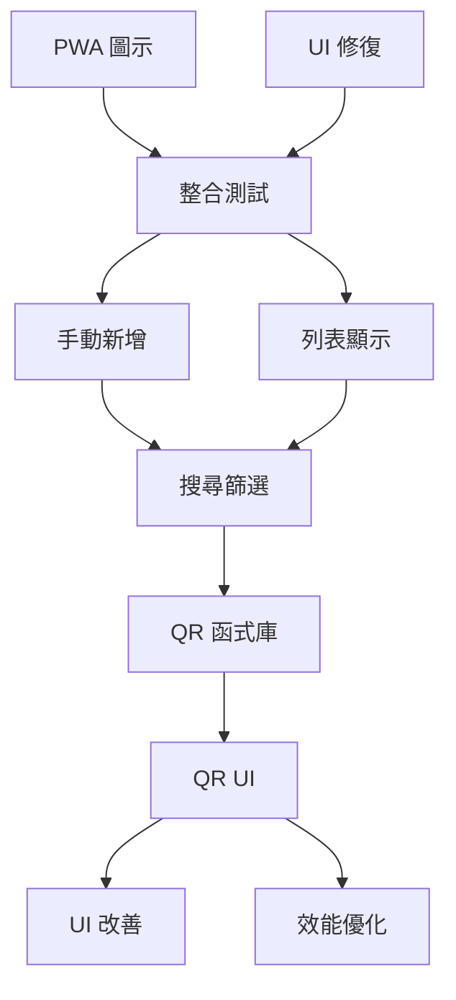

# PWA 名片收藏服務開發任務分解

## 任務分解總覽

### Phase A: 立即修復 (優先級: P0) ✅ 已完成
**預估時間**: 1-2 小時  
**目標**: 修復現有實作問題，確保基本功能可運作

### Phase B: 核心功能開發 (優先級: P0) ✅ 已完成
**預估時間**: 2-3 小時  
**目標**: 完成 MVP 收藏管理功能

### Phase C: QR 掃描整合 (優先級: P1) ✅ 已完成
**預估時間**: 1-2 小時  
**目標**: 整合 QR 掃描與相機功能

### Phase D: 優化與完善 (優先級: P2) ✅ 已完成
**預估時間**: 1 小時  
**目標**: UI/UX 改善與效能優化

### **Phase E: PWA 部署修復 (優先級: P0) 🚧 進行中**
**預估時間**: 3-4 小時  
**目標**: 修復 PWA 在 GitHub Pages 部署的關鍵問題

### **Phase F: NFC 收藏整合 (優先級: P1) 📋 待開始**
**預估時間**: 2-3 小時  
**目標**: 實作 NFC 讀取名片後的一鍵收藏功能

### **Phase G: 格式支援擴展 (優先級: P2) 📋 待開始**
**預估時間**: 3-4 小時  
**目標**: 支援更多名片格式與智慧檢測

---

## Phase E: PWA 部署修復 (新增)

### Task E1: 修正 manifest.json GitHub Pages 路徑
**Task ID**: PWA-PATH-001  
**優先級**: P0  
**預估時間**: 30 分鐘  
**負責模組**: PWA 基礎設施

**描述**: 修正 PWA manifest 配置以適配 GitHub Pages 部署

**當前問題**:
```json
// manifest.json 當前設定
"start_url": "/",           // 在 GitHub Pages 子路徑部署時失效
"scope": "/",               // 權限範圍過於寬泛
"shortcuts": [
  { "url": "/collection.html" }  // 路徑不正確
]
```

**Acceptance Criteria**:
- [ ] 動態檢測部署環境 (GitHub Pages vs 自架)
- [ ] 修正 start_url 為正確的子路徑
- [ ] 更新 shortcuts URL 路徑
- [ ] 確保 PWA 安裝正常運作
- [ ] 驗證離線功能完整性

**技術規格**:
```javascript
// 新增 PWA 配置管理
class PWAConfig {
  static getBasePath() {
    const isGitHubPages = location.hostname.includes('github.io');
    return isGitHubPages ? `/${location.pathname.split('/')[1]}/` : '/';
  }
  
  static updateManifest() {
    // 動態更新 manifest 路徑
  }
}
```

---

### Task E2: 修正 Service Worker 快取路徑
**Task ID**: PWA-SW-001  
**優先級**: P0  
**預估時間**: 60 分鐘  
**負責模組**: Service Worker

**描述**: 修正 Service Worker 中的路徑配置與快取策略

**當前問題**:
```javascript
// sw.js 第 89 行邏輯錯誤
!url.origin === location.origin  // 應為 url.origin !== location.origin

// CORE_FILES 使用絕對路徑
const CORE_FILES = [
  '/',                    // GitHub Pages 部署時失效
  '/index.html',          
  '/collection.html'
];
```

**Acceptance Criteria**:
- [ ] 修正 Service Worker 邏輯錯誤
- [ ] 更新 CORE_FILES 為相對路徑或動態路徑
- [ ] 確保快取策略在子路徑部署時正常
- [ ] 驗證離線功能完整性
- [ ] 測試快取更新機制

**技術規格**:
```javascript
// 修正後的 Service Worker
const BASE_PATH = self.location.pathname.match(/^\/[^\/]*/)[0];
const CORE_FILES = [
  `${BASE_PATH}/`,
  `${BASE_PATH}/index.html`,
  `${BASE_PATH}/collection.html`,
  // ...其他資源
];
```

---

### Task E3: 安全性加固
**Task ID**: PWA-SEC-001  
**優先級**: P0  
**預估時間**: 45 分鐘  
**負責模組**: 安全架構

**描述**: 修復輸入驗證與 XSS 防護漏洞

**當前問題**:
```javascript
// collection-manager.js:50 存在 XSS 風險
const base64DecodedData = decodeURIComponent(escape(atob(urlDecodedData)));
const rawData = JSON.parse(base64DecodedData);  // 未驗證輸入
```

**Acceptance Criteria**:
- [ ] 實作安全的輸入驗證機制
- [ ] 加入 XSS 防護與 HTML 轉義
- [ ] 實作嚴格的 JSON 解析驗證
- [ ] 加入 Content Security Policy
- [ ] 測試各種惡意輸入情境

**技術規格**:
```javascript
// 安全架構模組
class SecurityValidator {
  static sanitizeInput(input) {
    // XSS 防護與輸入清理
  }
  
  static validateCardData(data) {
    // 嚴格的資料格式驗證
  }
  
  static parseSecureJSON(jsonStr) {
    // 安全的 JSON 解析
  }
}
```

---

### Task E4: PWA 整合測試
**Task ID**: PWA-TEST-001  
**優先級**: P0  
**預估時間**: 60 分鐘  
**負責模組**: 整合測試

**描述**: 在 GitHub Pages 環境進行完整的 PWA 功能測試

**Acceptance Criteria**:
- [ ] PWA 安裝流程端到端測試
- [ ] 離線功能完整性測試
- [ ] Service Worker 快取機制測試
- [ ] 路徑配置正確性測試
- [ ] 安全性漏洞掃描測試

---

## Phase F: NFC 收藏整合

### Task F1: NFC 名片頁面收藏按鈕
**Task ID**: NFC-UI-001  
**優先級**: P1  
**預估時間**: 45 分鐘  
**負責模組**: NFC 整合 UI

**描述**: 在個人名片頁面添加一鍵收藏功能

**Acceptance Criteria**:
- [ ] 在 index.html 名片頁面添加「收藏此名片」按鈕
- [ ] 按鈕設計符合現有 UI 風格
- [ ] 支援響應式設計與無障礙訪問
- [ ] 整合現有的 saveToCollection() 函數
- [ ] 提供視覺化操作回饋

**技術規格**:
```html
<button id="save-to-collection-btn" class="download-btn collection-btn">
  📇 收藏名片
</button>
```

---

### Task F2: 重複檢測與智慧處理
**Task ID**: NFC-DUP-001  
**優先級**: P1  
**預估時間**: 60 分鐘  
**負責模組**: 收藏邏輯

**描述**: 實作智慧重複檢測與處理機制

**Acceptance Criteria**:
- [ ] 自動檢測名片是否已收藏
- [ ] 提供覆蓋/更新/取消選項
- [ ] 智慧比對姓名、郵箱、電話等關鍵欄位
- [ ] 顯示上次收藏時間與來源
- [ ] 支援批量操作提示

---

### Task F3: 收藏成功回饋優化
**Task ID**: NFC-FEEDBACK-001  
**優先級**: P1  
**預估時間**: 30 分鐘  
**負責模組**: 使用者體驗

**描述**: 優化收藏成功後的使用者回饋

**Acceptance Criteria**:
- [ ] 取代簡單的 alert 提示
- [ ] 實作動畫化的成功提示
- [ ] 提供後續操作建議 (查看收藏、繼續掃描)
- [ ] 支援快速標籤添加
- [ ] 無障礙性友善設計

---

## Phase G: 格式支援擴展

### Task G1: vCard 格式解析器
**Task ID**: FORMAT-VCARD-001  
**優先級**: P2  
**預估時間**: 90 分鐘  
**負責模組**: 格式解析

**描述**: 支援標準 vCard 3.0/4.0 格式解析

**Acceptance Criteria**:
- [ ] 支援 vCard 3.0 與 4.0 格式
- [ ] 解析常用欄位 (FN, N, ORG, TEL, EMAIL, PHOTO)
- [ ] 處理編碼問題 (UTF-8, QUOTED-PRINTABLE)
- [ ] 容錯處理與部分欄位缺失
- [ ] 轉換為內部統一格式

---

### Task G2: 智慧格式檢測
**Task ID**: FORMAT-DETECT-001  
**優先級**: P2  
**預估時間**: 75 分鐘  
**負責模組**: 格式檢測

**描述**: 自動檢測並適配不同名片格式

**Acceptance Criteria**:
- [ ] 自動檢測 JSON、vCard、舊版格式
- [ ] 提供格式信心分數與備選解析方案
- [ ] 支援混合格式與容錯解析
- [ ] 詳細的解析錯誤報告
- [ ] 效能優化與快取機制

---

### Task G3: 舊版格式相容性
**Task ID**: FORMAT-LEGACY-001  
**優先級**: P2  
**預估時間**: 60 分鐘  
**負責模組**: 向下相容

**描述**: 支援專案舊版本的名片格式

**Acceptance Criteria**:
- [ ] 分析並支援 v1.x 名片格式
- [ ] 處理編碼差異與欄位對應
- [ ] 提供格式升級與遷移提示
- [ ] 保持向下相容性
- [ ] 測試各版本格式混用情境

---

## Phase A: 立即修復 (已完成)

### Task A1: PWA 圖示建立
**Task ID**: PWA-ICON-001  
**優先級**: P0  
**預估時間**: 30 分鐘  
**負責模組**: PWA 基礎設施

**描述**: 建立 PWA 所需的應用程式圖示檔案

**Acceptance Criteria**:
- [ ] 建立 192x192 PNG 圖示檔案
- [ ] 建立 512x512 PNG 圖示檔案  
- [ ] 圖示符合 moda 品牌風格
- [ ] manifest.json 正確引用圖示路徑
- [ ] PWA 安裝提示正常顯示

**技術規格**:
```
assets/icon-192.png (192x192, PNG, <10KB)
assets/icon-512.png (512x512, PNG, <50KB)
```

**Dependencies**: manifest.json 已存在

---

### Task A2: Collection UI 功能修復
**Task ID**: UI-FIX-001  
**優先級**: P0  
**預估時間**: 45 分鐘  
**負責模組**: Collection Manager

**描述**: 修復 collection.html 中無作用的功能按鈕

**Acceptance Criteria**:
- [ ] 「新增名片」按鈕可正常開啟輸入對話框
- [ ] 搜尋框可正常篩選名片列表
- [ ] 篩選下拉選單可正常切換顯示
- [ ] 排序功能可正常重新排列名片
- [ ] 錯誤狀態有適當的使用者回饋

**技術規格**:
```javascript
// 修復目標函數
showAddDialog() - 顯示新增對話框
addCardFromUrl(url) - URL 解析與新增
showQRScanner() - QR 掃描功能入口
```

**Dependencies**: collection-manager.js, pwa-storage.js

---

### Task A3: 基本功能整合測試
**Task ID**: TEST-INT-001  
**優先級**: P0  
**預估時間**: 45 分鐘  
**負責模組**: 整合測試

**描述**: 驗證已實作模組間的協作功能

**Acceptance Criteria**:
- [ ] PWA 可正常安裝到桌面
- [ ] Service Worker 正常註冊與快取
- [ ] IndexedDB 初始化與基本 CRUD 操作
- [ ] Collection Manager 與 Storage 層協作
- [ ] 錯誤處理機制正常運作

**測試案例**:
1. PWA 安裝流程測試
2. 離線模式基本功能測試  
3. 資料儲存與讀取測試
4. 錯誤邊界條件測試

**Dependencies**: 所有已實作模組

---

## Phase B: 核心功能開發

### Task B1: 手動新增名片功能
**Task ID**: CORE-ADD-001  
**優先級**: P0  
**預估時間**: 60 分鐘  
**負責模組**: Collection Manager

**描述**: 實作手動輸入 URL 新增名片功能

**Acceptance Criteria**:
- [ ] 使用者可輸入名片 URL 或 QR 碼內容
- [ ] 系統自動解析並驗證資料格式
- [ ] 重複名片檢測與提示機制
- [ ] 新增成功後更新列表與統計
- [ ] 輸入錯誤時顯示友善錯誤訊息

**技術規格**:
```javascript
// 實作函數
parseCardFromUrl(url) -> CardData | null
validateCardData(data) -> boolean
checkDuplicate(cardData) -> boolean
addCardWithValidation(url) -> Promise<Result>
```

**Dependencies**: pwa-storage.js 的 addCard 方法

---

### Task B2: 名片列表顯示優化
**Task ID**: CORE-LIST-001  
**優先級**: P0  
**預估時間**: 45 分鐘  
**負責模組**: UI 渲染

**描述**: 優化名片列表的顯示與互動體驗

**Acceptance Criteria**:
- [ ] 名片列表支援響應式設計
- [ ] 頭像載入失敗時顯示預設圖示
- [ ] 聯絡方式可點擊直接撥號或發郵件
- [ ] 名片項目支援 hover 效果與視覺回饋
- [ ] 空狀態時顯示友善提示訊息

**技術規格**:
```javascript
// 優化函數
renderCardItem(card) -> HTMLElement
handleAvatarError(img) -> void
formatContactLinks(data) -> HTMLElement[]
renderEmptyState() -> HTMLElement
```

**Dependencies**: collection-manager.js 的 renderCards 方法

---

### Task B3: 搜尋與篩選功能
**Task ID**: CORE-SEARCH-001  
**優先級**: P1  
**預估時間**: 75 分鐘  
**負責模組**: Search Engine

**描述**: 實作全文搜尋與多維度篩選功能

**Acceptance Criteria**:
- [ ] 支援姓名、職稱、公司、標籤全文搜尋
- [ ] 搜尋結果即時更新 (防抖動處理)
- [ ] 支援按來源類型篩選 (QR/NFC/手動)
- [ ] 支援按時間範圍篩選 (本週/本月/全部)
- [ ] 支援多種排序方式 (時間/姓名/瀏覽次數)

**技術規格**:
```javascript
// 搜尋函數
searchCards(query) -> Promise<BusinessCard[]>
filterBySource(source) -> Promise<BusinessCard[]>  
filterByTimeRange(range) -> Promise<BusinessCard[]>
sortCards(cards, sortBy) -> BusinessCard[]
debounceSearch(query, delay) -> void
```

**Dependencies**: pwa-storage.js 的搜尋方法

---

## Phase C: QR 掃描整合

### Task C1: QR 掃描函式庫整合
**Task ID**: QR-LIB-001  
**優先級**: P1  
**預估時間**: 60 分鐘  
**負責模組**: QR Scanner

**描述**: 整合 QuaggaJS 或類似函式庫實作 QR 掃描

**Acceptance Criteria**:
- [ ] 成功整合 QR 掃描函式庫
- [ ] 支援相機權限請求與處理
- [ ] 掃描成功時自動解析 QR 碼內容
- [ ] 掃描失敗時提供重試機制
- [ ] 支援手動關閉掃描功能

**技術規格**:
```javascript
// QR 掃描模組
class QRScanner {
  async requestCameraPermission() -> boolean
  async startScan(videoElement) -> void
  stopScan() -> void
  onScanSuccess(callback) -> void
  onScanError(callback) -> void
}
```

**Dependencies**: 相機 API, QuaggaJS 函式庫

---

### Task C2: 掃描 UI 介面開發
**Task ID**: QR-UI-001  
**優先級**: P1  
**預估時間**: 45 分鐘  
**負責模組**: QR Scanner UI

**描述**: 開發 QR 掃描的使用者介面

**Acceptance Criteria**:
- [ ] 掃描介面支援全螢幕模式
- [ ] 顯示掃描框與引導線
- [ ] 提供關閉按鈕與手動輸入選項
- [ ] 掃描成功時顯示確認動畫
- [ ] 權限被拒絕時顯示說明訊息

**技術規格**:
```html
<!-- QR 掃描 UI 結構 -->
<div id="qr-scanner-modal">
  <video id="qr-video"></video>
  <div id="qr-overlay"></div>
  <button id="qr-close">關閉</button>
  <button id="qr-manual">手動輸入</button>
</div>
```

**Dependencies**: QR Scanner 模組

---

## Phase D: 優化與完善

### Task D1: UI/UX 改善
**Task ID**: UX-IMP-001  
**優先級**: P2  
**預估時間**: 30 分鐘  
**負責模組**: UI Polish

**描述**: 改善使用者介面與體驗細節

**Acceptance Criteria**:
- [ ] 載入狀態顯示與動畫效果
- [ ] 操作回饋與成功/錯誤提示
- [ ] 響應式設計在各裝置正常顯示
- [ ] 高齡友善設計 (大字體、高對比)
- [ ] 無障礙支援 (鍵盤操作、螢幕閱讀器)

**技術規格**:
```css
/* UI 改善重點 */
.loading-spinner { /* 載入動畫 */ }
.success-toast { /* 成功提示 */ }
.error-message { /* 錯誤訊息 */ }
.high-contrast { /* 高對比模式 */ }
```

---

### Task D2: 效能優化
**Task ID**: PERF-OPT-001  
**優先級**: P2  
**預估時間**: 30 分鐘  
**負責模組**: Performance

**描述**: 優化應用程式載入與執行效能

**Acceptance Criteria**:
- [ ] 圖片懶載入與快取機制
- [ ] 大量名片列表虛擬滾動
- [ ] Service Worker 快取策略優化
- [ ] IndexedDB 查詢效能優化
- [ ] 記憶體使用量監控與優化

**技術規格**:
```javascript
// 效能優化函數
lazyLoadImages() -> void
virtualScrolling(container, items) -> void
optimizeIndexedDBQueries() -> void
monitorMemoryUsage() -> void
```

---

## 任務依賴關係


```mermaid
graph TD
    A1[PWA 圖示] --> A3[整合測試]
    A2[UI 修復] --> A3
    A3 --> B1[手動新增]
    A3 --> B2[列表顯示]
    B1 --> B3[搜尋篩選]
    B2 --> B3
    B3 --> C1[QR 函式庫]
    C1 --> C2[QR UI]
    C2 --> D1[UI 改善]
    C2 --> D2[效能優化]
```

## 驗收標準

### 功能驗收
- [ ] 所有 P0 任務 100% 完成
- [ ] 所有 P1 任務 80% 完成  
- [ ] 核心功能流程端到端測試通過
- [ ] 錯誤處理機制驗證通過

### 品質驗收
- [ ] 程式碼符合專案風格規範
- [ ] 無 console.error 錯誤訊息
- [ ] 載入時間 < 3 秒
- [ ] 記憶體使用 < 50MB

### 使用者驗收
- [ ] PWA 安裝流程順暢
- [ ] 基本收藏功能直觀易用
- [ ] 搜尋回應速度 < 500ms
- [ ] 離線模式正常運作

---

**相關文件**:
- requirements.md: 需求規格對應
- design.md: 技術實作細節