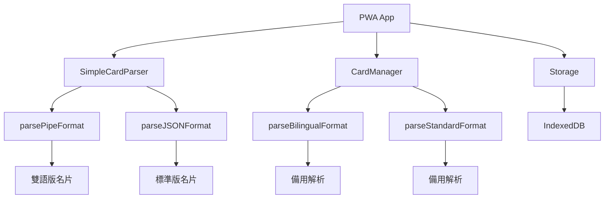

# PWA 名片系統完整架構文件

## 系統概覽

PWA 名片系統提供離線名片收納與分享功能，支援 9 種名片類型的統一管理。

## 核心組件架構



## 資料解析流程

### 主要解析器 (v1.5.12+)

**SimpleCardParser** 是主要的資料解析入口：

```javascript
SimpleCardParser.parseDirectly(urlData, cardType)
├── 檢查未編碼格式 (測試用)
├── 解碼 Base64 資料
├── 根據類型選擇解析方法
│   ├── 雙語類型 → parsePipeFormat()
│   └── 標準類型 → parseJSONFormat()
└── 自動識別格式 (備用)
```

### 關鍵修復：欄位對應錯誤

**問題根源** (v1.5.12 前)：
```javascript
// parsePipeFormat 中的錯誤對應
organization: parts[3],  // 錯誤：parts[3] 實際是 email
address: parts[8],       // 錯誤：parts[8] 實際是 socialNote
```

**修復方案** (v1.5.12+)：
```javascript
// 正確的欄位對應
email: parts[3] || '',                                    // 正確
socialNote: SimpleCardParser.parseBilingualField(parts[8]), // 正確
organization: { zh: '', en: '' },                         // 由前端預設
address: { zh: '', en: '' }                              // 由前端預設
```

## 支援的名片類型

| 類型 | 檔案 | 語言 | 建築 | 版面 | 解析器 |
|------|------|------|------|------|--------|
| index | index.html | 中文 | 延平 | 機關版 | JSON |
| index1 | index1.html | 中文 | 新光 | 機關版 | JSON |
| personal | index-personal.html | 中文 | - | 個人版 | JSON |
| bilingual | index-bilingual.html | 雙語 | 延平 | 機關版 | Pipe |
| bilingual1 | index1-bilingual.html | 雙語 | 新光 | 機關版 | Pipe |
| personal-bilingual | index-bilingual-personal.html | 雙語 | - | 個人版 | Pipe |
| en | index-en.html | 英文 | 延平 | 機關版 | JSON |
| en1 | index1-en.html | 英文 | 新光 | 機關版 | JSON |
| personal-en | index-personal-en.html | 英文 | - | 個人版 | JSON |

## 資料格式規範

### 雙語版管道分隔格式
```
name|title|department|email|phone|mobile|avatar|greetings|socialNote
```

### 標準版 JSON 格式
```json
{
  "n": "name",
  "t": "title", 
  "d": "department",
  "e": "email",
  "p": "phone",
  "m": "mobile",
  "a": "avatar",
  "g": ["greetings"],
  "s": "socialNote"
}
```

## 儲存架構

### IndexedDB 結構
```javascript
{
  cards: {
    keyPath: 'id',
    indexes: ['type', 'created', 'modified']
  },
  versions: {
    keyPath: 'id', 
    indexes: ['cardId', 'timestamp', 'version']
  },
  settings: {
    keyPath: 'key'
  }
}
```

### 名片資料結構
```javascript
{
  id: 'card_timestamp_random',
  type: 'bilingual|index|personal|...',
  data: {
    name: { zh: '中文', en: 'English' } | 'string',
    title: { zh: '中文', en: 'English' } | 'string',
    department: 'string',
    email: 'string',
    phone: 'string',
    mobile: 'string',
    avatar: 'string',
    greetings: ['string'],
    socialNote: 'string',
    organization: { zh: '中文', en: 'English' },
    address: { zh: '中文', en: 'English' }
  },
  created: Date,
  modified: Date,
  currentVersion: Number
}
```

## PWA 按鈕設計系統

### 設計演進歷程

#### v1.0 - 基礎設計
- 使用單調綠色背景 (`#28a745`)
- 簡單內聯樣式，缺乏視覺層次

#### v2.0 - 漸層優化
- 導入現代漸層設計 (`linear-gradient(135deg, #20c997 0%, #17a2b8 100%)`)
- 添加立體效果和互動動畫
- 圖標與文字分離設計

#### v3.0 - moda 設計系統對齊
- 使用 moda 次要色彩漸層 (`#8e8ec7` 到 `#7a7ab8`)
- 響應式設計修復，限制最大寬度
- 統一 9 個名片模板的視覺效果

#### v4.0 - 樣式統一 (當前版本)
- 與「加入聯絡人」按鈕完全統一樣式
- 使用純色背景 `#6868ac`
- 簡化佈局邏輯，移除複雜 flex 屬性

### 當前設計規範

```css
.pwa-save-btn {
    background: #6868ac;
    color: #fff;
    border: 1px solid #6868ac;
    padding: 12px 20px; /* 機關版 */
    border-radius: 6px;
    transition: all 0.15s ease;
    display: inline-block;
}

.pwa-save-btn:hover {
    background: #4e4e81;
    border-color: #4e4e81;
    transform: translateY(-1px);
}
```

### 響應式佈局

```css
.button-group {
    display: flex;
    gap: 12px;
    flex-wrap: wrap;
    justify-content: center;
    align-items: stretch; /* 水平對齊修復 */
}

@media (max-width: 480px) {
    .button-group {
        flex-direction: column;
        gap: 10px;
        width: 100%;
    }
    
    .pwa-save-btn {
        max-width: 280px; /* 限制最大寬度 */
        width: auto;
        min-width: 200px;
    }
}
```

### 版本差異化設計

| 版本類型 | padding | border-radius | max-width (mobile) |
|----------|---------|---------------|-------------------|
| 機關版 | 12px 20px | 6px | 280px |
| 個人版 | 14px 24px | 8px | 300px |
| 雙語個人版 | 15px 26px | 8px | 320px |

## 安全考量

### 資料隱私
- 所有資料儲存在本地 IndexedDB
- 無後端追蹤或資料收集
- 支援本地加密儲存

### 輸入驗證
- URL 解碼前驗證格式
- 防止 XSS 攻擊的字串清理
- 檔案大小限制檢查

### 錯誤處理
- 解析失敗時的優雅降級
- 資料損壞時的自動修復
- 版本不相容時的向下相容

## 效能優化

### 記憶體管理
- 定期清理過期版本記錄
- 限制版本歷史數量 (預設 10 個)
- 自動垃圾回收機制

### 儲存優化
- 資料壓縮與編碼優化
- 索引策略優化查詢效能
- 批次操作減少 I/O

## 無障礙設計

### 對比度
- 白色文字在背景上保持足夠對比度
- 符合 WCAG 2.1 AA 標準

### 觸控友善
- 最小觸控目標 48px 高度
- 適當間距避免誤觸
- 清晰的懸停和點擊狀態

## 版本歷史

- **v4.0 (2025-08)**: PWA 按鈕樣式統一，與聯絡人按鈕一致
- **v3.0 (2024-12)**: moda 設計系統對齊，響應式修復
- **v2.0 (2024-12)**: 漸層設計優化，互動效果提升
- **v1.5.12**: 修復 SimpleCardParser 欄位對應錯誤
- **v1.5.11**: 識別資料庫清理需求
- **v1.5.10**: 修復 CardManager 解析邏輯
- **v1.5.4**: 修復分享連結生成問題
- **v1.5.3**: 實作 PWA 離線收納功能

## 測試與品質保證

### 跨瀏覽器測試
- Chrome, Firefox, Safari, Edge 兼容性
- 不同螢幕尺寸響應式測試
- PWA 功能完整性驗證

### 視覺回歸測試
- 按鈕對齊效果驗證
- 色彩一致性檢查
- 動畫效果流暢度測試

### 功能測試
- PWA 離線儲存功能
- 名片解析準確性
- 跨設備同步能力

## 未來發展規劃

### 短期目標
- 建立統一的設計系統文檔
- 抽取共用 CSS 類別
- 定期樣式一致性檢查

### 長期目標
- 模組化架構重構
- 智慧快取策略
- 微前端架構演進