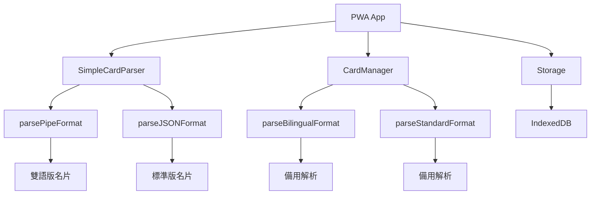

# PWA 名片系統架構文件

## 系統概覽

PWA 名片系統提供離線名片收納與分享功能，支援 9 種名片類型的統一管理。

## 核心組件架構



## 資料解析流程

### 主要解析器 (v1.5.12+)

**SimpleCardParser** 是主要的資料解析入口：

```javascript
SimpleCardParser.parseDirectly(urlData, cardType)
├── 檢查未編碼格式 (測試用)
├── 解碼 Base64 資料
├── 根據類型選擇解析方法
│   ├── 雙語類型 → parsePipeFormat()
│   └── 標準類型 → parseJSONFormat()
└── 自動識別格式 (備用)
```

### 關鍵修復：欄位對應錯誤

**問題根源** (v1.5.12 前)：
```javascript
// parsePipeFormat 中的錯誤對應
organization: parts[3],  // 錯誤：parts[3] 實際是 email
address: parts[8],       // 錯誤：parts[8] 實際是 socialNote
```

**修復方案** (v1.5.12+)：
```javascript
// 正確的欄位對應
email: parts[3] || '',                                    // 正確
socialNote: SimpleCardParser.parseBilingualField(parts[8]), // 正確
organization: { zh: '', en: '' },                         // 由前端預設
address: { zh: '', en: '' }                              // 由前端預設
```

## 支援的名片類型

| 類型 | 檔案 | 語言 | 建築 | 版面 | 解析器 |
|------|------|------|------|------|--------|
| index | index.html | 中文 | 延平 | 機關版 | JSON |
| index1 | index1.html | 中文 | 新光 | 機關版 | JSON |
| personal | index-personal.html | 中文 | - | 個人版 | JSON |
| bilingual | index-bilingual.html | 雙語 | 延平 | 機關版 | Pipe |
| bilingual1 | index1-bilingual.html | 雙語 | 新光 | 機關版 | Pipe |
| personal-bilingual | index-bilingual-personal.html | 雙語 | - | 個人版 | Pipe |
| en | index-en.html | 英文 | 延平 | 機關版 | JSON |
| en1 | index1-en.html | 英文 | 新光 | 機關版 | JSON |
| personal-en | index-personal-en.html | 英文 | - | 個人版 | JSON |

## 資料格式規範

### 雙語版管道分隔格式
```
name|title|department|email|phone|mobile|avatar|greetings|socialNote
```

### 標準版 JSON 格式
```json
{
  "n": "name",
  "t": "title", 
  "d": "department",
  "e": "email",
  "p": "phone",
  "m": "mobile",
  "a": "avatar",
  "g": ["greetings"],
  "s": "socialNote"
}
```

## 儲存架構

### IndexedDB 結構
```javascript
{
  cards: {
    keyPath: 'id',
    indexes: ['type', 'created', 'modified']
  },
  versions: {
    keyPath: 'id', 
    indexes: ['cardId', 'timestamp', 'version']
  },
  settings: {
    keyPath: 'key'
  }
}
```

### 名片資料結構
```javascript
{
  id: 'card_timestamp_random',
  type: 'bilingual|index|personal|...',
  data: {
    name: { zh: '中文', en: 'English' } | 'string',
    title: { zh: '中文', en: 'English' } | 'string',
    department: 'string',
    email: 'string',
    phone: 'string',
    mobile: 'string',
    avatar: 'string',
    greetings: ['string'],
    socialNote: 'string',
    organization: { zh: '中文', en: 'English' },
    address: { zh: '中文', en: 'English' }
  },
  created: Date,
  modified: Date,
  currentVersion: Number
}
```

## 安全考量

### 資料隱私
- 所有資料儲存在本地 IndexedDB
- 無後端追蹤或資料收集
- 支援本地加密儲存

### 輸入驗證
- URL 解碼前驗證格式
- 防止 XSS 攻擊的字串清理
- 檔案大小限制檢查

### 錯誤處理
- 解析失敗時的優雅降級
- 資料損壞時的自動修復
- 版本不相容時的向下相容

## 效能優化

### 記憶體管理
- 定期清理過期版本記錄
- 限制版本歷史數量 (預設 10 個)
- 自動垃圾回收機制

### 儲存優化
- 資料壓縮與編碼優化
- 索引策略優化查詢效能
- 批次操作減少 I/O

## 版本歷史

- **v1.5.12**: 修復 SimpleCardParser 欄位對應錯誤
- **v1.5.11**: 識別資料庫清理需求
- **v1.5.10**: 修復 CardManager 解析邏輯
- **v1.5.4**: 修復分享連結生成問題
- **v1.5.3**: 實作 PWA 離線收納功能