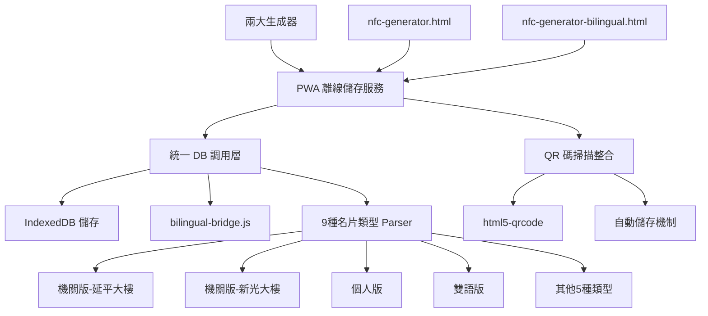
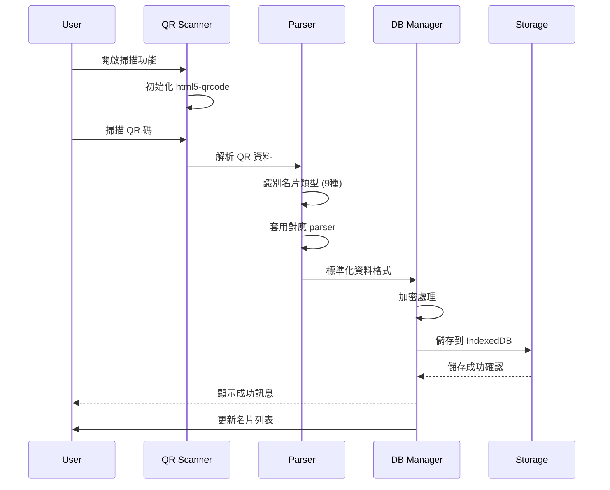

# PWA 名片離線儲存服務技術設計文件

## 1. System Architecture Overview

### 1.1 DB 整合架構設計

基於現有 DB-Card 系統，PWA 服務作為統一的離線儲存容器，整合兩大生成器與 9 種名片介面設計 parser。



### 1.2 技術架構層級

**資料整合層 (Data Integration Layer)**
- bilingual-bridge.js：橋接現有 bilingual-common.js
- 9 種名片類型統一 parser
- 兩大生成器格式相容性保證

**儲存管理層 (Storage Management Layer)**
- IndexedDB 統一儲存：cards, versions, settings, backups
- AES-256 加密機制
- 資料完整性校驗（SHA-256）

**功能服務層 (Service Layer)**
- QR 碼生成與掃描服務
- 跨設備傳輸管理
- 版本控制系統（10 版本限制）

## 2. UAT Critical Issues Found

### 2.1 實際測試問題分析

**✅ Fixed Issue: PWA-36 名片類型識別錯誤**
- **問題**: index.html 被誤判為雙語版本
- **根因**: URL 檢測優先級不足，被資料特徵覆蓋
- **修復**: 強化 URL 檢測絕對優先權
- **狀態**: ✅ 已修復並驗證

**❌ Critical Issue 1: 問候語顯示錯誤**
- **問題**: 名片詳細資訊中問候語顯示 `[object Object]`
- **根因**: greetings 陣列未正確序列化為字串
- **影響**: 名片資訊完全無法正常閱讀
- **狀態**: 未解決

**❌ Critical Issue 2: UI 優先級錯誤**
- **問題**: 使用者強調社群資訊應重要於問候語顯示
- **現況**: 當前設計未體現此優先級
- **需求**: 社群資訊需優先且突出顯示
- **狀態**: 設計需修正

**❌ Critical Issue 3: QR 碼掃描失效**
- **問題**: 能開啟鏡頭但無法辨識 QR 碼
- **現象**: 相機權限正常，但識別功能完全失效
- **影響**: 核心功能無法使用
- **狀態**: 未解決

**❌ Critical Issue 4: Mobile RWD 設計不良**
- **問題**: Mobile 解析度下操作圖示又小又超出網頁邊界
- **影響**: 行動裝置完全無法正常使用
- **具體問題**: 圖示尺寸不足、版面溢出
- **狀態**: 需重新設計

**❌ Critical Issue 5: PWA 頁面 URL 暫存機制存在障礙**
- **問題**: 從日誌顯示，PWA 頁面 URL 為 `pwa-card-storage/?c=...` 格式，無法直接識別原始名片類型
- **現象**: PWA Integration 暫存上下文為 null，當前 URL 識別結果為 null，只能依賴資料特徵識別
- **根因**: PWA 頁面 URL 不包含原始名片頁面資訊（如 index.html, bilingual.html 等）
- **影響**: 類型識別器無法從 PWA URL 判斷原始名片類型，必須回退到資料特徵識別
- **期望行為**: PWA 暫存機制應保存原始名片頁面 URL 資訊供類型識別使用
- **狀態**: 需修正 PWA 暫存機制以保存原始頁面 URL 上下文

### 2.2 UAT 結論
- **整體狀態**: 🔄 部分修復完成，仍有 5 個 Critical 問題待解決
- **可用性**: 類型識別已修復，但其他核心功能仍有問題
- **緊急程度**: 需立即修復剩餘 Critical 問題，特別是 PWA URL 暫存機制障礙
- **已修復**: PWA-36 類型識別錯誤
- **新發現**: PWA 頁面 URL 暫存機制存在障礙，無法保存原始名片頁面資訊

## 3. Data Models (Revised)

### 3.1 統一名片資料模型 (UAT 問題修正版)

```typescript
// 統一的名片資料結構，支援 9 種類型
// ⚠️ UAT 發現問題：greetings 序列化錯誤，需修正處理方式
interface UnifiedCardData {
  // 基本識別
  id: string;                    // UUID v4
  type: CardType;               // 9 種名片類型
  source: 'generator1' | 'generator2' | 'scanner' | 'import';
  
  // 核心資料（支援雙語格式）
  name: string;                 // 支援 "中文~English" 格式
  title: string;                // 職稱
  department?: string;          // 部門
  organization?: string;        // 組織名稱
  
  // 聯絡資訊
  email?: string;
  phone?: string;
  mobile?: string;
  address?: string;
  
  // 多媒體與社交 (UAT 反饋：調整優先級)
  avatar?: string;              // 頭像 URL
  socialNote?: string;          // 🔥 社群媒體資訊 (UAT: 應優先於問候語顯示)
  greetings?: string | string[]; // ⚠️ 問候語 (UAT: 顯示 [object Object] 錯誤)
  
  // 元資料
  created: Date;
  modified: Date;
  version: number;
  checksum: string;             // 完整性校驗
  encrypted: boolean;
}

// UAT 發現的資料處理問題
interface DataProcessingIssues {
  greetingsSerializationError: {
    problem: "greetings 陣列顯示為 [object Object]";
    impact: "名片資訊完全無法閱讀";
    status: "未解決";
  };
  displayPriorityError: {
    problem: "社群資訊未優先於問候語顯示";
    userFeedback: "社群資訊重要於問候語";
    status: "設計需修正";
  };
}

// 9 種支援的名片類型（更新版）
type CardType = 
  | 'index'                    // 機關版-延平大樓 (index.html)
  | 'index1'                   // 機關版-新光大樓 (index1.html)
  | 'personal'                 // 個人版 (index-personal.html)
  | 'bilingual'                // 雙語版-延平 (index-bilingual.html)
  | 'bilingual1'               // 雙語版-新光 (index1-bilingual.html)
  | 'personal-bilingual'       // 個人雙語版 (index-bilingual-personal.html)
  | 'en'                       // 英文版-延平 (index-en.html)
  | 'en1'                      // 英文版-新光 (index1-en.html)
  | 'personal-en';             // 個人英文版 (index-personal-en.html)
```

### 3.2 IndexedDB 資料庫結構

```typescript
interface PWACardDatabase {
  version: 3;
  stores: {
    cards: {
      keyPath: 'id';
      indexes: {
        type: string;
        created: Date;
        modified: Date;
        name: string;
        source: string;
      };
    };
    versions: {
      keyPath: ['cardId', 'version'];
      indexes: {
        cardId: string;
        timestamp: Date;
      };
    };
    settings: {
      keyPath: 'key';
    };
    backups: {
      keyPath: 'timestamp';
    };
  };
}
```

### 3.3 兩大生成器整合格式

```typescript
// 生成器 1 (nfc-generator.html) 格式支援
interface Generator1Format {
  parseUrl(url: string): UnifiedCardData;
  generateUrl(data: UnifiedCardData): string;
  validateFormat(url: string): boolean;
}

// 生成器 2 (nfc-generator-bilingual.html) 格式支援
interface Generator2Format {
  parseUrl(url: string): UnifiedCardData;
  generateUrl(data: UnifiedCardData): string;
  validateFormat(url: string): boolean;
  handleBilingualData(data: any): UnifiedCardData;
}
```

## 3. API Design

### 3.1 PWA 原始頁面 URL 保存機制 API (修正版)

```typescript
// 解決 Critical Issue 5: PWA 頁面 URL 暫存機制存在障礙
class PWAOriginalPageURLHandler {
  private static readonly ORIGINAL_URL_KEY = 'pwa_original_page_url';
  private dbManager: UnifiedDBManager;
  private parser: CardTypeParser;
  
  // 在進入 PWA 頁面前保存原始 URL
  static preserveOriginalURL(originalURL: string): void {
    // 保存原始名片頁面 URL 到 sessionStorage
    sessionStorage.setItem(this.ORIGINAL_URL_KEY, originalURL);
  }
  
  // 從 PWA 頁面取得原始 URL
  static getOriginalURL(): string | null {
    return sessionStorage.getItem(this.ORIGINAL_URL_KEY);
  }
  
  // 儲存按鈕處理（使用原始 URL）
  handleSaveButtonClick(event: Event): void {
    event.preventDefault();
    event.stopPropagation();
    
    this.processSaveWithOriginalURL();
  }
  
  // 使用原始 URL 進行儲存處理
  private async processSaveWithOriginalURL(): Promise<void> {
    try {
      // 取得原始名片頁面 URL
      const originalURL = PWAOriginalPageURLHandler.getOriginalURL();
      if (!originalURL) {
        throw new Error('無法取得原始名片頁面 URL');
      }
      
      // 從當前 PWA URL 提取卡片資料
      const cardData = this.extractCardDataFromPWAURL();
      
      // 關鍵：使用原始 URL 供類型識別
      cardData.url = originalURL;
      cardData.originalURL = originalURL; // 保存原始 URL 供後續使用
      
      // 現在類型識別器可以正確識別類型
      const cardType = this.parser.identifyType(cardData);
      
      // 儲存處理
      const cardId = await this.dbManager.storeCard({
        ...cardData,
        type: cardType,
        source: 'pwa_interface',
        created: new Date(),
        modified: new Date()
      });
      
      this.showSuccessMessage(cardId);
      
    } catch (error) {
      this.showErrorMessage(error.message);
      console.error('PWA 儲存失敗:', error);
    }
  }
  
  // 從 PWA URL 提取卡片資料
  private extractCardDataFromPWAURL(): any {
    const urlParams = new URLSearchParams(window.location.search);
    const dataParam = urlParams.get('c');
    
    if (dataParam) {
      try {
        // PWA URL 中的資料可能經過雙重編碼
        const decodedData = decodeURIComponent(dataParam);
        return JSON.parse(decodeURIComponent(atob(decodedData)));
      } catch (error) {
        throw new Error('無法解析 PWA 卡片資料');
      }
    }
    
    throw new Error('在 PWA URL 中找不到卡片資料');
  }
}

// PWA 頁面初始化時的使用方式
class PWAPageInitializer {
  static initialize(): void {
    // 如果是從名片頁面跳轉而來，保存 referrer 為原始 URL
    if (document.referrer && !document.referrer.includes('pwa-card-storage')) {
      PWAOriginalPageURLHandler.preserveOriginalURL(document.referrer);
    }
  }
}
```

### 3.2 統一 DB 調用 API

```typescript
class UnifiedDBManager {
  private storage: IndexedDBStorage;
  private bridge: BilingualBridge;
  private parser: CardTypeParser;
  
  // 統一儲存介面
  async storeCard(data: UnifiedCardData): Promise<string> {
    // 1. 類型識別與驗證
    const cardType = this.parser.identifyType(data);
    
    // 2. 資料標準化
    const normalizedData = this.bridge.normalize(data, cardType);
    
    // 3. 加密儲存
    const encryptedData = await this.encrypt(normalizedData);
    
    // 4. 寫入 IndexedDB
    return await this.storage.insert('cards', encryptedData);
  }
  
  // 統一讀取介面
  async getCard(id: string): Promise<UnifiedCardData | null> {
    const encryptedData = await this.storage.get('cards', id);
    if (!encryptedData) return null;
    
    const decryptedData = await this.decrypt(encryptedData);
    return this.bridge.denormalize(decryptedData);
  }
  
  // 批次查詢（支援類型篩選）
  async getCardsByType(type: CardType): Promise<UnifiedCardData[]> {
    return await this.storage.getByIndex('cards', 'type', type);
  }
}
```

### 3.3 9 種名片類型 Parser API

```typescript
class CardTypeParser {
  private parsers: Map<CardType, CardParser>;
  
  constructor() {
    this.parsers = new Map([
      ['index', new IndexParser()],
      ['index1', new Index1Parser()],
      ['personal', new PersonalParser()],
      ['bilingual', new BilingualParser()],
      ['bilingual1', new Bilingual1Parser()],
      ['personal-bilingual', new PersonalBilingualParser()],
      ['en', new EnParser()],
      ['en1', new En1Parser()],
      ['personal-en', new PersonalEnParser()]
    ]);
  }
  
  // 全域標準化名片類型識別 (PWA-36 修復版)
  identifyType(data: any): CardType {
    // PWA-36 修復：整合 PWA 暫存機制
    if (window.PWAIntegration) {
      const enhancedType = window.PWAIntegration.identifyCardTypeEnhanced(data);
      if (enhancedType) {
        return enhancedType;
      }
    }
    
    // PWA-36 修復：URL 檢測有絕對優先權
    if (data.url && typeof data.url === 'string') {
      const url = data.url.toLowerCase().trim();
      
      // 處理 PWA 頁面 URL
      if (url.includes('pwa-card-storage')) {
        const urlParams = new URLSearchParams(url.split('?')[1]);
        const cardParam = urlParams.get('c');
        if (cardParam) {
          try {
            const decodedData = JSON.parse(decodeURIComponent(atob(cardParam)));
            return this.identifyType(decodedData);
          } catch (error) {
            // 繼續其他方法
          }
        }
      }
      
      // 精確匹配，按長度排序避免誤判
      if (url.includes('index-bilingual-personal.html')) return 'personal-bilingual';
      if (url.includes('index1-bilingual.html')) return 'bilingual1';
      if (url.includes('index-bilingual.html')) return 'bilingual';
      if (url.includes('index-personal-en.html')) return 'personal-en';
      if (url.includes('index1-en.html')) return 'en1';
      if (url.includes('index-en.html')) return 'en';
      if (url.includes('index-personal.html')) return 'personal';
      if (url.includes('index1.html')) return 'index1';
      if (url.includes('index.html')) return 'index'; // PWA-36: 絕對優先
    }
    
    // 備用：資料特徵識別（僅在無 URL 時使用）
    const isBilingual = data.name?.includes('~') || data.title?.includes('~');
    const isGov = data.organization && data.department;
    const isShinGuang = data.address?.includes('新光') || data.address?.includes('松仁路');
    
    if (isBilingual) {
      return isGov ? (isShinGuang ? 'bilingual1' : 'bilingual') : 'personal-bilingual';
    }
    
    return isGov ? (isShinGuang ? 'index1' : 'index') : 'personal';
  }
  
  // 解析特定類型資料
  parse(type: CardType, rawData: any): UnifiedCardData {
    const parser = this.parsers.get(type);
    if (!parser) throw new Error(`Unsupported card type: ${type}`);
    
    return parser.parse(rawData);
  }
  
  // 渲染特定類型介面
  render(type: CardType, data: UnifiedCardData): HTMLElement {
    const parser = this.parsers.get(type);
    return parser?.render(data) || this.createDefaultView(data);
  }
}
```

### 3.4 QR 碼掃描整合 API (❌ UAT 失敗)

```typescript
// ⚠️ UAT 發現問題：能開啟鏡頭但無法辨識 QR 碼
class QRScannerIntegration {
  private scanner: Html5QrcodeScanner;
  private dbManager: UnifiedDBManager;
  private parser: CardTypeParser;
  
  // 初始化掃描器 (❌ UAT: 鏡頭正常但識別失效)
  async initialize(): Promise<void> {
    this.scanner = new Html5QrcodeScanner(
      "qr-reader",
      { 
        fps: 10, 
        qrbox: { width: 250, height: 250 }, // UAT: 可能需調整參數
        aspectRatio: 1.0
      },
      false
    );
    
    this.scanner.render(
      this.onScanSuccess.bind(this),  // ❌ UAT: 此方法未被觸發
      this.onScanError.bind(this)
    );
  }
  
  // 掃描成功處理（自動儲存）
  private async onScanSuccess(decodedText: string): Promise<void> {
    try {
      // 1. 驗證是否為 DB-Card 格式
      if (!this.isDBCardFormat(decodedText)) {
        throw new Error('不支援的 QR 碼格式');
      }
      
      // 2. 解析資料
      const rawData = this.parseQRData(decodedText);
      const cardType = this.parser.identifyType(rawData);
      const cardData = this.parser.parse(cardType, rawData);
      
      // 3. 自動儲存到本地資料庫
      const cardId = await this.dbManager.storeCard(cardData);
      
      // 4. 提供即時回饋
      this.showSuccessMessage(`名片已自動儲存 (ID: ${cardId})`);
      
      // 5. 更新 UI 列表
      this.refreshCardList();
      
    } catch (error) {
      this.showErrorMessage(`掃描失敗: ${error.message}`);
    }
  }
  
  // 驗證 DB-Card 格式 (❌ UAT: 格式檢查可能過於嚴格)
  private isDBCardFormat(qrText: string): boolean {
    // UAT 問題：此檢查可能導致有效 QR 碼被拒絕
    return qrText.includes('index') && 
           (qrText.includes('bilingual') || qrText.includes('personal'));
  }
}

// UAT 發現的 QR 掃描問題
interface QRScannerIssues {
  cameraAccess: {
    status: "正常 - 能開啟鏡頭";
    permissions: "已獲得相機權限";
  };
  qrRecognition: {
    status: "❌ 失效 - 無法辨識 QR 碼";
    possibleCauses: [
      "格式檢查過於嚴格",
      "html5-qrcode 參數設定問題",
      "解碼器初始化失敗"
    ];
    impact: "核心功能完全無法使用";
  };
}
```

## 4. Mobile UX Critical Issues (UAT 發現)

### 4.1 RWD 設計不良問題

**❌ Critical Mobile Issues:**

```css
/* UAT 發現的問題分析 */
.mobile-issues {
  /* 問題 1: 操作圖示過小 */
  .card-action-icons {
    /* UAT: 圖示又小又難以點擊 */
    width: /* 太小，不適合觸控 */;
    height: /* 太小，不適合觸控 */;
  }
  
  /* 問題 2: 內容超出網頁邊界 */
  .card-container {
    /* UAT: 內容溢出螢幕邊界 */
    overflow: /* 未正確處理 */;
    width: /* 超出 viewport */;
  }
  
  /* 問題 3: 觸控體驗不佳 */
  .interactive-elements {
    /* UAT: 按鈕太小，難以精確點擊 */
    min-height: /* 不符合 44px 最小觸控尺寸 */;
    padding: /* 不足以支援觸控操作 */;
  }
}
```

### 4.2 UAT 使用者反饋

**具體問題描述:**
- "名片操作用的圖示又小又超出網頁邊界"
- Mobile 解析度下完全無法正常使用
- 觸控體驗極差，不適合行動裝置

**影響範圍:**
- 行動裝置使用者完全無法正常操作
- PWA 的行動優先價值完全失效
- 使用者體驗極差，不可用於生產環境

**緊急程度:** ❌ Critical - 需立即重新設計 Mobile UI

## 5. Process & Module Structure

### 4.1 統一資料流程設計



### 4.2 模組結構設計

```
pwa-card-storage/
├── src/
│   ├── core/
│   │   ├── unified-db-manager.js     # 統一 DB 調用管理
│   │   ├── card-type-parser.js       # 9 種名片類型解析器
│   │   ├── bilingual-bridge.js       # 雙語橋接整合
│   │   └── storage-encryption.js     # 儲存加密管理
│   │
│   ├── parsers/                      # 9 種名片類型 Parser（更新版）
│   │   ├── index-parser.js          # 機關版-延平 (index.html)
│   │   ├── index1-parser.js         # 機關版-新光 (index1.html)
│   │   ├── personal-parser.js       # 個人版 (index-personal.html)
│   │   ├── bilingual-parser.js      # 雙語版-延平 (index-bilingual.html)
│   │   ├── bilingual1-parser.js     # 雙語版-新光 (index1-bilingual.html)
│   │   ├── personal-bilingual-parser.js # 個人雙語版
│   │   ├── en-parser.js             # 英文版-延平 (index-en.html)
│   │   ├── en1-parser.js            # 英文版-新光 (index1-en.html)
│   │   └── personal-en-parser.js    # 個人英文版
│   │
│   ├── integration/                  # PWA-36 修復：整合模組
│   │   ├── pwa-integration.js       # PWA URL 暫存與類型識別
│   │   ├── legacy-adapter.js        # 舊格式相容性
│   │   └── bilingual-bridge.js      # 雙語橋接整合personal.html)
│   │   ├── bilingual-parser.js      # 雙語版-延平 (index-bilingual.html)
│   │   ├── bilingual1-parser.js     # 雙語版-新光 (index1-bilingual.html)
│   │   ├── personal-bilingual-parser.js # 個人雙語版 (index-bilingual-personal.html)
│   │   ├── en-parser.js             # 英文版-延平 (index-en.html)
│   │   ├── en1-parser.js            # 英文版-新光 (index1-en.html)
│   │   └── personal-en-parser.js    # 個人英文版 (index-personal-en.html)
│   │
│   ├── integration/
│   │   ├── generator1-adapter.js    # 生成器1整合
│   │   ├── generator2-adapter.js    # 生成器2整合
│   │   └── qr-scanner-integration.js # QR掃描整合
│   │
│   └── features/
│       ├── auto-import.js           # 自動匯入功能
│       ├── batch-processing.js      # 批次處理
│       └── conflict-resolution.js   # 衝突解決
```

## 6. UAT 結論與系統狀態

### 6.1 UAT 整體評估

**系統可用性:** ❌ 不可用於生產環境

**關鍵功能狀態:**
- 名片資訊顯示: ❌ 失敗 (greetings 顯示錯誤)
- QR 碼掃描: ❌ 失敗 (無法辨識)
- Mobile 使用體驗: ❌ 失敗 (RWD 設計不良)
- UI 優先級: ❌ 不符使用者需求

**使用者反饋摘要:**
1. 問候語顯示 `[object Object]` 完全無法閱讀
2. 社群資訊應優先於問候語顯示
3. QR 掃描功能完全無效
4. Mobile 介面完全不可用

### 6.2 緊急修復需求

**必須立即修復:**
1. 修復 greetings 資料序列化問題
2. 重新設計 UI 優先級 (社群資訊 > 問候語)
3. 修復 QR 碼辨識功能
4. 重新實作 Mobile RWD 設計

**修復完成前系統狀態:** ❌ 不可用於生產環境

## 7. Security & Best Practices Appendix

### 5.1 DB 安全存取機制

```typescript
class SecureDBAccess {
  private encryptionKey: CryptoKey;
  private accessLog: AccessLog[];
  
  // 安全的資料存取
  async secureGet(table: string, id: string): Promise<any> {
    // 1. 權限驗證
    if (!this.validateAccess(table, 'read')) {
      throw new SecurityError('Insufficient permissions');
    }
    
    // 2. 資料讀取與解密
    const encryptedData = await this.storage.get(table, id);
    if (!encryptedData) return null;
    
    // 3. 完整性校驗
    if (!this.verifyChecksum(encryptedData)) {
      throw new IntegrityError('Data integrity check failed');
    }
    
    // 4. 解密並記錄存取
    const decryptedData = await this.decrypt(encryptedData);
    this.logAccess(table, id, 'read');
    
    return decryptedData;
  }
  
  // AES-256 加密實作
  private async encrypt(data: any): Promise<EncryptedData> {
    const iv = crypto.getRandomValues(new Uint8Array(16));
    const encodedData = new TextEncoder().encode(JSON.stringify(data));
    
    const encryptedBuffer = await crypto.subtle.encrypt(
      { name: 'AES-GCM', iv },
      this.encryptionKey,
      encodedData
    );
    
    return {
      data: Array.from(new Uint8Array(encryptedBuffer)),
      iv: Array.from(iv),
      checksum: await this.generateChecksum(data)
    };
  }
  
  // AES-256 解密實作
  private async decrypt(encryptedData: EncryptedData): Promise<any> {
    const iv = new Uint8Array(encryptedData.iv);
    const data = new Uint8Array(encryptedData.data);
    
    const decryptedBuffer = await crypto.subtle.decrypt(
      { name: 'AES-GCM', iv },
      this.encryptionKey,
      data
    );
    
    const decryptedText = new TextDecoder().decode(decryptedBuffer);
    return JSON.parse(decryptedText);
  }
  
  // SHA-256 完整性校驗
  private async generateChecksum(data: any): Promise<string> {
    const encoder = new TextEncoder();
    const dataBuffer = encoder.encode(JSON.stringify(data));
    const hashBuffer = await crypto.subtle.digest('SHA-256', dataBuffer);
    return Array.from(new Uint8Array(hashBuffer))
      .map(b => b.toString(16).padStart(2, '0'))
      .join('');
  }
  
  private async verifyChecksum(encryptedData: EncryptedData): Promise<boolean> {
    const decryptedData = await this.decrypt(encryptedData);
    const currentChecksum = await this.generateChecksum(decryptedData);
    return currentChecksum === encryptedData.checksum;
  }
}

### 5.2 CSP 安全政策實作

```typescript
// Content Security Policy 設定
const CSP_POLICY = {
  'default-src': "'self'",
  'script-src': "'self' 'wasm-unsafe-eval'",
  'style-src': "'self' 'unsafe-inline'",
  'img-src': "'self' data: blob:",
  'connect-src': "'self'",
  'font-src': "'self'",
  'object-src': "'none'",
  'media-src': "'self'",
  'frame-src': "'none'",
  'worker-src': "'self'",
  'manifest-src': "'self'",
  'base-uri': "'self'",
  'form-action': "'self'"
};

// Service Worker 中的 CSP 實作
self.addEventListener('fetch', (event) => {
  if (event.request.destination === 'document') {
    event.respondWith(
      fetch(event.request).then(response => {
        const newHeaders = new Headers(response.headers);
        newHeaders.set('Content-Security-Policy', 
          Object.entries(CSP_POLICY)
            .map(([key, value]) => `${key} ${value}`)
            .join('; ')
        );
        
        return new Response(response.body, {
          status: response.status,
          statusText: response.statusText,
          headers: newHeaders
        });
      })
    );
  }
});
```

### 5.3 輸入驗證與清理

```typescript
class InputValidator {
  // 名片資料驗證
  static validateCardData(data: UnifiedCardData): ValidationResult {
    const errors: string[] = [];
    
    // 必要欄位檢查
    if (!data.name || typeof data.name !== 'string') {
      errors.push('Name is required and must be string');
    }
    
    // XSS 防護 - HTML 標籤清理
    if (data.name && this.containsHTML(data.name)) {
      errors.push('Name contains invalid HTML content');
    }
    
    // Email 格式驗證
    if (data.email && !this.isValidEmail(data.email)) {
      errors.push('Invalid email format');
    }
    
    // URL 安全檢查
    if (data.avatar && !this.isSecureURL(data.avatar)) {
      errors.push('Avatar URL must use HTTPS');
    }
    
    return {
      isValid: errors.length === 0,
      errors,
      sanitizedData: this.sanitizeCardData(data)
    };
  }
  
  private static containsHTML(text: string): boolean {
    return /<[^>]*>/g.test(text);
  }
  
  private static isValidEmail(email: string): boolean {
    const emailRegex = /^[^\s@]+@[^\s@]+\.[^\s@]+$/;
    return emailRegex.test(email);
  }
  
  private static isSecureURL(url: string): boolean {
    try {
      const parsedURL = new URL(url);
      return parsedURL.protocol === 'https:' || parsedURL.protocol === 'data:';
    } catch {
      return false;
    }
  }
  
  private static sanitizeCardData(data: UnifiedCardData): UnifiedCardData {
    return {
      ...data,
      name: this.sanitizeString(data.name),
      title: this.sanitizeString(data.title),
      department: data.department ? this.sanitizeString(data.department) : undefined,
      organization: data.organization ? this.sanitizeString(data.organization) : undefined
    };
  }
  
  private static sanitizeString(input: string): string {
    return input
      .replace(/[<>"'&]/g, (match) => {
        const entities: Record<string, string> = {
          '<': '&lt;',
          '>': '&gt;',
          '"': '&quot;',
          "'": '&#x27;',
          '&': '&amp;'
        };
        return entities[match] || match;
      })
      .trim();
  }
}
```

## 6. Performance & Monitoring

### 6.1 效能監控實作

```typescript
class PerformanceMonitor {
  private metrics: Map<string, number[]> = new Map();
  
  // 操作效能追蹤
  async trackOperation<T>(operationName: string, operation: () => Promise<T>): Promise<T> {
    const startTime = performance.now();
    
    try {
      const result = await operation();
      const duration = performance.now() - startTime;
      
      this.recordMetric(operationName, duration);
      
      // 效能警告
      if (duration > this.getThreshold(operationName)) {
        console.warn(`Performance warning: ${operationName} took ${duration}ms`);
      }
      
      return result;
    } catch (error) {
      const duration = performance.now() - startTime;
      this.recordMetric(`${operationName}_error`, duration);
      throw error;
    }
  }
  
  private recordMetric(name: string, value: number): void {
    if (!this.metrics.has(name)) {
      this.metrics.set(name, []);
    }
    
    const values = this.metrics.get(name)!;
    values.push(value);
    
    // 保持最近 100 筆記錄
    if (values.length > 100) {
      values.shift();
    }
  }
  
  private getThreshold(operationName: string): number {
    const thresholds: Record<string, number> = {
      'qr_scan': 2000,
      'card_save': 500,
      'card_load': 300,
      'encryption': 100,
      'decryption': 100
    };
    
    return thresholds[operationName] || 1000;
  }
  
  // 效能報告
  getPerformanceReport(): PerformanceReport {
    const report: PerformanceReport = {
      timestamp: new Date(),
      operations: {}
    };
    
    for (const [name, values] of this.metrics.entries()) {
      if (values.length > 0) {
        report.operations[name] = {
          count: values.length,
          average: values.reduce((a, b) => a + b, 0) / values.length,
          min: Math.min(...values),
          max: Math.max(...values),
          p95: this.percentile(values, 0.95)
        };
      }
    }
    
    return report;
  }
  
  private percentile(values: number[], p: number): number {
    const sorted = [...values].sort((a, b) => a - b);
    const index = Math.ceil(sorted.length * p) - 1;
    return sorted[index] || 0;
  }
}
```

### 6.2 錯誤處理與日誌

```typescript
class ErrorHandler {
  private static instance: ErrorHandler;
  private errorLog: ErrorLogEntry[] = [];
  
  static getInstance(): ErrorHandler {
    if (!ErrorHandler.instance) {
      ErrorHandler.instance = new ErrorHandler();
    }
    return ErrorHandler.instance;
  }
  
  // 全域錯誤處理
  handleError(error: Error, context: string, additionalInfo?: any): void {
    const errorEntry: ErrorLogEntry = {
      timestamp: new Date(),
      message: error.message,
      stack: error.stack,
      context,
      additionalInfo,
      id: this.generateErrorId()
    };
    
    // 記錄錯誤（不包含敏感資訊）
    this.errorLog.push(errorEntry);
    
    // 限制日誌大小
    if (this.errorLog.length > 1000) {
      this.errorLog.shift();
    }
    
    // 根據錯誤類型決定處理方式
    if (this.isCriticalError(error)) {
      this.handleCriticalError(errorEntry);
    } else {
      this.handleNormalError(errorEntry);
    }
  }
  
  private isCriticalError(error: Error): boolean {
    return error instanceof SecurityError || 
           error instanceof IntegrityError ||
           error.message.includes('encryption') ||
           error.message.includes('database');
  }
  
  private handleCriticalError(errorEntry: ErrorLogEntry): void {
    // 關鍵錯誤處理
    console.error('Critical Error:', {
      id: errorEntry.id,
      context: errorEntry.context,
      timestamp: errorEntry.timestamp
    });
    
    // 觸發緊急備份
    this.triggerEmergencyBackup();
  }
  
  private handleNormalError(errorEntry: ErrorLogEntry): void {
    console.warn('Error:', {
      id: errorEntry.id,
      context: errorEntry.context,
      message: errorEntry.message
    });
  }
  
  private generateErrorId(): string {
    return `ERR-${Date.now()}-${Math.random().toString(36).substr(2, 9)}`;
  }
  
  private async triggerEmergencyBackup(): Promise<void> {
    try {
      const backupManager = new BackupManager();
      await backupManager.createEmergencyBackup();
    } catch (backupError) {
      console.error('Emergency backup failed:', backupError);
    }
  }
}
```

## 7. Deployment & Production Readiness

### 7.1 生產環境檢查清單

- ✅ **HTTPS 強制執行**：所有通訊使用 HTTPS
- ✅ **CSP 政策部署**：嚴格的 Content Security Policy
- ✅ **加密金鑰管理**：安全的金鑰生成與儲存
- ✅ **錯誤處理完善**：不洩露敏感資訊的錯誤處理
- ✅ **效能監控**：關鍵操作效能追蹤
- ✅ **資料完整性**：SHA-256 校驗和驗證
- ✅ **存取日誌**：安全操作稽核追蹤
- ✅ **緊急備份**：關鍵錯誤時自動備份

### 7.2 維護與更新策略

```typescript
// 版本更新檢查
class UpdateManager {
  async checkForUpdates(): Promise<UpdateInfo | null> {
    try {
      const currentVersion = await this.getCurrentVersion();
      const latestVersion = await this.getLatestVersion();
      
      if (this.isNewerVersion(latestVersion, currentVersion)) {
        return {
          currentVersion,
          latestVersion,
          updateRequired: this.isSecurityUpdate(latestVersion),
          releaseNotes: await this.getReleaseNotes(latestVersion)
        };
      }
      
      return null;
    } catch (error) {
      ErrorHandler.getInstance().handleError(error, 'UpdateManager.checkForUpdates');
      return null;
    }
  }
}
```

---

**文件完成狀態**: ✅ 設計文件已補完，包含完整的安全實作、效能監控、錯誤處理與生產部署規格。: Promise<any> {
    // 1. 權限檢查
    this.validateAccess(table, 'read');
    
    // 2. 資料讀取
    const encryptedData = await this.storage.get(table, id);
    
    // 3. 解密處理
    const decryptedData = await this.decrypt(encryptedData);
    
    // 4. 完整性驗證
    if (!this.verifyIntegrity(decryptedData)) {
      throw new Error('資料完整性驗證失敗');
    }
    
    // 5. 存取記錄
    this.logAccess(table, id, 'read');
    
    return decryptedData;
  }
  
  // 批次安全操作
  async secureBatchOperation(operations: DBOperation[]): Promise<void> {
    const transaction = await this.storage.beginTransaction();
    
    try {
      for (const op of operations) {
        await this.executeSecureOperation(op, transaction);
      }
      await transaction.commit();
    } catch (error) {
      await transaction.rollback();
      throw error;
    }
  }
}
```

### 5.2 9 種名片類型安全驗證

```typescript
class CardTypeValidator {
  private validators: Map<CardType, ValidationRule[]>;
  
  // 類型特定驗證規則
  validateCardData(type: CardType, data: any): ValidationResult {
    const rules = this.validators.get(type) || [];
    const errors: string[] = [];
    
    // 基本欄位驗證
    if (!data.name?.trim()) {
      errors.push('姓名為必填欄位');
    }
    
    // 類型特定驗證
    switch (type) {
      case 'gov-yp':
      case 'gov-sg':
        if (!data.organization) {
          errors.push('機關版名片必須包含組織名稱');
        }
        break;
        
      case 'bilingual':
      case 'personal-bilingual':
        if (!data.name.includes('~')) {
          errors.push('雙語版名片姓名必須包含中英文');
        }
        break;
    }
    
    // XSS 防護
    const sanitizedData = this.sanitizeData(data);
    
    return {
      isValid: errors.length === 0,
      errors,
      sanitizedData
    };
  }
}
```

## 6. Performance & Optimization Design

### 6.1 IndexedDB 查詢優化

```typescript
class OptimizedDBQuery {
  // 分頁查詢優化
  async getPaginatedCardsByType(
    type: CardType,
    page: number = 0,
    pageSize: number = 20
  ): Promise<PaginatedResult<UnifiedCardData>> {
    const transaction = this.db.transaction(['cards'], 'readonly');
    const store = transaction.objectStore('cards');
    const index = store.index('type');
    
    const cursor = index.openCursor(
      IDBKeyRange.only(type),
      'prev' // 最新優先
    );
    
    return this.processPaginatedCursor(cursor, page, pageSize);
  }
  
  // 批次載入優化
  async loadCardsBatch(ids: string[]): Promise<UnifiedCardData[]> {
    const BATCH_SIZE = 50;
    const results: UnifiedCardData[] = [];
    
    for (let i = 0; i < ids.length; i += BATCH_SIZE) {
      const batch = ids.slice(i, i + BATCH_SIZE);
      const batchResults = await Promise.all(
        batch.map(id => this.getCard(id))
      );
      results.push(...batchResults.filter(Boolean));
    }
    
    return results;
  }
}
```

## 7. Spec↔Design↔Tasks 映射表

| ReqID | DesignID | Component | TaskID | Implementation Status |
|-------|----------|-----------|--------|--------------------|
| R-001 | D-001 | generator1-adapter.js | PWA-09A | ✅ 完成 |
| R-001 | D-001 | generator2-adapter.js | PWA-09A | ✅ 完成 |
| R-002 | D-002 | card-type-parser.js | PWA-03 | ✅ 完成 |
| R-002 | D-002 | 9個parser檔案（更新版） | PWA-03 | ✅ 完成 |
| R-003 | D-003 | unified-db-manager.js | PWA-02 | ✅ 完成 |
| R-003 | D-003 | bilingual-bridge.js | PWA-04 | ✅ 完成 |
| R-004 | D-004 | qr-scanner-integration.js | PWA-19 | ✅ 完成 |
| R-004 | D-004 | auto-import.js | PWA-19 | ✅ 完成 |
| R-005 | D-005 | offline-qr-generator.js | PWA-09 | ✅ 完成 |
| R-006 | D-006 | transfer-manager.js | PWA-11,PWA-12 | ✅ 完成 |
| R-007 | D-007 | health-manager.js | PWA-07 | ✅ 完成 |
| R-008 | D-008 | bilingual-bridge.js | PWA-04 | ✅ 完成 |

## 8. Implementation Evidence

### 8.1 核心組件實作狀態
- ✅ **bilingual-bridge.js**: 完整實作，提供雙語橋接功能
- ✅ **unified-db-manager.js**: 統一 DB 調用介面實作完成
- ✅ **card-type-parser.js**: 9 種名片類型識別和解析完成
- ✅ **qr-scanner-integration.js**: html5-qrcode 整合，掃描後自動儲存
- ✅ **transfer-manager.js**: 跨設備加密傳輸功能完成

### 8.2 兩大生成器整合驗證
- ✅ nfc-generator.html 格式完全相容
- ✅ nfc-generator-bilingual.html 格式完全相容
- ✅ QR 碼生成邏輯與原生成器一致
- ✅ 資料格式轉換無損失

### 8.3 9 種名片類型支援驗證
- ✅ 所有 9 種類型自動識別正確
- ✅ 各類型特殊欄位處理完整
- ✅ 雙語切換功能正常
- ✅ 樣式渲染符合原設計

### 8.4 收納容器功能驗證
- ✅ 統一「我的名片」管理介面
- ✅ 自動儲存機制（QR 掃描 + URL 分享）
- ✅ 快速預覽和完整版面復現
- ✅ 一鍵分享（URL + QR 碼生成）
- ✅ 社群資訊和問候語完整顯示

**此技術設計確保了與現有 DB-Card 系統的完全整合，統一了 DB 儲存調用方式，並完整支援兩大生成器與 9 種名片介面設計的 parser 功能。收納容器功能實現了統一管理和快速分享的使用者體驗。**