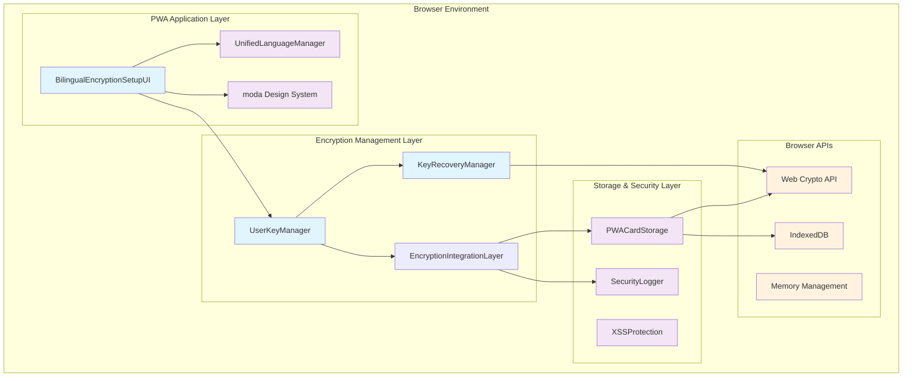
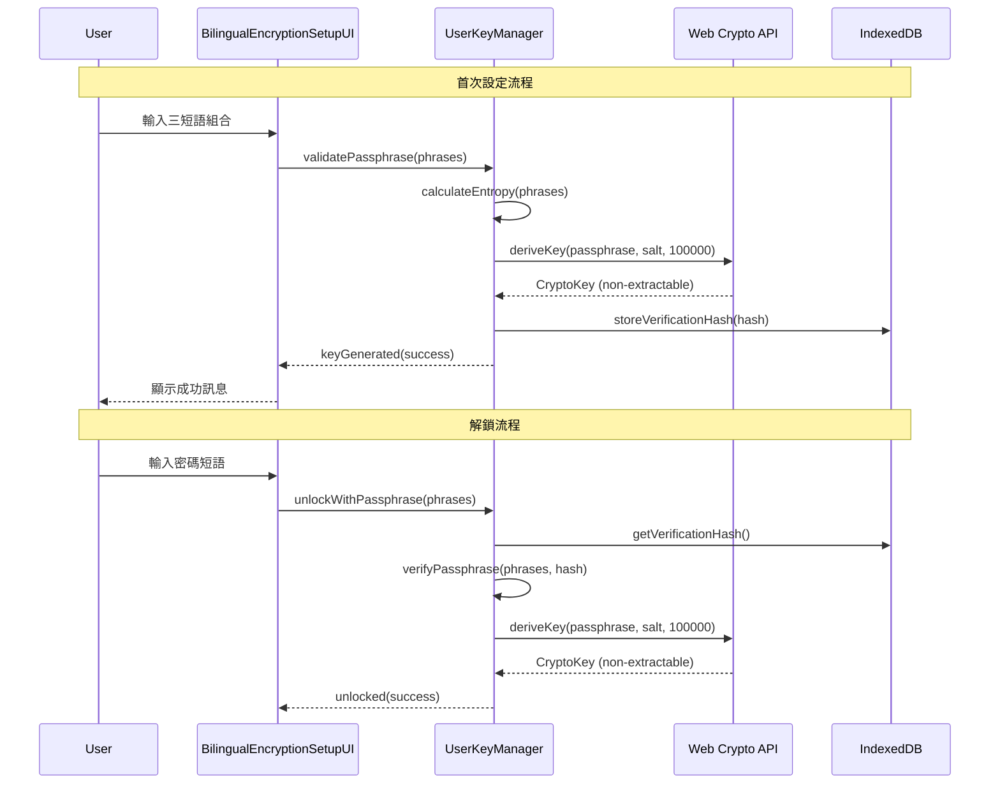
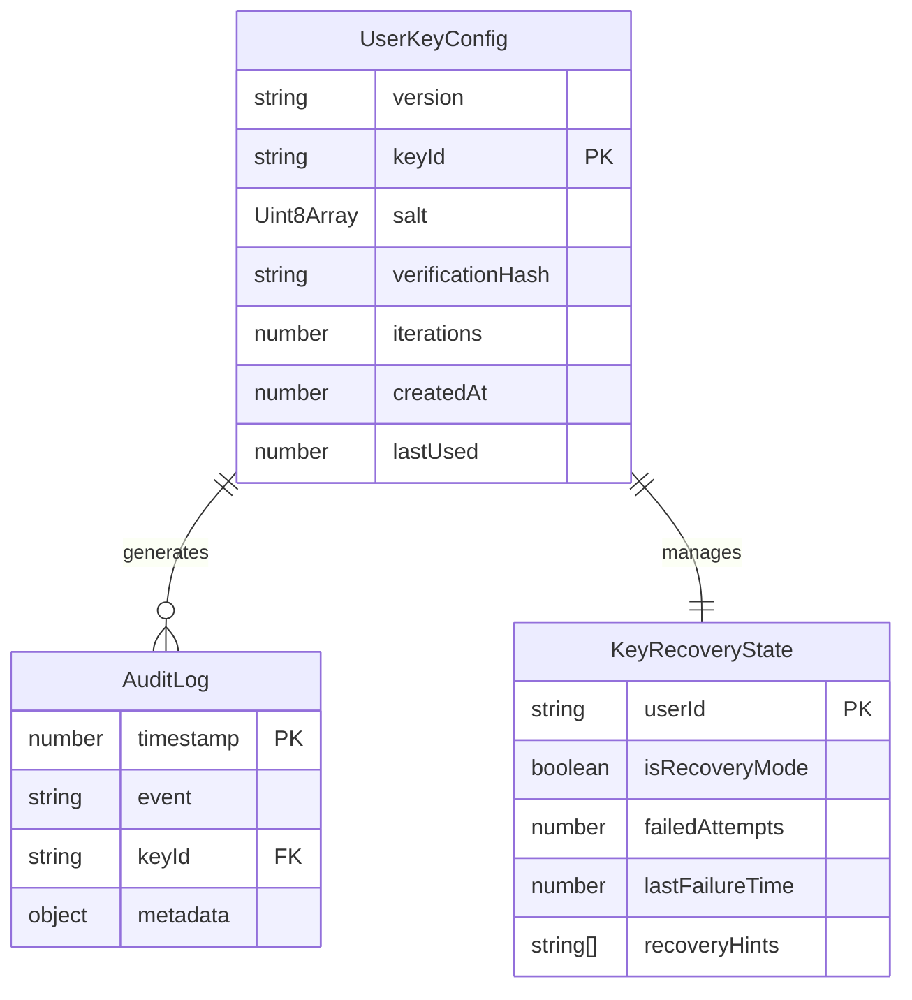
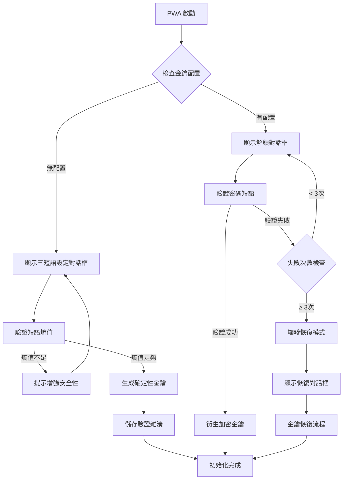

# DB-Card PWA 用戶可控加密金鑰系統技術設計

---
version: "v3.2.2-user-controlled-encryption"
rev_id: "DES-UCE-001"
last_updated: "2025-08-09"
owners: ["technical-architect", "security-engineer"]
source_prd_rev: "REQ-UCE-001"
---

## 1. System Architecture Overview

### 1.1 高層架構圖



### 1.2 信任邊界與資料流



### 1.3 安全邊界設計

- **記憶體邊界**: 密碼短語僅在記憶體中暫存，不持久化
- **加密邊界**: 所有衍生金鑰設為不可匯出 (non-extractable)
- **儲存邊界**: 僅儲存 PBKDF2 驗證雜湊，不儲存明文或金鑰
- **時間邊界**: 固定迭代次數防止時間分析攻擊

## 2. Data Models

### 2.1 核心資料結構

```typescript
// 使用者金鑰管理
interface UserKeyConfig {
  readonly version: string;
  readonly keyId: string;
  readonly salt: Uint8Array;
  readonly verificationHash: string;
  readonly iterations: number; // 固定 100,000
  readonly createdAt: number;
  readonly lastUsed: number;
}

// 密碼短語結構
interface PassphraseStructure {
  readonly adjective: string;
  readonly noun: string;
  readonly verb: string;
  readonly entropy: number; // 計算熵值
  readonly language: 'zh-TW' | 'en-US';
}

// 金鑰恢復狀態
interface KeyRecoveryState {
  readonly isRecoveryMode: boolean;
  readonly failedAttempts: number;
  readonly lastFailureTime: number;
  readonly recoveryHints?: string[];
}

// 加密金鑰快取
interface EncryptionKeyCache {
  readonly masterKey: CryptoKey; // non-extractable
  readonly fieldKeys: Map<string, CryptoKey>;
  readonly expiresAt: number;
}
```

### 2.2 資料庫 Schema (IndexedDB)

```typescript
// UserKeyStore
interface UserKeyStore {
  keyName: 'user-encryption-key';
  keyPath: 'keyId';
  data: UserKeyConfig;
}

// RecoveryStore  
interface RecoveryStore {
  keyName: 'key-recovery-state';
  keyPath: 'userId';
  data: KeyRecoveryState;
}

// AuditStore
interface AuditStore {
  keyName: 'encryption-audit-log';
  keyPath: 'timestamp';
  data: {
    event: 'key_generated' | 'unlock_success' | 'unlock_failed' | 'recovery_triggered';
    timestamp: number;
    metadata: Record<string, any>;
  };
}
```

### 2.3 ERD 圖



## 3. API Design

### 3.1 UserKeyManager API

```typescript
class UserKeyManager {
  // 設定使用者密碼短語
  async setUserPassphrase(phrases: PassphraseStructure): Promise<{
    success: boolean;
    keyId: string;
    entropy: number;
  }>;
  
  // 驗證密碼短語
  async verifyUserPassphrase(phrases: PassphraseStructure): Promise<{
    success: boolean;
    keyId?: string;
    remainingAttempts?: number;
  }>;
  
  // 衍生加密金鑰
  async deriveEncryptionKey(phrases: PassphraseStructure): Promise<CryptoKey>;
  
  // 檢測金鑰失效
  async detectKeyFailure(): Promise<{
    isValid: boolean;
    failureReason?: string;
    suggestedAction?: string;
  }>;
  
  // 清理記憶體
  async clearMemory(): Promise<void>;
}
```

### 3.2 BilingualEncryptionSetupUI API

```typescript
class BilingualEncryptionSetupUI {
  // 顯示三短語設定對話框
  async showSetupDialog(language: 'zh-TW' | 'en-US'): Promise<{
    phrases?: PassphraseStructure;
    cancelled: boolean;
  }>;
  
  // 顯示解鎖對話框
  async showUnlockDialog(language: 'zh-TW' | 'en-US'): Promise<{
    phrases?: PassphraseStructure;
    cancelled: boolean;
  }>;
  
  // 顯示恢復對話框
  async showRecoveryDialog(hints: string[]): Promise<{
    phrases?: PassphraseStructure;
    cancelled: boolean;
  }>;
  
  // 語言切換
  async switchLanguage(language: 'zh-TW' | 'en-US'): Promise<void>;
}
```

### 3.3 KeyRecoveryManager API

```typescript
class KeyRecoveryManager {
  // 觸發金鑰恢復
  async triggerRecovery(reason: string): Promise<{
    recoveryId: string;
    hints: string[];
  }>;
  
  // 批量資料恢復
  async batchDataRecovery(newKey: CryptoKey): Promise<{
    totalItems: number;
    recoveredItems: number;
    failedItems: string[];
  }>;
  
  // 健康檢查
  async performHealthCheck(): Promise<{
    keyIntegrity: boolean;
    dataIntegrity: boolean;
    recommendations: string[];
  }>;
}
```

## 4. Process & Module Structure

### 4.1 初始化流程



### 4.2 模組依賴注入

```typescript
// 依賴注入容器
class EncryptionContainer {
  private static instance: EncryptionContainer;
  private dependencies = new Map<string, any>();
  
  register<T>(key: string, factory: () => T): void {
    this.dependencies.set(key, factory);
  }
  
  resolve<T>(key: string): T {
    const factory = this.dependencies.get(key);
    if (!factory) throw new Error(`Dependency ${key} not found`);
    return factory();
  }
}

// 模組註冊
const container = EncryptionContainer.getInstance();
container.register('userKeyManager', () => new UserKeyManager());
container.register('keyRecoveryManager', () => new KeyRecoveryManager());
container.register('bilingualUI', () => new BilingualEncryptionSetupUI());
```

### 4.3 錯誤處理與重試策略

```typescript
// 統一錯誤處理
class EncryptionErrorHandler {
  async handleError(error: Error, context: string): Promise<{
    shouldRetry: boolean;
    retryDelay?: number;
    userMessage: string;
  }> {
    switch (error.name) {
      case 'InvalidPassphraseError':
        return {
          shouldRetry: true,
          userMessage: this.getLocalizedMessage('invalid_passphrase')
        };
      
      case 'KeyDerivationError':
        return {
          shouldRetry: true,
          retryDelay: 1000,
          userMessage: this.getLocalizedMessage('key_derivation_failed')
        };
      
      case 'StorageQuotaError':
        return {
          shouldRetry: false,
          userMessage: this.getLocalizedMessage('storage_full')
        };
      
      default:
        return {
          shouldRetry: false,
          userMessage: this.getLocalizedMessage('unknown_error')
        };
    }
  }
}
```

## 5. Security & Best Practices Appendix

### 5.1 輸入驗證與清理

```typescript
class PassphraseValidator {
  private readonly MIN_ENTROPY = 60; // 位元
  private readonly WORD_PATTERNS = {
    'zh-TW': /^[\u4e00-\u9fff]+$/,
    'en-US': /^[a-zA-Z]+$/
  };
  
  validateStructure(phrases: PassphraseStructure): ValidationResult {
    // 驗證三短語結構
    if (!phrases.adjective || !phrases.noun || !phrases.verb) {
      return { valid: false, error: 'incomplete_structure' };
    }
    
    // 驗證字符集
    const pattern = this.WORD_PATTERNS[phrases.language];
    if (!pattern.test(phrases.adjective) || 
        !pattern.test(phrases.noun) || 
        !pattern.test(phrases.verb)) {
      return { valid: false, error: 'invalid_characters' };
    }
    
    // 計算熵值
    const entropy = this.calculateEntropy(phrases);
    if (entropy < this.MIN_ENTROPY) {
      return { valid: false, error: 'insufficient_entropy', entropy };
    }
    
    return { valid: true, entropy };
  }
  
  private calculateEntropy(phrases: PassphraseStructure): number {
    // 基於詞庫大小和組合計算熵值
    const vocabSizes = {
      adjective: 1000, // 形容詞詞庫大小
      noun: 2000,      // 名詞詞庫大小  
      verb: 800        // 動詞詞庫大小
    };
    
    const combinations = vocabSizes.adjective * vocabSizes.noun * vocabSizes.verb;
    return Math.log2(combinations);
  }
}
```

### 5.2 加密金鑰管理

```typescript
class SecureKeyManager {
  private readonly PBKDF2_ITERATIONS = 100000;
  private readonly KEY_LENGTH = 256; // bits
  
  async deriveKeyFromPBKDF2(
    passphrase: string, 
    salt: Uint8Array
  ): Promise<CryptoKey> {
    const encoder = new TextEncoder();
    const keyMaterial = await crypto.subtle.importKey(
      'raw',
      encoder.encode(passphrase),
      'PBKDF2',
      false,
      ['deriveKey']
    );
    
    return await crypto.subtle.deriveKey(
      {
        name: 'PBKDF2',
        salt: salt,
        iterations: this.PBKDF2_ITERATIONS,
        hash: 'SHA-256'
      },
      keyMaterial,
      {
        name: 'AES-GCM',
        length: this.KEY_LENGTH
      },
      false, // non-extractable
      ['encrypt', 'decrypt']
    );
  }
  
  async generateSalt(): Promise<Uint8Array> {
    return crypto.getRandomValues(new Uint8Array(32));
  }
  
  async clearKeyFromMemory(key: CryptoKey): Promise<void> {
    // 瀏覽器會自動處理 CryptoKey 的記憶體清理
    // 但我們可以清除相關引用
    key = null as any;
  }
}
```

### 5.3 審計日誌

```typescript
class EncryptionAuditLogger {
  async logEvent(
    event: string, 
    metadata: Record<string, any>
  ): Promise<void> {
    const auditEntry = {
      timestamp: Date.now(),
      event,
      metadata: this.sanitizeMetadata(metadata),
      userAgent: navigator.userAgent,
      sessionId: this.getSessionId()
    };
    
    await this.storeAuditEntry(auditEntry);
  }
  
  private sanitizeMetadata(metadata: Record<string, any>): Record<string, any> {
    // 移除敏感資訊
    const sanitized = { ...metadata };
    delete sanitized.passphrase;
    delete sanitized.key;
    delete sanitized.privateData;
    
    return sanitized;
  }
}
```

### 5.4 效能優化

```typescript
class PerformanceOptimizer {
  private keyCache = new Map<string, CryptoKey>();
  private readonly CACHE_TTL = 30 * 60 * 1000; // 30分鐘
  
  async getOrDeriveKey(
    passphrase: string, 
    salt: Uint8Array
  ): Promise<CryptoKey> {
    const cacheKey = this.generateCacheKey(passphrase, salt);
    const cached = this.keyCache.get(cacheKey);
    
    if (cached && !this.isCacheExpired(cacheKey)) {
      return cached;
    }
    
    // 使用 Web Worker 避免阻塞 UI
    const key = await this.deriveKeyInWorker(passphrase, salt);
    this.keyCache.set(cacheKey, key);
    
    // 設定過期清理
    setTimeout(() => {
      this.keyCache.delete(cacheKey);
    }, this.CACHE_TTL);
    
    return key;
  }
  
  private async deriveKeyInWorker(
    passphrase: string, 
    salt: Uint8Array
  ): Promise<CryptoKey> {
    // 實作 Web Worker 金鑰衍生
    return new Promise((resolve, reject) => {
      const worker = new Worker('/workers/key-derivation.js');
      worker.postMessage({ passphrase, salt });
      
      worker.onmessage = (e) => {
        resolve(e.data.key);
        worker.terminate();
      };
      
      worker.onerror = (e) => {
        reject(new Error('Key derivation failed'));
        worker.terminate();
      };
    });
  }
}
```

## 6. Localization & Accessibility

### 6.1 多語言支援整合

```typescript
class EncryptionLanguageIntegration {
  constructor(
    private languageManager: UnifiedLanguageManager,
    private ui: BilingualEncryptionSetupUI
  ) {}
  
  async initializeWithLanguage(): Promise<void> {
    const currentLang = await this.languageManager.getCurrentLanguage();
    await this.ui.switchLanguage(currentLang);
    
    // 監聽語言切換事件
    this.languageManager.onLanguageChange((newLang) => {
      this.ui.switchLanguage(newLang);
    });
  }
  
  getLocalizedErrorMessage(errorCode: string): string {
    return this.languageManager.translate(`encryption.errors.${errorCode}`);
  }
}
```

### 6.2 高齡友善設計實作

```typescript
class AccessibilityEnhancer {
  private readonly LARGE_FONT_SIZE = '1.2em';
  private readonly HIGH_CONTRAST_RATIO = 4.5;
  
  applyAccessibilityStyles(element: HTMLElement): void {
    // 大字體
    element.style.fontSize = this.LARGE_FONT_SIZE;
    
    // 高對比
    element.style.color = '#000000';
    element.style.backgroundColor = '#ffffff';
    
    // 足夠的點擊區域
    if (element.tagName === 'BUTTON') {
      element.style.minHeight = '44px';
      element.style.minWidth = '44px';
      element.style.padding = '12px 16px';
    }
    
    // ARIA 標籤
    if (!element.getAttribute('aria-label')) {
      element.setAttribute('aria-label', this.generateAriaLabel(element));
    }
  }
  
  private generateAriaLabel(element: HTMLElement): string {
    // 根據元素類型生成適當的 ARIA 標籤
    if (element.tagName === 'INPUT') {
      return `輸入${element.getAttribute('placeholder') || '資料'}`;
    }
    return element.textContent || '互動元素';
  }
}
```

## 7. Spec↔Design Mapping

| 需求 ID | 設計 ID | 簡述 | 未來任務 ID |
|---------|---------|------|-------------|
| R-1 | D-MODULE-UserKeyManager | 用戶可控密碼短語設定 | T-001 |
| R-1 | D-UI-BilingualEncryptionSetup | 三短語設定對話框 | T-002 |
| R-2 | D-MODULE-KeyRecoveryManager | 金鑰可恢復性機制 | T-003 |
| R-2 | D-API-DeterministicKeyGen | 確定性金鑰生成 | T-004 |
| R-3 | D-MODULE-KeyRecoveryManager | 金鑰失效檢測與恢復 | T-005 |
| R-3 | D-API-HealthCheck | 系統健康檢查整合 | T-006 |
| NFR-Security | D-SECURITY-PBKDF2 | PBKDF2 安全實作 | T-007 |
| NFR-Performance | D-PERF-WebWorker | Web Worker 效能優化 | T-008 |
| NFR-Accessibility | D-UI-AccessibilityEnhancer | 高齡友善設計實作 | T-009 |
| NFR-Localization | D-I18N-Integration | 統一語言管理整合 | T-010 |

## 8. Migration Strategy

### 8.1 相容性保證

```typescript
class BackwardCompatibilityManager {
  async migrateFromDefaultPassword(): Promise<{
    success: boolean;
    migratedItems: number;
    errors: string[];
  }> {
    const result = {
      success: true,
      migratedItems: 0,
      errors: [] as string[]
    };
    
    try {
      // 檢測舊系統資料
      const oldData = await this.detectLegacyData();
      
      if (oldData.length === 0) {
        return result;
      }
      
      // 提示使用者設定新密碼短語
      const newPassphrase = await this.promptForNewPassphrase();
      
      // 批量遷移資料
      for (const item of oldData) {
        try {
          await this.migrateDataItem(item, newPassphrase);
          result.migratedItems++;
        } catch (error) {
          result.errors.push(`Failed to migrate item ${item.id}: ${error.message}`);
        }
      }
      
    } catch (error) {
      result.success = false;
      result.errors.push(`Migration failed: ${error.message}`);
    }
    
    return result;
  }
}
```

### 8.2 回滾機制

```typescript
class RollbackManager {
  async createBackup(): Promise<string> {
    const backup = {
      timestamp: Date.now(),
      version: 'v3.2.2',
      data: await this.exportAllData()
    };
    
    const backupId = `backup_${backup.timestamp}`;
    await this.storeBackup(backupId, backup);
    
    return backupId;
  }
  
  async rollback(backupId: string): Promise<void> {
    const backup = await this.getBackup(backupId);
    if (!backup) {
      throw new Error('Backup not found');
    }
    
    // 清除當前資料
    await this.clearCurrentData();
    
    // 恢復備份資料
    await this.restoreBackup(backup);
    
    // 重新初始化系統
    await this.reinitializeSystem();
  }
}
```

---

**Memory MCP 記錄摘要**:
- trace-id: DES-UCE-001-2025-08-09
- node-count: 6 (Design + 3 DesignItems + ThreatModel + ADR)
- edge-count: 10 (需求對應 + 設計包含 + 模組關聯)
- security_snapshot: PBKDF2+AES-GCM+NonExtractable+MemoryClearing
- reuse_score: 0.75 (高度複用現有 PWA 架構)
- spec_design_coverage: R-1,R-2,R-3,NFR-Security,NFR-Performance,NFR-Accessibility

設計已完成並記錄至知識圖譜，準備移交給 task-breakdown-planner 進行任務分解。