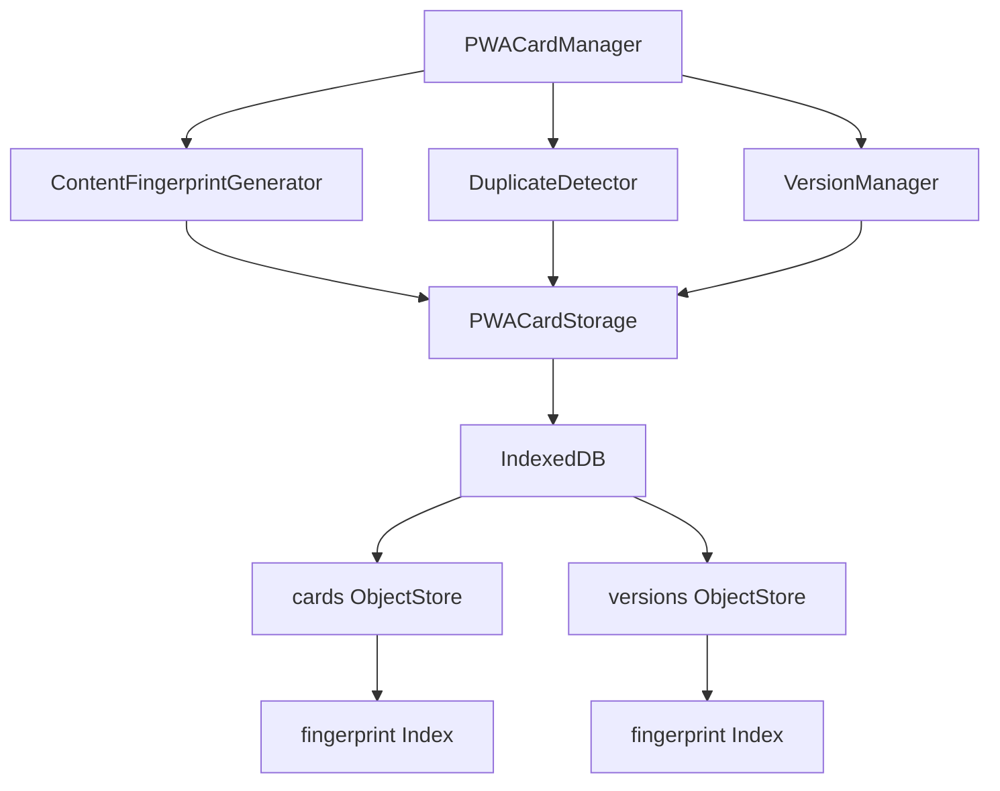
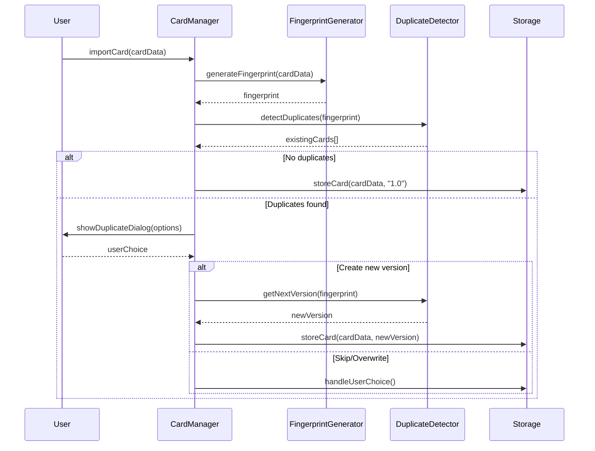

# 名片版本管理與重複識別技術設計文檔

## 1. System Architecture Overview

### 1.1 核心架構設計
基於現有 PWA 架構的最小化擴展策略：



### 1.2 模組責任劃分
- **ContentFingerprintGenerator**: 生成基於 name+email 的 SHA-256 指紋
- **DuplicateDetector**: 檢測重複名片並提供處理選項
- **VersionManager**: 管理版本歷史和語義化版本號
- **PWACardStorage**: 擴展現有儲存層，新增指紋索引

## 2. Data Models

### 2.1 擴展的 Card Schema
```typescript
interface EnhancedCard {
  // 現有欄位保持不變
  id: string;
  type: string;
  data: CardData;
  created: Date;
  modified: Date;
  currentVersion: number;
  
  // 新增欄位
  fingerprint: string;           // 格式: fingerprint_[64字元hash]
  version: string;               // 語義化版本: "1.0", "1.1", "1.2"
  duplicateGroup?: string;       // 重複群組ID (可選)
}
```

### 2.2 版本快照擴展
```typescript
interface EnhancedVersionSnapshot {
  // 現有欄位保持不變
  id: string;
  cardId: string;
  version: number;
  data: CardData;
  timestamp: Date;
  changeType: string;
  
  // 新增欄位
  fingerprint: string;           // 版本指紋
  semanticVersion: string;       // 語義化版本號
  changeDescription?: string;    // 變更描述
}
```

## 3. API Design

### 3.1 內容指紋生成 API
```typescript
class ContentFingerprintGenerator {
  async generateFingerprint(cardData: CardData): Promise<string> {
    const normalizedName = this.normalizeName(cardData.name);
    const normalizedEmail = this.normalizeEmail(cardData.email);
    const source = `${normalizedName}|${normalizedEmail}`;
    
    const hash = await crypto.subtle.digest('SHA-256', 
      new TextEncoder().encode(source));
    const hashHex = Array.from(new Uint8Array(hash))
      .map(b => b.toString(16).padStart(2, '0')).join('');
    
    return `fingerprint_${hashHex}`;
  }
  
  private normalizeName(name: string): string {
    if (!name) return '';
    // 處理雙語格式: "蔡孟諭~Tsai Meng-Yu" → "蔡孟諭"
    return name.split('~')[0].trim().toLowerCase();
  }
  
  private normalizeEmail(email: string): string {
    return (email || '').trim().toLowerCase();
  }
}
```

### 3.2 重複檢測 API
```typescript
class DuplicateDetector {
  async detectDuplicates(fingerprint: string): Promise<Card[]> {
    const transaction = this.storage.db.transaction(['cards'], 'readonly');
    const store = transaction.objectStore('cards');
    const index = store.index('fingerprint');
    
    return new Promise((resolve, reject) => {
      const request = index.getAll(fingerprint);
      request.onsuccess = () => resolve(request.result);
      request.onerror = () => reject(request.error);
    });
  }
  
  async getNextVersion(fingerprint: string): Promise<string> {
    const duplicates = await this.detectDuplicates(fingerprint);
    if (duplicates.length === 0) return "1.0";
    
    const versions = duplicates.map(card => parseFloat(card.version || "1.0"));
    const maxVersion = Math.max(...versions);
    return (maxVersion + 0.1).toFixed(1);
  }
}
```

## 4. Process & Module Structure

### 4.1 匯入時重複處理流程


### 4.2 版本管理模組結構
```typescript
class VersionManager {
  async createVersionSnapshot(cardId: string, data: CardData, 
                            changeType: string): Promise<void> {
    const card = await this.storage.getCard(cardId);
    const fingerprint = await this.fingerprintGenerator
      .generateFingerprint(data);
    
    const version = {
      id: `${cardId}_v${card.version}`,
      cardId,
      fingerprint,
      semanticVersion: card.version,
      data: JSON.parse(JSON.stringify(data)),
      timestamp: new Date(),
      changeType,
      checksum: await this.storage.calculateChecksum(data)
    };
    
    await this.storage.safeTransaction(['versions'], 'readwrite', 
      async (transaction) => {
        const store = transaction.objectStore('versions');
        store.put(version);
      });
  }
}
```

## 5. Security & Best Practices Appendix

### 5.1 安全設計原則
- **輸入驗證**: 所有名片資料進行格式驗證和清理
- **指紋防碰撞**: 使用 SHA-256 + 標準化處理，碰撞機率極低
- **授權檢查**: 版本操作需要適當的使用者權限驗證
- **安全日誌**: 記錄版本操作，但不洩露 PII 資訊
- **錯誤處理**: 版本衝突和異常情況的安全處理

### 5.2 認知負荷最小化
- **自動化處理**: 重複檢測和版本管理對使用者透明
- **清楚提示**: 版本狀態和操作結果有明確的視覺回饋
- **簡化選擇**: 提供預設選項和批量處理模式
- **可理解標籤**: 版本號使用語義化命名（1.0, 1.1, 1.2）

## 6. Spec↔Design Mapping

| 需求編號 | 設計模組 | 實作方法 | 測試策略 |
|---------|---------|---------|---------|
| REQ-001 | ContentFingerprintGenerator | generateFingerprint() | 指紋唯一性測試 |
| REQ-002 | DuplicateDetector | detectDuplicates() | 重複檢測準確率測試 |
| REQ-003 | VersionManager | getVersionHistory() | 版本歷史顯示測試 |
| REQ-004 | DuplicateDialog | showDuplicateDialog() | 匯入流程端到端測試 |
| REQ-005 | VersionCleaner | cleanupOldVersions() | 清理操作安全性測試 |