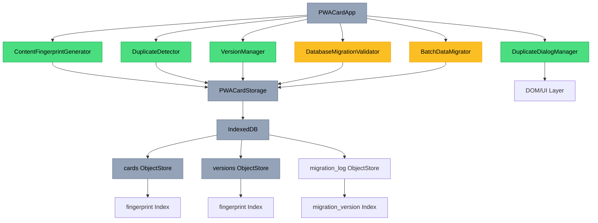
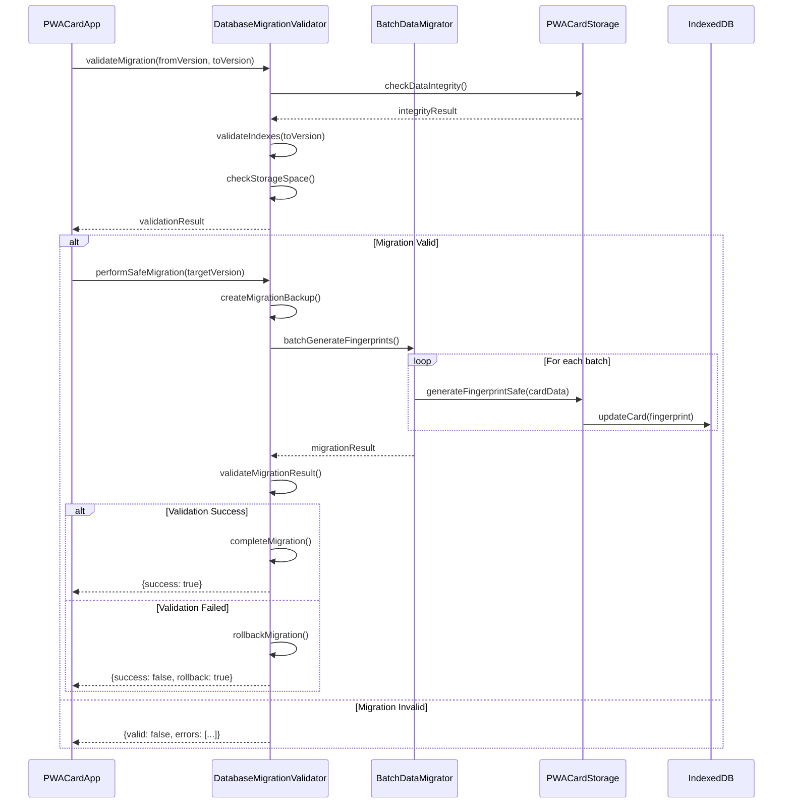

# 名片版本管理與重複識別技術設計文檔

## 1. System Architecture Overview

### 1.1 核心架構設計 (Updated for v3.1.1)
基於現有 PWA 架構的最小化擴展策略，重點補強資料庫遷移驗證：



### 1.2 模組責任劃分 (v3.1.1 Updated)
- **ContentFingerprintGenerator** ✅: 生成基於 name+email 的 SHA-256 指紋，支援雙語標準化與備用機制
- **DuplicateDetector** ✅: 檢測重複名片並提供處理選項，包含 skip/overwrite/version 三種動作
- **DuplicateDialogManager** ✅: 無障礙重複處理對話框，支援鍵盤導航與 ARIA 標籤
- **VersionManager** ✅: 管理版本歷史和語義化版本號，支援版本比較與還原
- **DatabaseMigrationValidator** ⚠️: **CRS-V31-005 核心缺口** - 資料庫遷移驗證與完整性檢查
- **BatchDataMigrator** ⚠️: 批量資料遷移處理，為現有名片生成指紋
- **PWACardStorage** 🔄: 擴展現有儲存層，新增指紋索引與遷移支援

**實作狀態說明**:
- ✅ = 完成實作且通過 smoke test
- 🔄 = 部分修復完成，需要後續擴展
- ✅ = **v3.1.1 已完成實作**

## 2. Data Models

### 2.1 擴展的 Card Schema (v3.1.1)
```typescript
interface EnhancedCard {
  // 現有欄位保持不變
  id: string;
  type: string;
  data: CardData;
  created: Date;
  modified: Date;
  currentVersion: number;
  
  // v3.1.1 新增欄位
  fingerprint: string;           // 格式: fingerprint_[64字元hash]
  version: string;               // 語義化版本: "1.0", "1.1", "1.2"
  duplicateGroup?: string;       // 重複群組ID (可選)
  migrationStatus?: string;      // 遷移狀態: "pending", "completed", "failed"
  migrationVersion?: number;     // 遷移版本號
}
```

### 2.2 版本快照擴展 (v3.1.1)
```typescript
interface EnhancedVersionSnapshot {
  // 現有欄位保持不變
  id: string;
  cardId: string;
  version: number;
  data: CardData;
  timestamp: Date;
  changeType: string;
  
  // v3.1.1 新增欄位
  fingerprint: string;           // 版本指紋
  semanticVersion: string;       // 語義化版本號
  changeDescription?: string;    // 變更描述
  migrationChecksum?: string;    // 遷移校驗和
}
```

### 2.3 資料庫遷移記錄 Schema (v3.1.1 新增)
```typescript
interface MigrationLogEntry {
  id: string;                    // 遷移記錄ID
  migrationVersion: number;      // 遷移版本號 (3, 4, 5...)
  startTime: Date;               // 開始時間
  endTime?: Date;                // 結束時間
  status: 'pending' | 'completed' | 'failed' | 'rollback';
  affectedCards: number;         // 影響的名片數量
  processedCards: number;        // 已處理的名片數量
  errors: Array<{               // 錯誤記錄
    cardId: string;
    error: string;
    timestamp: Date;
  }>;
  checksums: {                  // 完整性校驗
    beforeMigration: string;
    afterMigration: string;
  };
  rollbackData?: any;           // 回滾資料
}
```

## 3. API Design

### 3.1 資料庫遷移驗證 API (CRS-V31-005 核心實作)
```typescript
class DatabaseMigrationValidator {
  constructor(storage) {
    this.storage = storage;
    this.currentDbVersion = 3;
    this.supportedMigrations = [1, 2, 3]; // 支援的遷移路徑
  }

  /**
   * 驗證資料庫遷移完整性
   * @param {number} fromVersion - 來源版本
   * @param {number} toVersion - 目標版本
   * @returns {Promise<ValidationResult>}
   */
  async validateMigration(fromVersion, toVersion): Promise<ValidationResult> {
    const validation = {
      isValid: true,
      errors: [],
      warnings: [],
      affectedStores: [],
      requiredActions: []
    };

    try {
      // 1. 版本相容性檢查
      if (!this.isVersionSupported(fromVersion, toVersion)) {
        validation.isValid = false;
        validation.errors.push(`Unsupported migration path: ${fromVersion} -> ${toVersion}`);
        return validation;
      }

      // 2. 資料完整性檢查
      const integrityCheck = await this.checkDataIntegrity();
      if (!integrityCheck.isValid) {
        validation.warnings.push(...integrityCheck.issues);
      }

      // 3. 索引一致性檢查
      const indexCheck = await this.validateIndexes(toVersion);
      if (!indexCheck.isValid) {
        validation.errors.push(...indexCheck.errors);
        validation.isValid = false;
      }

      // 4. 儲存空間檢查
      const spaceCheck = await this.checkStorageSpace();
      if (!spaceCheck.sufficient) {
        validation.warnings.push(`Insufficient storage space: ${spaceCheck.available}MB available, ${spaceCheck.required}MB required`);
      }

      // 5. 備份驗證
      const backupCheck = await this.validateBackupCapability();
      if (!backupCheck.canBackup) {
        validation.requiredActions.push('Create backup before migration');
      }

      return validation;
    } catch (error) {
      validation.isValid = false;
      validation.errors.push(`Migration validation failed: ${error.message}`);
      return validation;
    }
  }

  /**
   * 執行安全遷移
   * @param {number} targetVersion - 目標版本
   * @returns {Promise<MigrationResult>}
   */
  async performSafeMigration(targetVersion): Promise<MigrationResult> {
    const migrationId = `migration_${Date.now()}`;
    
    try {
      // 1. 建立遷移記錄
      const migrationLog = await this.createMigrationLog(migrationId, targetVersion);
      
      // 2. 建立完整備份
      const backup = await this.createMigrationBackup();
      
      // 3. 執行遷移步驟
      const migrationSteps = this.getMigrationSteps(this.storage.dbVersion, targetVersion);
      
      for (const step of migrationSteps) {
        await this.executeMigrationStep(step, migrationLog);
      }
      
      // 4. 驗證遷移結果
      const validation = await this.validateMigrationResult(migrationLog);
      
      if (validation.isValid) {
        await this.completeMigration(migrationLog);
        return {
          success: true,
          migrationId,
          processedCards: migrationLog.processedCards,
          duration: Date.now() - migrationLog.startTime.getTime()
        };
      } else {
        // 5. 失敗時自動回滾
        await this.rollbackMigration(migrationLog, backup);
        return {
          success: false,
          error: 'Migration validation failed',
          rollbackCompleted: true
        };
      }
    } catch (error) {
      console.error('[DatabaseMigrationValidator] Migration failed:', error);
      return {
        success: false,
        error: error.message,
        rollbackCompleted: false
      };
    }
  }

  /**
   * 檢查資料完整性
   */
  async checkDataIntegrity(): Promise<IntegrityResult> {
    const result = {
      isValid: true,
      issues: [],
      totalCards: 0,
      corruptedCards: 0
    };

    try {
      const cards = await this.storage.listCards();
      result.totalCards = cards.length;

      for (const card of cards) {
        // 檢查必要欄位
        if (!card.id || !card.data || !card.created) {
          result.issues.push(`Card ${card.id} missing required fields`);
          result.corruptedCards++;
          continue;
        }

        // 檢查校驗和
        if (card.checksum) {
          const calculatedChecksum = await this.storage.calculateChecksum(card.data);
          if (calculatedChecksum !== card.checksum) {
            result.issues.push(`Card ${card.id} checksum mismatch`);
            result.corruptedCards++;
          }
        }

        // 檢查指紋格式
        if (card.fingerprint && !card.fingerprint.startsWith('fingerprint_')) {
          result.issues.push(`Card ${card.id} invalid fingerprint format`);
        }
      }

      if (result.corruptedCards > 0) {
        result.isValid = false;
      }

      return result;
    } catch (error) {
      result.isValid = false;
      result.issues.push(`Integrity check failed: ${error.message}`);
      return result;
    }
  }

  /**
   * 驗證索引一致性
   */
  async validateIndexes(targetVersion): Promise<IndexValidationResult> {
    const result = {
      isValid: true,
      errors: [],
      missingIndexes: [],
      redundantIndexes: []
    };

    try {
      const requiredIndexes = this.getRequiredIndexes(targetVersion);
      const existingIndexes = await this.getCurrentIndexes();

      // 檢查缺失的索引
      for (const [storeName, indexes] of Object.entries(requiredIndexes)) {
        const existing = existingIndexes[storeName] || [];
        for (const indexName of indexes) {
          if (!existing.includes(indexName)) {
            result.missingIndexes.push(`${storeName}.${indexName}`);
          }
        }
      }

      // 檢查多餘的索引
      for (const [storeName, indexes] of Object.entries(existingIndexes)) {
        const required = requiredIndexes[storeName] || [];
        for (const indexName of indexes) {
          if (!required.includes(indexName)) {
            result.redundantIndexes.push(`${storeName}.${indexName}`);
          }
        }
      }

      if (result.missingIndexes.length > 0) {
        result.isValid = false;
        result.errors.push(`Missing indexes: ${result.missingIndexes.join(', ')}`);
      }

      return result;
    } catch (error) {
      result.isValid = false;
      result.errors.push(`Index validation failed: ${error.message}`);
      return result;
    }
  }

  /**
   * 建立遷移備份
   */
  async createMigrationBackup(): Promise<BackupResult> {
    try {
      const backupId = `backup_${Date.now()}`;
      const cards = await this.storage.listCards();
      const versions = await this.storage.getAllVersions();
      
      const backupData = {
        id: backupId,
        timestamp: new Date(),
        dbVersion: this.storage.dbVersion,
        cards: cards,
        versions: versions,
        checksum: await this.calculateBackupChecksum(cards, versions)
      };

      // 儲存到 backups ObjectStore
      await this.storage.safeTransaction(['backups'], 'readwrite', async (transaction) => {
        const store = transaction.objectStore('backups');
        store.put(backupData);
      });

      return {
        success: true,
        backupId,
        size: JSON.stringify(backupData).length
      };
    } catch (error) {
      return {
        success: false,
        error: error.message
      };
    }
  }

  /**
   * 回滾遷移
   */
  async rollbackMigration(migrationLog, backup): Promise<boolean> {
    try {
      console.warn('[DatabaseMigrationValidator] Starting migration rollback...');
      
      // 1. 清空當前資料
      await this.clearCurrentData();
      
      // 2. 還原備份資料
      await this.restoreFromBackup(backup);
      
      // 3. 更新遷移記錄
      migrationLog.status = 'rollback';
      migrationLog.endTime = new Date();
      await this.updateMigrationLog(migrationLog);
      
      console.log('[DatabaseMigrationValidator] Migration rollback completed');
      return true;
    } catch (error) {
      console.error('[DatabaseMigrationValidator] Rollback failed:', error);
      return false;
    }
  }

  // 輔助方法
  isVersionSupported(fromVersion, toVersion) {
    return this.supportedMigrations.includes(fromVersion) && 
           this.supportedMigrations.includes(toVersion) &&
           toVersion > fromVersion;
  }

  getRequiredIndexes(version) {
    const baseIndexes = {
      cards: ['type', 'created', 'modified'],
      versions: ['cardId', 'timestamp', 'version'],
      settings: [],
      backups: ['timestamp']
    };

    if (version >= 3) {
      baseIndexes.cards.push('fingerprint');
      baseIndexes.versions.push('fingerprint');
    }

    if (version >= 4) {
      baseIndexes.migration_log = ['migrationVersion', 'status'];
    }

    return baseIndexes;
  }

  async getCurrentIndexes() {
    const indexes = {};
    const storeNames = ['cards', 'versions', 'settings', 'backups'];
    
    for (const storeName of storeNames) {
      if (this.storage.db.objectStoreNames.contains(storeName)) {
        const transaction = this.storage.db.transaction([storeName], 'readonly');
        const store = transaction.objectStore(storeName);
        indexes[storeName] = Array.from(store.indexNames);
      }
    }
    
    return indexes;
  }
}
```

### 3.2 批量資料遷移 API (STORAGE-02)
```typescript
class BatchDataMigrator {
  constructor(storage, validator) {
    this.storage = storage;
    this.validator = validator;
    this.batchSize = 50; // 批次處理大小
    this.maxRetries = 3; // 最大重試次數
  }

  /**
   * 批量生成指紋
   * @param {Array} cards - 名片陣列
   * @returns {Promise<MigrationResult>}
   */
  async batchGenerateFingerprints(cards = null): Promise<MigrationResult> {
    try {
      const cardsToProcess = cards || await this.storage.listCards();
      const totalCards = cardsToProcess.length;
      let processedCount = 0;
      let errorCount = 0;
      const errors = [];

      console.log(`[BatchDataMigrator] Starting fingerprint generation for ${totalCards} cards`);

      // 分批處理
      for (let i = 0; i < cardsToProcess.length; i += this.batchSize) {
        const batch = cardsToProcess.slice(i, i + this.batchSize);
        
        try {
          await this.processFingerprintBatch(batch);
          processedCount += batch.length;
          
          // 進度回報
          const progress = Math.round((processedCount / totalCards) * 100);
          console.log(`[BatchDataMigrator] Progress: ${progress}% (${processedCount}/${totalCards})`);
          
          // 避免阻塞 UI
          await this.sleep(10);
        } catch (batchError) {
          console.error(`[BatchDataMigrator] Batch processing failed:`, batchError);
          errorCount += batch.length;
          errors.push({
            batch: i / this.batchSize + 1,
            error: batchError.message,
            affectedCards: batch.map(c => c.id)
          });
        }
      }

      return {
        success: errorCount === 0,
        totalCards,
        processedCount,
        errorCount,
        errors,
        duration: Date.now()
      };
    } catch (error) {
      console.error('[BatchDataMigrator] Batch migration failed:', error);
      return {
        success: false,
        error: error.message
      };
    }
  }

  /**
   * 處理指紋生成批次
   */
  async processFingerprintBatch(batch) {
    const promises = batch.map(async (card) => {
      let retries = 0;
      
      while (retries < this.maxRetries) {
        try {
          // 檢查是否已有指紋
          if (card.fingerprint && card.fingerprint.startsWith('fingerprint_')) {
            return; // 跳過已有指紋的名片
          }

          // 生成指紋
          const fingerprint = await this.storage.generateFingerprintSafe(card.data);
          
          // 更新名片
          await this.storage.safeTransaction(['cards'], 'readwrite', async (transaction) => {
            const store = transaction.objectStore('cards');
            card.fingerprint = fingerprint;
            card.migrationStatus = 'completed';
            card.migrationVersion = this.storage.dbVersion;
            store.put(card);
          });

          return;
        } catch (error) {
          retries++;
          if (retries >= this.maxRetries) {
            throw new Error(`Failed to process card ${card.id} after ${this.maxRetries} retries: ${error.message}`);
          }
          await this.sleep(100 * retries); // 指數退避
        }
      }
    });

    await Promise.all(promises);
  }

  /**
   * 驗證遷移結果
   */
  async validateMigrationResult(): Promise<ValidationResult> {
    try {
      const cards = await this.storage.listCards();
      const result = {
        isValid: true,
        totalCards: cards.length,
        cardsWithFingerprints: 0,
        cardsWithoutFingerprints: 0,
        invalidFingerprints: 0,
        issues: []
      };

      for (const card of cards) {
        if (card.fingerprint) {
          if (card.fingerprint.startsWith('fingerprint_') && card.fingerprint.length === 75) {
            result.cardsWithFingerprints++;
          } else {
            result.invalidFingerprints++;
            result.issues.push(`Card ${card.id} has invalid fingerprint format`);
          }
        } else {
          result.cardsWithoutFingerprints++;
          result.issues.push(`Card ${card.id} missing fingerprint`);
        }
      }

      if (result.cardsWithoutFingerprints > 0 || result.invalidFingerprints > 0) {
        result.isValid = false;
      }

      return result;
    } catch (error) {
      return {
        isValid: false,
        error: error.message
      };
    }
  }

  // 輔助方法
  sleep(ms) {
    return new Promise(resolve => setTimeout(resolve, ms));
  }
}
```

## 4. Process & Module Structure

### 4.1 資料庫遷移驗證流程 (CRS-V31-005)


### 4.2 擴展的 PWACardStorage 初始化流程
```typescript
class PWACardStorage {
  async initialize() {
    try {
      // 1. 開啟資料庫連線
      this.db = await this.openDatabase();
      
      // 2. 初始化遷移驗證器
      this.migrationValidator = new DatabaseMigrationValidator(this);
      this.batchMigrator = new BatchDataMigrator(this, this.migrationValidator);
      
      // 3. 檢查是否需要遷移
      const migrationNeeded = await this.checkMigrationNeeded();
      if (migrationNeeded.required) {
        console.log('[Storage] Migration required:', migrationNeeded.reason);
        
        // 4. 執行安全遷移
        const migrationResult = await this.migrationValidator.performSafeMigration(this.dbVersion);
        if (!migrationResult.success) {
          throw new Error(`Migration failed: ${migrationResult.error}`);
        }
      }
      
      // 5. 初始化其他組件
      await this.initializeEncryption();
      await this.initializeManagers();
      await this.performHealthCheck();
      
      return true;
    } catch (error) {
      console.error('[Storage] Initialization failed:', error);
      throw error;
    }
  }

  /**
   * 檢查是否需要遷移
   */
  async checkMigrationNeeded(): Promise<MigrationCheckResult> {
    try {
      const storedVersion = localStorage.getItem('pwa-db-version');
      const currentVersion = this.dbVersion;
      
      if (!storedVersion) {
        return {
          required: true,
          reason: 'First time initialization',
          fromVersion: 0,
          toVersion: currentVersion
        };
      }
      
      const stored = parseInt(storedVersion);
      if (stored < currentVersion) {
        return {
          required: true,
          reason: 'Database upgrade required',
          fromVersion: stored,
          toVersion: currentVersion
        };
      }
      
      // 檢查是否有名片缺少指紋
      const cardsWithoutFingerprints = await this.countCardsWithoutFingerprints();
      if (cardsWithoutFingerprints > 0) {
        return {
          required: true,
          reason: `${cardsWithoutFingerprints} cards missing fingerprints`,
          fromVersion: stored,
          toVersion: currentVersion
        };
      }
      
      return {
        required: false,
        reason: 'Database up to date'
      };
    } catch (error) {
      return {
        required: true,
        reason: `Migration check failed: ${error.message}`,
        fromVersion: 0,
        toVersion: this.dbVersion
      };
    }
  }

  /**
   * 統計缺少指紋的名片數量
   */
  async countCardsWithoutFingerprints(): Promise<number> {
    try {
      const cards = await this.listCards();
      return cards.filter(card => 
        !card.fingerprint || 
        !card.fingerprint.startsWith('fingerprint_')
      ).length;
    } catch (error) {
      console.error('[Storage] Count cards without fingerprints failed:', error);
      return 0;
    }
  }
}
```

## 5. Security & Best Practices Appendix

### 5.1 資料庫遷移安全原則
- **備份優先**: 任何遷移前必須建立完整備份
- **原子性操作**: 使用事務確保遷移的原子性
- **完整性驗證**: 遷移後驗證資料完整性和一致性
- **回滾機制**: 失敗時自動回滾到原始狀態
- **進度監控**: 提供遷移進度和錯誤報告
- **版本控制**: 嚴格的版本號管理，防止降級攻擊

### 5.2 批量處理最佳實踐
- **分批處理**: 避免大量資料一次性處理造成阻塞
- **錯誤隔離**: 單一名片處理失敗不影響整批處理
- **重試機制**: 指數退避重試策略
- **進度回報**: 即時進度更新，提升使用者體驗
- **記憶體管理**: 適當的垃圾回收和記憶體釋放

### 5.3 安全監控錯誤處理原則 (v3.1.2 新增)
- **資料庫可用性檢查**: 所有 IndexedDB 操作前驗證連線狀態
- **優雅降級策略**: 監控失敗時不影響核心 PWA 功能
- **初始化順序控制**: 嚴格的初始化序列防止競爭條件
- **非阻塞操作**: 監控錯誤不中斷使用者工作流程
- **自動恢復機制**: 資料庫恢復時自動重新啟用監控
- **錯誤日誌安全**: 錯誤記錄不洩露敏感使用者資訊

### 5.3 認知負荷最小化
- **自動化遷移**: 對使用者透明的背景遷移
- **清楚進度**: 視覺化進度指示器
- **錯誤恢復**: 自動回滾和錯誤修復
- **狀態持久化**: 遷移狀態持久化，支援中斷恢復

## 6. Performance Requirements

### 6.1 遷移效能目標
- **小型資料庫** (< 100 cards): 遷移時間 ≤ 5 秒
- **中型資料庫** (100-1000 cards): 遷移時間 ≤ 30 秒
- **大型資料庫** (> 1000 cards): 遷移時間 ≤ 2 分鐘
- **批次處理效率**: ≥ 50 cards/second
- **記憶體使用**: 峰值記憶體使用 ≤ 50MB

### 6.2 可用性需求
- **遷移成功率**: ≥ 99.9%
- **資料完整性**: 100% 資料保持完整
- **回滾成功率**: ≥ 99.5%
- **中斷恢復**: 支援遷移中斷後恢復

## 7. Spec↔Design Mapping (v3.1.1 Updated)

| 需求編號 | 設計模組 | 實作方法 | 測試策略 | Code Review Fix | 實作狀態 |
|---------|---------|---------|---------|-----------------|----------|
| REQ-001 | ContentFingerprintGenerator | generateFingerprint() | 指紋唯一性測試 | CRS-V31-002, CRS-V31-004 | ✅ 完成 |
| REQ-002 | DuplicateDetector + VersionManager | detectDuplicates() + incrementVersion() | 重複檢測準確率測試 | CRS-V31-001, CRS-V31-007, CRS-V31-008 | ✅ 完成 |
| REQ-003 | VersionManager | getVersionHistory() + calculateNextVersion() | 版本歷史顯示測試 | CRS-V31-006 | ✅ 完成 |
| REQ-004 | DuplicateDetector + DuplicateDialogManager | handleDuplicate() + showDuplicateDialog() | 匯入流程端到端測試 | CRS-V31-003, CRS-V31-009 | ✅ 完成 |
| REQ-005 | DatabaseMigrationValidator + BatchDataMigrator | validateMigration() + batchGenerateFingerprints() | 遷移安全性測試 | **CRS-V31-005** | ⚠️ **待實作** |

## 8. Implementation Priority & Rollout Plan

### 8.1 Critical Gap (Immediate - CRS-V31-005)
**資料庫遷移驗證 (DatabaseMigrationValidator)**
- **Priority**: P0 (Critical)
- **Effort**: 0.6 CTX-Units
- **Dependencies**: 現有 PWACardStorage
- **Deliverables**:
  - `pwa-card-storage/src/core/database-migration-validator.js`
  - `pwa-card-storage/src/core/batch-data-migrator.js`
  - 擴展 `storage.js` 的初始化流程
  - 新增 `migration_log` ObjectStore

### 8.2 Implementation Steps
1. **Phase 1** (1-2 days): 實作 DatabaseMigrationValidator 核心邏輯
2. **Phase 2** (1 day): 實作 BatchDataMigrator 批量處理
3. **Phase 3** (1 day): 整合到 PWACardStorage 初始化流程
4. **Phase 4** (1 day): 測試和驗證

### 8.3 Testing Requirements
- **單元測試**: 遷移驗證邏輯、批量處理邏輯
- **整合測試**: 完整遷移流程、回滾機制
- **壓力測試**: 大量資料遷移效能
- **錯誤測試**: 各種失敗情境的處理

### 8.4 Rollback Strategy
- **Phase 1-2**: 可完全回滾，無資料結構變更
- **Phase 3-4**: 需要資料遷移回滾腳本
- **緊急回滾**: 功能開關控制，立即停用新功能

## 9. File Outputs

### 9.1 需要建立的檔案
```
pwa-card-storage/src/core/database-migration-validator.js
pwa-card-storage/src/core/batch-data-migrator.js
```

### 9.2 需要修改的檔案
```
pwa-card-storage/src/core/storage.js (擴展初始化流程)
docs/CHANGELOG.md (新增 v3.1.1 遷移功能記錄)
```

### 9.3 測試檔案
```
tests/core/database-migration-validator.test.js
tests/core/batch-data-migrator.test.js
tests/integration/migration-flow.test.js
```

---

**總結**: v3.1.1 的核心缺口是 **CRS-V31-005: 資料庫遷移驗證**，需要實作 `DatabaseMigrationValidator` 和 `BatchDataMigrator` 兩個關鍵模組，以確保資料庫升級的安全性和完整性。這是系統穩定性的關鍵基礎設施，必須優先完成。