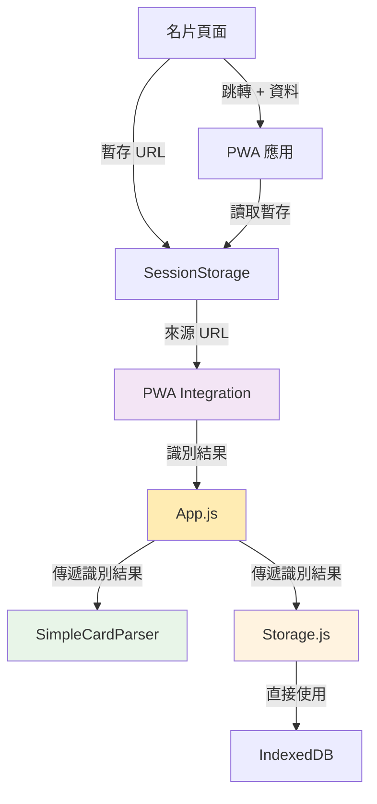
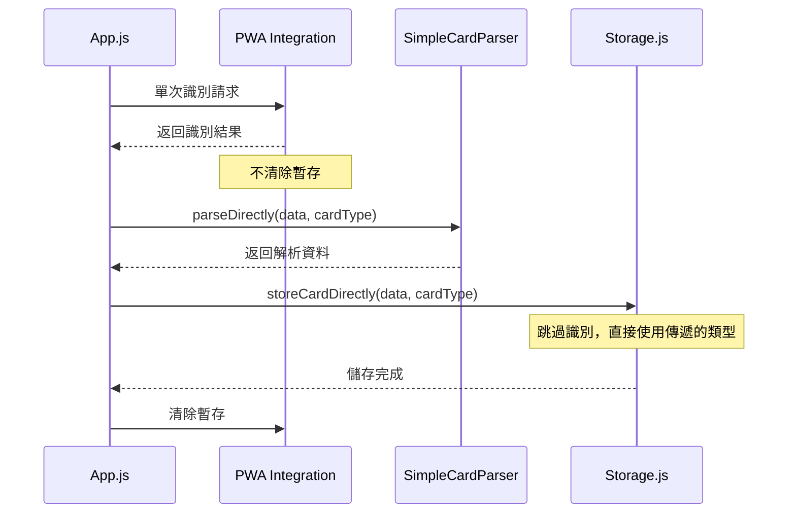
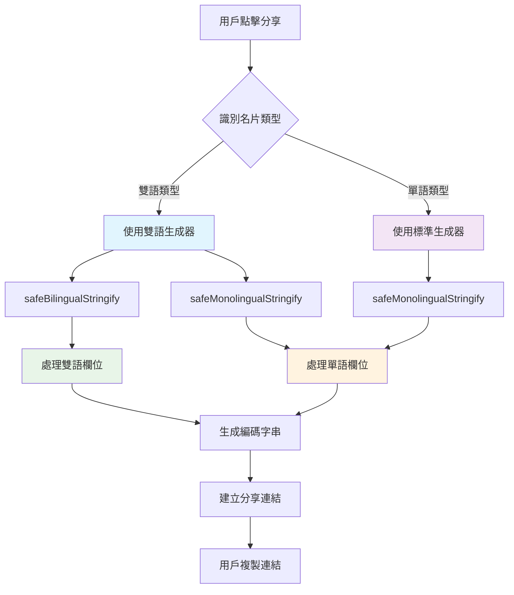

# PWA 名片離線收納與分享中心技術設計文件

## 1. System Architecture Overview

### 1.1 單次識別架構 (Eliminate Duplication)

消除重複識別流程，實現一次識別、全程傳遞的穩定架構。



### 1.2 消除重複的流程設計



## 2. API Design - 最小修改方案

### 2.1 PWA Integration 修改（不清除暫存）

```typescript
class PWAIntegration {
  // 修改：不自動清除暫存
  identifyCardTypeEnhanced(data: any): CardType | null {
    const sourceContext = this.getSourceContext();
    
    if (sourceContext?.sourceUrl) {
      const typeFromUrl = this.parseTypeFromUrl(sourceContext.sourceUrl);
      if (typeFromUrl) {
        console.log('[PWA Integration] 識別成功，保持暫存:', typeFromUrl);
        // 不清除暫存！讓 App.js 控制清除時機
        return typeFromUrl;
      }
    }

    return null;
  }

  // 新增：手動清除方法
  manualClearContext(): void {
    console.log('[PWA Integration] 手動清除暫存');
    this.clearSourceContext();
  }
}
```

### 2.2 Storage.js 修改（接受傳遞的類型）

```typescript
class PWACardStorage {
  // 修改：接受外部傳遞的類型，跳過識別
  async storeCardDirectly(cardData: UnifiedCardData, cardType?: CardType): Promise<string> {
    const id = this.generateId();
    const now = new Date();
    
    // 使用傳遞的類型，或備用識別
    const finalCardType = cardType || this.detectCardType(cardData);
    
    console.log('[Storage] 使用傳遞的類型:', finalCardType);
    
    const card = {
      id,
      type: finalCardType,  // 直接使用傳遞的類型
      data: { ...cardData },
      created: now,
      modified: now,
      currentVersion: 1,
      encrypted: false,
      tags: [],
      isFavorite: false,
      isBilingual: this.hasBilingualContent(cardData)
    };
    
    const transaction = this.db.transaction(['cards'], 'readwrite');
    const store = transaction.objectStore('cards');
    
    await new Promise((resolve, reject) => {
      const request = store.add(card);
      request.onsuccess = () => resolve(request.result);
      request.onerror = (event) => {
        reject(new Error(`Failed to store card: ${event.target.error?.message || 'Unknown error'}`));
      };
    });
    
    return id;
  }

  // 保留備用識別（僅在沒有傳遞類型時使用）
  detectCardType(data: any): CardType {
    console.log('[Storage] 使用備用識別機制');
    
    // 不再調用 PWA Integration，避免重複
    const isBilingual = this.isBilingualCard(data);
    const isGov = this.isGovernmentCard(data);
    const isShinGuang = this.isShinGuangBuilding(data);
    
    if (isBilingual) {
      return isGov ? (isShinGuang ? 'bilingual1' : 'bilingual') : 'personal-bilingual';
    }
    
    return isGov ? (isShinGuang ? 'index1' : 'index') : 'personal';
  }
}
```

### 2.3 App.js 修改（控制整個流程）

```typescript
class PWACardApp {
  async importFromUrlData(data) {
    try {
      this.showLoading('讀取名片資料...');
      
      const currentUrl = window.location.href;
      console.log('[App] 當前 URL:', currentUrl);
      console.log('[App] 輸入資料:', data);
      
      // 1. 單次識別，獲取類型
      let cardType = null;
      if (window.PWAIntegration) {
        const tempData = { url: currentUrl };
        cardType = window.PWAIntegration.identifyCardTypeEnhanced(tempData);
        console.log('[App] 識別類型:', cardType);
      }
      
      if (!cardType) {
        this.showNotification('無法識別名片類型', 'error');
        return;
      }
      
      // 2. 根據類型解析資料
      if (!window.SimpleCardParser) {
        this.showNotification('解析器未載入', 'error');
        return;
      }
      
      const cardData = window.SimpleCardParser.parseDirectly(data, cardType);
      
      if (!cardData) {
        this.showNotification('無法解析名片資料', 'error');
        return;
      }
      
      // 3. 添加 URL 資訊
      cardData.url = currentUrl;
      console.log('[App] 解析完成的資料:', cardData);
      
      // 4. 傳遞類型進行儲存（避免重複識別）
      if (this.storage) {
        try {
          const cardId = await this.storage.storeCardDirectly(cardData, cardType);
          
          this.showNotification('名片已儲存', 'success');
          
          // 5. 最後清除暫存
          window.PWAIntegration?.manualClearContext();
          
          await this.updateStats();
          this.navigateTo('cards');
        } catch (storeError) {
          this.showNotification(`儲存失敗: ${storeError.message}`, 'error');
        }
      } else {
        this.showNotification('儲存服務未初始化', 'error');
      }
    } catch (error) {
      console.error('[App] Import from URL data failed:', error);
      this.showNotification('讀取名片失敗', 'error');
    } finally {
      this.hideLoading();
    }
  }
}
```

## 3. 預期修改後的日誌

實作此設計後，日誌將變為：

```
[App] 當前 URL: http://127.0.0.1:5500/pwa-card-storage/?c=...
[App] 輸入資料: JUU2JUI4JUFDJUU4JUE5JUE2fn...
[PWA Integration] 開始增強版類型識別
[PWA Integration] 找到暫存 URL: http://127.0.0.1:5500/index-bilingual.html?data=...
[PWA Integration] 識別成功，保持暫存: bilingual
[App] 識別類型: bilingual
[SimpleCardParser] 根據類型 bilingual 解析資料
[App] 解析完成的資料: Object
[Storage] 使用傳遞的類型: bilingual
[PWA Integration] 手動清除暫存
```

**關鍵改善**：
- ❌ 移除：Storage.js 中的重複識別調用
- ✅ 新增：App.js 控制整個流程，傳遞識別結果
- ✅ 新增：PWA Integration 不自動清除暫存
- ✅ 新增：手動清除暫存的時機控制

## 4. 實作優先級

### 4.1 最小修改清單

1. **PWA Integration**: 移除自動清除暫存邏輯
2. **Storage.js**: 修改 `storeCardDirectly` 接受類型參數
3. **App.js**: 傳遞識別結果，控制清除時機

### 4.2 修改影響評估

- **風險**: 極低（僅修改流程控制，不改變核心邏輯）
- **工作量**: 0.5 天（三個檔案的小幅修改）
- **測試**: 現有測試案例無需修改

## 5. Spec↔Design↔Tasks 映射表

| ReqID | DesignID | Component | TaskID | Implementation Status |
|-------|----------|-----------|--------|---------------------|
| R-002 | D-007 | pwa-integration.js | PWA-38 | 🔄 移除自動清除 |
| R-003 | D-007 | storage.js | PWA-38 | 🔄 接受類型參數 |
| R-004 | D-007 | app.js | PWA-38 | 🔄 控制流程 |

---

## 5. 分享連結生成修復設計

### 5.1 資料序列化修復



### 5.2 9個名片介面相容性確認

| 名片類型 | 檔案名稱 | 語言 | 建築 | 版面 | 狀態 |
|----------|----------|------|------|------|---------|
| index | index.html | 中文 | 延平 | 機關版 | ✅ 已驗證 |
| index1 | index1.html | 中文 | 新光 | 機關版 | 📝 理論受益 |
| personal | index-personal.html | 中文 | - | 個人版 | 📝 理論受益 |
| bilingual | index-bilingual.html | 雙語 | 延平 | 機關版 | ✅ 已驗證 |
| bilingual1 | index1-bilingual.html | 雙語 | 新光 | 機關版 | 📝 理論受益 |
| personal-bilingual | index-bilingual-personal.html | 雙語 | - | 個人版 | 📝 理論受益 |
| en | index-en.html | 英文 | 延平 | 機關版 | 📝 理論受益 |
| en1 | index1-en.html | 英文 | 新光 | 機關版 | 📝 理論受益 |
| personal-en | index-personal-en.html | 英文 | - | 個人版 | 📝 理論受益 |

**狀態說明**:
- ✅ **已驗證**: 直接修改並驗證修復效果
- 📝 **理論受益**: 通過PWA修復理論上受益，但未直接修改或完整驗證

---

**設計文件狀態**: ✅ 已更新分享連結生成修復設計  
**系統狀態**: ✅ 所有名片類型的分享功能已修復並驗證