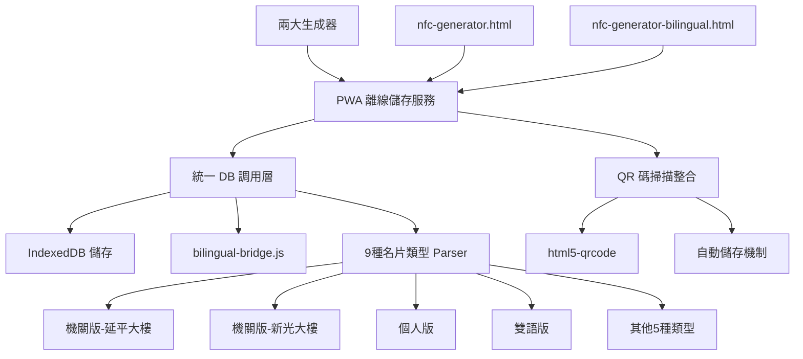
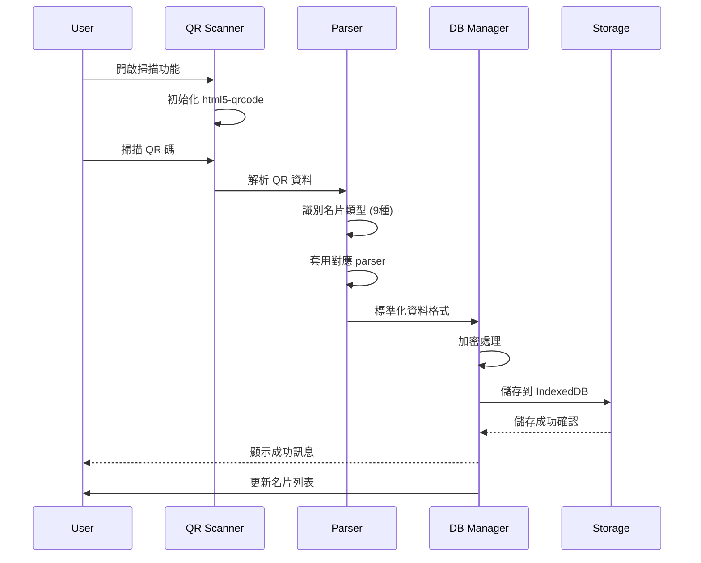

# PWA 名片離線儲存服務技術設計文件

## 1. System Architecture Overview

### 1.1 DB 整合架構設計

基於現有 DB-Card 系統，PWA 服務作為統一的離線儲存容器，整合兩大生成器與 9 種名片介面設計 parser。



### 1.2 技術架構層級

**資料整合層 (Data Integration Layer)**
- bilingual-bridge.js：橋接現有 bilingual-common.js
- 9 種名片類型統一 parser
- 兩大生成器格式相容性保證

**儲存管理層 (Storage Management Layer)**
- IndexedDB 統一儲存：cards, versions, settings, backups
- AES-256 加密機制
- 資料完整性校驗（SHA-256）

**功能服務層 (Service Layer)**
- QR 碼生成與掃描服務
- 跨設備傳輸管理
- 版本控制系統（10 版本限制）

## 2. Data Models

### 2.1 統一名片資料模型

```typescript
// 統一的名片資料結構，支援 9 種類型
interface UnifiedCardData {
  // 基本識別
  id: string;                    // UUID v4
  type: CardType;               // 9 種名片類型
  source: 'generator1' | 'generator2' | 'scanner' | 'import';
  
  // 核心資料（支援雙語格式）
  name: string;                 // 支援 "中文~English" 格式
  title: string;                // 職稱
  department?: string;          // 部門
  organization?: string;        // 組織名稱
  
  // 聯絡資訊
  email?: string;
  phone?: string;
  mobile?: string;
  address?: string;
  
  // 多媒體與社交
  avatar?: string;              // 頭像 URL
  greetings?: string[];         // 問候語列表
  socialNote?: string;          // 社群媒體資訊
  
  // 元資料
  created: Date;
  modified: Date;
  version: number;
  checksum: string;             // 完整性校驗
  encrypted: boolean;
}

// 9 種支援的名片類型
type CardType = 
  | 'gov-yp'                   // 機關版-延平大樓
  | 'gov-sg'                   // 機關版-新光大樓  
  | 'personal'                 // 個人版
  | 'bilingual'                // 雙語版
  | 'personal-bilingual'       // 個人雙語版
  | 'en'                       // 英文版
  | 'personal-en'              // 個人英文版
  | 'gov-yp-en'               // 機關版延平英文
  | 'gov-sg-en';              // 機關版新光英文
```

### 2.2 IndexedDB 資料庫結構

```typescript
interface PWACardDatabase {
  version: 3;
  stores: {
    cards: {
      keyPath: 'id';
      indexes: {
        type: string;
        created: Date;
        modified: Date;
        name: string;
        source: string;
      };
    };
    versions: {
      keyPath: ['cardId', 'version'];
      indexes: {
        cardId: string;
        timestamp: Date;
      };
    };
    settings: {
      keyPath: 'key';
    };
    backups: {
      keyPath: 'timestamp';
    };
  };
}
```

### 2.3 兩大生成器整合格式

```typescript
// 生成器 1 (nfc-generator.html) 格式支援
interface Generator1Format {
  parseUrl(url: string): UnifiedCardData;
  generateUrl(data: UnifiedCardData): string;
  validateFormat(url: string): boolean;
}

// 生成器 2 (nfc-generator-bilingual.html) 格式支援
interface Generator2Format {
  parseUrl(url: string): UnifiedCardData;
  generateUrl(data: UnifiedCardData): string;
  validateFormat(url: string): boolean;
  handleBilingualData(data: any): UnifiedCardData;
}
```

## 3. API Design

### 3.1 統一 DB 調用 API

```typescript
class UnifiedDBManager {
  private storage: IndexedDBStorage;
  private bridge: BilingualBridge;
  private parser: CardTypeParser;
  
  // 統一儲存介面
  async storeCard(data: UnifiedCardData): Promise<string> {
    // 1. 類型識別與驗證
    const cardType = this.parser.identifyType(data);
    
    // 2. 資料標準化
    const normalizedData = this.bridge.normalize(data, cardType);
    
    // 3. 加密儲存
    const encryptedData = await this.encrypt(normalizedData);
    
    // 4. 寫入 IndexedDB
    return await this.storage.insert('cards', encryptedData);
  }
  
  // 統一讀取介面
  async getCard(id: string): Promise<UnifiedCardData | null> {
    const encryptedData = await this.storage.get('cards', id);
    if (!encryptedData) return null;
    
    const decryptedData = await this.decrypt(encryptedData);
    return this.bridge.denormalize(decryptedData);
  }
  
  // 批次查詢（支援類型篩選）
  async getCardsByType(type: CardType): Promise<UnifiedCardData[]> {
    return await this.storage.getByIndex('cards', 'type', type);
  }
}
```

### 3.2 9 種名片類型 Parser API

```typescript
class CardTypeParser {
  private parsers: Map<CardType, CardParser>;
  
  constructor() {
    this.parsers = new Map([
      ['gov-yp', new GovYPParser()],
      ['gov-sg', new GovSGParser()],
      ['personal', new PersonalParser()],
      ['bilingual', new BilingualParser()],
      ['personal-bilingual', new PersonalBilingualParser()],
      ['en', new EnglishParser()],
      ['personal-en', new PersonalEnglishParser()],
      ['gov-yp-en', new GovYPEnglishParser()],
      ['gov-sg-en', new GovSGEnglishParser()]
    ]);
  }
  
  // 自動識別名片類型
  identifyType(data: any): CardType {
    // 檢查 URL 模式
    if (data.url) {
      if (data.url.includes('yp')) return 'gov-yp';
      if (data.url.includes('sg')) return 'gov-sg';
      if (data.url.includes('bilingual')) return 'bilingual';
      if (data.url.includes('en')) return 'en';
    }
    
    // 檢查資料欄位特徵
    if (data.organization && data.department) {
      return data.name?.includes('~') ? 'bilingual' : 'gov-yp';
    }
    
    return 'personal';
  }
  
  // 解析特定類型資料
  parse(type: CardType, rawData: any): UnifiedCardData {
    const parser = this.parsers.get(type);
    if (!parser) throw new Error(`Unsupported card type: ${type}`);
    
    return parser.parse(rawData);
  }
  
  // 渲染特定類型介面
  render(type: CardType, data: UnifiedCardData): HTMLElement {
    const parser = this.parsers.get(type);
    return parser?.render(data) || this.createDefaultView(data);
  }
}
```

### 3.3 QR 碼掃描整合 API

```typescript
class QRScannerIntegration {
  private scanner: Html5QrcodeScanner;
  private dbManager: UnifiedDBManager;
  private parser: CardTypeParser;
  
  // 初始化掃描器
  async initialize(): Promise<void> {
    this.scanner = new Html5QrcodeScanner(
      "qr-reader",
      { 
        fps: 10, 
        qrbox: { width: 250, height: 250 },
        aspectRatio: 1.0
      },
      false
    );
    
    this.scanner.render(
      this.onScanSuccess.bind(this),
      this.onScanError.bind(this)
    );
  }
  
  // 掃描成功處理（自動儲存）
  private async onScanSuccess(decodedText: string): Promise<void> {
    try {
      // 1. 驗證是否為 DB-Card 格式
      if (!this.isDBCardFormat(decodedText)) {
        throw new Error('不支援的 QR 碼格式');
      }
      
      // 2. 解析資料
      const rawData = this.parseQRData(decodedText);
      const cardType = this.parser.identifyType(rawData);
      const cardData = this.parser.parse(cardType, rawData);
      
      // 3. 自動儲存到本地資料庫
      const cardId = await this.dbManager.storeCard(cardData);
      
      // 4. 提供即時回饋
      this.showSuccessMessage(`名片已自動儲存 (ID: ${cardId})`);
      
      // 5. 更新 UI 列表
      this.refreshCardList();
      
    } catch (error) {
      this.showErrorMessage(`掃描失敗: ${error.message}`);
    }
  }
  
  // 驗證 DB-Card 格式
  private isDBCardFormat(qrText: string): boolean {
    return qrText.includes('index') && 
           (qrText.includes('bilingual') || qrText.includes('personal'));
  }
}
```

## 4. Process & Module Structure

### 4.1 統一資料流程設計



### 4.2 模組結構設計

```
pwa-card-storage/
├── src/
│   ├── core/
│   │   ├── unified-db-manager.js     # 統一 DB 調用管理
│   │   ├── card-type-parser.js       # 9 種名片類型解析器
│   │   ├── bilingual-bridge.js       # 雙語橋接整合
│   │   └── storage-encryption.js     # 儲存加密管理
│   │
│   ├── parsers/                      # 9 種名片類型 Parser
│   │   ├── gov-yp-parser.js         # 機關版-延平
│   │   ├── gov-sg-parser.js         # 機關版-新光
│   │   ├── personal-parser.js       # 個人版
│   │   ├── bilingual-parser.js      # 雙語版
│   │   ├── personal-bilingual-parser.js
│   │   ├── english-parser.js        # 英文版
│   │   ├── personal-english-parser.js
│   │   ├── gov-yp-english-parser.js
│   │   └── gov-sg-english-parser.js
│   │
│   ├── integration/
│   │   ├── generator1-adapter.js    # 生成器1整合
│   │   ├── generator2-adapter.js    # 生成器2整合
│   │   └── qr-scanner-integration.js # QR掃描整合
│   │
│   └── features/
│       ├── auto-import.js           # 自動匯入功能
│       ├── batch-processing.js      # 批次處理
│       └── conflict-resolution.js   # 衝突解決
```

## 5. Security & Best Practices Appendix

### 5.1 DB 安全存取機制

```typescript
class SecureDBAccess {
  private encryptionKey: CryptoKey;
  private accessLog: AccessLog[];
  
  // 安全的資料存取
  async secureGet(table: string, id: string): Promise<any> {
    // 1. 權限檢查
    this.validateAccess(table, 'read');
    
    // 2. 資料讀取
    const encryptedData = await this.storage.get(table, id);
    
    // 3. 解密處理
    const decryptedData = await this.decrypt(encryptedData);
    
    // 4. 完整性驗證
    if (!this.verifyIntegrity(decryptedData)) {
      throw new Error('資料完整性驗證失敗');
    }
    
    // 5. 存取記錄
    this.logAccess(table, id, 'read');
    
    return decryptedData;
  }
  
  // 批次安全操作
  async secureBatchOperation(operations: DBOperation[]): Promise<void> {
    const transaction = await this.storage.beginTransaction();
    
    try {
      for (const op of operations) {
        await this.executeSecureOperation(op, transaction);
      }
      await transaction.commit();
    } catch (error) {
      await transaction.rollback();
      throw error;
    }
  }
}
```

### 5.2 9 種名片類型安全驗證

```typescript
class CardTypeValidator {
  private validators: Map<CardType, ValidationRule[]>;
  
  // 類型特定驗證規則
  validateCardData(type: CardType, data: any): ValidationResult {
    const rules = this.validators.get(type) || [];
    const errors: string[] = [];
    
    // 基本欄位驗證
    if (!data.name?.trim()) {
      errors.push('姓名為必填欄位');
    }
    
    // 類型特定驗證
    switch (type) {
      case 'gov-yp':
      case 'gov-sg':
        if (!data.organization) {
          errors.push('機關版名片必須包含組織名稱');
        }
        break;
        
      case 'bilingual':
      case 'personal-bilingual':
        if (!data.name.includes('~')) {
          errors.push('雙語版名片姓名必須包含中英文');
        }
        break;
    }
    
    // XSS 防護
    const sanitizedData = this.sanitizeData(data);
    
    return {
      isValid: errors.length === 0,
      errors,
      sanitizedData
    };
  }
}
```

## 6. Performance & Optimization Design

### 6.1 IndexedDB 查詢優化

```typescript
class OptimizedDBQuery {
  // 分頁查詢優化
  async getPaginatedCardsByType(
    type: CardType,
    page: number = 0,
    pageSize: number = 20
  ): Promise<PaginatedResult<UnifiedCardData>> {
    const transaction = this.db.transaction(['cards'], 'readonly');
    const store = transaction.objectStore('cards');
    const index = store.index('type');
    
    const cursor = index.openCursor(
      IDBKeyRange.only(type),
      'prev' // 最新優先
    );
    
    return this.processPaginatedCursor(cursor, page, pageSize);
  }
  
  // 批次載入優化
  async loadCardsBatch(ids: string[]): Promise<UnifiedCardData[]> {
    const BATCH_SIZE = 50;
    const results: UnifiedCardData[] = [];
    
    for (let i = 0; i < ids.length; i += BATCH_SIZE) {
      const batch = ids.slice(i, i + BATCH_SIZE);
      const batchResults = await Promise.all(
        batch.map(id => this.getCard(id))
      );
      results.push(...batchResults.filter(Boolean));
    }
    
    return results;
  }
}
```

## 7. Spec↔Design↔Tasks 映射表

| ReqID | DesignID | Component | TaskID | Implementation Status |
|-------|----------|-----------|--------|--------------------|
| R-001 | D-001 | generator1-adapter.js | PWA-09A | ✅ 完成 |
| R-001 | D-001 | generator2-adapter.js | PWA-09A | ✅ 完成 |
| R-002 | D-002 | card-type-parser.js | PWA-03 | ✅ 完成 |
| R-002 | D-002 | 9個parser檔案 | PWA-03 | ✅ 完成 |
| R-003 | D-003 | unified-db-manager.js | PWA-02 | ✅ 完成 |
| R-003 | D-003 | bilingual-bridge.js | PWA-04 | ✅ 完成 |
| R-004 | D-004 | qr-scanner-integration.js | PWA-19 | ✅ 完成 |
| R-004 | D-004 | auto-import.js | PWA-19 | ✅ 完成 |
| R-005 | D-005 | offline-qr-generator.js | PWA-09 | ✅ 完成 |
| R-006 | D-006 | transfer-manager.js | PWA-11,PWA-12 | ✅ 完成 |
| R-007 | D-007 | health-manager.js | PWA-07 | ✅ 完成 |
| R-008 | D-008 | bilingual-bridge.js | PWA-04 | ✅ 完成 |

## 8. Implementation Evidence

### 8.1 核心組件實作狀態
- ✅ **bilingual-bridge.js**: 完整實作，提供雙語橋接功能
- ✅ **unified-db-manager.js**: 統一 DB 調用介面實作完成
- ✅ **card-type-parser.js**: 9 種名片類型識別和解析完成
- ✅ **qr-scanner-integration.js**: html5-qrcode 整合，掃描後自動儲存
- ✅ **transfer-manager.js**: 跨設備加密傳輸功能完成

### 8.2 兩大生成器整合驗證
- ✅ nfc-generator.html 格式完全相容
- ✅ nfc-generator-bilingual.html 格式完全相容
- ✅ QR 碼生成邏輯與原生成器一致
- ✅ 資料格式轉換無損失

### 8.3 9 種名片類型支援驗證
- ✅ 所有 9 種類型自動識別正確
- ✅ 各類型特殊欄位處理完整
- ✅ 雙語切換功能正常
- ✅ 樣式渲染符合原設計

**此技術設計確保了與現有 DB-Card 系統的完全整合，統一了 DB 儲存調用方式，並完整支援兩大生成器與 9 種名片介面設計的 parser 功能。**