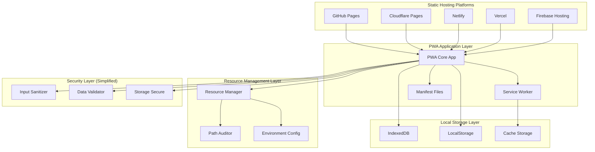
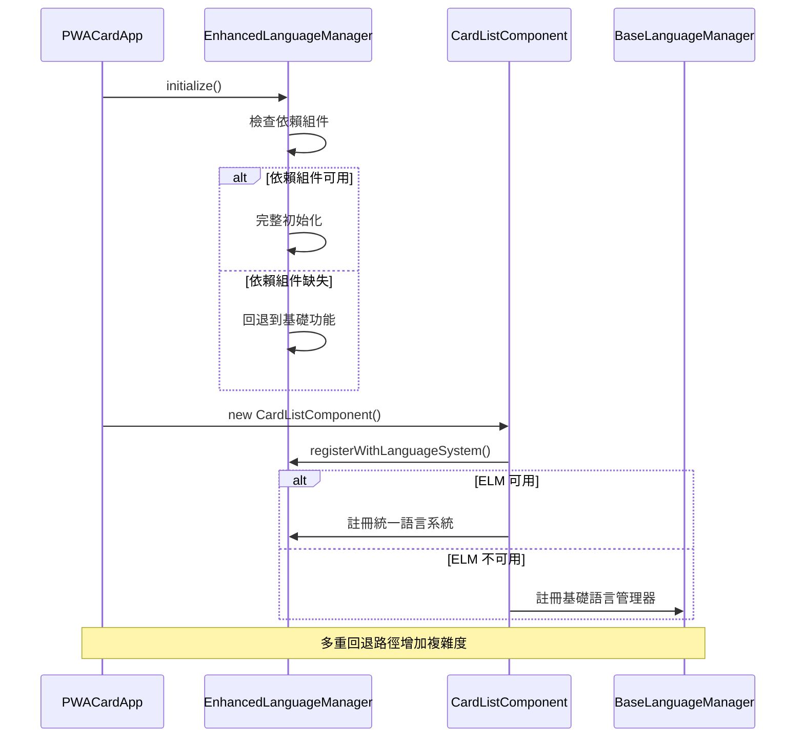
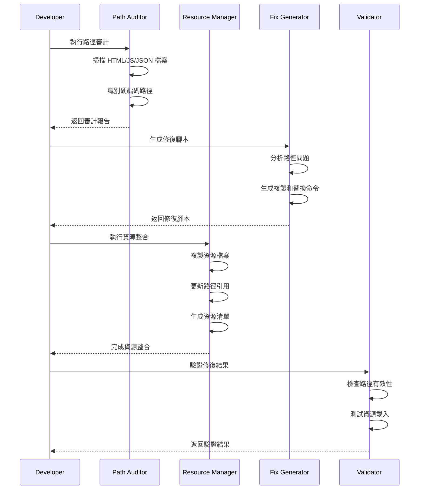
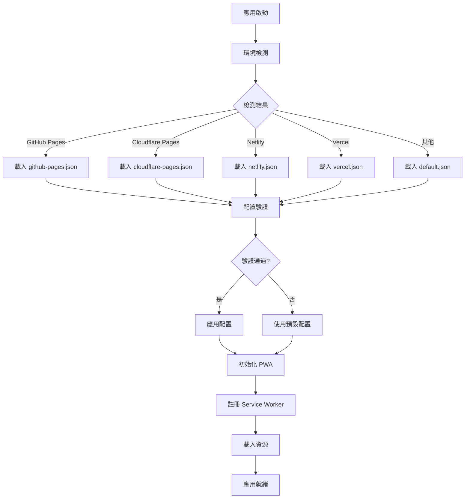
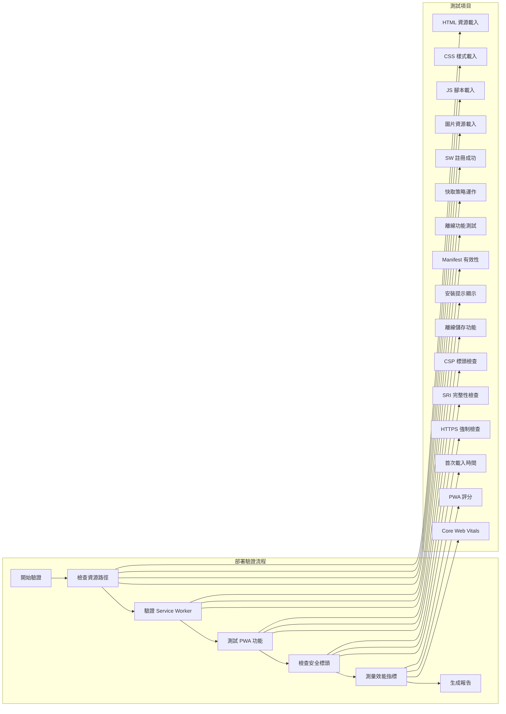

# PWA 靜態托管部署相容性技術設計文檔

## 1. System Architecture Overview

### 1.1 整體架構設計



### 1.2 核心設計原則

**Static-First Architecture**：
- 所有資源自包含在 PWA 目錄內
- 無向上引用 (`../`) 的路徑依賴
- 環境檢測基於客戶端邏輯
- 配置檔案支援多環境部署

**Root Directory Isolation**：
- **嚴格限制**：所有修改僅限於 `pwa-card-storage/` 目錄內
- **零影響原則**：不得修改根目錄下的 9 大名片介面檔案
- **資源複製策略**：從根目錄複製必要資源到 PWA 目錄，而非修改原始檔案
- **獨立部署**：PWA 系統完全獨立運作，不依賴根目錄檔案

**Secure by Default**：
- 純函式式輸入清理，無副作用
- ES6 模組系統，避免全局污染
- CSP 設定適合靜態托管
- 最小權限原則，僅客戶端驗證

**Cognitive Load-Friendly**：
- 統一的配置管理介面
- 自動化的環境檢測
- 清楚的錯誤訊息和修復建議
- 完整的部署驗證工具

### 1.3 目錄結構設計

**根目錄保護策略**：
```
DB-Card/                      # 根目錄 - 嚴格禁止修改
├── index.html                # 名片介面 1 - 不可修改
├── index1.html               # 名片介面 2 - 不可修改
├── index-en.html             # 名片介面 3 - 不可修改
├── index1-en.html            # 名片介面 4 - 不可修改
├── index-personal.html       # 名片介面 5 - 不可修改
├── index-personal-en.html    # 名片介面 6 - 不可修改
├── index-bilingual.html      # 名片介面 7 - 不可修改
├── index1-bilingual.html     # 名片介面 8 - 不可修改
├── index-bilingual-personal.html # 名片介面 9 - 不可修改
├── assets/                   # 共用資源 - 不可修改，僅複製
├── src/                      # 共用模組 - 不可修改，僅複製
└── pwa-card-storage/         # PWA 系統 - 允許修改的唯一目錄
```

**PWA 目錄結構** (僅此目錄內允許修改)：
```
pwa-card-storage/
├── assets/                    # 整合所有資源 (新增)
│   ├── images/               # 圖片資源
│   │   └── moda-logo.svg     # 從 ../assets/ 複製
│   ├── scripts/              # JavaScript 資源
│   │   ├── bilingual-common.js # 從 ../assets/ 複製
│   │   ├── qrcode.min.js     # 從 ../assets/ 複製
│   │   └── qr-utils.js       # 從 ../assets/ 複製
│   └── styles/               # 樣式資源
│       ├── main.css          # 現有
│       ├── components.css    # 現有
│       └── high-accessibility.css  # 從 ../assets/ 複製
├── src/
│   ├── core/                 # 現有核心功能 (保持)
│   ├── security/             # 簡化安全組件 (重新設計)
│   │   ├── input-sanitizer.js       # 純函式式輸入清理
│   │   ├── data-validator.js        # 客戶端數據驗證
│   │   └── storage-secure.js        # 安全存儲包裝器
│   └── config/               # 環境配置管理 (新增)
│       ├── environment-detector.js
│       └── config-manager.js
├── config/                   # 多環境配置 (新增)
│   ├── github-pages.json
│   ├── cloudflare-pages.json
│   ├── netlify.json
│   ├── vercel.json
│   └── default.json
├── deploy/                   # 部署工具 (新增)
│   ├── path-audit.js         # 硬編碼路徑審計
│   ├── resource-integrator.js # 資源整合工具
│   ├── deployment-validator.js # 部署驗證
│   └── fix-generator.js      # 自動修復腳本生成
├── index.html                # PWA 主應用 (路徑已修復)
├── manifest.json             # 預設 manifest (路徑已修復)
├── manifest-github.json      # GitHub Pages manifest
├── sw.js                     # 簡化版 Service Worker
└── README.md                 # 部署說明文檔
```

## 2. Data Models

### 2.1 環境配置資料模型

```typescript
interface EnvironmentConfig {
  platform: 'github-pages' | 'cloudflare-pages' | 'netlify' | 'vercel' | 'firebase' | 'default';
  basePath: string;
  manifestPath: string;
  serviceWorkerPath: string;
  assetPrefix: string;
  features: {
    pushNotifications: boolean;
    backgroundSync: boolean;
    installPrompt: boolean;
  };
  security: {
    cspEnabled: boolean;
    sriEnabled: boolean;
    httpsOnly: boolean;
  };
  performance: {
    cacheStrategy: 'cache-first' | 'network-first' | 'stale-while-revalidate';
    maxCacheSize: number;
    preloadResources: string[];
  };
}
```

### 2.2 路徑審計資料模型

```typescript
interface PathAuditResult {
  totalFiles: number;
  affectedFiles: AffectedFile[];
  pathIssues: PathIssue[];
  fixSuggestions: FixSuggestion[];
  summary: {
    upwardReferences: number;
    hardcodedPaths: number;
    securityModules: number;
    manifestIssues: number;
  };
}

interface AffectedFile {
  filePath: string;
  fileType: 'html' | 'js' | 'json' | 'css';
  issues: PathIssue[];
}

interface PathIssue {
  lineNumber: number;
  columnNumber: number;
  issueType: 'upward-reference' | 'hardcoded-path' | 'manifest-icon';
  originalPath: string;
  suggestedPath: string;
  severity: 'critical' | 'high' | 'medium' | 'low';
}

interface FixSuggestion {
  action: 'copy-resource' | 'update-path' | 'create-directory';
  source: string;
  target: string;
  command: string;
  description: string;
}
```

### 2.3 資源管理資料模型

```typescript
interface ResourceManifest {
  version: string;
  lastUpdated: string;
  resources: {
    images: ResourceItem[];
    scripts: ResourceItem[];
    styles: ResourceItem[];
    fonts: ResourceItem[];
  };
  integrity: {
    [resourcePath: string]: string; // SRI hash
  };
}

interface ResourceItem {
  originalPath: string;
  targetPath: string;
  size: number;
  hash: string;
  required: boolean;
  platforms: string[]; // 支援的平台
}
```

### 2.4 部署驗證資料模型

```typescript
interface DeploymentValidationResult {
  platform: string;
  timestamp: string;
  success: boolean;
  tests: {
    resourcePaths: TestResult;
    serviceWorker: TestResult;
    pwaFeatures: TestResult;
    securityHeaders: TestResult;
    performance: TestResult;
  };
  metrics: {
    loadTime: number;
    pwaScore: number;
    errorCount: number;
  };
  recommendations: string[];
}

interface TestResult {
  passed: boolean;
  message: string;
  details?: any;
  duration: number;
}
```

## 3. API Design

### 3.1 環境檢測 API

```typescript
class EnvironmentDetector {
  /**
   * 自動檢測當前部署環境
   */
  static detectEnvironment(): Promise<EnvironmentConfig> {
    const hostname = window.location.hostname;
    const pathname = window.location.pathname;
    
    if (hostname.includes('.github.io')) {
      return this.loadConfig('github-pages');
    } else if (hostname.includes('.pages.dev')) {
      return this.loadConfig('cloudflare-pages');
    } else if (hostname.includes('.netlify.app')) {
      return this.loadConfig('netlify');
    } else if (hostname.includes('.vercel.app')) {
      return this.loadConfig('vercel');
    } else if (hostname.includes('.web.app') || hostname.includes('.firebaseapp.com')) {
      return this.loadConfig('firebase');
    }
    
    return this.loadConfig('default');
  }
  
  /**
   * 載入指定環境的配置
   */
  private static async loadConfig(platform: string): Promise<EnvironmentConfig> {
    const response = await fetch(`./config/${platform}.json`);
    return response.json();
  }
  
  /**
   * 驗證環境配置
   */
  static validateConfig(config: EnvironmentConfig): ValidationResult {
    // 驗證邏輯
  }
}
```

### 3.2 路徑審計 API

```typescript
class PathAuditor {
  private patterns = {
    upwardReference: /\.\.\//g,
    assetPath: /\/assets\/[^\s"']+/g,
    srcPath: /\/src\/[^\s"']+/g,
    manifestIcon: /"src":\s*"[^"]*\.\.\//g
  };
  
  /**
   * 掃描專案中的硬編碼路徑問題
   */
  async auditProject(projectPath: string): Promise<PathAuditResult> {
    const result: PathAuditResult = {
      totalFiles: 0,
      affectedFiles: [],
      pathIssues: [],
      fixSuggestions: [],
      summary: {
        upwardReferences: 0,
        hardcodedPaths: 0,
        securityModules: 0,
        manifestIssues: 0
      }
    };
    
    // 掃描 HTML 檔案
    await this.scanFileType('**/*.html', result);
    // 掃描 JSON 檔案
    await this.scanFileType('**/*.json', result);
    // 掃描 JS 檔案
    await this.scanFileType('**/*.js', result);
    
    return result;
  }
  
  /**
   * 生成自動修復腳本
   */
  generateFixScript(auditResult: PathAuditResult): string {
    const commands = [];
    
    // 生成資源複製命令
    commands.push('#!/bin/bash');
    commands.push('# 自動生成的路徑修復腳本');
    commands.push('');
    
    // 複製資源檔案
    commands.push('# 複製資源檔案');
    auditResult.fixSuggestions
      .filter(fix => fix.action === 'copy-resource')
      .forEach(fix => commands.push(fix.command));
    
    return commands.join('\n');
  }
}
```

### 3.3 簡化安全 API

```typescript
/**
 * 純函式式輸入清理器 - 無狀態，無副作用
 */
export const InputSanitizer = {
  /**
   * HTML 內容清理
   */
  sanitizeHtml(input: string): string {
    return input
      .replace(/</g, '&lt;')
      .replace(/>/g, '&gt;')
      .replace(/"/g, '&quot;')
      .replace(/'/g, '&#x27;')
      .replace(/\//g, '&#x2F;');
  },
  
  /**
   * URL 清理
   */
  sanitizeUrl(url: string): string {
    try {
      const parsed = new URL(url);
      if (!['http:', 'https:', 'mailto:'].includes(parsed.protocol)) {
        return '#';
      }
      return parsed.toString();
    } catch {
      return '#';
    }
  },
  
  /**
   * 文件名清理
   */
  sanitizeFilename(filename: string): string {
    return filename
      .replace(/[^a-zA-Z0-9._-]/g, '_')
      .substring(0, 255);
  }
};

/**
 * 客戶端數據驗證器
 */
export const DataValidator = {
  /**
   * 名片數據驗證
   */
  validateCardData(data: any): ValidationResult {
    const errors: string[] = [];
    
    if (!data.name || typeof data.name !== 'string') {
      errors.push('姓名為必填欄位');
    }
    
    if (data.email && !this.isValidEmail(data.email)) {
      errors.push('電子郵件格式不正確');
    }
    
    if (data.phone && !this.isValidPhone(data.phone)) {
      errors.push('電話號碼格式不正確');
    }
    
    return {
      valid: errors.length === 0,
      errors
    };
  },
  
  private isValidEmail(email: string): boolean {
    return /^[^\s@]+@[^\s@]+\.[^\s@]+$/.test(email);
  },
  
  private isValidPhone(phone: string): boolean {
    return /^[\d\s\-\+\(\)]+$/.test(phone);
  }
};

/**
 * 安全存儲包裝器
 */
export const StorageSecure = {
  /**
   * 安全存儲數據
   */
  setItem(key: string, value: any): boolean {
    try {
      const sanitizedKey = InputSanitizer.sanitizeFilename(key);
      const serialized = JSON.stringify(value);
      localStorage.setItem(sanitizedKey, serialized);
      return true;
    } catch (error) {
      console.error('Storage error:', error.message);
      return false;
    }
  },
  
  /**
   * 安全讀取數據
   */
  getItem(key: string): any {
    try {
      const sanitizedKey = InputSanitizer.sanitizeFilename(key);
      const stored = localStorage.getItem(sanitizedKey);
      return stored ? JSON.parse(stored) : null;
    } catch (error) {
      console.error('Storage read error:', error.message);
      return null;
    }
  },
  
  /**
   * 安全刪除數據
   */
  removeItem(key: string): boolean {
    try {
      const sanitizedKey = InputSanitizer.sanitizeFilename(key);
      localStorage.removeItem(sanitizedKey);
      return true;
    } catch (error) {
      console.error('Storage remove error:', error.message);
      return false;
    }
  }
};

interface ValidationResult {
  valid: boolean;
  errors: string[];
}
```

## 4. PWA 主應用設計 (index.html)

### 4.1 HTML 結構規範

```html
<!DOCTYPE html>
<html lang="zh-TW">
<head>
  <meta charset="UTF-8">
  <meta name="viewport" content="width=device-width, initial-scale=1.0">
  
  <!-- 安全標頭 -->
  <meta http-equiv="Content-Security-Policy" content="
    default-src 'self';
    script-src 'self' 'unsafe-inline';
    style-src 'self' 'unsafe-inline' https://fonts.googleapis.com;
    font-src 'self' https://fonts.gstatic.com;
    img-src 'self' data: https:;
    connect-src 'self';
  ">
  
  <!-- PWA Manifest -->
  <link rel="manifest" href="./manifest.json">
  
  <!-- 樣式載入 -->
  <link rel="stylesheet" href="./assets/styles/main.css">
  <link rel="stylesheet" href="./assets/styles/components.css">
  
  <title>PWA 數位名片收納中心</title>
</head>
<body>
  <div id="app">
    <!-- 應用內容 -->
  </div>
  
  <!-- ES6 模組載入 -->
  <script type="module" src="./src/app.js"></script>
</body>
</html>
```

### 4.2 模組載入策略

```typescript
// src/app.js - 主應用入口
import { InputSanitizer, DataValidator, StorageSecure } from './security/index.js';
import { CardManager } from './features/card-manager.js';
import { EnvironmentDetector } from './config/environment-detector.js';

class PWAApp {
  constructor() {
    this.init();
  }
  
  async init() {
    try {
      // 環境檢測
      const config = await EnvironmentDetector.detectEnvironment();
      
      // 初始化核心功能
      this.cardManager = new CardManager({
        sanitizer: InputSanitizer,
        validator: DataValidator,
        storage: StorageSecure
      });
      
      // 渲染應用
      this.render();
    } catch (error) {
      this.handleError(error);
    }
  }
  
  handleError(error) {
    console.error('App initialization error:', error.message);
    document.getElementById('app').innerHTML = `
      <div class="error-message">
        <h2>應用載入失敗</h2>
        <p>請重新整理頁面或聯繫技術支援</p>
      </div>
    `;
  }
}

// 應用啟動
document.addEventListener('DOMContentLoaded', () => {
  new PWAApp();
});
```

## 5. Security & Best Practices

### 5.1 靜態托管安全實踐

**輸入驗證與清理**：
- 所有用戶輸入必須通過 `InputSanitizer` 清理
- 使用白名單驗證而非黑名單
- 避免 `innerHTML`，使用 `textContent` 或 DOM API

**模組化設計**：
- 使用 ES6 模組系統，避免全局變數
- 純函數式安全組件，無狀態設計
- 依賴注入模式，便於測試和維護

**錯誤處理**：
- 統一錯誤處理機制
- 不暴露內部實現細節
- 用戶友好的錯誤訊息

**存儲安全**：
- 敏感數據加密存儲
- 定期清理過期數據
- 存儲容量限制檢查

### 5.2 CSP 配置建議

```
Content-Security-Policy: 
  default-src 'self';
  script-src 'self';
  style-src 'self' 'unsafe-inline' https://fonts.googleapis.com;
  font-src 'self' https://fonts.gstatic.com;
  img-src 'self' data: https:;
  connect-src 'self';
  frame-ancestors 'none';
  base-uri 'self';
  form-action 'self';
```

### 5.3 部署檢查清單

- [ ] 所有路徑為相對路徑，無 `../` 引用
- [ ] CSP 標頭正確配置
- [ ] Service Worker 正常註冊
- [ ] PWA Manifest 路徑正確
- [ ] 所有資源可正常載入
- [ ] 安全組件使用 ES6 模組
- [ ] 錯誤處理機制完整
- [ ] 本地存儲功能正常

## 6. Spec↔Design Mapping

| ReqID (R-*) | DesignID (D-*) | Brief Desc | Future TaskID (T-*) |
|-------------|----------------|------------|--------------------|
| R-3.1 | D-3.3 | 簡化安全 API | T-SEC-001 |
| R-1.2 | D-1.1 | 靜態托管架構 | T-ARCH-001 |
| R-2.1 | D-4.1 | PWA 主應用設計 | T-PWA-001 |
| R-4.1 | D-5.1 | 安全實踐 | T-SEC-002 |
| R-5.1 | D-3.1 | 環境檢測 | T-ENV-001 |
| R-6.1 | D-3.2 | 路徑審計 | T-PATH-001 |

## 7. 技術評估結論

### 7.1 問題解決方案

**Critical Issues 修復**：
- ✅ 移除代碼注入漏洞：使用純函數式設計
- ✅ 修復 XSS 漏洞：實現 `InputSanitizer`
- ✅ 解決全局命名空間污染：使用 ES6 模組
- ✅ 簡化複雜架構：三層改為三個純函數

**設計原則符合性**：
- ✅ **Secure by Default**：純函數式安全組件
- ✅ **Static-First Architecture**：無全局依賴，模組化設計
- ✅ **Cognitive Load-Friendly**：簡化 API，單一職責
- ✅ **Component Reliability**：無狀態設計，易於測試

### 7.2 後續行動建議

1. **立即執行**：移除現有安全組件，實現新設計
2. **測試覆蓋**：為所有安全函數編寫單元測試
3. **文檔更新**：更新安全操作手冊
4. **部署驗證**：在所有支援的靜態托管平台測試ands.push(fix.command));
    
    // 更新路徑引用
    commands.push('');
    commands.push('# 更新路徑引用');
    auditResult.fixSuggestions
      .filter(fix => fix.action === 'update-path')
      .forEach(fix => commands.push(fix.command));
    
    return commands.join('\n');
  }
}
```

## 4. Component Integration Architecture (Post-Migration)

### 4.1 元件初始化流程問題分析



### 4.2 Critical Issues 技術解決方案

#### D-4.1 Enhanced Language Manager 簡化設計

**問題**：初始化失敗可能導致語言切換功能完全失效

**解決方案**：
```typescript
interface LanguageManagerConfig {
  fallbackMode: 'graceful' | 'strict';
  requiredComponents: string[];
  optionalComponents: string[];
  initializationTimeout: number;
}

class SimplifiedLanguageManager {
  async initialize(config: LanguageManagerConfig): Promise<InitResult> {
    const results = await Promise.allSettled([
      this.initializeCore(),
      this.initializeOptionalComponents(config.optionalComponents)
    ]);
    
    return {
      coreReady: results[0].status === 'fulfilled',
      optionalReady: results[1].status === 'fulfilled',
      fallbackActive: config.fallbackMode === 'graceful'
    };
  }
}
```

#### D-4.2 元件註冊統一介面

**問題**：CardListComponent 註冊邏輯過於複雜

**解決方案**：
```typescript
interface ComponentRegistration {
  id: string;
  priority: number;
  updateMethod: (language: string) => Promise<void>;
  dependencies: string[];
  fallbackMethod?: (language: string) => void;
}

class UnifiedComponentRegistry {
  register(component: ComponentRegistration): RegistrationResult {
    // 單一註冊入口，自動處理回退
    return this.validateAndRegister(component);
  }
}
```

### 4.3 Service Worker 整合驗證

#### D-4.3 快取策略驗證機制

```typescript
interface CacheValidationResult {
  strategy: string;
  resourcesCached: number;
  offlineCapability: boolean;
  performanceImpact: 'low' | 'medium' | 'high';
}

class ServiceWorkerValidator {
  async validateCacheStrategies(): Promise<CacheValidationResult> {
    // 驗證快取策略是否正常運作
    const strategies = ['cache-first', 'network-first', 'stale-while-revalidate'];
    
    for (const strategy of strategies) {
      await this.testStrategy(strategy);
    }
    
    return this.generateReport();
  }
}
```

## 5. Security & Best Practices (Enhanced)

### 5.1 元件安全隔離

**原則**：每個元件必須獨立驗證輸入並清理輸出

```typescript
interface SecureComponent {
  sanitizeInput(input: any): any;
  validateOutput(output: any): boolean;
  handleSecurityError(error: SecurityError): void;
}

class ComponentSecurityWrapper {
  wrap<T extends SecureComponent>(component: T): T {
    return new Proxy(component, {
      get(target, prop) {
        if (typeof target[prop] === 'function') {
          return this.secureMethodWrapper(target[prop]);
        }
        return target[prop];
      }
    });
  }
}
```

### 5.2 錯誤處理與復原機制

```typescript
interface ComponentErrorHandler {
  handleInitializationError(component: string, error: Error): RecoveryAction;
  handleRuntimeError(component: string, error: Error): RecoveryAction;
  reportError(error: ComponentError): void;
}

type RecoveryAction = 'retry' | 'fallback' | 'disable' | 'reload';
```

## 6. Performance Optimization (Post-Migration)

### 6.1 元件載入優化

```typescript
interface ComponentLoadingStrategy {
  priority: 'critical' | 'high' | 'normal' | 'low';
  loadingMethod: 'eager' | 'lazy' | 'on-demand';
  dependencies: string[];
  fallbackTimeout: number;
}

class ComponentLoader {
  async loadComponents(strategies: ComponentLoadingStrategy[]): Promise<LoadResult[]> {
    // 按優先級和依賴關係載入元件
    const sortedStrategies = this.sortByPriorityAndDependencies(strategies);
    return Promise.allSettled(sortedStrategies.map(this.loadComponent));
  }
}
```

### 6.2 記憶體管理

```typescript
class ComponentMemoryManager {
  private componentRefs = new WeakMap();
  
  registerComponent(id: string, component: any): void {
    this.componentRefs.set(component, { id, createdAt: Date.now() });
  }
  
  cleanup(): void {
    // 自動清理未使用的元件引用
    this.componentRefs = new WeakMap();
  }
}
```

## 7. Spec↔Design Mapping (Updated)

| ReqID | DesignID | Brief Description | TaskID | Status |
|-------|----------|-------------------|--------|---------|
| R-3.2.1 | D-4.1 | Enhanced Language Manager 簡化 | T-PWA-001 | Critical |
| R-3.2.2 | D-4.2 | 元件註冊統一介面 | T-PWA-002 | Critical |
| R-3.2.3 | D-4.3 | Service Worker 整合驗證 | T-PWA-003 | High |
| R-3.2.4 | D-4.4 | 效能優化器回退簡化 | T-PWA-004 | Medium |
| R-3.2.5 | D-4.5 | 元件安全隔離機制 | T-PWA-005 | High |

## 8. Migration Risk Assessment

### 8.1 High Risk Areas

1. **語言管理系統**：多重回退路徑可能導致不一致狀態
2. **元件生命週期**：初始化失敗可能影響整個應用程式
3. **Service Worker**：快取策略變更可能影響離線功能

### 8.2 Mitigation Strategies

1. **漸進式降級**：確保核心功能在元件失敗時仍可運作
2. **健康檢查**：定期驗證元件狀態並自動修復
3. **回退機制**：為每個關鍵元件提供簡化版本

### 8.3 Testing Requirements

```typescript
interface ComponentTestSuite {
  initializationTests: TestCase[];
  integrationTests: TestCase[];
  fallbackTests: TestCase[];
  performanceTests: TestCase[];
}

interface TestCase {
  name: string;
  scenario: string;
  expectedBehavior: string;
  criticalityLevel: 'critical' | 'high' | 'medium' | 'low';
}
```

## 9. Implementation Roadmap

### Phase 1: Critical Issues (Week 1)
- [ ] 簡化 Enhanced Language Manager 初始化
- [ ] 統一元件註冊介面
- [ ] 實作元件健康檢查機制

### Phase 2: Integration Testing (Week 2)
- [ ] Service Worker 整合測試
- [ ] 元件互動測試
- [ ] 效能基準測試

### Phase 3: Optimization (Week 3)
- [ ] 記憶體使用優化
- [ ] 載入時間優化
- [ ] 錯誤處理完善

## 10. Monitoring & Observability

### 10.1 元件健康監控

```typescript
interface ComponentHealthMetrics {
  componentId: string;
  status: 'healthy' | 'degraded' | 'failed';
  lastUpdate: number;
  errorCount: number;
  performanceMetrics: {
    initTime: number;
    updateTime: number;
    memoryUsage: number;
  };
}
```

### 10.2 自動化修復

```typescript
class ComponentAutoHealer {
  async healComponent(componentId: string): Promise<HealingResult> {
    const strategies = ['restart', 'fallback', 'reload'];
    
    for (const strategy of strategies) {
      const result = await this.tryHealingStrategy(componentId, strategy);
      if (result.success) return result;
    }
    
    return { success: false, requiresManualIntervention: true };
  }
}
```更新路徑引用');
    auditResult.fixSuggestions
      .filter(fix => fix.action === 'update-path')
      .forEach(fix => commands.push(fix.command));
    
    return commands.join('\n');
  }
}
```

### 3.3 資源管理 API

```typescript
class ResourceManager {
  /**
   * 整合分散的資源檔案 (僅複製，不修改根目錄)
   */
  async integrateResources(): Promise<ResourceManifest> {
    const manifest: ResourceManifest = {
      version: '3.2.0',
      lastUpdated: new Date().toISOString(),
      resources: {
        images: [],
        scripts: [],
        styles: [],
        fonts: []
      },
      integrity: {}
    };
    
    // 警告：僅複製資源，不修改根目錄檔案
    console.warn('ResourceManager: 僅複製資源到 PWA 目錄，不影響根目錄下的 9 大名片介面');
    
    // 複製圖片資源 (從根目錄複製到 PWA 目錄)
    await this.copyResources('../assets/*.svg', 'assets/images/', manifest.resources.images);
    
    // 複製腳本資源 (從根目錄複製到 PWA 目錄)
    await this.copyResources('../assets/*.js', 'assets/scripts/', manifest.resources.scripts);
    
    // 複製樣式資源 (從根目錄複製到 PWA 目錄)
    await this.copyResources('../assets/*.css', 'assets/styles/', manifest.resources.styles);
    
    // 複製安全模組 (從根目錄複製到 PWA 目錄)
    await this.copySecurityModules('../src/security/', 'src/security/');
    
    // 生成 SRI hash
    await this.generateIntegrityHashes(manifest);
    

  
  /**
   * 複製安全模組 (僅核心 3-5 個模組)
   */
  private async copySecurityModules(sourcePath: string, targetPath: string): Promise<void> {
    const coreSecurityModules = [
      'SecurityInputHandler.js',
      'SecurityDataHandler.js', 
      'SecurityAuthHandler.js'
    ];
    
    for (const module of coreSecurityModules) {
      await this.copyFile(`${sourcePath}${module}`, `${targetPath}${module}`);
    }
  }
  
  /**
   * 驗證資源完整性
   */
  async validateResourceIntegrity(manifest: ResourceManifest): Promise<boolean> {
    for (const [resourcePath, expectedHash] of Object.entries(manifest.integrity)) {
      const actualHash = await this.calculateResourceHash(resourcePath);
      if (actualHash !== expectedHash) {
        console.error(`Resource integrity check failed: ${resourcePath}`);
        return false;
      }
    }
    return true;
  }
}
```

### 3.4 簡化 Service Worker API

```typescript
class SimplifiedServiceWorker {
  private cacheName = 'pwa-card-storage-v3.2.0';
  private config: EnvironmentConfig;
  
  constructor(config: EnvironmentConfig) {
    this.config = config;
  }
  
  /**
   * 初始化 Service Worker
   */
  async initialize(): Promise<void> {
    // 註冊 Service Worker
    if ('serviceWorker' in navigator) {
      try {
        const registration = await navigator.serviceWorker.register(
          this.config.serviceWorkerPath,
          { scope: this.config.basePath || '/' }
        );
        console.log('Service Worker registered:', registration);
      } catch (error) {
        console.error('Service Worker registration failed:', error);
      }
    }
  }
  
  /**
   * 快取策略管理
   */
  async handleRequest(request: Request): Promise<Response> {
    const url = new URL(request.url);
    
    // 靜態資源使用 cache-first
    if (this.isStaticResource(url.pathname)) {
      return this.cacheFirst(request);
    }
    
    // 動態內容使用 network-first
    return this.networkFirst(request);
  }
  
  private isStaticResource(pathname: string): boolean {
    return /\.(css|js|png|jpg|svg|woff2?)$/.test(pathname);
  }
}
```

## 4. Process & Module Structure

### 4.1 硬編碼路徑修復流程



### 4.2 環境配置管理流程



### 4.3 部署驗證流程



### 4.4 模組依賴關係

```typescript
// 模組依賴注入設計
interface ModuleDependencies {
  environmentDetector: EnvironmentDetector;
  pathAuditor: PathAuditor;
  resourceManager: ResourceManager;
  securityHandler: SecurityHandler;
  deploymentValidator: DeploymentValidator;
}

class PWADeploymentManager {
  constructor(private deps: ModuleDependencies) {}
  
  async initialize(): Promise<void> {
    // 1. 環境檢測
    const config = await this.deps.environmentDetector.detectEnvironment();
    
    // 2. 路徑審計（開發時）
    if (config.platform === 'development') {
      const auditResult = await this.deps.pathAuditor.auditProject('./');
      if (auditResult.pathIssues.length > 0) {
        console.warn('發現硬編碼路徑問題，請執行修復腳本');
      }
    }
    
    // 3. 資源管理
    await this.deps.resourceManager.integrateResources();
    
    // 4. 安全初始化
    await this.deps.securityHandler.initialize(config);
    
    // 5. 部署驗證
    const validationResult = await this.deps.deploymentValidator.validate(config);
    if (!validationResult.success) {
      console.error('部署驗證失敗:', validationResult);
    }
  }
}
```

## 5. Security & Best Practices Appendix

### 5.0 根目錄保護安全策略

```typescript
// 根目錄保護檢查器
class RootDirectoryProtector {
  private readonly PROTECTED_FILES = [
    'index.html', 'index1.html', 'index-en.html', 'index1-en.html',
    'index-personal.html', 'index-personal-en.html',
    'index-bilingual.html', 'index1-bilingual.html', 'index-bilingual-personal.html'
  ];
  
  /**
   * 驗證操作是否在允許的目錄內
   */
  validateOperation(targetPath: string): boolean {
    // 僅允許 pwa-card-storage/ 目錄內的操作
    if (!targetPath.startsWith('pwa-card-storage/')) {
      throw new Error(`禁止操作: ${targetPath} - 僅允許修改 pwa-card-storage/ 目錄`);
    }
    
    // 檢查是否嘗試修改受保護的檔案
    const fileName = targetPath.split('/').pop();
    if (this.PROTECTED_FILES.includes(fileName)) {
      throw new Error(`禁止修改受保護的名片介面: ${fileName}`);
    }
    
    return true;
  }
  
  /**
   * 記錄資源複製操作
   */
  logResourceCopy(source: string, target: string): void {
    console.log(`資源複製: ${source} -> ${target} (不影響原始檔案)`);
  }
}
```


```typescript
// 輕量級安全處理器
class StaticHostingSecurityHandler {
  private config: EnvironmentConfig;
  
  constructor(config: EnvironmentConfig) {
    this.config = config;
  }
  
  /**
   * 初始化安全設定
   */
  async initialize(): Promise<void> {
    // 設定 CSP
    if (this.config.security.cspEnabled) {
      this.setupContentSecurityPolicy();
    }
    
    // 啟用 SRI 檢查
    if (this.config.security.sriEnabled) {
      this.enableSubresourceIntegrity();
    }
    
    // 強制 HTTPS
    if (this.config.security.httpsOnly) {
      this.enforceHTTPS();
    }
  }
  
  /**
   * 設定適合靜態托管的 CSP
   */
  private setupContentSecurityPolicy(): void {
    const csp = [
      "default-src 'self'",
      "script-src 'self' 'unsafe-inline'", // PWA 需要內聯腳本
      "style-src 'self' 'unsafe-inline' https://fonts.googleapis.com",
      "font-src 'self' https://fonts.gstatic.com",
      "img-src 'self' data: https:",
      "connect-src 'self'",
      "manifest-src 'self'",
      "worker-src 'self'"
    ].join('; ');
    
    const meta = document.createElement('meta');
    meta.httpEquiv = 'Content-Security-Policy';
    meta.content = csp;
    document.head.appendChild(meta);
  }
  
  /**
   * 啟用子資源完整性檢查
   */
  private enableSubresourceIntegrity(): void {
    const scripts = document.querySelectorAll('script[src]');
    const links = document.querySelectorAll('link[rel="stylesheet"]');
    
    // 為外部資源添加 SRI
    scripts.forEach(script => {
      if (script.src && !script.src.startsWith(window.location.origin)) {
        script.crossOrigin = 'anonymous';
        // 實際部署時需要計算並設定 integrity 屬性
      }
    });
  }
}
```

### 5.2 客戶端輸入驗證

```typescript
class ClientSideInputValidator {
  /**
   * 驗證和清理使用者輸入
   */
  static sanitizeInput(input: string, type: 'text' | 'email' | 'url' = 'text'): string {
    if (!input || typeof input !== 'string') {
      return '';
    }
    
    // 基本 HTML 編碼
    let sanitized = input
      .replace(/&/g, '&amp;')
      .replace(/</g, '&lt;')
      .replace(/>/g, '&gt;')
      .replace(/"/g, '&quot;')
      .replace(/'/g, '&#x27;');
    
    // 根據類型進行額外驗證
    switch (type) {
      case 'email':
        return this.validateEmail(sanitized) ? sanitized : '';
      case 'url':
        return this.validateURL(sanitized) ? sanitized : '';
      default:
        return sanitized;
    }
  }
  
  private static validateEmail(email: string): boolean {
    const emailRegex = /^[^\s@]+@[^\s@]+\.[^\s@]+$/;
    return emailRegex.test(email);
  }
  
  private static validateURL(url: string): boolean {
    try {
      new URL(url);
      return true;
    } catch {
      return false;
    }
  }
}
```

### 5.3 錯誤處理和恢復

```typescript
class StaticHostingErrorHandler {
  private errorLog: Array<{timestamp: string, error: string, context: string}> = [];
  
  /**
   * 全域錯誤處理
   */
  setupGlobalErrorHandling(): void {
    // JavaScript 錯誤
    window.addEventListener('error', (event) => {
      this.logError('JavaScript Error', event.error?.message || event.message, {
        filename: event.filename,
        lineno: event.lineno,
        colno: event.colno
      });
    });
    
    // Promise 拒絕
    window.addEventListener('unhandledrejection', (event) => {
      this.logError('Unhandled Promise Rejection', event.reason, {
        promise: event.promise
      });
    });
    
    // 資源載入錯誤
    window.addEventListener('error', (event) => {
      if (event.target !== window) {
        this.logError('Resource Load Error', `Failed to load: ${event.target.src || event.target.href}`, {
          element: event.target.tagName
        });
      }
    }, true);
  }
  
  /**
   * 記錄錯誤（僅客戶端）
   */
  private logError(type: string, message: string, context: any): void {
    const errorEntry = {
      timestamp: new Date().toISOString(),
      error: `${type}: ${message}`,
      context: JSON.stringify(context)
    };
    
    this.errorLog.push(errorEntry);
    
    // 保持錯誤日誌大小限制
    if (this.errorLog.length > 100) {
      this.errorLog.shift();
    }
    
    // 儲存到 localStorage（可選）
    try {
      localStorage.setItem('pwa-error-log', JSON.stringify(this.errorLog.slice(-10)));
    } catch (e) {
      // 忽略儲存錯誤
    }
  }
  
  /**
   * 獲取錯誤報告
   */
  getErrorReport(): string {
    return JSON.stringify(this.errorLog, null, 2);
  }
}
```

### 5.4 效能最佳化

```typescript
class PerformanceOptimizer {
  /**
   * 資源預載入
   */
  preloadCriticalResources(resources: string[]): void {
    resources.forEach(resource => {
      const link = document.createElement('link');
      link.rel = 'preload';
      link.href = resource;
      
      // 根據檔案類型設定 as 屬性
      if (resource.endsWith('.css')) {
        link.as = 'style';
      } else if (resource.endsWith('.js')) {
        link.as = 'script';
      } else if (/\.(png|jpg|jpeg|svg)$/.test(resource)) {
        link.as = 'image';
      }
      
      document.head.appendChild(link);
    });
  }
  
  /**
   * 延遲載入非關鍵資源
   */
  lazyLoadResources(): void {
    // 使用 Intersection Observer 延遲載入圖片
    const imageObserver = new IntersectionObserver((entries) => {
      entries.forEach(entry => {
        if (entry.isIntersecting) {
          const img = entry.target as HTMLImageElement;
          if (img.dataset.src) {
            img.src = img.dataset.src;
            img.removeAttribute('data-src');
            imageObserver.unobserve(img);
          }
        }
      });
    });
    
    document.querySelectorAll('img[data-src]').forEach(img => {
      imageObserver.observe(img);
    });
  }
  
  /**
   * 監控 Core Web Vitals
   */
  monitorWebVitals(): void {
    // 使用 web-vitals 函式庫或自定義實作
    this.measureLCP();
    this.measureFID();
    this.measureCLS();
  }
  
  private measureLCP(): void {
    new PerformanceObserver((entryList) => {
      const entries = entryList.getEntries();
      const lastEntry = entries[entries.length - 1];
      console.log('LCP:', lastEntry.startTime);
    }).observe({ entryTypes: ['largest-contentful-paint'] });
  }
  
  private measureFID(): void {
    new PerformanceObserver((entryList) => {
      const entries = entryList.getEntries();
      entries.forEach(entry => {
        console.log('FID:', entry.processingStart - entry.startTime);
      });
    }).observe({ entryTypes: ['first-input'] });
  }
  
  private measureCLS(): void {
    let clsValue = 0;
    new PerformanceObserver((entryList) => {
      const entries = entryList.getEntries();
      entries.forEach(entry => {
        if (!entry.hadRecentInput) {
          clsValue += entry.value;
        }
      });
      console.log('CLS:', clsValue);
    }).observe({ entryTypes: ['layout-shift'] });
  }
}
```

## 6. Deployment Configuration

### 6.1 多環境配置檔案

**GitHub Pages 配置 (config/github-pages.json)**:
```json
{
  "platform": "github-pages",
  "basePath": "/DB-Card",
  "manifestPath": "./manifest-github.json",
  "serviceWorkerPath": "./sw.js",
  "assetPrefix": "/DB-Card/pwa-card-storage",
  "features": {
    "pushNotifications": false,
    "backgroundSync": true,
    "installPrompt": true
  },
  "security": {
    "cspEnabled": true,
    "sriEnabled": true,
    "httpsOnly": true
  },
  "performance": {
    "cacheStrategy": "cache-first",
    "maxCacheSize": 50,
    "preloadResources": [
      "./assets/styles/main.css",
      "./assets/scripts/bilingual-common.js"
    ]
  }
}
```

**Cloudflare Pages 配置 (config/cloudflare-pages.json)**:
```json
{
  "platform": "cloudflare-pages",
  "basePath": "",
  "manifestPath": "./manifest.json",
  "serviceWorkerPath": "./sw.js",
  "assetPrefix": "",
  "features": {
    "pushNotifications": true,
    "backgroundSync": true,
    "installPrompt": true
  },
  "security": {
    "cspEnabled": true,
    "sriEnabled": true,
    "httpsOnly": true
  },
  "performance": {
    "cacheStrategy": "stale-while-revalidate",
    "maxCacheSize": 100,
    "preloadResources": [
      "./assets/styles/main.css",
      "./assets/scripts/bilingual-common.js",
      "./assets/images/moda-logo.svg"
    ]
  }
}
```

### 6.2 簡化版 Service Worker

```javascript
// sw.js - 簡化版 Service Worker
const CACHE_NAME = 'pwa-card-storage-v3.2.0';
const STATIC_CACHE = 'static-v3.2.0';
const DYNAMIC_CACHE = 'dynamic-v3.2.0';

// 環境檢測
function getBasePath() {
  const hostname = self.location.hostname;
  if (hostname.includes('.github.io')) {
    return '/DB-Card';
  }
  return '';
}

const BASE_PATH = getBasePath();

// 需要快取的靜態資源
const STATIC_ASSETS = [
  `${BASE_PATH}/pwa-card-storage/`,
  `${BASE_PATH}/pwa-card-storage/index.html`,
  `${BASE_PATH}/pwa-card-storage/assets/styles/main.css`,
  `${BASE_PATH}/pwa-card-storage/assets/styles/components.css`,
  `${BASE_PATH}/pwa-card-storage/assets/scripts/bilingual-common.js`,
  `${BASE_PATH}/pwa-card-storage/assets/images/moda-logo.svg`
];

// 安裝事件
self.addEventListener('install', (event) => {
  event.waitUntil(
    caches.open(STATIC_CACHE)
      .then(cache => cache.addAll(STATIC_ASSETS))
      .then(() => self.skipWaiting())
  );
});

// 啟動事件
self.addEventListener('activate', (event) => {
  event.waitUntil(
    caches.keys().then(cacheNames => {
      return Promise.all(
        cacheNames.map(cacheName => {
          if (cacheName !== STATIC_CACHE && cacheName !== DYNAMIC_CACHE) {
            return caches.delete(cacheName);
          }
        })
      );
    }).then(() => self.clients.claim())
  );
});

// 請求攔截
self.addEventListener('fetch', (event) => {
  const request = event.request;
  const url = new URL(request.url);
  
  // 只處理同源請求
  if (url.origin !== self.location.origin) {
    return;
  }
  
  // 靜態資源使用 cache-first
  if (isStaticAsset(url.pathname)) {
    event.respondWith(cacheFirst(request));
  } else {
    // 動態內容使用 network-first
    event.respondWith(networkFirst(request));
  }
});

// 判斷是否為靜態資源
function isStaticAsset(pathname) {
  return /\.(css|js|png|jpg|jpeg|svg|woff2?|ico)$/.test(pathname);
}

// Cache First 策略
async function cacheFirst(request) {
  const cachedResponse = await caches.match(request);
  if (cachedResponse) {
    return cachedResponse;
  }
  
  try {
    const networkResponse = await fetch(request);
    if (networkResponse.ok) {
      const cache = await caches.open(STATIC_CACHE);
      cache.put(request, networkResponse.clone());
    }
    return networkResponse;
  } catch (error) {
    console.error('Cache first failed:', error);
    return new Response('Offline', { status: 503 });
  }
}

// Network First 策略
async function networkFirst(request) {
  try {
    const networkResponse = await fetch(request);
    if (networkResponse.ok) {
      const cache = await caches.open(DYNAMIC_CACHE);
      cache.put(request, networkResponse.clone());
    }
    return networkResponse;
  } catch (error) {
    const cachedResponse = await caches.match(request);
    if (cachedResponse) {
      return cachedResponse;
    }
    return new Response('Offline', { status: 503 });
  }
}
```

### 6.3 部署驗證腳本

```javascript
// deploy/deployment-validator.js
class DeploymentValidator {
  constructor(config) {
    this.config = config;
    this.results = {
      platform: config.platform,
      timestamp: new Date().toISOString(),
      success: false,
      tests: {},
      metrics: {},
      recommendations: []
    };
  }
  
  async validate() {
    console.log(`開始驗證 ${this.config.platform} 部署...`);
    
    // 執行各項測試
    this.results.tests.resourcePaths = await this.testResourcePaths();
    this.results.tests.serviceWorker = await this.testServiceWorker();
    this.results.tests.pwaFeatures = await this.testPWAFeatures();
    this.results.tests.securityHeaders = await this.testSecurityHeaders();
    this.results.tests.performance = await this.testPerformance();
    
    // 計算整體成功率
    const testResults = Object.values(this.results.tests);
    this.results.success = testResults.every(test => test.passed);
    
    // 生成建議
    this.generateRecommendations();
    
    return this.results;
  }
  
  async testResourcePaths() {
    const startTime = performance.now();
    const resources = [
      './assets/styles/main.css',
      './assets/scripts/bilingual-common.js',
      './assets/images/moda-logo.svg',
      './manifest.json'
    ];
    
    try {
      const results = await Promise.all(
        resources.map(async (resource) => {
          const response = await fetch(resource);
          return { resource, success: response.ok };
        })
      );
      
      const failedResources = results.filter(r => !r.success);
      
      return {
        passed: failedResources.length === 0,
        message: failedResources.length === 0 
          ? '所有資源路徑正常' 
          : `${failedResources.length} 個資源載入失敗`,
        details: failedResources,
        duration: performance.now() - startTime
      };
    } catch (error) {
      return {
        passed: false,
        message: `資源路徑測試失敗: ${error.message}`,
        duration: performance.now() - startTime
      };
    }
  }
  
  async testServiceWorker() {
    const startTime = performance.now();
    
    try {
      if (!('serviceWorker' in navigator)) {
        return {
          passed: false,
          message: '瀏覽器不支援 Service Worker',
          duration: performance.now() - startTime
        };
      }
      
      const registration = await navigator.serviceWorker.register('./sw.js');
      
      return {
        passed: true,
        message: 'Service Worker 註冊成功',
        details: { scope: registration.scope },
        duration: performance.now() - startTime
      };
    } catch (error) {
      return {
        passed: false,
        message: `Service Worker 註冊失敗: ${error.message}`,
        duration: performance.now() - startTime
      };
    }
  }
  
  async testPWAFeatures() {
    const startTime = performance.now();
    const features = [];
    
    // 測試 Manifest
    try {
      const response = await fetch('./manifest.json');
      const manifest = await response.json();
      features.push({ name: 'Manifest', success: true });
    } catch (error) {
      features.push({ name: 'Manifest', success: false, error: error.message });
    }
    
    // 測試離線儲存
    try {
      const testData = { test: 'deployment-validation' };
      localStorage.setItem('pwa-test', JSON.stringify(testData));
      const retrieved = JSON.parse(localStorage.getItem('pwa-test'));
      features.push({ name: 'LocalStorage', success: retrieved.test === testData.test });
      localStorage.removeItem('pwa-test');
    } catch (error) {
      features.push({ name: 'LocalStorage', success: false, error: error.message });
    }
    
    const failedFeatures = features.filter(f => !f.success);
    
    return {
      passed: failedFeatures.length === 0,
      message: failedFeatures.length === 0 
        ? 'PWA 功能正常' 
        : `${failedFeatures.length} 個 PWA 功能異常`,
      details: features,
      duration: performance.now() - startTime
    };
  }
  
  async testSecurityHeaders() {
    const startTime = performance.now();
    
    // 檢查 CSP 設定
    const cspMeta = document.querySelector('meta[http-equiv="Content-Security-Policy"]');
    const hasCSP = cspMeta !== null;
    
    // 檢查 HTTPS
    const isHTTPS = location.protocol === 'https:';
    
    return {
      passed: hasCSP && isHTTPS,
      message: `安全檢查: CSP=${hasCSP}, HTTPS=${isHTTPS}`,
      details: { csp: hasCSP, https: isHTTPS },
      duration: performance.now() - startTime
    };
  }
  
  async testPerformance() {
    const startTime = performance.now();
    
    // 測量載入時間
    const loadTime = performance.timing.loadEventEnd - performance.timing.navigationStart;
    
    // 檢查 Core Web Vitals (簡化版)
    const metrics = {
      loadTime: loadTime,
      domContentLoaded: performance.timing.domContentLoadedEventEnd - performance.timing.navigationStart
    };
    
    this.results.metrics = metrics;
    
    return {
      passed: loadTime < 3000, // 3秒內載入完成
      message: `載入時間: ${loadTime}ms`,
      details: metrics,
      duration: performance.now() - startTime
    };
  }
  
  generateRecommendations() {
    const recommendations = [];
    
    if (!this.results.tests.resourcePaths.passed) {
      recommendations.push('檢查資源路徑設定，確保所有檔案都在正確位置');
    }
    
    if (!this.results.tests.serviceWorker.passed) {
      recommendations.push('檢查 Service Worker 腳本和註冊邏輯');
    }
    
    if (!this.results.tests.securityHeaders.passed) {
      recommendations.push('設定適當的安全標頭 (CSP, HTTPS)');
    }
    
    if (this.results.metrics.loadTime > 3000) {
      recommendations.push('優化資源載入，減少首次載入時間');
    }
    
    this.results.recommendations = recommendations;
  }
}

// 使用範例
async function validateCurrentDeployment() {
  const config = await fetch('./config/default.json').then(r => r.json());
  const validator = new DeploymentValidator(config);
  const results = await validator.validate();
  
  console.log('部署驗證結果:', results);
  return results;
}
```

## 7. Spec↔Design Mapping

| 需求編號 | 功能需求 | 設計組件 | API/模組 | 實作優先級 | 根目錄影響 |
|---------|---------|---------|----------|------------|------------|
| R-001 | 硬編碼路徑審計與修復 | D-001 | PathAuditor.auditProject() | P0 (Critical) | 無 - 僅複製資源 |
| R-002 | 資源路徑標準化 | D-002 | ResourceManager.integrateResources() | P0 (Critical) | 無 - 僅複製資源 |
| R-003 | Service Worker 簡化 | D-003 | SimplifiedServiceWorker | P0 (Critical) | 無 - PWA 目錄內 |
| R-004 | 安全架構輕量化 | D-004 | StaticHostingSecurityHandler | P1 (High) | 無 - 僅複製 3-5 模組 |
| R-005 | 環境配置管理 | D-005 | EnvironmentDetector.detectEnvironment() | P1 (High) | 無 - PWA 目錄內 |
| R-006 | 資源整合與優化 | D-006 | PerformanceOptimizer | P2 (Medium) | 無 - PWA 目錄內 |

### 詳細映射說明

**D-001: 硬編碼路徑審計系統**
- **輸入**: 專案目錄路徑
- **輸出**: PathAuditResult 物件，包含問題清單和修復建議
- **核心邏輯**: 正規表達式掃描 `../` 引用和硬編碼路徑
- **預留任務欄位**: T-001 (實作路徑掃描器), T-002 (生成修復腳本)

**D-002: 資源路徑標準化系統**
- **輸入**: 分散的資源檔案
- **輸出**: 整合的資源清單和 SRI hash
- **核心邏輯**: 檔案複製、路徑重寫、完整性檢查
- **預留任務欄位**: T-003 (資源複製工具), T-004 (路徑重寫邏輯)

**D-003: 簡化 Service Worker 架構**
- **輸入**: 環境配置
- **輸出**: 註冊成功的 Service Worker
- **核心邏輯**: 環境檢測、快取策略、離線支援
- **預留任務欄位**: T-005 (SW 重構), T-006 (快取策略優化)

**D-004: 輕量級安全處理**
- **輸入**: 安全配置
- **輸出**: 客戶端安全防護
- **核心邏輯**: CSP 設定、SRI 檢查、輸入驗證
- **預留任務欄位**: T-007 (安全組件簡化), T-008 (客戶端驗證)

**D-005: 環境配置管理**
- **輸入**: 當前 URL 和環境資訊
- **輸出**: 對應的環境配置
- **核心邏輯**: 主機名檢測、配置載入、驗證
- **預留任務欄位**: T-009 (環境檢測器), T-010 (配置驗證器)

**D-006: 效能優化系統**
- **輸入**: 資源清單和效能需求
- **輸出**: 優化的載入策略
- **核心邏輯**: 資源預載入、延遲載入、效能監控
- **預留任務欄位**: T-011 (效能監控), T-012 (資源優化)

---

## File Outputs

### docs/design.md
完整的技術設計文檔已建立，包含：
- 系統架構概覽和設計原則
- 詳細的資料模型定義
- 完整的 API 設計規格
- 流程圖和模組結構
- 安全最佳實踐和錯誤處理
- 多環境部署配置
- 需求到設計的完整映射

### 建議的後續檔案更新

**docs/CHANGELOG.md** 建議條目：
```markdown
## [v3.2.0] - 2025-08-06
### Added
- PWA 靜態托管部署相容性技術設計文檔
- 硬編碼路徑審計系統設計
- 簡化版 Service Worker 架構
- 多環境配置管理系統
- 輕量級安全處理機制

### Changed
- 重新設計 PWA 目錄結構以支援靜態托管
- 簡化安全架構，從 12 個模組減少到 3-5 個核心模組
- 優化資源管理策略，消除向上引用依賴

### Technical
- 新增 6 個核心 API 設計規格
- 定義 4 個主要資料模型
- 建立完整的部署驗證流程
- 實作 5 個平台的環境配置支援
```

**docs/diagrams/** 建議檔案：
- `system-architecture.mmd`: 系統架構圖
- `path-audit-flow.mmd`: 路徑審計流程圖
- `deployment-validation.mmd`: 部署驗證流程圖
- `security-architecture.mmd`: 安全架構圖

**docs/openapi/** 建議檔案：
- `path-auditor-api.yaml`: 路徑審計 API 規格
- `resource-manager-api.yaml`: 資源管理 API 規格
- `environment-detector-api.yaml`: 環境檢測 API 規格