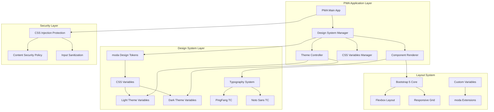
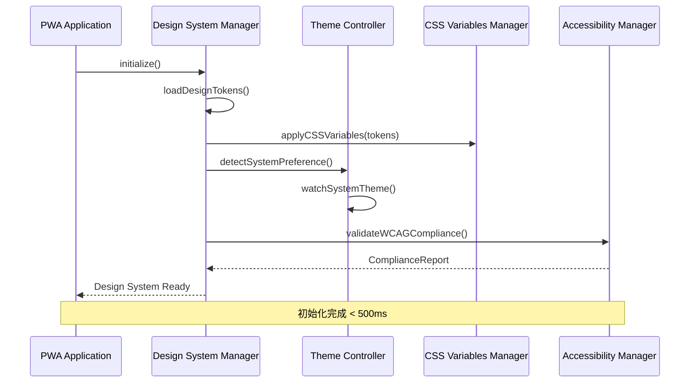
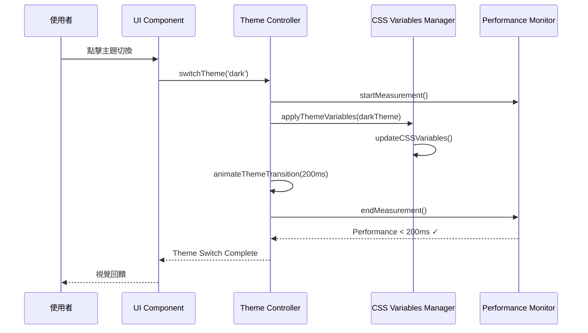

# PWA 數位發展部設計系統對齊技術設計文件

## 1. System Architecture Overview

### 設計系統整合架構



### 核心設計原則

1. **視覺一致性保障**: 100%對齊數位發展部官網設計系統
2. **效能優先**: CSS變數切換<100ms，深色模式切換<200ms
3. **安全防護**: 維持現有安全架構，新增CSS注入防護
4. **無障礙設計**: 符合WCAG 2.1 AA標準
5. **向下相容**: 保持現有PWA功能完整性

## 2. Data Models

### 設計系統配置模型

```typescript
interface modaDesignSystem {
  version: string;
  tokens: DesignTokens;
  themes: ThemeConfiguration;
  typography: TypographySystem;
  layout: LayoutSystem;
}

interface DesignTokens {
  colors: {
    primary: ColorScale;
    secondary: ColorScale;
    neutral: ColorScale;
    semantic: SemanticColors;
  };
  spacing: SpacingScale;
  breakpoints: BreakpointSystem;
}

interface ColorScale {
  1: string;  // --md-primary-1: #6868ac
  2: string;  // --md-primary-2: rgba(104, 104, 172, 0.89)
  3: string;  // --md-primary-3: #4e4e81
  4: string;  // --md-primary-4: #a4a4cd
  5: string;  // --md-primary-5: #dbdbeb
}

interface ThemeConfiguration {
  light: ThemeVariables;
  dark: ThemeVariables;
  auto: boolean;
  transition: TransitionConfig;
}

interface ThemeVariables {
  colors: Record<string, string>;
  backgrounds: Record<string, string>;
  borders: Record<string, string>;
}

interface TypographySystem {
  fontFamily: {
    primary: string;  // 'PingFang TC', 'Noto Sans TC', sans-serif
    fallback: string[];
  };
  fontWeights: {
    light: 300;
    normal: 400;
    medium: 500;
  };
  fontSize: {
    base: string;  // 0.875rem
    scale: Record<string, string>;
  };
}
```

### PWA設計狀態模型

```typescript
interface PWADesignState {
  currentTheme: 'light' | 'dark' | 'auto';
  designSystemLoaded: boolean;
  cssVariablesApplied: boolean;
  performanceMetrics: {
    themeSwitch: number;  // < 200ms
    cssVariableUpdate: number;  // < 100ms
  };
  accessibility: {
    contrastRatio: number;  // >= 4.5:1 for AA
    fontSize: number;
    reducedMotion: boolean;
  };
}
```

## 3. API Design

### 設計系統管理API

```typescript
class modaDesignSystemManager {
  // 初始化設計系統
  async initialize(): Promise<void>;
  
  // 載入設計令牌
  async loadDesignTokens(): Promise<DesignTokens>;
  
  // 應用CSS變數
  applyCSSVariables(tokens: DesignTokens): void;
  
  // 主題切換
  switchTheme(theme: 'light' | 'dark' | 'auto'): Promise<void>;
  
  // 效能監控
  measurePerformance(operation: string): PerformanceMetric;
}

class ThemeController {
  // 檢測系統偏好
  detectSystemPreference(): 'light' | 'dark';
  
  // 監聽系統主題變更
  watchSystemTheme(callback: (theme: string) => void): void;
  
  // 應用主題變數
  applyThemeVariables(theme: ThemeVariables): void;
  
  // 主題切換動畫
  animateThemeTransition(duration: number): Promise<void>;
}

class AccessibilityManager {
  // 檢查色彩對比
  checkColorContrast(foreground: string, background: string): number;
  
  // 調整字體大小
  adjustFontSize(scale: number): void;
  
  // 減少動畫
  enableReducedMotion(enabled: boolean): void;
  
  // WCAG合規檢查
  validateWCAGCompliance(): ComplianceReport;
}
```

### 安全防護API

```typescript
class CSSSecurityManager {
  // CSS注入防護
  sanitizeCSS(cssContent: string): string;
  
  // 驗證CSS變數
  validateCSSVariable(name: string, value: string): boolean;
  
  // 內容安全政策
  enforceCSP(): void;
  
  // 安全審計
  auditCSSChanges(changes: CSSChange[]): SecurityReport;
}
```

## 4. Process & Module Structure

### 設計系統初始化流程



### 主題切換流程



### 模組責任劃分

```typescript
// 核心模組結構
src/
├── design-system/
│   ├── modaDesignSystemManager.ts    // 設計系統主管理器
│   ├── ThemeController.ts            // 主題控制器
│   ├── CSSVariablesManager.ts        // CSS變數管理器
│   ├── TypographyManager.ts          // 字體系統管理器
│   └── AccessibilityManager.ts       // 無障礙管理器
├── security/
│   └── CSSSecurityManager.ts         // CSS安全防護
├── performance/
│   └── DesignSystemMonitor.ts        // 效能監控
└── integration/
    └── BootstrapIntegration.ts       // Bootstrap 5整合
```

## 5. Security & Best Practices Appendix

### CSS注入防護機制

```typescript
class CSSInjectionProtection {
  // 白名單CSS屬性
  private allowedProperties = [
    'color', 'background-color', 'font-family', 'font-size',
    'margin', 'padding', 'border', 'display', 'flex-direction'
  ];
  
  // CSS變數驗證
  validateCSSVariable(name: string, value: string): boolean {
    // 檢查變數名稱格式
    if (!name.startsWith('--md-')) return false;
    
    // 檢查值的安全性
    if (this.containsMaliciousContent(value)) return false;
    
    return true;
  }
  
  // 惡意內容檢測
  private containsMaliciousContent(value: string): boolean {
    const maliciousPatterns = [
      /javascript:/i,
      /expression\(/i,
      /url\(/i,
      /@import/i,
      /behavior:/i
    ];
    
    return maliciousPatterns.some(pattern => pattern.test(value));
  }
}
```

### 內容安全政策 (CSP)

```html
<!-- PWA HTML Head 安全標頭 -->
<meta http-equiv="Content-Security-Policy" 
      content="default-src 'self'; 
               style-src 'self' 'unsafe-inline' fonts.googleapis.com;
               font-src 'self' fonts.gstatic.com;
               script-src 'self';
               img-src 'self' data: https:;
               connect-src 'self';">
```

### 效能最佳化策略

```typescript
class PerformanceOptimization {
  // CSS變數批次更新
  batchUpdateCSSVariables(updates: Record<string, string>): void {
    requestAnimationFrame(() => {
      const root = document.documentElement;
      Object.entries(updates).forEach(([name, value]) => {
        root.style.setProperty(name, value);
      });
    });
  }
  
  // 主題切換優化
  optimizedThemeSwitch(theme: ThemeVariables): Promise<void> {
    return new Promise((resolve) => {
      // 使用CSS transition優化
      document.documentElement.style.transition = 'all 0.2s ease-in-out';
      
      this.batchUpdateCSSVariables(theme.colors);
      
      setTimeout(() => {
        document.documentElement.style.transition = '';
        resolve();
      }, 200);
    });
  }
}
```

## 6. Implementation Specifications

### CSS變數系統實作

```css
/* moda設計系統CSS變數 */
:root {
  /* 主色系 */
  --md-primary-1: #6868ac;
  --md-primary-2: rgba(104, 104, 172, 0.89);
  --md-primary-3: #4e4e81;
  --md-primary-4: #a4a4cd;
  --md-primary-5: #dbdbeb;
  
  /* 次要色系 */
  --md-secondary-1: #565e62;
  --md-secondary-2: #6E777C;
  --md-secondary-3: #7b868c;
  
  /* 中性色系 */
  --md-neutral-1: #1a1a1a;
  --md-neutral-2: #3e4346;
  --md-neutral-9: #f3f5f6;
  --md-neutral-10: #f4f6f7;
  
  /* 基礎色 */
  --md-white-1: #fff;
  --md-black-1: #000;
  
  /* 字體系統 */
  --bs-body-font-family: 'PingFang TC', 'Noto Sans TC', sans-serif;
  --bs-body-font-weight: 300;
  --bs-body-font-size: 0.875rem;
  
  /* 佈局系統 */
  --bs-primary: var(--md-primary-1);
  --bs-secondary: var(--md-secondary-1);
}

/* 深色模式變數 */
.dark {
  --md-primary-1: #f6e948;
  --md-primary-2: rgba(246, 233, 72, 0.9);
  --md-secondary-1: #adb4b8;
  --md-white-1: #000;
  --md-black-1: #fff;
}
```

### Bootstrap 5整合策略

```typescript
class BootstrapmodaIntegration {
  // 整合Bootstrap 5與moda變數
  integrateBootstrapVariables(): void {
    const bootstrapmodaMapping = {
      '--bs-primary': 'var(--md-primary-1)',
      '--bs-secondary': 'var(--md-secondary-1)',
      '--bs-body-font-family': 'var(--bs-body-font-family)',
      '--bs-body-color': 'var(--md-black-1)',
      '--bs-body-bg': 'var(--md-white-1)'
    };
    
    this.applyCSSVariables(bootstrapmodaMapping);
  }
  
  // 響應式斷點對齊
  alignResponsiveBreakpoints(): void {
    const modaBreakpoints = {
      '--bs-breakpoint-sm': '576px',
      '--bs-breakpoint-md': '768px',
      '--bs-breakpoint-lg': '992px',
      '--bs-breakpoint-xl': '1200px',
      '--bs-breakpoint-xxl': '1400px'
    };
    
    this.applyCSSVariables(modaBreakpoints);
  }
}
```

## 7. Spec↔Design Mapping

| ReqID | Requirement | DesignID | Design Component | Future TaskID |
|-------|-------------|----------|------------------|---------------|
| R-009 | 數位發展部設計系統對齊 | D-009 | moda Design System Integration | T-020 |
| R-009.1 | CSS變數系統導入 | D-009.1 | CSS Variables Manager | T-020A |
| R-009.2 | 深色模式支援 | D-009.2 | Theme Controller | T-020B |
| R-009.3 | 字體系統統一 | D-009.3 | Typography Manager | T-020C |
| R-009.4 | Bootstrap 5整合 | D-009.4 | Bootstrap Integration | T-020D |
| R-009.5 | 響應式設計 | D-009.5 | Responsive Layout System | T-020E |
| R-009.6 | 無障礙設計 | D-009.6 | Accessibility Manager | T-020F |
| R-009.7 | 效能優化 | D-009.7 | Performance Monitor | T-020G |
| R-009.8 | 安全防護 | D-009.8 | CSS Security Manager | T-020H |

## 8. Architecture Decision Records (ADRs)

### ADR-009-001: 採用CSS變數系統
**決策**: 使用CSS自訂屬性實作設計系統變數  
**理由**: 提供動態主題切換能力，符合現代瀏覽器標準  
**影響**: 需要IE11以上瀏覽器支援，效能優於JavaScript動態樣式

### ADR-009-002: 保持Bootstrap 5相容性
**決策**: 整合而非替換現有Bootstrap 5系統  
**理由**: 維持現有PWA功能完整性，降低重構風險  
**影響**: 需要建立變數映射機制，確保樣式一致性

### ADR-009-003: 實作漸進式增強
**決策**: 設計系統作為增強層，不影響核心功能  
**理由**: 確保在設計系統載入失敗時PWA仍可正常運作  
**影響**: 需要建立降級機制和錯誤處理

## File Outputs

### File Path: `docs/design.md`
✅ **已完成創建** - 完整的數位發展部設計系統對齊技術設計文件

### File Path: `docs/diagrams/moda-design-system-architecture.mmd`


### File Path: `docs/CHANGELOG.md`
建議新增條目：
```markdown
## [1.6.1] - 2024-12-20

### Technical Design - 數位發展部設計系統對齊架構設計完成
- **設計文件**: 創建 `docs/design.md` 完整技術設計文件
- **系統架構**: 設計四層架構（應用層、設計系統層、佈局層、安全層）
- **API規格**: 定義 modaDesignSystemManager、ThemeController、AccessibilityManager 等核心API
- **安全防護**: 實作CSS注入防護和內容安全政策
- **效能優化**: 設計CSS變數切換<100ms，主題切換<200ms的效能目標

### Design System Components
- **modaDesignSystemManager**: 設計系統主管理器，負責初始化和協調
- **ThemeController**: 主題控制器，支援light/dark/auto模式切換
- **CSSVariablesManager**: CSS變數管理器，批次更新和效能優化
- **AccessibilityManager**: 無障礙管理器，WCAG 2.1 AA合規檢查
- **CSSSecurityManager**: CSS安全管理器，防護注入攻擊

### Architecture Decisions
- **ADR-009-001**: 採用CSS變數系統實作動態主題
- **ADR-009-002**: 保持Bootstrap 5相容性，整合而非替換
- **ADR-009-003**: 實作漸進式增強，確保核心功能穩定性

### Files Created
- `docs/design.md` (數位發展部設計系統技術設計文件)
- `docs/diagrams/moda-design-system-architecture.mmd` (系統架構圖)
- `docs/CHANGELOG.md` (文件同步)

### Next Actions
- **task-breakdown-planner**: 拆解設計系統實作任務
- **code-executor**: 實作設計系統核心模組
- **test-coverage-generator**: 建立設計系統測試套件

### Design Status
**狀態**: 🎨 **DESIGN READY** - 設計系統技術架構設計完成  
**建議**: 立即開始任務拆解，準備實作階段  
**工具**: 使用technical-architect完成技術設計  
**結果**: 建立完整的設計系統技術架構，為實作提供詳細指引
```

## 後續行動建議

**觸發 post_hook: on_design_ready**
- **下一步委派**: `task-breakdown-planner`
- **Payload 包含**:
  - design_sections: ["System Architecture", "CSS Variables System", "Theme Controller", "Security Layer"]
  - spec_design_mapping: R-009系列需求對應的設計組件
  - security_items: ["CSS Injection Protection", "Content Security Policy", "Input Sanitization"]
  - openapi_paths: 設計系統管理API規格

**狀態**: ✅ **DESIGN ARCHITECTURE COMPLETED** - 數位發展部設計系統技術架構設計完成  
**建議**: 立即委派task-breakdown-planner進行任務拆解，準備實作階段  
**結果**: 建立完整的四層設計系統架構，包含安全防護、效能優化和無障礙設計