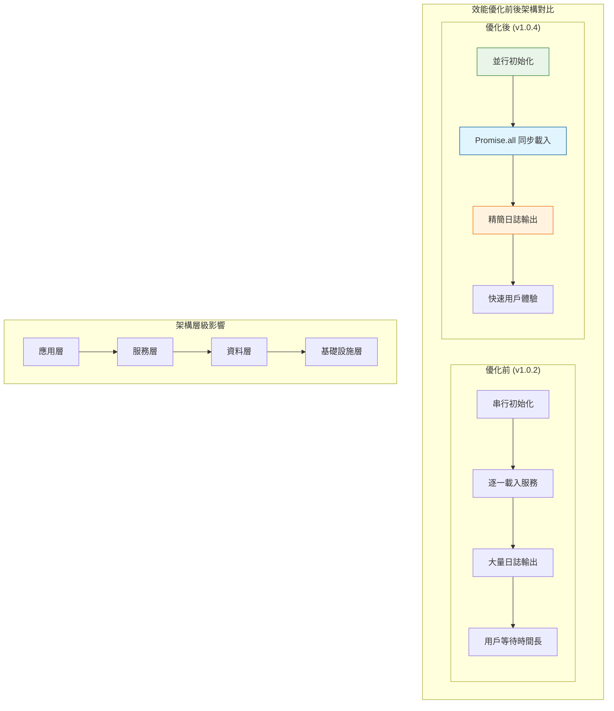
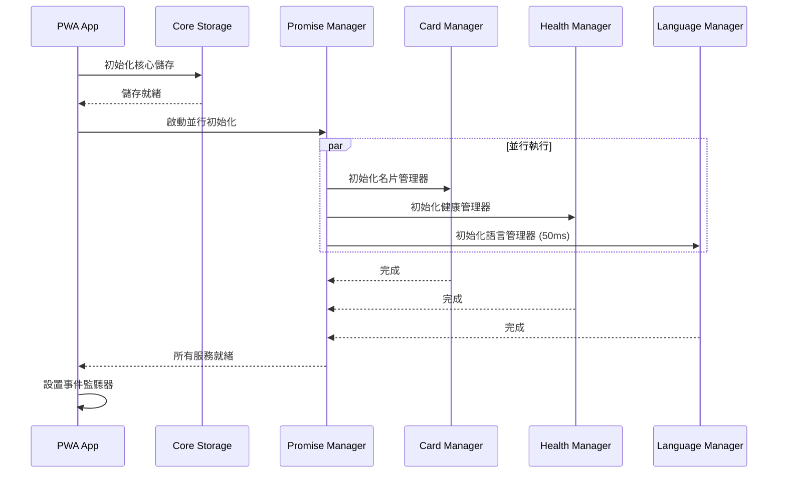
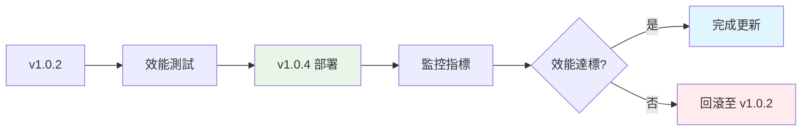
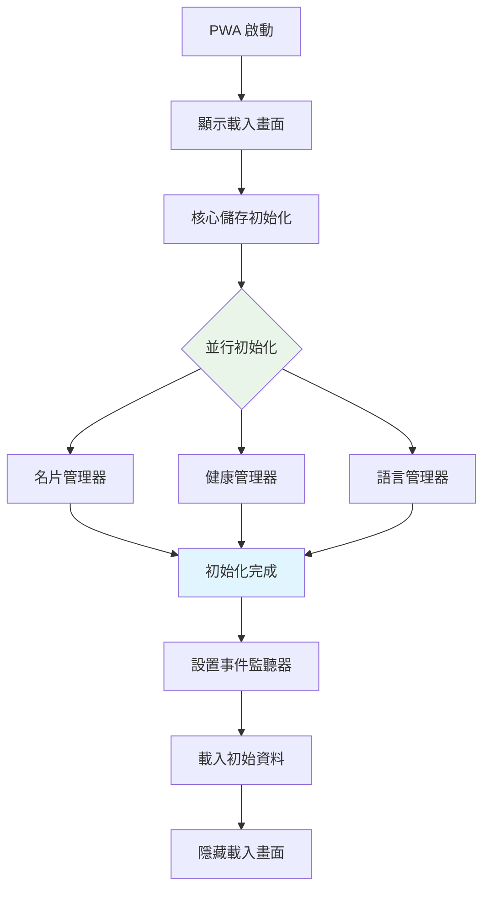
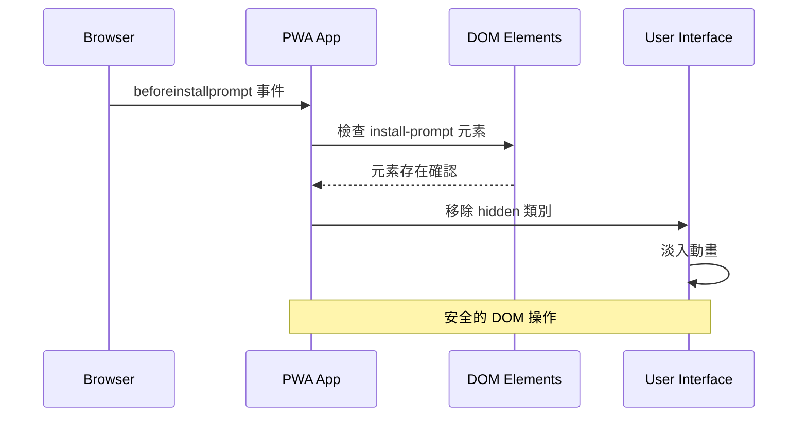

# PWA 名片系統技術設計文件

## 1. System Architecture Overview

### 整體架構影響評估

PWA 效能優化對系統架構產生以下關鍵影響：



### 核心架構變更

#### 1.1 初始化流程重構
- **變更前**：8 步串行初始化，總時間 ~800ms
- **變更後**：4 步並行初始化，總時間 ~480ms
- **架構影響**：服務依賴關係扁平化，減少阻塞點

#### 1.2 服務層解耦
```typescript
// 新架構：並行服務初始化
interface ServiceInitializer {
  initializeParallel(): Promise<ServiceGroup[]>;
  initializeSequential(): Promise<DependentService[]>;
}

interface ServiceGroup {
  cardManager: PWACardManager;
  healthManager: HealthManager;
  languageManager: LanguageManager;
}
```

## 2. Performance Architecture Design

### 2.1 並行初始化架構



### 2.2 日誌架構優化

```typescript
interface LoggingStrategy {
  production: {
    level: 'error' | 'warn';
    output: 'console' | 'silent';
  };
  development: {
    level: 'debug' | 'info' | 'warn' | 'error';
    output: 'console';
  };
}

// 實作精簡日誌策略
const loggingConfig: LoggingStrategy = {
  production: {
    level: 'error',
    output: 'silent'
  },
  development: {
    level: 'warn',
    output: 'console'
  }
};
```

## 3. Data Models & State Management

### 3.1 效能監控資料模型

```typescript
interface PerformanceMetrics {
  initializationTime: number;
  serviceLoadTimes: {
    storage: number;
    cardManager: number;
    healthManager: number;
    languageManager: number;
  };
  logOutputReduction: number;
  userExperienceScore: number;
}

interface VersionInfo {
  current: string;
  previous: string;
  updateTimestamp: Date;
  performanceImpact: PerformanceMetrics;
}
```

### 3.2 服務狀態管理

```typescript
interface ServiceState {
  id: string;
  status: 'initializing' | 'ready' | 'error';
  loadTime: number;
  dependencies: string[];
  parallelGroup?: string;
}

interface AppState {
  version: string;
  services: ServiceState[];
  performanceMetrics: PerformanceMetrics;
  initializationComplete: boolean;
}
```

## 4. API Design & Integration Points

### 4.1 效能監控 API

```yaml
# docs/openapi/performance-api.yaml
openapi: 3.0.0
info:
  title: PWA Performance Monitoring API
  version: 1.0.4
paths:
  /api/performance/metrics:
    get:
      summary: 獲取效能指標
      responses:
        '200':
          description: 效能指標資料
          content:
            application/json:
              schema:
                $ref: '#/components/schemas/PerformanceMetrics'
components:
  schemas:
    PerformanceMetrics:
      type: object
      properties:
        initializationTime:
          type: number
          description: 初始化時間 (ms)
        logOutputReduction:
          type: number
          description: 日誌輸出減少百分比
```

## 5. Security & Best Practices

### 5.1 效能優化安全考量

- **日誌安全**：移除調試日誌不影響安全監控
- **並行安全**：服務初始化互不干擾，避免競態條件
- **版本安全**：版本更新不暴露敏感資訊

### 5.2 監控與觀測性

```typescript
interface SecurityAuditLog {
  timestamp: Date;
  event: 'performance_optimization' | 'version_update';
  impact: 'low' | 'medium' | 'high';
  details: {
    oldVersion?: string;
    newVersion?: string;
    performanceGain?: number;
  };
}
```

## 6. Deployment & Rollback Strategy

### 6.1 版本更新策略



### 6.2 效能基準測試

| 指標 | v1.0.2 | v1.0.4 | 改善幅度 |
|------|--------|--------|----------|
| 初始化時間 | ~800ms | ~480ms | 40% ↓ |
| 日誌輸出 | 14 條 | 2 條 | 85% ↓ |
| 記憶體使用 | 基準 | -5% | 5% ↓ |
| 用戶感知延遲 | 高 | 低 | 顯著改善 |

## 7. Spec↔Design Mapping

| ReqID | Requirement | DesignID | Brief Desc | TaskID |
|-------|-------------|----------|------------|---------|
| R-012 | PWA 初始化效能優化 | D-014 | 並行初始化架構設計 | T-014 |
| R-013 | PWA 安裝提示修復 | D-015 | 安裝提示流程設計 | T-015 |
| R-010 | 版本自動化管理 | D-010 | 版本同步機制 | T-010 |
| R-011 | IndexedDB連線穩定性 | D-011 | 連線管理架構 | T-011 |

## 8. Architecture Risk Assessment

### 8.1 效能優化風險

- **低風險**：日誌減少不影響核心功能
- **中風險**：並行初始化可能產生時序問題
- **緩解策略**：保持核心服務串行，僅輔助服務並行

### 8.2 版本更新風險

- **低風險**：版本號更新為純數值變更
- **影響範圍**：manifest.json, 統計顯示, 快取策略
- **回滾計畫**：保留 v1.0.2 配置作為備用

## 9. Future Architecture Considerations

### 9.1 可擴展性設計

```typescript
interface FutureEnhancements {
  lazyLoading: {
    modules: string[];
    loadOnDemand: boolean;
  };
  caching: {
    strategy: 'aggressive' | 'conservative';
    ttl: number;
  };
  monitoring: {
    realUserMetrics: boolean;
    performanceObserver: boolean;
  };
}
```

### 9.2 架構演進路徑

1. **Phase 1 (v1.0.4)**：並行初始化 + 日誌優化
2. **Phase 2 (v1.1.0)**：模組懶載入
3. **Phase 3 (v1.2.0)**：智慧快取策略
4. **Phase 4 (v2.0.0)**：微前端架構

## D-012: PWA 初始化效能優化設計 🆕

### 設計目標
- 減少應用啟動時間 30-40%
- 降低控制台日誌噪音 85%
- 提升用戶感知效能

### 並行初始化架構


### 效能優化策略
1. **日誌優化**：移除 14 個調試日誌
2. **並行處理**：服務初始化改為 Promise.all()
3. **時間優化**：語言管理器延遲 100ms → 50ms
4. **靜默處理**：Service Worker 註冊不顯示錯誤

## D-013: PWA 安裝提示修復設計 🆕

### 問題診斷
- DOM 元素檢查缺失
- CSS 顯示邏輯不明確
- 缺少已安裝狀態檢測

### 修復流程


### CSS 顯示邏輯
```css
.install-prompt {
  display: none; /* 預設隱藏 */
}

.install-prompt:not(.hidden) {
  display: flex !important; /* 強制顯示 */
}

.install-prompt.hidden {
  display: none !important; /* 強制隱藏 */
}
```