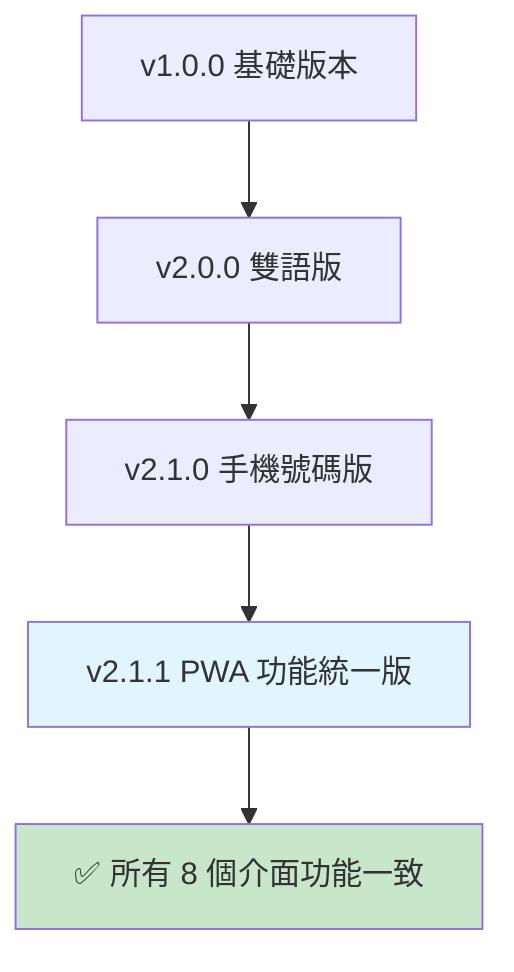

# 功能矩陣表 - 名片介面完整功能對照

## 📊 功能一致性矩陣

| 名片介面 | 加入聯絡人 | PWA 儲存 | QR 碼生成 | 隱私橫幅 | 語言支援 | 版面類型 |
|----------|------------|----------|-----------|----------|----------|----------|
| `index.html` | ✅ | ✅ | ✅ | ✅ | 中文 | 機關版（延平） |
| `index1.html` | ✅ | ✅ | ✅ | ✅ | 中文 | 機關版（新光） |
| `index-en.html` | ✅ | ✅ | ✅ | ✅ | 英文 | 機關版（延平） |
| `index1-en.html` | ✅ | ✅ | ✅ | ✅ | 英文 | 機關版（新光） |
| `index-personal.html` | ✅ | ✅ | ✅ | ✅ | 中文 | 個人版 |
| `index-personal-en.html` | ✅ | ✅ | ✅ | ✅ | 英文 | 個人版 |
| `index-bilingual.html` | ✅ | ✅ | ✅ | ✅ | 雙語 | 機關版 |
| `index-bilingual-personal.html` | ✅ | ✅ | ✅ | ✅ | 雙語 | 個人版 |

## 🔧 PWA 儲存功能技術規格

### 功能特色
- **安全檢查**：驗證 HTTPS 連線或本地環境
- **資料傳遞**：自動獲取當前頁面的名片資料參數
- **視覺回饋**：按鈕狀態變化（已開啟 PWA → 恢復原狀）
- **錯誤處理**：彈窗提示無法開啟 PWA 的情況
- **跨版本相容**：支援所有版本的名片介面

### 實作函數
```javascript
function setupPWASaveButton(cardData) {
    const saveButton = document.getElementById('save-to-pwa-btn');
    if (!saveButton) return;
    
    saveButton.addEventListener('click', function() {
        // HTTPS 檢查
        if (window.location.protocol !== 'https:' && 
            window.location.hostname !== 'localhost' && 
            window.location.hostname !== '127.0.0.1') {
            alert('離線儲存功能需要 HTTPS 連線或本地環境');
            return;
        }
        
        // 資料參數獲取
        const urlParams = new URLSearchParams(window.location.search);
        const dataParam = urlParams.get('data') || urlParams.get('c');
        const pwaUrl = window.location.origin + '/pwa-card-storage/?c=' + encodeURIComponent(dataParam);
        
        // PWA 開啟與視覺回饋
        const pwaWindow = window.open(pwaUrl, '_blank');
        if (pwaWindow) {
            saveButton.textContent = '✅ 已開啟 PWA';
            saveButton.style.background = '#6c757d';
            saveButton.disabled = true;
            
            setTimeout(() => {
                saveButton.textContent = '💾 儲存到離線';
                saveButton.style.background = '#28a745';
                saveButton.disabled = false;
            }, 3000);
        } else {
            alert('無法開啟 PWA，請檢查瀏覽器設定');
        }
    });
}
```

## 🎯 統一使用者體驗

### 核心功能清單
所有 8 個名片介面現在都具備：

1. **📱 加入聯絡人功能**
   - 動態 vCard 生成
   - 設備類型檢測
   - 多語言支援

2. **💾 PWA 離線儲存功能**
   - HTTPS 安全檢查
   - 資料參數傳遞
   - 視覺狀態回饋

3. **🔒 隱私優先設計理念**
   - 隱私橫幅顯示
   - 無後端追蹤說明
   - 資料自主控制

4. **📊 QR 碼分享功能**
   - 本地 QR 碼生成
   - 240x240 高解析度
   - 無外部 API 依賴

5. **🌐 多語言支援**（部分版本）
   - 中文、英文、雙語版本
   - 動態語言切換
   - 本地化內容翻譯

## 📈 版本演進歷程



## 🔍 測試驗證狀態

### 已完成驗證
- ✅ **功能補齊**：`index1.html` 和 `index1-en.html` 已添加 PWA 儲存功能
- ✅ **一致性檢查**：所有 8 個名片介面具備相同核心功能
- ✅ **使用者體驗**：統一的按鈕配置和操作流程

### 建議後續測試
- 🔄 **完整回歸測試**：驗證所有名片介面的 PWA 儲存功能
- 🔄 **跨瀏覽器測試**：確保在不同瀏覽器中的相容性
- 🔄 **行動裝置測試**：驗證在 iOS 和 Android 設備上的表現

---

**更新日期**：2024-12-20  
**版本**：v2.1.1  
**狀態**：功能統一完成 ✅