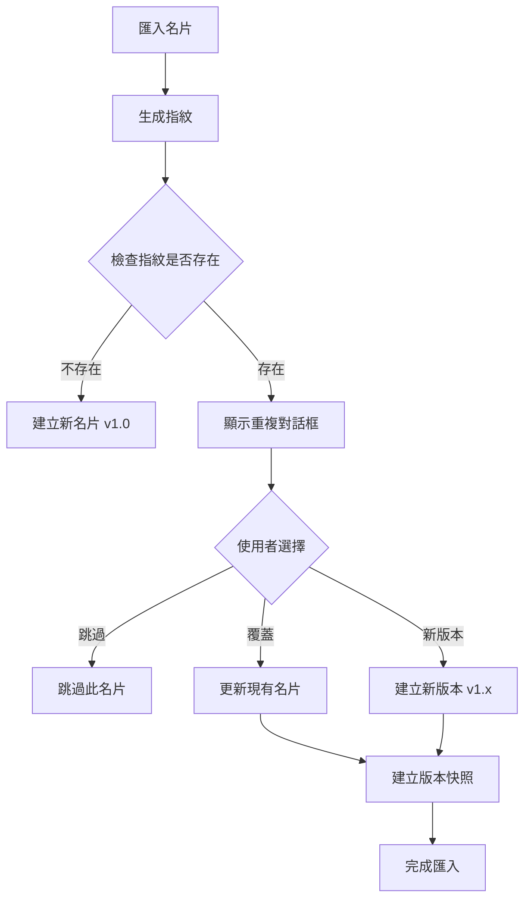

# 名片版本管理與重複識別功能需求文檔

## 1. Product Overview

### 1.1 背景與動機
基於專案現狀分析，系統已具備：
- ✅ **基礎版本控制**：`PWACardStorage` 提供版本快照功能
- ✅ **IndexedDB 儲存**：完整的本地資料庫架構
- ✅ **名片匯入功能**：支援 JSON 和 vCard 格式匯入

**需求缺口**：從匯出檔案 `cards-export-2025-08-04T21-27-49.json` 分析發現：
1. **重複名片問題**：同一人（蔡孟諭）的 3 張名片被當作不同名片儲存
2. **版本號固定**：所有名片版本都是 "1.0"，沒有遞增機制
3. **缺乏唯一識別**：無法識別相同名片的不同版本
4. **資料格式不一致**：新舊格式混合，影響識別準確性

### 1.2 產品目標
- **主要目標**：建立基於內容指紋的名片版本管理機制
- **次要目標**：提供版本歷史查看和還原功能
- **長期目標**：建立智慧重複檢測和合併建議系統

### 1.3 目標使用者
- **主要使用者**：PWA 名片管理系統使用者
- **使用場景**：匯入名片時自動檢測重複、管理名片版本歷史
- **技術水平**：一般使用者，期望自動化處理

### 1.4 商業價值
- 提升資料品質，避免重複儲存
- 增強版本控制能力，支援名片演進追蹤
- 改善使用者體驗，減少手動清理工作

### 1.5 關鍵績效指標 (KPI)
- **重複檢測準確率**：≥ 95%（基於姓名+電子郵件指紋）
- **版本管理效率**：版本建立時間 ≤ 500ms
- **儲存空間優化**：重複名片減少 ≥ 80%
- **使用者滿意度**：版本管理功能使用率 ≥ 60%

## 2. Functional Requirements

### 2.1 內容指紋生成機制
**User Story**: 作為系統，我需要為每張名片生成唯一的內容指紋，以識別相同名片的不同版本。

**Acceptance Criteria**:
- **Given** 使用者匯入或新增名片資料
- **When** 系統處理名片資料（包含姓名、電子郵件等關鍵欄位）
- **Then** 自動生成基於 `name + email` 的 SHA-256 內容指紋
- **And** 指紋格式為 `fingerprint_[hash]`，長度固定 64 字元
- **And** 支援雙語名片的標準化處理（"蔡孟諭~Tsai Meng-Yu" → "蔡孟諭"）
- **And** 處理空值和特殊字元，確保指紋穩定性

**Priority**: P0 (Critical)
**Dependencies**: 現有 `PWACardStorage.calculateChecksum()` 方法、Web Crypto API

### 2.2 智慧重複檢測與版本遞增
**User Story**: 作為使用者，我希望匯入名片時系統能自動檢測重複並管理版本號。

**Acceptance Criteria**:
- **Given** 使用者匯入名片資料
- **When** 系統檢測到相同指紋的名片已存在
- **Then** 自動將版本號遞增（1.0 → 1.1 → 1.2）
- **And** 保留所有歷史版本，最多保存 10 個版本
- **And** 顯示重複檢測提示："發現相同名片，已建立版本 1.2"
- **And** 提供選項：「覆蓋現有版本」或「建立新版本」
- **And** 自動清理超過限制的舊版本（FIFO 策略）

**Priority**: P0 (Critical)
**Dependencies**: 內容指紋機制、現有版本控制系統

### 2.3 版本歷史管理介面
**User Story**: 作為使用者，我希望能查看和管理名片的版本歷史。

**Acceptance Criteria**:
- **Given** 名片存在多個版本
- **When** 使用者點擊「版本歷史」按鈕
- **Then** 顯示版本列表，包含版本號、修改時間、變更摘要
- **And** 支援版本比較功能，高亮顯示差異欄位
- **And** 提供「還原到此版本」功能
- **And** 顯示版本統計：總版本數、最後修改時間、儲存空間使用
- **And** 支援版本匯出功能（單一版本或完整歷史）

**Priority**: P1 (High)
**Dependencies**: 現有 `getVersionHistory()` 方法、UI 元件系統

### 2.4 匯入時重複處理流程
**User Story**: 作為使用者，我希望匯入檔案時能智慧處理重複名片。

**Acceptance Criteria**:
- **Given** 使用者匯入包含重複名片的檔案
- **When** 系統檢測到重複名片（相同指紋）
- **Then** 顯示重複處理對話框，包含：
  - 現有名片資訊（版本、最後修改時間）
  - 新名片資訊（來源、差異摘要）
  - 處理選項：跳過、覆蓋、建立新版本、批量處理
- **And** 支援批量處理模式：「全部跳過」、「全部建立新版本」
- **And** 提供預覽功能，顯示處理結果統計
- **And** 完成後顯示匯入報告：新增、更新、跳過的名片數量

**Priority**: P0 (Critical)
**Dependencies**: 匯入流程、重複檢測機制、UI 對話框元件

### 2.5 版本合併與清理功能
**User Story**: 作為使用者，我希望能合併相似版本並清理不需要的歷史版本。

**Acceptance Criteria**:
- **Given** 名片存在多個相似版本
- **When** 使用者選擇「版本管理」功能
- **Then** 系統分析版本差異，提供合併建議
- **And** 支援手動選擇要保留的版本
- **And** 提供批量清理功能：清理 30 天前的版本、清理相似版本
- **And** 清理前顯示影響範圍和確認對話框
- **And** 支援清理操作的撤銷功能（24 小時內）

**Priority**: P2 (Medium)
**Dependencies**: 版本比較算法、批量操作機制

## 3. Non-Functional Requirements

### 3.1 Secure by Default 檢查清單
- ✅ **資料完整性**：使用 SHA-256 確保指紋唯一性和防篡改
- ✅ **輸入驗證**：所有名片資料進行格式驗證和清理
- ✅ **授權檢查**：版本操作需要適當的使用者權限驗證
- ✅ **安全日誌**：記錄版本操作，但不洩露 PII 資訊
- ✅ **錯誤處理**：版本衝突和異常情況的安全處理

### 3.2 Cognitive Load-Friendly 檢查清單
- ✅ **自動化處理**：重複檢測和版本管理對使用者透明
- ✅ **清楚提示**：版本狀態和操作結果有明確的視覺回饋
- ✅ **簡化選擇**：提供預設選項和批量處理模式
- ✅ **可理解標籤**：版本號使用語義化命名（1.0, 1.1, 1.2）
- ✅ **錯誤恢復**：提供撤銷和還原機制

### 3.3 效能需求
- **指紋生成時間**：≤ 100ms per card
- **重複檢測時間**：≤ 200ms per card
- **版本歷史載入**：≤ 500ms for 10 versions
- **批量處理效率**：≥ 50 cards/second

### 3.4 可用性需求
- **離線可用性**：100% 離線環境下功能正常
- **資料一致性**：版本操作的 ACID 特性保證
- **錯誤恢復**：異常中斷後自動恢復到一致狀態

## 4. Technical Constraints & Assumptions

### 4.1 技術限制
- **必須複用現有組件**：`PWACardStorage`、`PWACardManager`、IndexedDB 架構
- **保持 API 一致性**：不改變現有 `storeCard()` 和 `importFromFile()` 函數簽名
- **資料庫結構擴展**：在現有 schema 基礎上新增欄位，不破壞相容性
- **瀏覽器相容性**：支援 IndexedDB 和 Web Crypto API 的現代瀏覽器

### 4.2 現有依賴與整合點
- **儲存層**：`PWACardStorage` 的版本控制機制
- **管理層**：`PWACardManager` 的匯入和類型識別邏輯
- **資料結構**：現有的 `cards` 和 `versions` ObjectStore
- **加密機制**：現有的 SHA-256 校驗和計算方法

### 4.3 假設條件
- 使用者理解版本管理的基本概念
- 姓名+電子郵件組合足以唯一識別一個人
- 版本歷史不會無限增長（10 版本限制合理）

## 5. Architecture Reuse Plan

### 5.1 Reuse Mapping
| 新需求功能 | 現有模組/API | 複用方式 | 擴展需求 |
|-----------|-------------|----------|----------|
| 內容指紋生成 | `calculateChecksum()` | 直接複用 | 新增指紋標準化邏輯 |
| 版本儲存 | `createVersionSnapshot()` | 擴展複用 | 新增指紋欄位 |
| 重複檢測 | `listCards()` | 擴展複用 | 新增指紋索引查詢 |
| 版本歷史 | `getVersionHistory()` | 直接複用 | 無需修改 |
| 匯入處理 | `importFromExportFormat()` | 擴展複用 | 新增重複檢測邏輯 |

### 5.2 Extension Plan
**資料庫 Schema 擴展**：
```javascript
// 擴展 cards ObjectStore
{
  id: 'card_xxx',
  fingerprint: 'fingerprint_[hash]', // 新增：內容指紋
  type: 'bilingual',
  data: { /* 名片資料 */ },
  created: Date,
  modified: Date,
  version: '1.2', // 擴展：語義化版本號
  currentVersion: 2, // 保留：數字版本號
  // ... 其他現有欄位
}

// 擴展 versions ObjectStore
{
  id: 'card_xxx_v1.2',
  cardId: 'card_xxx',
  fingerprint: 'fingerprint_[hash]', // 新增：版本指紋
  version: '1.2', // 擴展：語義化版本號
  // ... 其他現有欄位
}
```

**新增索引**：
```javascript
// 新增指紋索引以支援快速重複檢測
cardsStore.createIndex('fingerprint', 'fingerprint', { unique: false });
versionsStore.createIndex('fingerprint', 'fingerprint', { unique: false });
```

### 5.3 Build vs. Buy vs. Reuse 分析
| 功能模組 | 決策 | 理由 | 成本評估 |
|---------|------|------|----------|
| 指紋生成算法 | Reuse | 現有 SHA-256 機制成熟 | 低：僅需包裝函數 |
| 版本比較邏輯 | Build | 業務邏輯特殊，需客製化 | 中：約 200 行程式碼 |
| 重複檢測 UI | Build | 需要特定的使用者互動流程 | 中：約 300 行程式碼 |
| 版本歷史 UI | Extend | 基於現有 UI 元件擴展 | 低：約 150 行程式碼 |

### 5.4 Migration & Deprecation
**資料遷移策略**：
1. **Phase 1**：新增指紋欄位，現有資料保持不變
2. **Phase 2**：背景任務為現有名片生成指紋
3. **Phase 3**：啟用重複檢測功能
4. **Phase 4**：清理重複資料（可選，使用者確認）

**向下相容性**：
- 現有 API 保持不變，新功能通過可選參數提供
- 舊版本資料自動升級，無需使用者干預
- 提供降級機制，可關閉新功能回到原始行為

## 6. Security & Privacy Requirements

### 6.1 威脅模型概覽
| 威脅類型 | 風險等級 | 緩解措施 |
|---------|---------|----------|
| 指紋碰撞攻擊 | Medium | 使用 SHA-256 + 鹽值，碰撞機率極低 |
| 版本資料篡改 | Medium | 版本校驗和驗證，檢測資料完整性 |
| 重複檢測繞過 | Low | 多重驗證機制，防止惡意重複 |
| 版本歷史洩露 | Low | 本地儲存，無網路傳輸風險 |

### 6.2 資料分類與最小權限
- **敏感資料**：姓名、電子郵件（用於指紋生成）
- **處理原則**：指紋生成後立即清理中間資料
- **存取控制**：版本操作需要明確的使用者授權
- **日誌記錄**：記錄操作類型和時間，不記錄具體內容

### 6.3 審計需求
- 版本建立、修改、刪除操作的完整日誌
- 重複檢測結果和使用者選擇的記錄
- 異常情況和錯誤處理的追蹤記錄

## 7. Measurement & Validation Plan

### 7.1 功能驗證
**單元測試**：
- 指紋生成算法的一致性和唯一性測試
- 版本遞增邏輯的正確性測試
- 重複檢測算法的準確性測試

**整合測試**：
- 匯入流程中重複處理的端到端測試
- 版本管理 UI 的互動測試
- 資料庫操作的事務性測試

**端到端測試**：
- 完整的名片匯入和版本管理流程
- 異常情況下的錯誤恢復測試
- 大量資料的效能壓力測試

### 7.2 效能監控
- **指紋生成效能**：批量處理 1000 張名片的時間
- **重複檢測效能**：在 10000 張名片中檢測重複的時間
- **版本歷史載入**：複雜版本樹的渲染時間
- **儲存空間使用**：版本資料的空間效率

### 7.3 使用者體驗測試
- **可用性測試**：新使用者完成版本管理任務的成功率
- **認知負荷測試**：版本概念理解和操作複雜度評估
- **錯誤恢復測試**：使用者在操作失誤後的恢復能力

## 8. Appendix

### 8.1 內容指紋算法規格
```javascript
/**
 * 生成名片內容指紋
 * @param {Object} cardData - 名片資料
 * @returns {string} 指紋字串，格式：fingerprint_[64字元hash]
 */
function generateCardFingerprint(cardData) {
  // 1. 標準化姓名（處理雙語格式）
  const normalizedName = normalizeName(cardData.name);
  
  // 2. 標準化電子郵件（轉小寫，去空格）
  const normalizedEmail = normalizeEmail(cardData.email);
  
  // 3. 組合關鍵欄位
  const fingerprintSource = `${normalizedName}|${normalizedEmail}`;
  
  // 4. 生成 SHA-256 雜湊
  const hash = await crypto.subtle.digest('SHA-256', 
    new TextEncoder().encode(fingerprintSource));
  
  // 5. 轉換為十六進位字串
  const hashHex = Array.from(new Uint8Array(hash))
    .map(b => b.toString(16).padStart(2, '0')).join('');
  
  return `fingerprint_${hashHex}`;
}
```

### 8.2 版本號規則
- **格式**：`major.minor`（如：1.0, 1.1, 1.2）
- **遞增規則**：同一指紋的名片，minor 版本號遞增
- **重置規則**：不同指紋視為不同名片，重新從 1.0 開始
- **顯示規則**：UI 中顯示為「版本 1.2」，資料庫儲存為字串 "1.2"

### 8.3 重複檢測流程圖


### 8.4 資料庫索引策略
```sql
-- 指紋索引（支援快速重複檢測）
CREATE INDEX idx_cards_fingerprint ON cards(fingerprint);
CREATE INDEX idx_versions_fingerprint ON versions(fingerprint);

-- 複合索引（支援版本查詢）
CREATE INDEX idx_versions_card_version ON versions(cardId, version);

-- 時間索引（支援清理操作）
CREATE INDEX idx_versions_timestamp ON versions(timestamp);
```

### 8.5 錯誤處理策略
| 錯誤類型 | 處理策略 | 使用者體驗 |
|---------|----------|------------|
| 指紋生成失敗 | 使用備用算法（時間戳+隨機數） | 顯示警告，功能降級 |
| 版本衝突 | 自動重試，遞增版本號 | 透明處理，無感知 |
| 儲存空間不足 | 自動清理舊版本 | 提示清理結果 |
| 資料庫損壞 | 嘗試修復，備份重要資料 | 顯示修復進度 |

### 8.6 技術名詞表
- **內容指紋 (Content Fingerprint)**：基於名片關鍵欄位生成的唯一識別碼
- **版本快照 (Version Snapshot)**：特定時間點的名片資料完整副本
- **重複檢測 (Duplicate Detection)**：識別相同名片不同版本的算法
- **語義化版本 (Semantic Versioning)**：使用 major.minor 格式的版本號系統

### 8.7 參考文件
- [現有專案 README.md](../README.md)
- [PWA 儲存架構文檔](../pwa-card-storage/README.md)
- [安全架構文檔](SECURITY.md)
- [IndexedDB 最佳實踐](https://developer.mozilla.org/en-US/docs/Web/API/IndexedDB_API)

---

## Spec↔Design↔Tasks 映射表

| 需求編號 | 功能需求 | 現有基礎 | 實作任務 | 測試案例 |
|---------|---------|---------|---------|---------|
| REQ-001 | 內容指紋生成機制 | `calculateChecksum()` | 新增 `generateCardFingerprint()` 函數 | 指紋唯一性和一致性測試 |
| REQ-002 | 智慧重複檢測與版本遞增 | `storeCard()` 方法 | 擴展匯入邏輯，新增重複檢測 | 重複檢測準確率測試 |
| REQ-003 | 版本歷史管理介面 | `getVersionHistory()` | 新增版本管理 UI 元件 | 版本歷史顯示和操作測試 |
| REQ-004 | 匯入時重複處理流程 | `importFromExportFormat()` | 新增重複處理對話框 | 匯入流程端到端測試 |
| REQ-005 | 版本合併與清理功能 | 版本控制系統 | 新增批量清理和合併邏輯 | 清理操作安全性測試 |