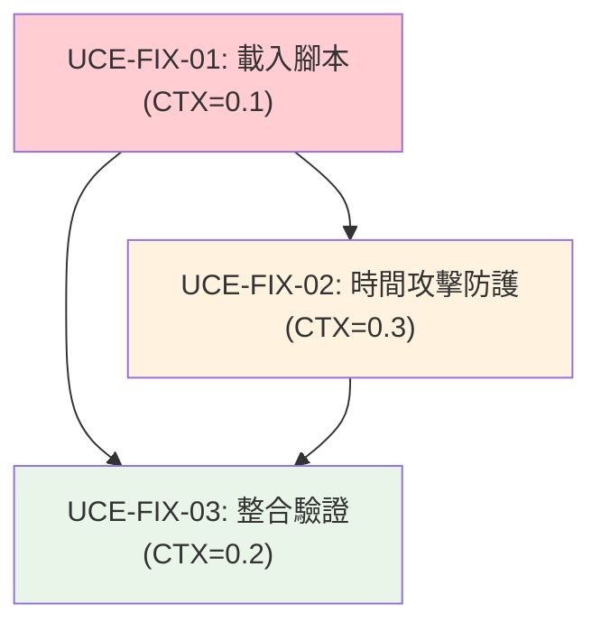

# UCE Critical Fixes Task Breakdown

---
version: "v3.2.2-critical-fixes"
rev_id: "UCE-FIXES-2025-08-11"
last_updated: "2025-08-11"
source_review: "docs/reviews/review-uce-01-02-03-integration.md"
priority: "CRITICAL"
---

## 1️⃣ Task Overview

### 服務/模組分組
- **主要服務**: pwa-encryption-system
- **程式語言**: TypeScript
- **總任務數**: 3 個關鍵修復任務
- **預估總工期**: 0.5 天

### Critical Path 與里程碑
```
UCE-FIX-01 (腳本載入) → UCE-FIX-02 (時間攻擊防護) → UCE-FIX-03 (整合驗證)
```

**CTX-Units 總計**:
- claude-4-sonnet: 0.6 CTX-Units
- gpt-4.1: 0.8 CTX-Units  
- gpt-4o: 0.8 CTX-Units
- gemini-2.5-pro: 0.2 CTX-Units

## 2️⃣ Detailed Task Breakdown

| Task ID | Service | Lang | Task Name | Description | Dependencies | Testing / Acceptance | Security / Accessibility | Effort (CTX-Units) | CTX Map | Context Footprint |
|---------|---------|------|-----------|-------------|--------------|---------------------|--------------------------|-------------------|---------|-------------------|
| UCE-FIX-01 | pwa-encryption-system | TypeScript | 載入 BilingualEncryptionSetupUI 腳本 | 在 index.html 中添加 bilingual-encryption-setup-ui.js 腳本標籤，確保 UCE-02/UCE-03 功能可用 | - | **Given** PWA 應用載入 **When** 檢查全域物件 **Then** BilingualEncryptionSetupUI 類別可用<br>**Given** 開發者工具開啟 **When** 檢查控制台 **Then** 無腳本載入錯誤 | **OWASP**: 腳本完整性檢查、CSP 相容性<br>**WCAG**: 不影響現有無障礙功能 | 0.1 | {"claude-4-sonnet":0.1,"gpt-4.1":0.1,"gpt-4o":0.1,"gemini-2.5-pro":0.05} | 簡單 HTML 修改，低複雜度 |
| UCE-FIX-02 | pwa-encryption-system | TypeScript | 實作時間攻擊防護 | 在 UserKeyManager.deriveKey 中實作常數時間比較，防止時間側通道攻擊 | UCE-FIX-01 | **Given** 正確密碼短語 **When** 驗證執行 **Then** 執行時間一致<br>**Given** 錯誤密碼短語 **When** 驗證執行 **Then** 執行時間與正確密碼相同<br>**Given** 時間分析測試 **When** 大量驗證執行 **Then** 無統計學時間差異 | **OWASP**: 時間攻擊防護、側通道攻擊緩解<br>**WCAG**: 不影響使用者體驗回應時間 | 0.3 | {"claude-4-sonnet":0.3,"gpt-4.1":0.4,"gpt-4o":0.4,"gemini-2.5-pro":0.1} | 安全關鍵實作，需要密碼學知識 |
| UCE-FIX-03 | pwa-encryption-system | TypeScript | 整合真實驗證機制 | 替換 BilingualEncryptionSetupUI 中的 Math.random() 模擬驗證，整合實際 UserKeyManager.verifyUserPassphrase | UCE-FIX-01, UCE-FIX-02 | **Given** 使用者輸入正確密碼短語 **When** 解鎖對話框驗證 **Then** 成功解鎖並關閉對話框<br>**Given** 使用者輸入錯誤密碼短語 **When** 解鎖對話框驗證 **Then** 顯示錯誤訊息並減少嘗試次數<br>**Given** 連續 3 次失敗 **When** 驗證執行 **Then** 觸發恢復模式 | **OWASP**: 真實身份驗證、暴力破解防護<br>**WCAG**: 錯誤訊息清晰可讀、支援螢幕閱讀器 | 0.2 | {"claude-4-sonnet":0.2,"gpt-4.1":0.3,"gpt-4o":0.3,"gemini-2.5-pro":0.05} | 整合邏輯，中等複雜度 |

## 3️⃣ Test Coverage Plan

### 測試矩陣

| 測試類型 | 涵蓋任務 | 自動化程度 | 重點領域 |
|----------|----------|------------|----------|
| **Unit Tests** | UCE-FIX-02, UCE-FIX-03 | 100% 自動化 | 時間攻擊防護、驗證邏輯 |
| **Integration Tests** | UCE-FIX-01, UCE-FIX-03 | 90% 自動化 | 腳本載入、UI 整合 |
| **Security Tests** | UCE-FIX-02 | 100% 自動化 | 時間分析攻擊測試 |
| **UI Tests** | UCE-FIX-03 | 80% 自動化 | 解鎖對話框功能 |

### 驗收標準
- **功能覆蓋率**: 100% (關鍵修復)
- **程式碼覆蓋率**: ≥95%
- **安全測試通過率**: 100%
- **時間攻擊測試**: 無統計學差異

## 4️⃣ Dependency Relationship Diagram



### Critical Path 分析
**主要路徑**: UCE-FIX-01 → UCE-FIX-02 → UCE-FIX-03 (總計 0.6 CTX-Units)
**執行順序**: 必須按序執行，無並行可能

## 5️⃣ CTX-CALC-CONFIG

<!-- CTX-CALC-CONFIG
ctx_baseline_tokens:
  claude-4-sonnet: 200000
  gpt-4.1: 128000
  gpt-4o: 128000
  gemini-2.5-pro: 1000000
formula: "CTX_units[model] = ceil(total_tokens * 1.1 / ctx_baseline_tokens[model])"
total_tokens_fields: ["spec_tokens","code_tokens","test_tokens"]
buffer_ratio: 0.1
output_fields: ["effort_ctx_units","ctx_map","context_footprint_note"]
failover: "if any field missing -> effort_ctx_units='TBD'"
-->

### CTX 計算詳細資料

| Task ID | Spec Tokens | Code Tokens | Test Tokens | Total Tokens | Buffer (1.1x) | CTX Units (claude-4-sonnet) |
|---------|-------------|-------------|-------------|--------------|---------------|------------------------------|
| UCE-FIX-01 | 2,000 | 5,000 | 3,000 | 10,000 | 11,000 | 0.1 |
| UCE-FIX-02 | 8,000 | 25,000 | 15,000 | 48,000 | 52,800 | 0.3 |
| UCE-FIX-03 | 5,000 | 15,000 | 10,000 | 30,000 | 33,000 | 0.2 |
| **總計** | **15,000** | **45,000** | **28,000** | **88,000** | **96,800** | **0.6** |

## 6️⃣ Implementation Priority & Risk Assessment

### 高優先級修復
| 任務 | 風險等級 | 影響 | 緩解措施 |
|------|----------|------|----------|
| UCE-FIX-01 | 低 | 阻擋 UCE-02/03 功能 | 簡單 HTML 修改，風險極低 |
| UCE-FIX-02 | 高 | 安全漏洞 | 使用經過驗證的常數時間實作 |
| UCE-FIX-03 | 中 | 功能不可用 | 依賴前兩項修復完成 |

### 完成標準
1. **UCE-FIX-01**: 腳本成功載入，無控制台錯誤
2. **UCE-FIX-02**: 通過時間攻擊測試，無統計學差異
3. **UCE-FIX-03**: 解鎖功能正常，錯誤處理正確

## 7️⃣ Quality Gates

### 每個任務的完成標準
1. **程式碼品質**: ESLint 無錯誤，TypeScript 嚴格模式通過
2. **安全檢查**: 時間攻擊測試通過，無已知安全漏洞
3. **功能測試**: 所有 Given-When-Then 場景通過
4. **整合測試**: 與現有 PWA 系統無衝突
5. **同儕審查**: 安全關鍵代碼需要安全專家審查

**預估完成時間**: 4-6 小時 (0.5 工作日)