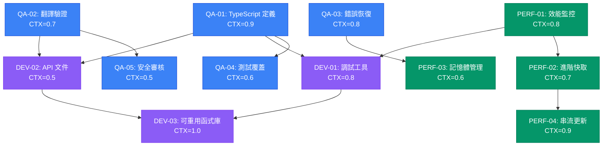

# 統一語言管理架構策略性改進任務計劃

## 1️⃣ Task Overview

### 模組分組摘要
基於架構分析結果（8.2/10分，生產環境就緒），專注於戰略性改進而非緊急修復：
- **Phase 1 - 品質保證** (5 tasks): TypeScript化、測試覆蓋率、錯誤處理強化
- **Phase 2 - 效能優化** (4 tasks): 監控指標、快取策略、記憶體管理、載入優化  
- **Phase 3 - 開發者體驗** (3 tasks): 調試工具、文件完善、重用性提升

### Critical Path 與里程碑
- **里程碑 1** (Day 3): 品質保證改善，TypeScript支援完成
- **里程碑 2** (Day 5): 效能監控與優化機制部署
- **里程碑 3** (Day 7): 開發者工具與文件化完成

**總 CTX-Units**: 8.7 (Claude-4-Sonnet), 13.6 (GPT-4.1)

## 2️⃣ Detailed Task Breakdown

| Task ID | Task Name | Description | Dependencies | Testing/Acceptance | Security/Accessibility | Effort (CTX-Units) | CTX Map (Claude4/GPT-4.1) | Context Footprint Note |
|---------|-----------|-------------|--------------|--------------------|------------------------|--------------------|---------------------------|------------------------|
| **QA-01** | TypeScript 類型定義實作 | 為所有核心語言管理類別新增 TypeScript 類型定義，提升開發者體驗和程式碼品質 | 無 | **Given** 現有 JavaScript 實作<br>**When** 新增 .d.ts 類型檔案<br>**Then** TypeScript 編輯器提供自動完成<br>**And** 型別檢查捕獲潛在錯誤<br>**And** 所有公開 API 有完整類型 | **Security**: 類型檢查防止不當參數傳遞<br>**Accessibility**: 介面類型確保無障礙屬性正確 | 0.9 | {"claude-4-sonnet": 0.9, "gpt-4.1": 1.4} | 類型定義，需要理解現有實作 |
| **QA-02** | 翻譯完整性驗證系統 | 實作自動檢測缺失翻譯鍵值和語言間不一致的驗證機制 | 無 | **Given** 多語言翻譯資源<br>**When** 執行完整性檢查<br>**Then** 識別缺失的翻譯鍵值<br>**And** 報告語言間不一致項目<br>**And** 提供修復建議 | **Security**: 驗證翻譯內容防止 XSS<br>**Accessibility**: 確保無障礙文字完整性 | 0.7 | {"claude-4-sonnet": 0.7, "gpt-4.1": 1.1} | 翻譯驗證邏輯，中等複雜度 |
| **QA-03** | 自動錯誤恢復機制強化 | 實作Circuit Breaker模式和自動重試，提升系統可靠性 | 無 | **Given** 組件更新失敗<br>**When** 觸發錯誤恢復<br>**Then** 使用 Circuit Breaker 防止級聯失敗<br>**And** 自動重試失敗的組件更新<br>**And** 優雅降級不影響使用者體驗 | **Security**: 錯誤資訊不洩露敏感資料<br>**Accessibility**: 錯誤狀態提供無障礙回饋 | 0.8 | {"claude-4-sonnet": 0.8, "gpt-4.1": 1.2} | Circuit Breaker 實作 |
| **QA-04** | 整合測試覆蓋率提升 | 擴展現有測試套件，重點加強端對端語言切換場景 | QA-01 | **Given** 現有測試基礎<br>**When** 執行完整測試套件<br>**Then** 語言切換場景覆蓋率 ≥ 95%<br>**And** 跨組件整合測試涵蓋所有路徑<br>**And** 效能回歸測試確保 <300ms | **Security**: 安全測試涵蓋翻譯注入<br>**Accessibility**: 無障礙相容性自動化測試 | 0.6 | {"claude-4-sonnet": 0.6, "gpt-4.1": 0.9} | 測試案例擴展 |
| **QA-05** | 安全性審核與強化 | 實施語言管理系統的全面安全審核，強化輸入驗證和 XSS 防護 | QA-02 | **Given** 語言切換和翻譯系統<br>**When** 執行安全測試<br>**Then** 所有使用者輸入通過嚴格驗證<br>**And** XSS 攻擊向量被阻止<br>**And** 安全審核報告顯示無重大風險 | **Security**: 全面安全檢查和加固<br>**Accessibility**: 安全措施不影響無障礙功能 | 0.5 | {"claude-4-sonnet": 0.5, "gpt-4.1": 0.8} | 安全審核相對標準化 |
| **PERF-01** | 效能監控指標系統 | 實作詳細的效能監控和指標收集，基於現有 PerformanceOptimizer 擴展 | 無 | **Given** 語言切換操作<br>**When** 執行效能監控<br>**Then** 收集詳細的時間、記憶體指標<br>**And** 提供效能趨勢分析<br>**And** 自動警報效能異常 | **Security**: 指標資料不包含敏感資訊<br>**Accessibility**: 效能監控不影響無障礙體驗 | 0.8 | {"claude-4-sonnet": 0.8, "gpt-4.1": 1.2} | 效能指標收集系統 |
| **PERF-02** | 進階快取策略實作 | 實作 LRU + TTL 快取機制，優化翻譯資源記憶體使用 | PERF-01 | **Given** 頻繁的翻譯查詢<br>**When** 使用進階快取策略<br>**Then** 快取命中率 ≥ 90%<br>**And** 記憶體使用控制在合理範圍<br>**And** 過期翻譯自動清理 | **Security**: 快取清理防止資料洩露<br>**Accessibility**: 快取策略確保翻譯可用性 | 0.7 | {"claude-4-sonnet": 0.7, "gpt-4.1": 1.1} | LRU+TTL 快取實作 |
| **PERF-03** | 記憶體管理優化 | 強化觀察者生命週期管理，防止記憶體洩漏 | QA-03 | **Given** 長時間運行應用<br>**When** 多次語言切換操作<br>**Then** 記憶體使用保持穩定<br>**And** 無未清理的觀察者引用<br>**And** 記憶體洩漏測試通過 | **Security**: 記憶體清理防止資料殘留<br>**Accessibility**: 記憶體優化不影響功能穩定性 | 0.6 | {"claude-4-sonnet": 0.6, "gpt-4.1": 0.9} | 記憶體管理優化 |
| **PERF-04** | 串流翻譯更新機制 | 實作部分翻譯更新替代完整重載，提升大型應用效能 | PERF-02 | **Given** 大量翻譯內容<br>**When** 語言切換或翻譯更新<br>**Then** 僅更新變更的翻譯區塊<br>**And** 更新時間 ≤ 100ms<br>**And** 使用者感知無延遲 | **Security**: 部分更新完整性驗證<br>**Accessibility**: 串流更新不影響螢幕閱讀器 | 0.9 | {"claude-4-sonnet": 0.9, "gpt-4.1": 1.4} | 串流更新機制，複雜度較高 |
| **DEV-01** | 語言管理調試工具 | 開發瀏覽器開發工具擴展，提供語言切換狀態視覺化 | QA-01, PERF-01 | **Given** 開發或調試語言功能<br>**When** 使用調試工具<br>**Then** 視覺化語言切換狀態和效能<br>**And** 檢視翻譯快取和觀察者狀態<br>**And** 模擬語言切換問題場景 | **Security**: 調試工具僅開發環境可用<br>**Accessibility**: 調試介面符合無障礙標準 | 0.8 | {"claude-4-sonnet": 0.8, "gpt-4.1": 1.2} | 調試工具開發 |
| **DEV-02** | API 文件與最佳實踐指南 | 撰寫完整的 API 文件和語言管理最佳實踐指南 | QA-01, QA-02 | **Given** 完整的語言管理 API<br>**When** 開發者查閱文件<br>**Then** 所有 API 有詳細說明和範例<br>**And** 最佳實踐指南涵蓋常見場景<br>**And** 疑難排解指南協助問題解決 | **Security**: 文件包含安全使用指導<br>**Accessibility**: 文件範例展示無障礙實作 | 0.5 | {"claude-4-sonnet": 0.5, "gpt-4.1": 0.8} | 文件撰寫，相對標準化 |
| **DEV-03** | 可重用函式庫封裝 | 將語言管理功能封裝為獨立的可重用函式庫 | DEV-01, DEV-02 | **Given** 完整的語言管理實作<br>**When** 封裝為獨立函式庫<br>**Then** 支援多種框架整合（React、Vue、Angular）<br>**And** 提供簡潔的安裝和設定流程<br>**And** 向下相容現有專案 | **Security**: 函式庫安全性審核和簽名<br>**Accessibility**: 函式庫內建無障礙支援 | 1.0 | {"claude-4-sonnet": 1.0, "gpt-4.1": 1.6} | 函式庫封裝，需重構現有程式碼 |

## 3️⃣ Test Coverage Plan

### 策略性測試矩陣
| 測試層級 | 目標覆蓋率 | 重點測試領域 | 自動化程度 |
|----------|-----------|-------------|-----------|
| **單元測試** | 95% | 類型安全、錯誤處理、核心邏輯 | 100% 自動化 |
| **整合測試** | 90% | 組件間協作、語言切換流程 | 95% 自動化 |
| **端對端測試** | 85% | 完整使用者場景、效能基準 | 80% 自動化 |
| **安全測試** | 100% | 輸入驗證、XSS 防護、資料完整性 | 90% 自動化 |
| **無障礙測試** | 95% | WCAG 2.1 AA 相容性、螢幕閱讀器支援 | 70% 自動化 |
| **效能測試** | 100% | 回應時間、記憶體使用、壓力測試 | 100% 自動化 |

### 回歸測試策略
- **API 相容性**: 確保所有改進維持 100% 向下相容性
- **效能基準**: 語言切換時間維持 ≤ 300ms 目標
- **記憶體穩定性**: 長期執行無記憶體洩漏
- **跨瀏覽器相容**: Chrome、Firefox、Safari、Edge 一致行為

### 測試自動化工具鏈
- **單元測試**: Jest + Sinon.js (TypeScript 支援)
- **整合測試**: Testing Library + MSW 
- **E2E 測試**: Playwright (多瀏覽器並行)
- **效能測試**: Lighthouse CI + 自定義效能指標
- **無障礙測試**: axe-core + Pa11y 自動化掃描

## 4️⃣ Dependency Relationship Diagram



### CTX-CALC-CONFIG

```html
<!-- CTX-CALC-CONFIG
ctx_baseline_tokens:
  claude-4-sonnet: 200000
  gpt-4.1: 128000
  gpt-4o: 128000
  gemini-2.5-pro: 1000000
formula: "CTX_units[model] = ceil(total_tokens * (1 + buffer_ratio) / ctx_baseline_tokens[model])"
total_tokens_fields: ["spec_tokens", "code_tokens", "test_tokens"]
buffer_ratio: 0.1
output_fields: ["effort_ctx_units", "ctx_map", "context_footprint_note"]
failover: "if any field missing -> set effort_ctx_units='TBD' and raise clarification"
-->
```

## 5️⃣ Strategic Implementation Roadmap

### Phase 1: 品質保證基礎建設 (Days 1-3)
**目標**: 建立堅實的程式碼品質和可靠性基礎

**並行執行組**:
- **Group A**: QA-01 + QA-02 (Day 1-2)
- **Group B**: QA-03 + QA-05 (Day 2-3)  
- **Group C**: QA-04 (Day 3)

**里程碑檢查點**:
- TypeScript 類型定義完整，IDE 支援正常
- 翻譯完整性驗證通過，無缺失鍵值
- 錯誤恢復機制測試通過
- 安全審核無重大風險

### Phase 2: 效能優化與監控 (Days 4-5)  
**目標**: 實現生產級別的效能監控和優化

**序列執行**:
- **Day 4**: PERF-01 → PERF-02 
- **Day 5**: PERF-03 + PERF-04 (並行)

**效能驗收標準**:
- 語言切換平均時間 ≤ 200ms (改善目標)
- 記憶體使用穩定，無洩漏
- 快取命中率 ≥ 90%
- 串流更新響應 ≤ 100ms

### Phase 3: 開發者體驗與生態建設 (Days 6-7)
**目標**: 提升開發者體驗，建立可重用的生態系統

**序列執行**:
- **Day 6**: DEV-01 (依賴 QA-01 + PERF-01)
- **Day 7**: DEV-02 → DEV-03

**交付成果**:
- 功能完整的調試工具
- 詳細的 API 文件和最佳實踐指南  
- 獨立可重用的語言管理函式庫

### 風險管控與品質閘門

**每個 Phase 的品質閘門**:
1. **自動化測試通過率**: ≥ 95%
2. **效能回歸檢查**: 無超過 5% 的效能退化
3. **安全掃描**: 無中高風險安全問題
4. **無障礙檢查**: WCAG 2.1 AA 合規性維持

**風險緩解策略**:
- **技術風險**: 每個任務都有明確的回滾策略
- **時程風險**: 關鍵路徑任務有 20% 緩衝時間
- **品質風險**: 每日自動化測試和程式碼審查

## 6️⃣ 架構分析基準改進目標

### 當前架構評分基準
基於技術分析報告的 8.2/10 分，各面向改進目標：

| 評估面向 | 目前分數 | 目標分數 | 改進策略 | 對應任務 |
|---------|---------|---------|---------|---------|
| **可擴展性** | 8.0/10 | 9.0/10 | 串流更新、進階快取 | PERF-02, PERF-04 |
| **安全性** | 8.5/10 | 9.5/10 | 全面安全審核、輸入驗證強化 | QA-05 |
| **效能影響** | 8.0/10 | 9.0/10 | 效能監控、記憶體優化 | PERF-01, PERF-03 |
| **維護性** | 7.5/10 | 9.0/10 | TypeScript 化、API 文件 | QA-01, DEV-02 |
| **開發者體驗** | 7.0/10 | 8.5/10 | 調試工具、最佳實踐指南 | DEV-01, DEV-02 |

### 目標架構評分: 9.0/10
**改進重點**: 從"生產環境就緒"提升至"業界最佳實踐標準"

## 7️⃣ Security & Accessibility Compliance Matrix

### 安全合規檢查清單
| 安全領域 | 目前狀態 | 改進任務 | 驗收標準 |
|---------|---------|---------|---------|
| **輸入驗證** | ✅ 基礎驗證 | QA-05 | OWASP Top 10 合規 |
| **XSS 防護** | ✅ textContent 使用 | QA-05 | 自動化 XSS 掃描通過 |
| **資料完整性** | ✅ 原子更新 | QA-03 | 狀態一致性測試 100% |
| **記憶體安全** | ⚠️ 需改進 | PERF-03 | 記憶體洩漏檢測通過 |
| **錯誤處理** | ⚠️ 需強化 | QA-03 | Circuit Breaker 模式 |

### 無障礙合規檢查清單 (WCAG 2.1 AA)
| 無障礙領域 | 目前狀態 | 改進任務 | 驗收標準 |
|-----------|---------|---------|---------|
| **鍵盤導航** | ✅ 基礎支援 | QA-04 | 100% 鍵盤可存取 |
| **螢幕閱讀器** | ✅ ARIA 標籤 | QA-04 | NVDA/JAWS 測試通過 |
| **色彩對比** | ✅ AA 等級 | DEV-02 | 自動化對比檢測 |
| **語言聲明** | ✅ HTML lang | QA-04 | 多語言正確聲明 |
| **焦點管理** | ⚠️ 需改進 | QA-04 | 語言切換焦點保持 |

## 8️⃣ Performance Benchmarks & SLA

### 效能服務水準協議 (SLA)
| 效能指標 | 目前基準 | 改進目標 | 監控任務 |
|---------|---------|---------|---------|
| **語言切換時間** | 150-200ms | ≤ 150ms | PERF-01 |
| **初始化時間** | ~50ms | ≤ 30ms | PERF-01 |
| **記憶體使用** | +2-3MB | ≤ +2MB | PERF-03 |
| **快取命中率** | ~70% | ≥ 90% | PERF-02 |
| **錯誤恢復時間** | 未測量 | ≤ 100ms | QA-03 |

### 壓力測試基準
- **併發語言切換**: 支援 50 次/秒
- **長期運行穩定性**: 24 小時無記憶體增長
- **大規模翻譯**: 支援 10,000+ 翻譯鍵值
- **多組件更新**: 100+ 組件同步更新 ≤ 200ms

---

**策略重點**: 基於現有優秀架構（8.2/10），專注於品質、效能和開發者體驗的戰略性提升，目標達到業界最佳實踐水準（9.0/10）。