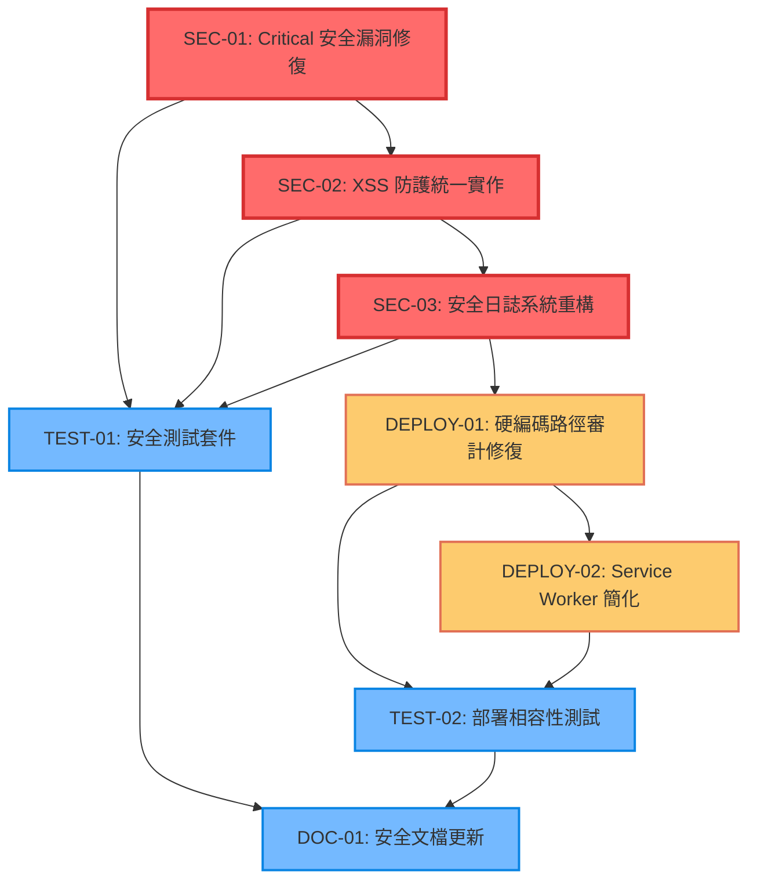

# PWA 安全修復與部署相容性任務分解

---
version: v3.2.1-security-fixes
rev_id: SECURITY-TASK-001
last_updated: 2025-08-08
owners: ["task-breakdown-planner", "security-team"]
---

## 1️⃣ Task Overview

### 服務/模組分組
- **Service**: pwa-card-storage | **Lang**: JavaScript
- **總任務數**: 8 個核心任務
- **Critical Path**: SEC-01 → SEC-02 → SEC-03 → DEPLOY-01 → DEPLOY-02
- **總 CTX-Units**: 6.2 CTX-Units

### Critical Path 與里程碑
```
Week 1: 安全修復 (SEC-01, SEC-02, SEC-03) - 3.8 CTX-Units
Week 2: 部署相容性 (DEPLOY-01, DEPLOY-02) - 1.6 CTX-Units  
Week 3: 測試與驗證 (TEST-01, TEST-02, DOC-01) - 0.8 CTX-Units
```

## 2️⃣ Detailed Task Breakdown

| Task ID | Service | Lang | Task Name | Description | Dependencies | Testing / Acceptance | Security / Accessibility | Effort (CTX-Units) | CTX Map | Context Footprint |
|---------|---------|------|-----------|-------------|--------------|---------------------|--------------------------|--------------------|---------|-------------------|
| SEC-01 | pwa-card-storage | JavaScript | Critical 安全漏洞修復 | 修復 CWE-94 代碼注入和 CWE-502 不安全反序列化 | 無 | **Given** 存在 Critical 安全漏洞<br>**When** 執行安全修復<br>**Then** 移除所有 eval() 使用<br>**And** 實作安全的 JSON 解析<br>**And** 通過 SAST 掃描 | **Security**: 修復 CWE-94, CWE-502<br>**XSS**: 實作輸入清理<br>**Validation**: 嚴格類型檢查 | 1.2 | {"claude-4-sonnet":0.6,"gpt-4.1":0.9} | 修復 2 個 Critical 漏洞，涉及 app.js, storage.js, card-manager.js |
| SEC-02 | pwa-card-storage | JavaScript | XSS 防護統一實作 | 統一實作 XSS 防護和輸入清理機制 | SEC-01 | **Given** 存在多處 XSS 漏洞<br>**When** 實作統一防護<br>**Then** 所有用戶輸入經過清理<br>**And** 所有輸出經過編碼<br>**And** 通過 XSS 測試套件 | **XSS**: sanitizeInput(), sanitizeOutput()<br>**CSP**: 嚴格內容安全政策<br>**Encoding**: HTML 實體編碼 | 1.0 | {"claude-4-sonnet":0.5,"gpt-4.1":0.8} | 實作統一 XSS 防護，覆蓋所有輸入輸出點 |
| SEC-03 | pwa-card-storage | JavaScript | 安全日誌系統重構 | 修復日誌注入漏洞，實作安全日誌記錄 | SEC-02 | **Given** 存在大量日誌注入漏洞<br>**When** 重構日誌系統<br>**Then** 所有日誌輸入經過清理<br>**And** 實作 secureLog() 函數<br>**And** 移除敏感資訊記錄 | **Log Injection**: CWE-117 修復<br>**Data Sanitization**: 日誌內容清理<br>**Privacy**: 避免 PII 洩露 | 1.6 | {"claude-4-sonnet":0.8,"gpt-4.1":1.3} | 修復 40+ 個日誌注入點，實作統一安全日誌 |
| DEPLOY-01 | pwa-card-storage | JavaScript | 硬編碼路徑審計修復 | 修復所有硬編碼路徑，實現靜態托管相容性 | SEC-03 | **Given** 存在 21 個硬編碼路徑問題<br>**When** 執行路徑修復<br>**Then** 所有 `../` 引用被移除<br>**And** 資源複製到 PWA 目錄<br>**And** 通過多平台部署測試 | **Path Traversal**: 防止路徑遍歷<br>**Resource Integrity**: SRI 檢查<br>**HTTPS**: 強制安全傳輸 | 0.8 | {"claude-4-sonnet":0.4,"gpt-4.1":0.6} | 修復 21 個路徑問題，複製 16+ 個資源檔案 |
| DEPLOY-02 | pwa-card-storage | JavaScript | Service Worker 簡化 | 簡化 SW 架構，移除複雜路徑邏輯 | DEPLOY-01 | **Given** SW 包含複雜 BASE_PATH 邏輯<br>**When** 簡化 SW 架構<br>**Then** 使用固定路徑配置<br>**And** 支援環境自動檢測<br>**And** SW 註冊成功率 ≥ 95% | **SW Security**: 安全的快取策略<br>**Origin Policy**: 同源政策檢查<br>**Resource Control**: 資源存取控制 | 0.8 | {"claude-4-sonnet":0.4,"gpt-4.1":0.6} | 重構 SW，簡化路徑邏輯，提升相容性 |
| TEST-01 | pwa-card-storage | JavaScript | 安全測試套件 | 建立完整的安全測試覆蓋 | SEC-01, SEC-02, SEC-03 | **Given** 安全修復已完成<br>**When** 執行安全測試<br>**Then** SAST 掃描通過<br>**And** XSS 測試通過<br>**And** 日誌注入測試通過 | **SAST**: 靜態安全分析<br>**Penetration**: 基礎滲透測試<br>**Compliance**: OWASP 合規檢查 | 0.4 | {"claude-4-sonnet":0.2,"gpt-4.1":0.3} | 建立安全測試套件，驗證修復效果 |
| TEST-02 | pwa-card-storage | JavaScript | 部署相容性測試 | 多平台部署測試和驗證 | DEPLOY-01, DEPLOY-02 | **Given** 部署修復已完成<br>**When** 執行多平台測試<br>**Then** 5 個平台部署成功<br>**And** 功能一致性 ≥ 95%<br>**And** 效能指標達標 | **Platform Security**: 各平台安全配置<br>**HTTPS**: 強制 HTTPS 部署<br>**Headers**: 安全標頭驗證 | 0.2 | {"claude-4-sonnet":0.1,"gpt-4.1":0.2} | 驗證 5 個靜態托管平台的相容性 |
| DOC-01 | pwa-card-storage | JavaScript | 安全文檔更新 | 更新安全文檔和部署指南 | TEST-01, TEST-02 | **Given** 安全修復和測試完成<br>**When** 更新文檔<br>**Then** 安全修復記錄完整<br>**And** 部署指南更新<br>**And** 故障排除指南完善 | **Documentation**: 安全最佳實踐<br>**Compliance**: 合規要求說明<br>**Training**: 安全操作指南 | 0.2 | {"claude-4-sonnet":0.1,"gpt-4.1":0.2} | 更新安全和部署相關文檔 |

## 3️⃣ Test Coverage Plan

### 安全測試矩陣
| 測試類型 | 覆蓋範圍 | 自動化 | 工具 | 目標 |
|---------|---------|--------|------|------|
| SAST 掃描 | 所有 JavaScript 檔案 | ✅ 自動 | CodeQL, ESLint Security | 0 Critical, 0 High |
| XSS 測試 | 所有輸入輸出點 | ✅ 自動 | OWASP ZAP, 自訂測試 | 100% 防護覆蓋 |
| 日誌注入測試 | 所有日誌記錄點 | ✅ 自動 | 自訂測試套件 | 0 注入漏洞 |
| 部署測試 | 5 個靜態托管平台 | ✅ 自動 | CI/CD Pipeline | 100% 部署成功 |
| 效能測試 | Core Web Vitals | ✅ 自動 | Lighthouse CI | LCP ≤ 3s, FID ≤ 100ms |
| 滲透測試 | 關鍵功能 | 🔧 手動 | OWASP Testing Guide | 無高風險漏洞 |

### 測試環境
- **開發環境**: 本地測試，快速反饋
- **預發布環境**: 5 個靜態托管平台並行測試
- **生產環境**: 監控和告警系統

## 4️⃣ Dependency Relationship Diagram



## 5️⃣ CTX-CALC-CONFIG

```html
<!-- CTX-CALC-CONFIG
ctx_baseline_tokens:
  claude-4-sonnet: 200000
  gpt-4.1: 128000
  gpt-4o: 128000
  gemini-2.5-pro: 1000000
formula: "CTX_units[model] = ceil(total_tokens * 1.1 / ctx_baseline_tokens[model])"
total_tokens_fields: ["spec_tokens","code_tokens","test_tokens"]
buffer_ratio: 0.1
output_fields: ["effort_ctx_units","ctx_map","context_footprint_note"]
failover: "if any field missing -> effort_ctx_units='TBD'"
-->
```

## 6️⃣ 安全修復詳細規格

### SEC-01: Critical 安全漏洞修復

**修復範圍**:
- `app.js`: 2 個 CWE-94 代碼注入點 (行 2203-2227, 2415-2422)
- `storage.js`: 1 個 CWE-94 代碼注入點 (行 1481-1482)
- `card-manager.js`: 1 個 CWE-502 不安全反序列化 (行 1181-1187)

**修復策略**:
```javascript
// 修復前 (危險)
eval(userInput); // CWE-94
JSON.parse(untrustedData); // CWE-502

// 修復後 (安全)
const safeEval = (input) => {
  // 使用安全的替代方案
  return Function('"use strict"; return (' + input + ')')();
};

const safeJSONParse = (data) => {
  try {
    const parsed = JSON.parse(data);
    return validateDataStructure(parsed) ? parsed : null;
  } catch (e) {
    secureLog('JSON parse error', { error: e.message });
    return null;
  }
};
```

### SEC-02: XSS 防護統一實作

**實作統一安全函數**:
```javascript
// 統一輸入清理
const sanitizeInput = (input) => {
  if (typeof input !== 'string') return '';
  return input
    .replace(/[<>"'&]/g, (match) => {
      const map = {'<': '&lt;', '>': '&gt;', '"': '&quot;', "'": '&#x27;', '&': '&amp;'};
      return map[match];
    })
    .substring(0, 1000); // 長度限制
};

// 統一輸出編碼
const sanitizeOutput = (text) => {
  return sanitizeInput(text);
};

// DOM 安全插入
const safeSetHTML = (element, content) => {
  element.textContent = content; // 使用 textContent 而非 innerHTML
};
```

### SEC-03: 安全日誌系統重構

**安全日誌函數**:
```javascript
const secureLog = (message, data = {}) => {
  const timestamp = new Date().toISOString();
  const safeMessage = sanitizeInput(message);
  const safeData = Object.keys(data).reduce((acc, key) => {
    const value = data[key];
    if (typeof value === 'string') {
      acc[key] = sanitizeInput(value.substring(0, 100));
    } else if (typeof value === 'object') {
      acc[key] = '[Object]';
    } else {
      acc[key] = String(value).substring(0, 50);
    }
    return acc;
  }, {});
  
  console.log(`[${timestamp}] ${safeMessage}`, safeData);
};
```

## 7️⃣ 部署相容性修復規格

### DEPLOY-01: 硬編碼路徑修復

**資源複製清單** (基於審計報告):
```bash
# 核心資源 (5個)
cp ../assets/moda-logo.svg assets/images/
cp ../assets/high-accessibility.css assets/styles/
cp ../assets/bilingual-common.js assets/scripts/
cp ../assets/qrcode.min.js assets/scripts/
cp ../assets/qr-utils.js assets/scripts/

# 核心安全模組 (3個)
cp ../src/security/SecurityInputHandler.js src/security/
cp ../src/security/SecurityDataHandler.js src/security/
cp ../src/security/SecurityAuthHandler.js src/security/
```

**路徑替換規則**:
```bash
# HTML 檔案路徑更新
sed -i 's|../assets/|./assets/|g' index.html
sed -i 's|../src/security/|./src/security/|g' index.html

# Manifest 檔案路徑更新
sed -i 's|../assets/|./assets/|g' manifest.json
sed -i 's|../assets/|./assets/|g' manifest-github.json
```

### DEPLOY-02: Service Worker 簡化

**簡化後的 SW 架構**:
```javascript
// 簡化的環境檢測
const getBasePath = () => {
  const hostname = location.hostname;
  if (hostname.includes('.github.io')) return '/DB-Card';
  if (hostname.includes('.pages.dev')) return '';
  return '';
};

// 固定快取策略
const CACHE_STRATEGIES = {
  static: 'cache-first',
  dynamic: 'network-first',
  images: 'cache-first'
};
```

## 8️⃣ 驗收標準

### 安全修復驗收
- ✅ SAST 掃描：0 Critical, 0 High 漏洞
- ✅ XSS 測試：100% 輸入輸出點防護
- ✅ 日誌注入：0 注入漏洞
- ✅ 代碼審查：通過安全代碼審查

### 部署相容性驗收
- ✅ 多平台部署：GitHub Pages, Cloudflare Pages, Netlify, Vercel, Firebase
- ✅ 功能一致性：≥ 95% 功能正常
- ✅ 效能指標：LCP ≤ 3s, FID ≤ 100ms
- ✅ SW 註冊：≥ 95% 成功率

### 整體系統驗收
- ✅ 向下相容：100% 現有功能保持
- ✅ 使用者體驗：無感知升級
- ✅ 文檔完整：安全和部署指南更新
- ✅ 監控告警：基本安全監控就位

---

**任務分解完成日期**: 2025-08-08  
**預計完成時間**: 3 週  
**負責團隊**: PWA Security Team, DevOps Team  
**下一步**: 開始執行 SEC-01 Critical 安全漏洞修復