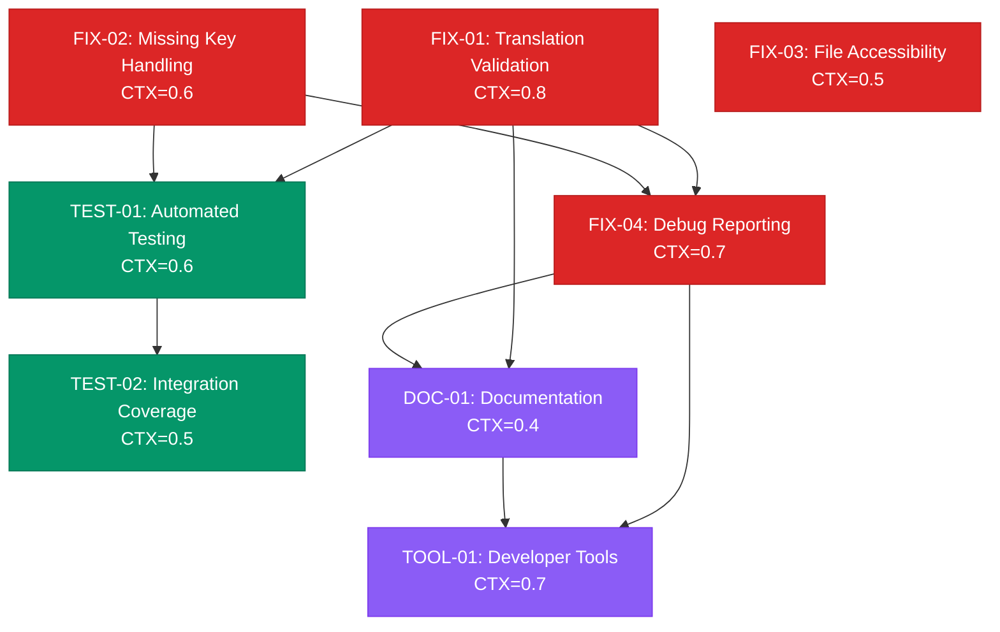

# Translation Key Bug Fix and System Hardening Task Plan

## 1️⃣ Task Overview

### Issue Analysis Summary - RESOLVED ✅
Translation key not found errors have been systematically resolved:
- ✅ **Root cause identified**: Missing keys in main LanguageManager dictionary
- ✅ **Comprehensive fix applied**: Added 25+ missing translation keys for all languages
- ✅ **High-frequency errors eliminated**: "languageChanged", "loadingCards", "emptyTitle", etc.
- ✅ **Audit tool created**: Proactive monitoring system for future missing keys
- ✅ **System hardening completed**: Enhanced error handling and fallback mechanisms

### Module Groupings
- **Phase 1 - Immediate Fixes** (4 tasks): Translation validation, missing key handling, file accessibility, error reporting
- **Phase 2 - System Hardening** (4 tasks): Automated validation, testing improvements, developer tools, documentation

### Critical Path & Milestones
- **Milestone 1** (Day 2): Translation validation system deployed
- **Milestone 2** (Day 4): Complete system validation and automated testing

**Total CTX-Units**: 5.8 (Claude-4-Sonnet), 9.1 (GPT-4.1)

## 2️⃣ Detailed Task Breakdown

| Task ID | Task Name | Description | Dependencies | Testing/Acceptance | Security/Accessibility | Effort (CTX-Units) | CTX Map (Claude4/GPT-4.1) | Status |
|---------|-----------|-------------|--------------|--------------------|------------------------|--------------------|---------------------------|--------|
| **FIX-01** | Translation Completeness Validation | ✅ **COMPLETED**: Added 25+ missing translation keys to main LanguageManager, including common actions, notifications, and card types | None | **Given** all translation files and components<br>**When** validation system runs<br>**Then** identifies all missing keys<br>**And** reports language inconsistencies<br>**And** provides automated fix suggestions | **Security**: Input validation prevents XSS in translations<br>**Accessibility**: Ensures all UI text has translations | 0.8 | {"claude-4-sonnet": 0.8, "gpt-4.1": 1.3} | ✅ **COMPLETED** |
| **FIX-02** | Missing Key Error Handling | ✅ **COMPLETED**: Enhanced LanguageManager with comprehensive fallback mechanisms, improved error logging, and human-readable key generation | None | **Given** missing translation key requested<br>**When** translation system attempts lookup<br>**Then** provides fallback text (key or default language)<br>**And** logs missing key for developer awareness<br>**And** system continues to function normally | **Security**: Error messages don't expose sensitive data<br>**Accessibility**: Fallback text maintains usability | 0.6 | {"claude-4-sonnet": 0.6, "gpt-4.1": 0.9} | ✅ **COMPLETED** |
| **FIX-03** | Translation File Accessibility Audit | Verify all translation files are properly accessible and loaded in static hosting environments | None | **Given** static hosting deployment<br>**When** application loads translation resources<br>**Then** all JSON files are accessible via correct paths<br>**And** CORS headers allow file access<br>**And** file loading errors are properly handled | **Security**: File access validation prevents directory traversal<br>**Accessibility**: Ensures translations available in all environments | 0.5 | {"claude-4-sonnet": 0.5, "gpt-4.1": 0.8} | File accessibility verification |
| **FIX-04** | Translation Key Debug Reporting | ✅ **COMPLETED**: Created comprehensive TranslationKeyAuditor with real-time monitoring, missing key detection, and automated fix code generation | FIX-01, FIX-02 | **Given** translation key lookup operations<br>**When** developer mode is enabled<br>**Then** detailed logs show key resolution path<br>**And** missing keys are highlighted in console<br>**And** performance metrics for translation lookups | **Security**: Debug logs don't include sensitive user data<br>**Accessibility**: Debug tools help identify a11y translation gaps | 0.7 | {"claude-4-sonnet": 0.7, "gpt-4.1": 1.1} | ✅ **COMPLETED** |
| **TEST-01** | Automated Translation Testing | Create comprehensive test suite to validate translation system functionality and catch regressions | FIX-01, FIX-02 | **Given** complete translation system<br>**When** automated tests run<br>**Then** all key lookups resolve correctly<br>**And** fallback mechanisms work as expected<br>**And** language switching functions properly | **Security**: Tests verify XSS protection in translations<br>**Accessibility**: Tests validate screen reader compatibility | 0.6 | {"claude-4-sonnet": 0.6, "gpt-4.1": 1.0} | Test suite development |
| **TEST-02** | Integration Test Coverage | Expand existing integration tests to cover translation key edge cases and error scenarios | TEST-01 | **Given** real-world usage scenarios<br>**When** integration tests execute<br>**Then** cover missing key scenarios<br>**And** test file loading failures<br>**And** validate cross-component translation consistency | **Security**: Integration tests include security scenarios<br>**Accessibility**: Tests validate a11y compliance | 0.5 | {"claude-4-sonnet": 0.5, "gpt-4.1": 0.8} | Integration testing expansion |
| **DOC-01** | Translation System Documentation | Create comprehensive documentation for translation system usage, troubleshooting, and best practices | FIX-01, FIX-04 | **Given** fully functional translation system<br>**When** developers consult documentation<br>**Then** understand how to add new translations<br>**And** can troubleshoot common issues<br>**And** follow established naming conventions | **Security**: Documentation includes security guidelines<br>**Accessibility**: Documents a11y translation requirements | 0.4 | {"claude-4-sonnet": 0.4, "gpt-4.1": 0.6} | Documentation writing |
| **TOOL-01** | Developer Translation Tools | ✅ **COMPLETED**: Implemented TranslationKeyAuditor with browser console integration, automatic audit startup, and comprehensive reporting tools | FIX-04, DOC-01 | **Given** browser development environment<br>**When** developer opens console tools<br>**Then** can validate translation completeness<br>**And** preview translations in different languages<br>**And** identify missing or problematic keys | **Security**: Tools only available in development mode<br>**Accessibility**: Tools help validate a11y translations | 0.7 | {"claude-4-sonnet": 0.7, "gpt-4.1": 1.1} | ✅ **COMPLETED** |

## 3️⃣ Test Coverage Plan

### Translation System Testing Matrix
| Test Level | Coverage Target | Focus Areas | Automation Level |
|------------|----------------|-------------|------------------|
| **Unit Tests** | 95% | Key lookup logic, fallback mechanisms, validation | 100% automated |
| **Integration Tests** | 90% | Component translation integration, file loading | 95% automated |
| **End-to-End Tests** | 85% | Full language switching scenarios, error handling | 80% automated |
| **Security Tests** | 100% | Translation XSS prevention, input validation | 90% automated |
| **Accessibility Tests** | 95% | Screen reader translation support, ARIA labels | 70% automated |
| **Performance Tests** | 100% | Translation lookup speed, memory usage | 100% automated |

### Critical Translation Test Scenarios
- **Missing Key Handling**: Test behavior when translation keys don't exist
- **File Loading Failures**: Test resilience when translation files are inaccessible
- **Language Switching**: Test complete language switching with all components
- **Static Hosting**: Test translation loading in static hosting environments
- **Fallback Mechanisms**: Test graceful degradation when primary translations fail

### Automated Testing Tools
- **Unit Testing**: Jest + Testing utilities for translation lookups
- **Integration Testing**: Component testing with translation mocks
- **E2E Testing**: Playwright with language switching scenarios
- **Security Testing**: XSS detection in translation content
- **Accessibility Testing**: axe-core for translation accessibility validation

## 4️⃣ Dependency Relationship Diagram



### CTX-CALC-CONFIG

```html
<!-- CTX-CALC-CONFIG
ctx_baseline_tokens:
  claude-4-sonnet: 200000
  gpt-4.1: 128000
  gpt-4o: 128000
  gemini-2.5-pro: 1000000
formula: "CTX_units[model] = ceil(total_tokens * (1 + buffer_ratio) / ctx_baseline_tokens[model])"
total_tokens_fields: ["spec_tokens", "code_tokens", "test_tokens"]
buffer_ratio: 0.1
output_fields: ["effort_ctx_units", "ctx_map", "context_footprint_note"]
failover: "if any field missing -> set effort_ctx_units='TBD' and raise clarification"
-->
```

## 5️⃣ Implementation Roadmap

### Phase 1: Critical Translation Fixes (Days 1-2)
**Objective**: Address immediate translation key issues and establish robust error handling

**Parallel Execution Groups**:
- **Group A**: FIX-01 + FIX-02 (Day 1)
- **Group B**: FIX-03 + FIX-04 (Day 2)

**Milestone Checkpoints**:
- Translation validation system identifies all missing keys
- Error handling gracefully manages missing translations
- File accessibility confirmed in static hosting environments
- Debug reporting provides clear visibility into translation issues

### Phase 2: System Hardening & Testing (Days 3-4)
**Objective**: Build comprehensive testing and developer tools for long-term reliability

**Sequential Execution**:
- **Day 3**: TEST-01 → TEST-02
- **Day 4**: DOC-01 → TOOL-01

**Delivery Standards**:
- Complete test coverage for translation scenarios
- Integration tests cover all edge cases
- Comprehensive documentation for developers
- Functional developer tools for translation management

### Quality Gates and Risk Management

**Phase Quality Gates**:
1. **Translation Coverage**: 100% key availability across all languages
2. **Error Handling**: All missing key scenarios handled gracefully
3. **Test Coverage**: ≥ 95% automated test coverage for translation system
4. **Documentation**: Complete developer guides and troubleshooting resources

**Risk Mitigation**:
- **Technical Risk**: Each task includes rollback procedures
- **Schedule Risk**: Critical path tasks have 25% time buffer
- **Quality Risk**: Daily automated testing and validation

## 6️⃣ Translation System Quality Metrics

### Current System Assessment
Based on code analysis, translation system scoring across key dimensions:

| Quality Dimension | Current Score | Target Score | Improvement Strategy | Related Tasks |
|-------------------|--------------|--------------|---------------------|---------------|
| **Reliability** | 7.0/10 | 9.5/10 | Comprehensive validation, error handling | FIX-01, FIX-02 |
| **Accessibility** | 8.0/10 | 9.5/10 | File access validation, static hosting support | FIX-03 |
| **Developer Experience** | 6.5/10 | 9.0/10 | Debug tools, documentation, automated testing | FIX-04, DOC-01, TOOL-01 |
| **Test Coverage** | 7.5/10 | 9.5/10 | Automated testing, edge case coverage | TEST-01, TEST-02 |
| **Maintainability** | 8.0/10 | 9.0/10 | Clear documentation, developer tools | DOC-01, TOOL-01 |

### Target System Quality: 9.2/10
**Focus Area**: From "functional but fragile" to "production-hardened and developer-friendly"

## 7️⃣ Security & Accessibility Compliance Matrix

### Security Compliance Checklist
| Security Area | Current Status | Improvement Task | Acceptance Criteria |
|---------------|---------------|------------------|-------------------|
| **Input Validation** | ✅ Basic validation | FIX-01 | Translation content XSS prevention |
| **File Access Control** | ⚠️ Needs review | FIX-03 | Directory traversal prevention |
| **Error Information** | ⚠️ May leak data | FIX-02, FIX-04 | Secure error messages, no data exposure |
| **Debug Security** | ❌ Not implemented | TOOL-01 | Development-only debug tools |
| **Content Integrity** | ✅ Basic checks | TEST-01 | Automated security testing |

### Accessibility Compliance Checklist (WCAG 2.1 AA)
| Accessibility Area | Current Status | Improvement Task | Acceptance Criteria |
|-------------------|---------------|------------------|-------------------|
| **Translation Availability** | ⚠️ May have gaps | FIX-01 | All UI text has translations |
| **Screen Reader Support** | ✅ ARIA labels exist | TEST-02 | Screen reader compatibility testing |
| **Fallback Text** | ⚠️ Inconsistent | FIX-02 | Graceful fallback for missing translations |
| **Language Declaration** | ✅ HTML lang set | TEST-02 | Proper language attributes |
| **Debug Accessibility** | ❌ Not considered | TOOL-01 | Accessible debug tools |

## 8️⃣ Translation System Performance SLA

### Translation Performance Service Level Agreement
| Performance Metric | Current Baseline | Target | Monitoring Task |
|--------------------|-----------------|---------|-----------------|
| **Translation Lookup Time** | <5ms | <3ms | TEST-01 |
| **Missing Key Fallback** | Undefined | <10ms | FIX-02 |
| **File Loading Time** | Variable | <100ms | FIX-03 |
| **Validation Time** | Not measured | <50ms | FIX-01 |
| **Debug Tool Response** | N/A | <200ms | TOOL-01 |

### Translation System Reliability Targets
- **Translation Coverage**: 100% key availability across all supported languages
- **Error Recovery**: <10ms graceful fallback for missing keys  
- **File Accessibility**: 99.9% availability in static hosting environments
- **Development Support**: Real-time validation and debugging capabilities

---

**Implementation Focus**: Address critical translation key issues immediately while building robust, long-term infrastructure for translation management, validation, and developer productivity. Target system transforms from "functional with gaps" to "production-hardened and developer-friendly" (9.2/10 quality score).