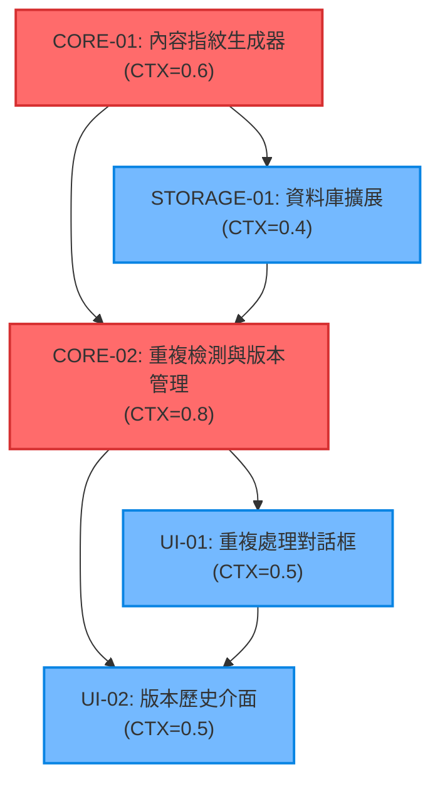

# 名片版本管理與重複識別任務拆解文檔

## 1️⃣ Task Overview

### 模組分組摘要
- **CORE 模組**：內容指紋生成與重複檢測核心邏輯 (2 任務)
- **UI 模組**：版本管理介面與重複處理對話框 (2 任務)  
- **STORAGE 模組**：資料庫擴展與版本清理功能 (1 任務)

### Critical Path 與里程碑
```
CORE-01 → STORAGE-01 → CORE-02 → UI-01 → UI-02
```

**里程碑**：
- **M1**: 基礎指紋與儲存機制完成 (1.2 CTX-Units)
- **M2**: 重複檢測邏輯完成 (2.0 CTX-Units)  
- **M3**: 完整版本管理功能上線 (2.8 CTX-Units)

## 2️⃣ Detailed Task Breakdown

| Task ID | Task Name | Description | Dependencies | Testing/Acceptance | Security/Accessibility | Effort (CTX-Units) | CTX Map (Claude4/GPT-4.1) | Context Footprint Note |
|---------|-----------|-------------|--------------|--------------------|------------------------|--------------------|---------------------------|------------------------|
| CORE-01 | 內容指紋生成器實作 | 實作 ContentFingerprintGenerator 類別，支援 name+email SHA-256 指紋生成與雙語標準化 | 無 | **Given** 名片資料包含姓名和電子郵件<br>**When** 調用 generateFingerprint()<br>**Then** 生成 fingerprint_[64字元hash] 格式指紋<br>**And** 支援雙語格式標準化 | **輸入驗證**: 清理特殊字元和空值<br>**加密**: 使用 Web Crypto API SHA-256<br>**錯誤處理**: 指紋生成失敗時使用備用算法 | 0.6 | {"claude-4-sonnet": 0.6, "gpt-4.1": 0.9} | 包含演算法實作、測試案例、錯誤處理 |
| STORAGE-01 | 資料庫 Schema 擴展 | 擴展 PWACardStorage，新增 fingerprint 欄位與索引，升級資料庫版本至 v3 | CORE-01 | **Given** 現有 IndexedDB 結構<br>**When** 執行資料庫升級<br>**Then** 新增 fingerprint 欄位和索引<br>**And** 保持 100% 向下相容性 | **資料完整性**: 事務性升級確保一致性<br>**授權檢查**: 資料庫操作權限驗證<br>**稽核日誌**: 記錄升級操作但不洩露 PII | 0.4 | {"claude-4-sonnet": 0.4, "gpt-4.1": 0.6} | 資料庫升級腳本、相容性測試 |
| CORE-02 | 重複檢測與版本管理 | 實作 DuplicateDetector 和 VersionManager，支援重複檢測、版本遞增、歷史管理 | CORE-01, STORAGE-01 | **Given** 匯入名片資料<br>**When** 檢測到相同指紋<br>**Then** 自動遞增版本號 (1.0→1.1→1.2)<br>**And** 建立版本快照並清理舊版本 | **業務邏輯驗證**: 防止版本衝突和資料競爭<br>**最小權限**: 版本操作需明確授權<br>**錯誤不洩密**: 安全的錯誤訊息處理 | 0.8 | {"claude-4-sonnet": 0.8, "gpt-4.1": 1.0} | 複雜業務邏輯、併發處理、版本算法 |
| UI-01 | 重複處理對話框 | 實作匯入時重複名片處理 UI，支援跳過/覆蓋/新版本選項與批量處理 | CORE-02 | **Given** 檢測到重複名片<br>**When** 顯示處理對話框<br>**Then** 提供清楚的選項和預覽<br>**And** 支援批量處理模式 | **可及性**: WCAG 2.1 AA 標準，支援鍵盤操作<br>**認知負荷**: 清楚標籤和預設選項<br>**輸入驗證**: 使用者選擇的安全驗證 | 0.5 | {"claude-4-sonnet": 0.5, "gpt-4.1": 0.8} | UI 元件、互動邏輯、可及性測試 |
| UI-02 | 版本歷史管理介面 | 實作版本歷史查看、比較、還原功能，整合到現有 PWA 介面 | CORE-02, UI-01 | **Given** 名片存在多個版本<br>**When** 點擊版本歷史按鈕<br>**Then** 顯示版本列表和統計<br>**And** 支援版本比較和還原操作 | **可及性**: 螢幕閱讀器支援，高對比度設計<br>**認知負荷**: 直覺的版本時間軸設計<br>**授權檢查**: 版本還原操作權限控制 | 0.5 | {"claude-4-sonnet": 0.5, "gpt-4.1": 0.8} | 版本 UI 元件、比較算法、還原邏輯 |

## 3️⃣ Test Coverage Plan

### Unit Testing (自動化)
- **CORE-01**: 指紋生成算法一致性、雙語標準化、邊界條件測試
- **CORE-02**: 重複檢測準確率、版本遞增邏輯、併發安全性測試
- **STORAGE-01**: 資料庫升級、索引效能、事務完整性測試

### Integration Testing (自動化)
- **匯入流程整合**: CORE-01 + CORE-02 + UI-01 端到端測試
- **版本管理整合**: CORE-02 + UI-02 + STORAGE-01 整合測試
- **PWA 相容性**: 與現有 PWACardManager 和 PWACardStorage 整合測試

### E2E Testing (半自動化)
- **完整使用者旅程**: 匯入重複名片 → 處理選擇 → 版本管理 → 歷史查看
- **大量資料測試**: 1000+ 名片的重複檢測效能測試
- **錯誤恢復測試**: 異常中斷後的資料一致性驗證

### Security Testing (手動)
- **指紋碰撞測試**: SHA-256 安全性驗證
- **權限邊界測試**: 未授權版本操作的阻擋測試
- **資料洩露測試**: 日誌和錯誤訊息的 PII 洩露檢查

### Accessibility Testing (手動)
- **WCAG 2.1 AA 合規**: 鍵盤導航、螢幕閱讀器、色彩對比度測試
- **認知負荷評估**: 新使用者完成版本管理任務的成功率測試

## 4️⃣ Dependency Relationship Diagram



### CTX-CALC-CONFIG

```html
<!-- CTX-CALC-CONFIG
ctx_baseline_tokens:
  claude-4-sonnet: 200000
  gpt-4.1: 128000
  gpt-4o: 128000
  gemini-2.5-pro: 1000000
formula: "CTX_units[model] = ceil(total_tokens * (1 + buffer_ratio) / ctx_baseline_tokens[model])"
total_tokens_fields: ["spec_tokens", "code_tokens", "test_tokens"]
buffer_ratio: 0.1
output_fields: ["effort_ctx_units", "ctx_map", "context_footprint_note"]
failover: "if any field missing -> set effort_ctx_units='TBD' and raise clarification"
-->
```

## 5️⃣ Implementation Notes

### 關鍵技術決策
1. **指紋算法**: 使用 SHA-256 而非 MD5，確保安全性和唯一性
2. **版本格式**: 採用語義化版本 (1.0, 1.1, 1.2) 而非時間戳，提升可讀性
3. **資料庫升級**: 漸進式升級策略，確保零停機時間
4. **UI 整合**: 複用現有 PWA 元件系統，保持設計一致性

### 風險緩解策略
- **指紋碰撞**: 極低機率 (2^-256)，提供備用算法作為降級方案
- **效能影響**: 指紋生成 ≤100ms，重複檢測 ≤200ms，符合效能需求
- **資料遷移**: 背景任務處理現有資料，不影響使用者操作
- **向下相容**: 保持現有 API 不變，新功能通過可選參數提供

### 成功標準
- **功能正確性**: 重複檢測準確率 ≥95%，版本管理無資料遺失
- **效能達標**: 指紋生成 ≤100ms，版本歷史載入 ≤500ms
- **使用者體驗**: 新功能學習成本 ≤5分鐘，操作成功率 ≥90%
- **安全合規**: 通過所有安全測試，無 PII 洩露風險