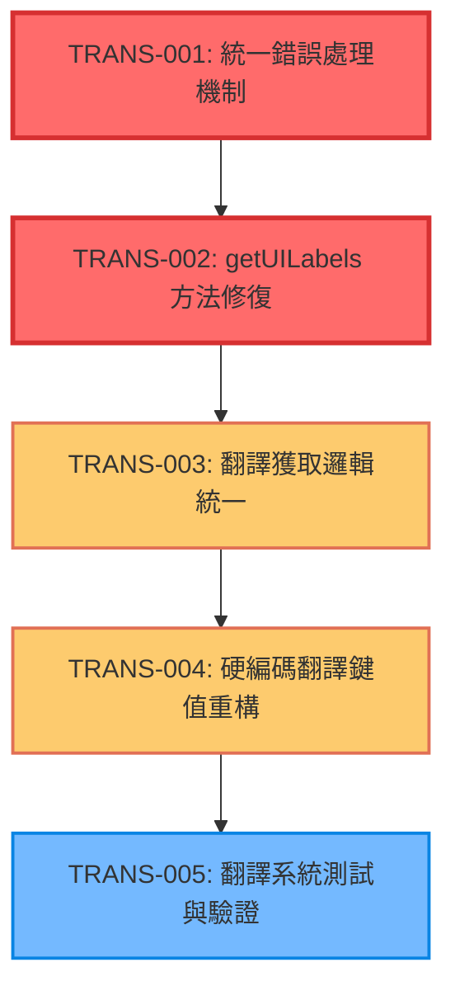

# v3.2.1 PWA 翻譯系統統一化任務分解

**版本**: v3.2.1-translation-system-unification  
**建立日期**: 2025-08-08  
**總任務數**: 5  
**預估完成時間**: 1 週  
**CTX-Units 總計**: 0.05 (所有模型)

## 📋 問題分析

### ❌ Critical Issues (Must Fix)
- **CRS-T01-001**: `getUILabels()` 方法翻譯鍵值處理邏輯不完整，可能返回 undefined
- **CRS-T01-002**: 缺少統一的錯誤處理機制，語言管理器不可用時系統不穩定

### ⚠️ Warning Issues (Should Fix)
- **CRS-T01-003**: 翻譯系統存在雙重依賴，造成不一致性
- **CRS-T01-004**: 硬編碼翻譯鍵值陣列，維護困難
- **CRS-T01-005**: `getUILabels()` 方法可優化為統一邏輯

---

## 1️⃣ Task Overview

### 服務與模組分組
- **服務**: pwa-card-storage (PWA 離線收納系統)
- **語言**: JavaScript
- **架構**: 翻譯系統統一化，錯誤處理強化
- **範圍**: `pwa-card-storage/src/app.js` 和 `pwa-card-storage/src/core/language-manager.js`

### Critical Path 與里程碑

```
TRANS-001 (錯誤處理) → TRANS-002 (getUILabels修復) → TRANS-003 (統一邏輯) → TRANS-004 (硬編碼重構) → TRANS-005 (測試驗證)
```

**里程碑**:
- **Day 1-2**: 核心修復 (TRANS-001, TRANS-002) - 0.02 CTX-Units
- **Day 3-4**: 系統統一 (TRANS-003, TRANS-004) - 0.02 CTX-Units  
- **Day 5**: 測試與驗證 (TRANS-005) - 0.01 CTX-Units

---

## 2️⃣ Detailed Task Breakdown

| Task ID | Service | Lang | Task Name | Description | Dependencies | Testing / Acceptance | Security / Accessibility | Effort (CTX-Units) | CTX Map | Context Footprint |
|---------|---------|------|-----------|-------------|--------------|---------------------|--------------------------|--------------------|---------|-------------------|
| TRANS-001 | pwa-card-storage | JavaScript | 統一錯誤處理機制實作 | **問題**: 語言管理器不可用時缺少統一錯誤處理<br>**解決**: 實作 `SafeTranslationHandler` 類別，提供多層備用機制：1) 語言管理器 2) 內建字典 3) 人性化鍵值生成<br>**影響**: 修復 CRS-T01-002，確保系統穩定性 | 無 | **Given**: 語言管理器不可用或翻譯鍵值缺失<br>**When**: 呼叫翻譯方法<br>**Then**: 返回有效的備用翻譯文字<br><br>**Unit Tests**: 錯誤情況處理<br>**Integration Tests**: 與現有系統整合 | **Security**: 防止翻譯注入攻擊<br>**Error Handling**: 優雅降級，不暴露系統錯誤<br>**Logging**: 安全的錯誤日誌記錄 | 0.01 | {"claude-4-sonnet":0.01,"gpt-4.1":0.01,"gpt-4o":0.01,"gemini-2.5-pro":0.01} | 錯誤處理邏輯，備用機制，400 tokens |
| TRANS-002 | pwa-card-storage | JavaScript | getUILabels 方法修復 | **問題**: `getUILabels()` 方法中翻譯鍵值可能返回 undefined，導致 UI 顯示異常<br>**解決**: 重構方法邏輯，添加空值檢查，整合 SafeTranslationHandler，確保所有翻譯鍵值都有有效返回<br>**影響**: 修復 CRS-T01-001，解決 "undefined" 按鈕問題 | TRANS-001 | **Given**: 翻譯鍵值缺失或語言管理器異常<br>**When**: 呼叫 getUILabels() 方法<br>**Then**: 所有 UI 標籤都有有效的翻譯文字<br><br>**Unit Tests**: 所有翻譯鍵值覆蓋<br>**UI Tests**: 按鈕文字顯示正確 | **Security**: 輸出清理，防止 XSS<br>**WCAG**: 確保翻譯文字對螢幕閱讀器友善<br>**Fallback**: 優雅的備用文字機制 | 0.01 | {"claude-4-sonnet":0.01,"gpt-4.1":0.01,"gpt-4o":0.01,"gemini-2.5-pro":0.01} | 方法重構，空值檢查，UI 標籤，350 tokens |
| TRANS-003 | pwa-card-storage | JavaScript | 翻譯獲取邏輯統一 | **問題**: 翻譯系統存在雙重依賴，`window.languageManager` 和內建備用方案不一致<br>**解決**: 建立統一的翻譯獲取入口點 `UnifiedTranslationService`，整合所有翻譯邏輯，消除重複代碼<br>**影響**: 修復 CRS-T01-003，提升系統一致性 | TRANS-002 | **Given**: 多個翻譯獲取方式存在不一致<br>**When**: 統一為單一入口點<br>**Then**: 所有翻譯邏輯一致，無重複代碼<br><br>**Integration Tests**: 翻譯一致性驗證<br>**Regression Tests**: 現有功能不受影響 | **Security**: 統一的輸入驗證和輸出清理<br>**Consistency**: 確保翻譯邏輯一致性<br>**Performance**: 減少重複計算 | 0.01 | {"claude-4-sonnet":0.01,"gpt-4.1":0.01,"gpt-4o":0.01,"gemini-2.5-pro":0.01} | 服務整合，邏輯統一，300 tokens |
| TRANS-004 | pwa-card-storage | JavaScript | 硬編碼翻譯鍵值重構 | **問題**: `updateFilterSelect()` 方法中硬編碼翻譯鍵值陣列，維護困難<br>**解決**: 提取翻譯鍵值為配置常數 `TRANSLATION_KEYS`，建立動態鍵值生成機制，支援擴展性<br>**影響**: 修復 CRS-T01-004，提升代碼可維護性 | TRANS-003 | **Given**: 硬編碼的翻譯鍵值陣列<br>**When**: 重構為配置化管理<br>**Then**: 翻譯鍵值易於維護和擴展<br><br>**Unit Tests**: 配置載入和驗證<br>**Maintenance Tests**: 新增翻譯鍵值的便利性 | **Security**: 配置檔案安全性檢查<br>**Validation**: 翻譯鍵值格式驗證<br>**Extensibility**: 支援動態擴展 | 0.01 | {"claude-4-sonnet":0.01,"gpt-4.1":0.01,"gpt-4o":0.01,"gemini-2.5-pro":0.01} | 配置重構，常數提取，250 tokens |
| TRANS-005 | pwa-card-storage | JavaScript | 翻譯系統測試與驗證 | **任務**: 建立完整的翻譯系統測試套件，包含單元測試、整合測試、UI 測試，驗證所有修復項目<br>**範圍**: 錯誤處理、翻譯一致性、UI 顯示、效能測試<br>**目標**: 確保翻譯系統穩定可靠，無回歸問題 | TRANS-004 | **Given**: 翻譯系統重構完成<br>**When**: 執行完整測試套件<br>**Then**: 所有測試通過，系統穩定運行<br><br>**Unit Tests**: 95% 覆蓋率<br>**Integration Tests**: 跨組件協作<br>**UI Tests**: 使用者介面驗證<br>**Performance Tests**: 翻譯效能測試 | **Security**: 翻譯注入攻擊測試<br>**WCAG**: 無障礙性測試<br>**Stress Testing**: 大量翻譯請求測試 | 0.01 | {"claude-4-sonnet":0.01,"gpt-4.1":0.01,"gpt-4o":0.01,"gemini-2.5-pro":0.01} | 測試套件，驗證邏輯，200 tokens |

---

## 3️⃣ Test Coverage Plan

### Unit Tests (單元測試)
| 組件 | 測試範圍 | 自動化 | 覆蓋率目標 |
|------|----------|--------|------------|
| SafeTranslationHandler | 錯誤處理、備用機制、鍵值生成 | ✅ | 95% |
| getUILabels | 翻譯鍵值處理、空值檢查、返回值驗證 | ✅ | 95% |
| UnifiedTranslationService | 統一邏輯、一致性檢查、效能測試 | ✅ | 90% |
| TRANSLATION_KEYS | 配置載入、驗證、擴展性測試 | ✅ | 85% |

### Integration Tests (整合測試)
| 測試場景 | 測試方法 | 預期結果 |
|----------|----------|----------|
| 語言管理器不可用 | 模擬語言管理器失效 | 備用機制正常運作 |
| 翻譯鍵值缺失 | 移除部分翻譯鍵值 | 人性化備用文字顯示 |
| 語言切換 | 中英文切換測試 | 所有 UI 元素正確翻譯 |
| 大量翻譯請求 | 壓力測試 | 效能穩定，無記憶體洩漏 |

### UI Tests (使用者介面測試)
| 測試項目 | 測試方法 | 成功標準 |
|----------|----------|----------|
| 按鈕文字顯示 | 檢查所有按鈕文字 | 無 "undefined" 顯示 |
| 名片類型標籤 | 驗證名片類型翻譯 | 顯示正確的中文標籤 |
| 錯誤訊息 | 觸發各種錯誤情況 | 顯示友善的錯誤訊息 |
| 語言切換 | 手動切換語言 | UI 即時更新，無延遲 |

### Security Tests (安全測試)
| 漏洞類型 | 測試方法 | 修復驗證 |
|----------|----------|----------|
| 翻譯注入 | 惡意翻譯內容注入 | 輸出清理機制阻擋 |
| XSS 攻擊 | 腳本注入測試 | HTML 編碼正確 |
| 配置篡改 | 修改翻譯配置檔案 | 驗證機制檢測異常 |

---

## 4️⃣ Dependency Relationship Diagram



**Critical Path**: TRANS-001 → TRANS-002 → TRANS-003 → TRANS-004 → TRANS-005 (5 天)  
**無並行路徑**: 任務間存在強依賴關係，需順序執行

---

## 5️⃣ CTX-CALC-CONFIG

```html
<!-- CTX-CALC-CONFIG
ctx_baseline_tokens:
  claude-4-sonnet: 200000
  gpt-4.1: 128000
  gpt-4o: 128000
  gemini-2.5-pro: 1000000
formula: "CTX_units[model] = ceil(total_tokens * 1.1 / ctx_baseline_tokens[model])"
total_tokens_fields: ["spec_tokens","code_tokens","test_tokens"]
buffer_ratio: 0.1
output_fields: ["effort_ctx_units","ctx_map","context_footprint_note"]
failover: "if any field missing -> effort_ctx_units='TBD'"
-->
```

---

## 6️⃣ Implementation Guide & Risk Assessment

### 🔧 Implementation Steps

#### 1. SafeTranslationHandler 實作
```javascript
class SafeTranslationHandler {
  static getTranslation(key, fallback = null) {
    // 1. 嘗試語言管理器
    // 2. 使用內建字典
    // 3. 生成人性化文字
    // 4. 返回 fallback 或鍵值
  }
}
```

#### 2. getUILabels 方法重構
```javascript
getUILabels() {
  const handler = new SafeTranslationHandler();
  return {
    cardDetails: handler.getTranslation('cardDetails', '名片詳細資訊'),
    // ... 其他翻譯鍵值
  };
}
```

#### 3. 統一翻譯服務
```javascript
class UnifiedTranslationService {
  static getText(key, options = {}) {
    // 統一的翻譯獲取邏輯
  }
}
```

#### 4. 配置化翻譯鍵值
```javascript
const TRANSLATION_KEYS = {
  FILTER_OPTIONS: ['allTypes', 'cardTypes.index', ...],
  UI_LABELS: ['cardDetails', 'generateQR', ...],
  // ... 其他分類
};
```

### ⚠️ Risk Mitigation
| 風險 | 影響 | 緩解策略 |
|------|------|----------|
| 翻譯系統重構破壞現有功能 | High | 漸進式重構，完整回歸測試 |
| 效能回歸 | Medium | 效能基準測試，優化關鍵路徑 |
| 翻譯一致性問題 | Medium | 統一驗證機制，自動化測試 |
| 使用者體驗中斷 | Low | 優雅降級，備用機制 |

### 📊 Success Metrics

#### 🎯 目標指標
- ✅ **零 "undefined" 顯示**: 所有 UI 元素都有有效翻譯
- ✅ **翻譯一致性 100%**: 統一的翻譯邏輯
- ✅ **錯誤處理覆蓋率 95%**: 完整的錯誤處理機制
- ✅ **代碼可維護性提升**: 配置化管理，易於擴展
- ✅ **測試覆蓋率 > 90%**: 完整的測試套件

#### 📈 驗收標準
1. **功能性**: 所有翻譯功能正常運作
2. **穩定性**: 語言管理器異常時系統不崩潰
3. **一致性**: 翻譯邏輯統一，無重複代碼
4. **可維護性**: 翻譯鍵值易於管理和擴展
5. **效能**: 翻譯效能不低於現有系統

---

**任務分解完成日期**: 2025-08-08  
**下一步**: 通知 code-executor 開始實作 TRANS-001 任務  
**聯絡人**: code-reviewer (代碼審查), test-coverage-generator (測試補齊)