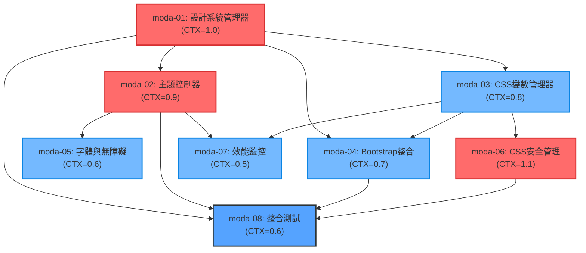

# PWA 數位發展部設計系統對齊實作任務清單

## 1️⃣ Task Overview

### 總任務摘要
- **總任務數**: 8 個主要任務
- **模組分組**: 設計系統核心 (4個)、整合層 (2個)、品質保證 (2個)
- **預估總工作量**: 6.2 CTX-Units
- **關鍵路徑**: moda-01 → moda-02 → moda-04 → moda-06 (4.1 CTX-Units)

### 主要里程碑
1. **Phase 1 - 核心系統** (2.8 CTX-Units): moda-01, moda-02, moda-03
2. **Phase 2 - 整合測試** (2.1 CTX-Units): moda-04, moda-05, moda-07
3. **Phase 3 - 品質驗證** (1.3 CTX-Units): moda-06, moda-08

## 2️⃣ Detailed Task Breakdown

| Task ID | Task Name | Description | Dependencies | Testing/Acceptance | Security/Accessibility | Effort (CTX-Units) | CTX Map (Claude4/GPT-4.1) | Context Footprint Note |
|---------|-----------|-------------|--------------|--------------------|------------------------|--------------------|---------------------------|------------------------|
| moda-01 | moda設計系統管理器實作 | 實作modaDesignSystemManager核心類別，負責設計系統初始化、設計令牌載入和CSS變數應用 | 無 | Given PWA啟動時 When 呼叫initialize() Then 設計系統在500ms內完成載入 And 所有CSS變數正確應用 | CSS注入防護、變數名稱驗證、安全載入機制 | 1.0 | {"claude-4-sonnet": 1.0, "gpt-4.1": 1.6} | 包含TypeScript介面定義、設計令牌載入邏輯、錯誤處理機制 |
| moda-02 | 主題控制器與深色模式 | 實作ThemeController，支援light/dark/auto主題切換，包含系統偏好檢測和主題切換動畫 | moda-01 | Given 使用者點擊主題切換 When 執行switchTheme() Then 主題在200ms內完成切換 And 動畫流暢無閃爍 | 主題變數安全驗證、無障礙色彩對比檢查、減少動畫支援 | 0.9 | {"claude-4-sonnet": 0.9, "gpt-4.1": 1.4} | 包含媒體查詢監聽、CSS transition優化、主題狀態管理 |
| moda-03 | CSS變數管理器與批次更新 | 實作CSSVariablesManager，提供批次CSS變數更新、效能優化和變數驗證功能 | moda-01 | Given 需要更新多個CSS變數 When 呼叫batchUpdate() Then 變數在100ms內完成更新 And 不影響頁面渲染效能 | CSS變數白名單驗證、惡意內容檢測、安全清理機制 | 0.8 | {"claude-4-sonnet": 0.8, "gpt-4.1": 1.3} | 包含requestAnimationFrame優化、變數驗證邏輯、效能監控 |
| moda-04 | Bootstrap 5整合與變數映射 | 整合Bootstrap 5與moda設計系統，建立變數映射機制，確保樣式一致性 | moda-01, moda-03 | Given Bootstrap元件載入 When 應用moda變數映射 Then 所有Bootstrap元件使用moda色彩系統 And 響應式斷點正確對齊 | 變數映射安全性、CSS覆蓋優先級控制、樣式隔離 | 0.7 | {"claude-4-sonnet": 0.7, "gpt-4.1": 1.1} | 包含Bootstrap變數覆蓋、響應式斷點對齊、樣式優先級管理 |
| moda-05 | 字體系統與無障礙管理器 | 實作TypographyManager和AccessibilityManager，統一字體系統並確保WCAG 2.1 AA合規 | moda-02 | Given 頁面載入完成 When 檢查無障礙合規性 Then 色彩對比≥4.5:1 And 字體大小符合標準 And 支援螢幕閱讀器 | 字體載入安全性、色彩對比驗證、鍵盤導航支援、螢幕閱讀器相容 | 0.6 | {"claude-4-sonnet": 0.6, "gpt-4.1": 1.0} | 包含字體載入檢測、對比度計算、無障礙測試工具整合 |
| moda-06 | CSS安全管理器與CSP | 實作CSSSecurityManager，提供CSS注入防護、內容安全政策和安全審計功能 | moda-03 | Given 接收外部CSS內容 When 執行安全驗證 Then 惡意內容被正確阻擋 And 安全事件被記錄 And CSP政策正確執行 | CSS注入防護、XSS防護、惡意樣式檢測、安全審計日誌、CSP違規監控 | 1.1 | {"claude-4-sonnet": 1.1, "gpt-4.1": 1.7} | 包含安全模式清單、惡意內容檢測、CSP標頭配置、安全事件處理 |
| moda-07 | 效能監控與優化系統 | 實作DesignSystemMonitor，監控設計系統效能指標，提供效能優化建議 | moda-02, moda-03 | Given 設計系統運行中 When 執行效能監控 Then CSS變數切換<100ms And 主題切換<200ms And 記憶體使用<10MB | 效能資料安全傳輸、監控資料隱私保護、效能指標存取控制 | 0.5 | {"claude-4-sonnet": 0.5, "gpt-4.1": 0.8} | 包含效能指標收集、Web Vitals整合、效能報告生成 |
| moda-08 | 整合測試與E2E驗證 | 建立完整的設計系統測試套件，包含單元測試、整合測試和E2E測試 | moda-01, moda-02, moda-04, moda-06 | Given 所有設計系統組件 When 執行完整測試套件 Then 測試覆蓋率≥90% And 所有E2E場景通過 And 效能指標符合要求 | 測試資料安全性、測試環境隔離、敏感資料遮罩、測試結果存取控制 | 0.6 | {"claude-4-sonnet": 0.6, "gpt-4.1": 1.0} | 包含Jest單元測試、Playwright E2E測試、視覺回歸測試 |

## 3️⃣ Test Coverage Plan

### 測試類型矩陣

| 測試類型 | 範圍 | 自動化程度 | 責任模組 | 覆蓋率目標 |
|----------|------|------------|----------|------------|
| **Unit Testing** | 個別類別和方法 | 100%自動化 | Jest + TypeScript | ≥95% |
| **Integration Testing** | 模組間互動 | 100%自動化 | Jest + Testing Library | ≥90% |
| **E2E Testing** | 完整使用者流程 | 100%自動化 | Playwright | ≥85% |
| **Visual Regression** | UI視覺一致性 | 100%自動化 | Playwright + Percy | ≥90% |
| **Performance Testing** | 效能指標驗證 | 100%自動化 | Lighthouse CI | 100% |
| **Security Testing** | 安全漏洞掃描 | 80%自動化 | OWASP ZAP + 手動 | ≥95% |
| **Accessibility Testing** | WCAG 2.1 AA合規 | 70%自動化 | axe-core + 手動 | 100% |

### 關鍵測試場景

1. **設計系統初始化測試**
   - 設計令牌正確載入
   - CSS變數正確應用
   - 錯誤處理機制驗證

2. **主題切換測試**
   - Light/Dark/Auto模式切換
   - 系統偏好檢測
   - 切換動畫效能驗證

3. **安全性測試**
   - CSS注入攻擊防護
   - XSS攻擊防護
   - CSP政策執行驗證

4. **無障礙測試**
   - 色彩對比度檢查
   - 鍵盤導航測試
   - 螢幕閱讀器相容性

5. **效能測試**
   - CSS變數更新效能
   - 主題切換效能
   - 記憶體使用監控

## 4️⃣ Dependency Relationship Diagram



### 關鍵路徑分析
**主要關鍵路徑**: moda-01 → moda-02 → moda-05 → moda-08 (3.1 CTX-Units)  
**安全關鍵路徑**: moda-01 → moda-03 → moda-06 → moda-08 (3.5 CTX-Units)  
**整合關鍵路徑**: moda-01 → moda-04 → moda-08 (2.3 CTX-Units)

## 5️⃣ Spec↔Task Mapping

| ReqID | Requirement | DesignID | TaskID | Task Name | Status |
|-------|-------------|----------|---------|-----------|---------|
| R-009 | 數位發展部設計系統對齊 | D-009 | moda-01 | moda設計系統管理器實作 | 🔄 Ready |
| R-009.1 | CSS變數系統導入 | D-009.1 | moda-03 | CSS變數管理器與批次更新 | 🔄 Ready |
| R-009.2 | 深色模式支援 | D-009.2 | moda-02 | 主題控制器與深色模式 | 🔄 Ready |
| R-009.3 | 字體系統統一 | D-009.3 | moda-05 | 字體系統與無障礙管理器 | 🔄 Ready |
| R-009.4 | Bootstrap 5整合 | D-009.4 | moda-04 | Bootstrap 5整合與變數映射 | 🔄 Ready |
| R-009.5 | 響應式設計 | D-009.5 | moda-04 | Bootstrap 5整合與變數映射 | 🔄 Ready |
| R-009.6 | 無障礙設計 | D-009.6 | moda-05 | 字體系統與無障礙管理器 | 🔄 Ready |
| R-009.7 | 效能優化 | D-009.7 | moda-07 | 效能監控與優化系統 | 🔄 Ready |
| R-009.8 | 安全防護 | D-009.8 | moda-06 | CSS安全管理器與CSP | 🔄 Ready |

## 6️⃣ Implementation Guidelines

### 開發環境設定
```bash
# 安裝開發依賴
npm install --save-dev @types/node typescript jest @testing-library/jest-dom
npm install --save-dev playwright @axe-core/playwright lighthouse-ci

# 設計系統開發依賴
npm install --save-dev sass postcss autoprefixer
```

### 程式碼結構規範
```typescript
// 統一的模組匯出格式
export class modaDesignSystemManager implements DesignSystemManager {
  // 公開API方法
  public async initialize(): Promise<void> { }
  
  // 私有實作方法
  private validateConfiguration(): boolean { }
}

// 統一的錯誤處理
export class DesignSystemError extends Error {
  constructor(
    message: string,
    public code: string,
    public context?: Record<string, any>
  ) {
    super(message);
    this.name = 'DesignSystemError';
  }
}
```

### 安全實作要求
1. **輸入驗證**: 所有外部輸入必須經過嚴格驗證
2. **CSS注入防護**: 使用白名單機制驗證CSS內容
3. **CSP政策**: 實作嚴格的內容安全政策
4. **審計日誌**: 記錄所有安全相關操作

### 效能最佳化要求
1. **批次更新**: 使用requestAnimationFrame批次更新DOM
2. **記憶體管理**: 及時清理事件監聽器和觀察者
3. **載入優化**: 實作漸進式載入和錯誤降級
4. **快取策略**: 合理使用瀏覽器快取機制

---

## CTX-Units 自動計算附錄

### 計算公式
```
CTX_units[model] = ceil(total_tokens * (1 + buffer_ratio) / ctx_baseline_tokens[model])
```

### 基準配置
- **buffer_ratio**: 0.1 (10%緩衝)
- **claude-4-sonnet**: 200,000 tokens
- **gpt-4.1**: 128,000 tokens
- **total_tokens**: spec_tokens + code_tokens + test_tokens

### 任務複雜度分析
- **高複雜度** (≥1.0 CTX): moda-01 (1.0), moda-06 (1.1)
- **中複雜度** (0.7-0.9 CTX): moda-02 (0.9), moda-03 (0.8), moda-04 (0.7)
- **低複雜度** (<0.7 CTX): moda-05 (0.6), moda-07 (0.5), moda-08 (0.6)

<!-- CTX-CALC-CONFIG
ctx_baseline_tokens:
  claude-4-sonnet: 200000
  gpt-4.1: 128000
  gpt-4o: 128000
  gemini-2.5-pro: 1000000
formula: "CTX_units[model] = ceil(total_tokens * (1 + buffer_ratio) / ctx_baseline_tokens[model])"
total_tokens_fields: ["spec_tokens", "code_tokens", "test_tokens"]
buffer_ratio: 0.1
output_fields: ["effort_ctx_units", "ctx_map", "context_footprint_note"]
failover: "if any field missing -> set effort_ctx_units='TBD' and raise clarification"
-->