# DB-Card PWA 安全漏洞修復任務分解

---
version: "v3.2.1-security-vulnerability-remediation"
rev_id: "TASK-001" 
last_updated: "2025-08-09"
owners: ["task-breakdown-expert", "security-engineer", "technical-architect"]
feature_scope: "security-vulnerability-remediation"
security_level: "critical"
priority: "P0-Critical"
total_tasks: 24
total_ctx_units: 18.5
estimated_duration: "3 weeks"
---

## 1️⃣ Task Overview

### 服務分組與模組架構
- **核心安全模組** (pwa-card-storage/src/security): 10 個任務
- **應用程式修復** (主要 JS 檔案): 8 個任務  
- **測試與驗證** (tests/security): 4 個任務
- **部署與監控** (配置檔案): 2 個任務

### Critical Path 與里程碑
```mermaid
gantt
    title 安全修復 Critical Path
    dateFormat  YYYY-MM-DD
    section Phase 1 - Critical (週1)
    XSS 防護強化 :crit, xss, 2025-08-12, 3d
    代碼注入防護 :crit, injection, 2025-08-12, 2d  
    日誌注入修復 :crit, logging, 2025-08-14, 3d
    Critical 整合 :milestone, m1, 2025-08-16, 0d
    
    section Phase 2 - High (週2)
    授權檢查實作 :high, auth, 2025-08-19, 3d
    連結安全防護 :high, links, 2025-08-19, 2d
    錯誤處理統一 :high, errors, 2025-08-21, 2d
    High 整合 :milestone, m2, 2025-08-23, 0d
    
    section Phase 3 - 整合測試 (週3)  
    E2E 安全測試 :test, 2025-08-26, 3d
    效能與合規驗證 :deploy, 2025-08-28, 2d
    生產部署 :milestone, final, 2025-08-30, 0d
```

### CTX-Units 總計分布
- **Phase 1 (Critical)**: 8.2 CTX-Units (47 個漏洞)
- **Phase 2 (High)**: 6.1 CTX-Units (8 個漏洞)  
- **Phase 3 (Testing)**: 4.2 CTX-Units (3 個品質問題)
- **Total**: 18.5 CTX-Units

## 2️⃣ Detailed Task Breakdown

| Task ID | Service | Lang | Task Name | Description | Dependencies | Testing / Acceptance | Security / Accessibility | Effort (CTX-Units) | CTX Map | Context Footprint |
|---------|---------|------|-----------|-------------|--------------|---------------------|--------------------------|--------------------|---------|-------------------|
| **SEC-001** | security-core | JavaScript | XSS 防護強化實作 | 擴展 InputSanitizer 模組，實作上下文感知編碼防護 CWE-79/80 | 現有 v3.2.0 安全架構 | Given 惡意 XSS 輸入 When 經過 sanitizer When Then 100% 清理無執行 | OWASP XSS Prevention / WCAG 2.1 相容 | 1.2 | {"claude-4-sonnet":0.6,"gpt-4.1":0.9,"gemini-2.5-pro":0.1} | 修復 8 個檔案中的 XSS 漏洞 |
| **SEC-002** | security-core | JavaScript | 代碼注入防護實作 | 擴展 DataValidator 模組，實作白名單驗證防護 CWE-94 | SEC-001 | Given 動態代碼輸入 When 驗證器處理 Then 僅允許白名單操作 | OWASP Injection Prevention | 0.8 | {"claude-4-sonnet":0.4,"gpt-4.1":0.6,"gemini-2.5-pro":0.1} | 修復 2 個檔案中的代碼注入漏洞 |
| **SEC-003** | security-core | JavaScript | 日誌注入防護實作 | 建立 SecureLogger 模組，實作結構化安全日誌防護 CWE-117 | 無 | Given 用戶輸入包含控制字符 When 記錄日誌 Then 結構化格式無注入 | 敏感資料遮罩合規 | 1.5 | {"claude-4-sonnet":0.8,"gpt-4.1":1.2,"gemini-2.5-pro":0.1} | 修復 34 個檔案中的日誌注入漏洞 |
| **SEC-004** | security-core | JavaScript | 授權檢查實作 | 建立 AuthorizationHandler 模組，實作用戶確認機制防護 CWE-862 | SEC-003 | Given 敏感操作請求 When 無確認 Then 拒絕執行並記錄 | 無障礙確認對話框設計 | 1.1 | {"claude-4-sonnet":0.6,"gpt-4.1":0.9,"gemini-2.5-pro":0.1} | 修復 8 個檔案中的授權檢查缺失 |
| **SEC-005** | security-core | JavaScript | 連結安全防護實作 | 建立 ExternalLinkHandler 模組，防護逆向 Tabnabbing 攻擊 | SEC-004 | Given 外部連結點擊 When 開啟新視窗 Then 設定 noopener noreferrer | 連結提示符合無障礙標準 | 0.7 | {"claude-4-sonnet":0.4,"gpt-4.1":0.6,"gemini-2.5-pro":0.1} | 修復 2 個檔案中的 Tabnabbing 漏洞 |
| **SEC-006** | security-core | JavaScript | 統一安全核心協調 | 擴展 SecurityCore 模組作為統一入口點協調各安全功能 | SEC-001~005 | Given 各安全模組載入 When 初始化 Then 統一 API 可用 | 認知負荷友善的統一 API | 1.5 | {"claude-4-sonnet":0.8,"gpt-4.1":1.2,"gemini-2.5-pro":0.1} | 整合所有安全模組的統一介面 |
| **APP-001** | bilingual-common | JavaScript | 修復 bilingual-common.js XSS | 修復 2 個 innerHTML XSS 漏洞 (行 394-395, 609-692) | SEC-001 | Given 雙語內容輸入 When DOM 更新 Then 使用 textContent 無 XSS | 雙語內容無障礙相容 | 0.6 | {"claude-4-sonnet":0.3,"gpt-4.1":0.5,"gemini-2.5-pro":0.1} | 主要雙語功能檔案安全修復 |
| **APP-002** | accessibility-language-manager | JavaScript | 修復無障礙語言管理器 XSS | 修復 1 個 XSS 漏洞並整合安全日誌 | SEC-001, SEC-003 | Given 語言切換輸入 When 處理 Then XSS 防護生效 | WCAG 2.1 AA 語言切換合規 | 0.5 | {"claude-4-sonnet":0.3,"gpt-4.1":0.4,"gemini-2.5-pro":0.1} | 無障礙語言功能安全強化 |
| **APP-003** | storage | JavaScript | 修復 storage.js 安全漏洞 | 修復 1 個 XSS 漏洞和 3 個日誌注入漏洞 | SEC-001, SEC-003 | Given 儲存操作 When 資料處理 Then 安全清理和記錄 | 個資保護合規儲存 | 0.7 | {"claude-4-sonnet":0.4,"gpt-4.1":0.6,"gemini-2.5-pro":0.1} | 核心儲存功能安全修復 |
| **APP-004** | unified-component-registry | JavaScript | 修復組件註冊安全漏洞 | 修復 1 個 XSS 和 2 個日誌注入漏洞 | SEC-001, SEC-003 | Given 組件註冊 When 動態載入 Then 安全驗證無漏洞 | 動態組件載入安全 | 0.6 | {"claude-4-sonnet":0.3,"gpt-4.1":0.5,"gemini-2.5-pro":0.1} | 動態組件系統安全強化 |
| **APP-005** | incremental-dom-updater | JavaScript | 修復 DOM 更新器代碼注入 | 修復 1 個代碼注入漏洞 (行 360-370) | SEC-002 | Given DOM 更新請求 When 動態內容 Then 白名單驗證通過 | DOM 更新無障礙相容 | 0.5 | {"claude-4-sonnet":0.3,"gpt-4.1":0.4,"gemini-2.5-pro":0.1} | 核心 DOM 操作安全修復 |
| **APP-006** | transfer-manager | JavaScript | 修復傳輸管理器代碼注入 | 修復 1 個代碼注入漏洞 (行 234-235) | SEC-002 | Given 動態操作執行 When Function 建構 Then 白名單限制生效 | 資料傳輸安全合規 | 0.5 | {"claude-4-sonnet":0.3,"gpt-4.1":0.4,"gemini-2.5-pro":0.1} | 資料傳輸功能安全修復 |
| **APP-007** | version-management | JavaScript | 修復版本管理授權漏洞 | 修復版本管理介面 4 個授權檢查缺失 | SEC-004 | Given 版本操作請求 When 敏感功能 Then 用戶確認必要 | 版本管理操作透明化 | 0.8 | {"claude-4-sonnet":0.4,"gpt-4.1":0.6,"gemini-2.5-pro":0.1} | 版本控制功能安全強化 |
| **APP-008** | main-app | JavaScript | 修復主應用程式安全漏洞 | 修復 app.js 中 1 個授權和 2 個 Tabnabbing 漏洞 | SEC-004, SEC-005 | Given 主要應用操作 When 敏感功能和外部連結 Then 安全檢查生效 | 主應用無障礙操作安全 | 0.9 | {"claude-4-sonnet":0.5,"gpt-4.1":0.7,"gemini-2.5-pro":0.1} | 主應用程式核心安全修復 |
| **LOG-001** | multi-modules | JavaScript | 批次修復日誌注入漏洞 | 修復剩餘 16 個檔案中的 25 個日誌注入漏洞 | SEC-003 | Given 各模組日誌輸出 When 用戶輸入包含 Then 結構化清理完成 | 日誌系統合規性 | 2.0 | {"claude-4-sonnet":1.0,"gpt-4.1":1.6,"gemini-2.5-pro":0.2} | 系統性日誌安全修復 |
| **QUA-001** ✅ | code-quality | JavaScript | 程式碼品質改善 | 修復所有 Medium 級別品質問題 (42→0) | 無 | Given 程式碼掃描 When 發現品質問題 Then ESLint 規則通過 | 程式碼可維護性提升 | 0.4 | {"claude-4-sonnet":0.2,"gpt-4.1":0.3,"gemini-2.5-pro":0.1} | 程式碼品質標準化 - **完成** |
| **BUG-001** ✅ | component-health-monitor | JavaScript | 修復 Health Monitor track 方法缺失 | 新增缺失的 track 方法到 ComponentHealthMonitor 類別 | APP-001 | Given PWA 初始化 When 呼叫 healthMonitor.track Then 方法存在且正常運作 | PWA 初始化穩定性 | 0.1 | {"claude-4-sonnet":0.05,"gpt-4.1":0.08,"gemini-2.5-pro":0.02} | 修復 TypeError: track is not a function - **完成** |
| **BUG-002** ✅ | error-handler,transfer-manager | JavaScript | 修復 ES6 import 語法錯誤 | 轉換 ES6 import 為 window 全域物件存取 | BUG-001 | Given 模組載入 When 使用 import 語句 Then 無 SyntaxError 發生 | 模組載入相容性 | 0.2 | {"claude-4-sonnet":0.1,"gpt-4.1":0.15,"gemini-2.5-pro":0.05} | 修復 ES6 import outside module 錯誤 - **完成** |
| **TEST-001** | security-tests | JavaScript | 單元安全測試套件 | 建立完整的 CWE 漏洞單元測試覆蓋 | SEC-001~006 | Given 各 CWE 攻擊向量 When 執行測試 Then 95% 覆蓋率達成 | 安全測試無障礙執行 | 1.5 | {"claude-4-sonnet":0.8,"gpt-4.1":1.2,"gemini-2.5-pro":0.1} | 完整安全測試框架 |
| **TEST-002** | security-integration | JavaScript | 整合安全測試 | E2E 安全測試和跨模組協作驗證 | TEST-001, 所有 APP-* | Given 真實使用場景 When 安全功能測試 Then 所有漏洞修復驗證 | E2E 測試無障礙相容 | 1.2 | {"claude-4-sonnet":0.6,"gpt-4.1":1.0,"gemini-2.5-pro":0.1} | 端到端安全驗證 |
| **TEST-003** | performance-security | JavaScript | 效能回歸測試 | 安全修復效能影響測試和優化 | 所有安全任務 | Given 安全修復完成 When 效能基準測試 Then <5% 載入時間增加 | 無障礙效能標準 | 0.8 | {"claude-4-sonnet":0.4,"gpt-4.1":0.6,"gemini-2.5-pro":0.1} | 效能影響控制驗證 |
| **TEST-004** | compliance-validation | JavaScript | 合規性驗證測試 | OWASP ASVS Level 2 和政府資安規範檢查 | 所有修復任務 | Given 安全修復完成 When 合規掃描 Then ASVS ≥90 分通過 | 政府無障礙合規驗證 | 0.7 | {"claude-4-sonnet":0.4,"gpt-4.1":0.6,"gemini-2.5-pro":0.1} | 全面合規性確認 |
| **DEPLOY-001** | static-hosting | Config | 跨平台部署配置 | 更新 5 個主要靜態托管平台安全 Headers | 所有修復完成 | Given 各平台部署 When 安全 Headers When Then CSP/HSTS 生效 | 跨平台無障礙配置 | 0.6 | {"claude-4-sonnet":0.3,"gpt-4.1":0.5,"gemini-2.5-pro":0.1} | 生產環境安全部署 |
| **DEPLOY-002** | monitoring | JavaScript | 安全監控與告警 | 實作安全事件監控和告警機制 | DEPLOY-001 | Given 安全事件發生 When 監控檢測 Then 告警和記錄生效 | 監控系統無障礙操作 | 0.8 | {"claude-4-sonnet":0.4,"gpt-4.1":0.6,"gemini-2.5-pro":0.1} | 持續安全監控體系 |
| **DOC-001** | documentation | Markdown | 安全修復文檔更新 | 更新技術文檔和使用手冊 | 所有任務完成 | Given 修復完成 When 文檔更新 Then 開發者指南完整 | 文檔無障礙可讀性 | 0.4 | {"claude-4-sonnet":0.2,"gpt-4.1":0.3,"gemini-2.5-pro":0.1} | 完整技術文檔維護 |
| **HANDOFF-001** | project-delivery | Mixed | 專案交付驗收 | 最終驗收測試和專案交付 | 所有任務完成 | Given 專案交付 When 驗收測試 Then 100% 需求達成 | 完整無障礙功能交付 | 0.5 | {"claude-4-sonnet":0.3,"gpt-4.1":0.4,"gemini-2.5-pro":0.1} | 專案成功交付確認 |

## 3️⃣ Test Coverage Plan

### 測試矩陣覆蓋策略

| 測試類型 | CWE-79/80 (XSS) | CWE-94 (注入) | CWE-117 (日誌) | CWE-862 (授權) | Tabnabbing | 自動化程度 |
|---------|-----------------|---------------|----------------|----------------|------------|------------|
| **單元測試** | ✅ 輸入清理函數<br>✅ DOM 安全操作 | ✅ JSON 解析安全<br>✅ 白名單驗證 | ✅ 結構化日誌<br>✅ 敏感資料遮罩 | ✅ 確認對話框<br>✅ 權限檢查邏輯 | ✅ URL 驗證<br>✅ 安全屬性設定 | 100% 自動化 |
| **整合測試** | ✅ 跨組件 XSS 防護<br>✅ 上下文編碼 | ✅ 動態載入安全<br>✅ 配置處理流程 | ✅ 多模組日誌整合<br>✅ 日誌格式一致性 | ✅ 敏感操作流程<br>✅ UI 互動確認 | ✅ 外部連結處理<br>✅ 多瀏覽器測試 | 90% 自動化 |
| **E2E 測試** | ✅ 實際攻擊模擬<br>✅ 真實環境驗證 | ✅ 惡意載荷測試<br>✅ 繞過嘗試檢測 | ✅ 日誌注入實測<br>✅ 完整性驗證 | ✅ 用戶流程測試<br>✅ 安全體驗驗證 | ✅ 實際釣魚測試<br>✅ 跨站點驗證 | 70% 自動化 |
| **滲透測試** | ✅ OWASP ZAP 掃描<br>✅ 手動滲透 | ✅ 代碼審查<br>✅ 動態分析 | ✅ 日誌分析工具<br>✅ 注入模式檢測 | ✅ 權限繞過測試<br>✅ 社交工程測試 | ✅ 釣魚連結測試<br>✅ 瀏覽器安全測試 | 50% 自動化 |

### 測試環境與工具配置

```bash
# 自動化安全測試腳本
npm run test:security:all        # 完整安全測試套件
npm run test:security:xss        # XSS 專項測試  
npm run test:security:injection  # 代碼注入測試
npm run test:security:logging    # 日誌注入測試
npm run test:security:auth       # 授權檢查測試
npm run test:security:links      # 外部連結安全測試
npm run test:performance         # 效能回歸測試
npm run test:compliance          # 合規性檢查
```

### 測試成功標準

- **單元測試覆蓋率**: ≥ 95% (安全相關程式碼)
- **整合測試通過率**: ≥ 98% (跨模組安全功能)  
- **E2E 測試成功率**: ≥ 95% (真實使用場景)
- **滲透測試結果**: 0 個 Critical, 0 個 High 漏洞
- **效能回歸檢查**: 載入時間增加 < 5%
- **合規性評分**: OWASP ASVS Level 2 ≥ 90 分

## 4️⃣ Dependency Relationship Diagram

```mermaid
graph TD
    %% Phase 1 - Critical Security Core
    SEC-001[XSS 防護強化] --> SEC-002[代碼注入防護]
    SEC-002 --> SEC-003[日誌注入防護]
    SEC-003 --> SEC-004[授權檢查實作]
    SEC-004 --> SEC-005[連結安全防護]
    SEC-001 --> SEC-006[統一安全核心]
    SEC-002 --> SEC-006
    SEC-003 --> SEC-006
    SEC-004 --> SEC-006
    SEC-005 --> SEC-006
    
    %% Phase 2 - Application Security Fixes
    SEC-001 --> APP-001[修復 bilingual-common XSS]
    SEC-001 --> APP-002[修復無障礙管理器 XSS]
    SEC-001 --> APP-003[修復 storage 安全漏洞]
    SEC-001 --> APP-004[修復組件註冊漏洞]
    SEC-002 --> APP-005[修復 DOM 更新器注入]
    SEC-002 --> APP-006[修復傳輸管理器注入]
    SEC-004 --> APP-007[修復版本管理授權]
    SEC-004 --> APP-008[修復主應用漏洞]
    SEC-005 --> APP-008
    SEC-003 --> LOG-001[批次修復日誌注入]
    
    %% Phase 3 - Testing & Quality
    SEC-006 --> TEST-001[單元安全測試]
    APP-001 --> TEST-002[整合安全測試]
    APP-002 --> TEST-002
    APP-003 --> TEST-002
    APP-004 --> TEST-002
    APP-005 --> TEST-002
    APP-006 --> TEST-002
    APP-007 --> TEST-002
    APP-008 --> TEST-002
    LOG-001 --> TEST-002
    
    TEST-001 --> TEST-003[效能回歸測試]
    TEST-002 --> TEST-003
    TEST-003 --> TEST-004[合規性驗證]
    
    %% Deployment & Documentation
    TEST-004 --> DEPLOY-001[跨平台部署配置]
    DEPLOY-001 --> DEPLOY-002[安全監控告警]
    DEPLOY-002 --> DOC-001[文檔更新]
    DOC-001 --> HANDOFF-001[專案交付驗收]
    
    %% Quality can run in parallel
    QUA-001[程式碼品質改善] --> TEST-002
    
    %% Styling
    classDef critical fill:#FF5722,stroke:#D32F2F,stroke-width:3px,color:#fff
    classDef high fill:#FF9800,stroke:#F57C00,stroke-width:2px,color:#fff  
    classDef testing fill:#2196F3,stroke:#1976D2,stroke-width:2px,color:#fff
    classDef deploy fill:#4CAF50,stroke:#388E3C,stroke-width:2px,color:#fff
    classDef quality fill:#9C27B0,stroke:#7B1FA2,stroke-width:2px,color:#fff
    
    class SEC-001,SEC-002,SEC-003,SEC-006,APP-001,APP-002,APP-003,APP-004,APP-005,APP-006,LOG-001 critical
    class SEC-004,SEC-005,APP-007,APP-008 high
    class TEST-001,TEST-002,TEST-003,TEST-004 testing
    class DEPLOY-001,DEPLOY-002,DOC-001,HANDOFF-001 deploy
    class QUA-001 quality
```



## 5️⃣ CTX-CALC-CONFIG

<!-- CTX-CALC-CONFIG
ctx_baseline_tokens:
  claude-4-sonnet: 200000
  gpt-4.1: 128000
  gpt-4o: 128000
  gemini-2.5-pro: 1000000
formula: "CTX_units[model] = ceil(total_tokens * 1.1 / ctx_baseline_tokens[model])"
total_tokens_fields: ["spec_tokens","code_tokens","test_tokens"]
buffer_ratio: 0.1
output_fields: ["effort_ctx_units","ctx_map","context_footprint_note"] 
failover: "if any field missing -> effort_ctx_units='TBD'"
estimation_method: "基於修復檔案數、程式碼行數、測試覆蓋需求計算"
-->

### CTX-Unit 計算基準

- **Claude-4-Sonnet**: 200K tokens baseline (主要開發模型)
- **GPT-4.1**: 128K tokens baseline (程式碼審查輔助)  
- **GPT-4o**: 128K tokens baseline (效能測試支援)
- **Gemini-2.5-Pro**: 1M tokens baseline (大型重構任務)

### 任務複雜度評估標準

| 複雜度等級 | CTX-Units 範圍 | 涉及檔案數 | 程式碼行數 | 測試需求 | 範例任務 |
|-----------|---------------|-----------|-----------|----------|----------|
| **簡單** | 0.3 - 0.6 | 1-3 個檔案 | 50-200 行 | 基礎單元測試 | APP-002, QUA-001 |
| **中等** | 0.7 - 1.2 | 4-8 個檔案 | 200-500 行 | 整合測試需求 | SEC-001, SEC-004, APP-003 |
| **複雜** | 1.3 - 2.0 | 9-20 個檔案 | 500-1000 行 | 完整測試套件 | SEC-003, SEC-006, LOG-001 |

### 緩衝策略

- **Buffer Ratio**: 10% (應對需求變更和技術風險)
- **Critical Path 優先**: Phase 1 任務優先分配資源
- **並行執行**: 獨立任務可並行開發 (如 QUA-001)
- **風險緩解**: 每階段設置檢查點允許調整

## 6️⃣ Implementation Guidelines

### Phase 1 (週 1): Critical 安全漏洞修復

**目標**: 修復所有 Critical 級別安全漏洞 (47 個)

#### 週一-週二: 核心安全模組建立
- SEC-001: XSS 防護強化實作 (1.2 CTX)
- SEC-002: 代碼注入防護實作 (0.8 CTX)  
- SEC-003: 日誌注入防護實作 (1.5 CTX)

#### 週三-週四: 應用程式漏洞修復
- APP-001~004: 主要 XSS 漏洞修復 (2.4 CTX)
- APP-005~006: 代碼注入漏洞修復 (1.0 CTX)
- LOG-001: 批次日誌注入修復 (2.0 CTX)

#### 週五: 整合與驗證
- SEC-006: 統一安全核心協調 (1.5 CTX)
- 階段性整合測試和驗證

### Phase 2 (週 2): High 風險漏洞修復

**目標**: 修復所有 High 級別安全漏洞 (8 個)

#### 週一-週二: 授權與連結安全
- SEC-004: 授權檢查實作 (1.1 CTX)
- SEC-005: 連結安全防護實作 (0.7 CTX)
- APP-007: 版本管理授權修復 (0.8 CTX)

#### 週三-週四: 主應用安全強化
- APP-008: 主應用程式安全修復 (0.9 CTX)
- QUA-001: 程式碼品質改善 (0.4 CTX)

#### 週五: High 風險整合測試
- 跨模組安全功能驗證
- 用戶體驗回歸測試

### Phase 3 (週 3): 整合測試與部署

**目標**: 完整測試驗證和生產部署

#### 週一-週二: 測試與驗證
- TEST-001: 單元安全測試套件 (1.5 CTX)
- TEST-002: 整合安全測試 (1.2 CTX)

#### 週三-週四: 效能與合規
- TEST-003: 效能回歸測試 (0.8 CTX)  
- TEST-004: 合規性驗證測試 (0.7 CTX)

#### 週五: 部署與交付
- DEPLOY-001~002: 部署配置與監控 (1.4 CTX)
- DOC-001: 文檔更新 (0.4 CTX)
- HANDOFF-001: 專案交付驗收 (0.5 CTX)

### 風險控制檢查點

1. **Phase 1 檢查點** (週 1 結束): Critical 漏洞 100% 修復
2. **Phase 2 檢查點** (週 2 結束): High 漏洞 100% 修復  
3. **Final 檢查點** (週 3 結束): 合規測試通過，部署就緒

### 回滾準備

- **即時回滾**: Git tag v3.2.0 + 配置回滾腳本
- **資料備份**: LocalStorage/IndexedDB 自動備份
- **分階段部署**: 1% → 10% → 100% 流量逐步遷移

## 7️⃣ Key Security Fixes Implementation

### SEC-001: XSS 防護強化實作

**修復範圍**: 8 個檔案中的 XSS 漏洞
- bilingual-common.js (行 394-395, 609-692)
- accessibility-language-manager.js (1 個漏洞)
- storage.js (行 709-710)
- unified-component-registry.js (1 個漏洞)

**修復策略**:
```javascript
// ❌ 修復前 (危險)
element.innerHTML = userInput;

// ✅ 修復後 (安全)
import { SecurityCore } from '../security/security-core.js';

function updateElementContent(element, userInput) {
  const validation = SecurityCore.sanitizeInput(userInput, 'html');
  if (!validation.valid) {
    SecurityCore.logSecurityEvent({
      type: 'xss_attempt',
      level: 'error',
      source: 'bilingual-common.js',
      details: { originalInput: userInput.substring(0, 100), reason: validation.reason }
    });
    return;
  }
  element.textContent = validation.sanitized;
}
```

### SEC-003: 日誌注入防護實作

**修復範圍**: 34 個檔案中的日誌注入漏洞
- 16 個核心檔案包含 25+ 個日誌注入點
- 建立統一的 SecureLogger 模組

**修復策略**:
```javascript
// ❌ 修復前 (危險)
console.log('[App] User input:', userInput);

// ✅ 修復後 (安全)
class SecureLogger {
  static log(level, component, event, data = {}) {
    const sanitizedData = this.sanitizeLogData(data);
    const logEntry = {
      timestamp: new Date().toISOString(),
      level: level.toUpperCase(),
      component: this.sanitizeString(component, 50),
      event: this.sanitizeString(event, 100),
      data: sanitizedData,
      sessionId: this.getSessionId()
    };
    console.log(`[${logEntry.level}]`, JSON.stringify(logEntry));
  }
  
  static sanitizeLogData(data) {
    const sanitized = {};
    for (const [key, value] of Object.entries(data)) {
      if (typeof value === 'string') {
        sanitized[key] = value.replace(/[\r\n\t\x00-\x1f\x7f]/g, '_').substring(0, 500);
      } else {
        sanitized[key] = String(value).substring(0, 100);
      }
    }
    return sanitized;
  }
}
```

### SEC-004: 授權檢查實作

**修復範圍**: 8 個檔案中的授權檢查缺失
- app.js (行 361-362)
- version-management-interface.js (3 個漏洞)
- version-history.js (1 個漏洞)

**修復策略**:
```javascript
// ❌ 修復前 (危險)
async function deleteAllData() {
  await storage.clear();
}

// ✅ 修復後 (安全)
async function deleteAllData() {
  const confirmation = await AuthorizationHandler.requireUserConfirmation('delete_all_data', {
    title: '刪除所有資料',
    message: '此操作將永久刪除所有名片資料，無法復原。',
    confirmText: 'DELETE',
    requireTextMatch: true
  });
  
  if (!confirmation.authorized) {
    throw new SecurityError('用戶未確認刪除操作');
  }
  
  await storage.clear();
  SecurityCore.logSecurityEvent({
    type: 'auth_violation',
    level: 'info',
    source: 'app.js',
    details: { operation: 'delete_all_data', result: 'completed' }
  });
}
```

## 8️⃣ Acceptance Criteria & Validation

### 安全修復驗收標準

#### Critical 漏洞修復 (Phase 1)
- ✅ **XSS 防護**: 8 個漏洞 100% 修復，通過 OWASP ZAP 掃描
- ✅ **代碼注入**: 2 個漏洞 100% 修復，移除所有 eval() 使用
- ✅ **日誌注入**: 34 個漏洞 100% 修復，實作結構化日誌
- ✅ **SAST 掃描**: 0 個 Critical 級別漏洞

#### High 風險漏洞修復 (Phase 2)  
- ✅ **授權檢查**: 8 個缺失 100% 修復，所有敏感操作需確認
- ✅ **Tabnabbing**: 2 個漏洞 100% 修復，外部連結安全屬性設定
- ✅ **用戶體驗**: 滿意度 ≥ 4.0/5.0，安全功能不影響操作流程

#### 整合測試驗收 (Phase 3)
- ✅ **測試覆蓋**: 單元測試 ≥ 95%，整合測試 ≥ 90%，E2E 測試 ≥ 85%
- ✅ **效能影響**: 載入時間增加 < 5%，記憶體增加 < 150KB
- ✅ **合規性**: OWASP ASVS Level 2 ≥ 90 分
- ✅ **跨平台**: 5 個靜態托管平台 100% 部署成功

### 最終交付標準

#### 功能完整性
- ✅ **向下相容**: 100% 現有功能正常運作
- ✅ **安全強化**: 所有已發現漏洞完全修復  
- ✅ **文檔完整**: 技術文檔、使用指南、故障排除完整更新
- ✅ **監控就緒**: 安全事件監控和告警系統運作正常

#### 品質保證
- ✅ **程式碼品質**: ESLint 安全規則通過，程式碼審查完成
- ✅ **安全測試**: 滲透測試通過，無新發現漏洞
- ✅ **效能基準**: Core Web Vitals 達標，用戶體驗無劣化
- ✅ **合規驗證**: 政府資安規範和無障礙標準符合

---

## Changelog Update

**建議加入 `docs/CHANGELOG.md`**:

```markdown
## [v3.2.1-security-vulnerability-remediation] - 2025-08-09

### 🔒 Security Enhancements
- Fixed 58 security vulnerabilities across 6 CWE categories (CWE-79/80, CWE-94, CWE-117, CWE-862, Reverse Tabnabbing)
- Enhanced InputSanitizer with context-aware encoding 
- Added SecureLogger for structured logging with injection prevention
- Implemented AuthorizationHandler for user confirmation workflows
- Added ExternalLinkHandler for Tabnabbing protection
- Extended v3.2.0 lightweight security architecture

### 📋 Task Breakdown
- Total Tasks: 24 (Critical: 14, High: 4, Testing: 4, Deploy: 2)
- Estimated Effort: 18.5 CTX-Units over 3 weeks
- Implementation Phases: Critical → High → Integration Testing
- Test Coverage: 95% unit, 90% integration, 85% E2E

### 🎯 Compliance & Standards  
- OWASP ASVS Level 2 compliance target (≥90 score)
- Government cybersecurity standards alignment
- WCAG 2.1 AA accessibility maintained
- Cross-platform static hosting compatibility

### ⚡ Performance Impact
- Security overhead: <5% loading time increase
- Memory footprint: <150KB additional 
- Maintained 100% backward compatibility
- Optimized module loading strategy
```

**總結**: 本任務分解文檔將 PRD 的 6 個主要功能需求轉換為 24 個具體可執行任務，總計 18.5 CTX-Units，採用 3 週分階段實施策略。所有任務都有明確的依賴關係、測試標準和安全/無障礙要求，確保修復所有 58 個安全漏洞的同時維持系統穩定性和使用者體驗。