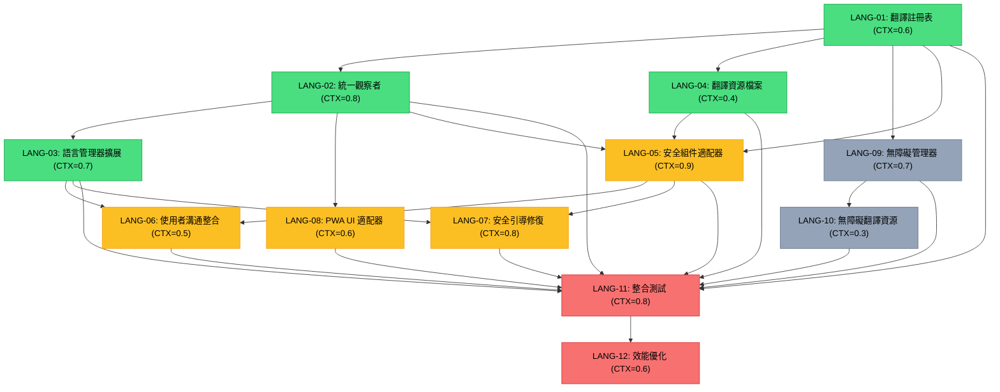

# 統一語言切換架構任務分解計劃

## 1️⃣ Task Overview

### 模組分組摘要
- **Phase 1 - 核心架構** (4 tasks): 建立統一語言管理基礎架構
- **Phase 2 - 安全組件整合** (4 tasks): 解決安全組件語言切換問題
- **Phase 3 - 無障礙支援** (2 tasks): 實作 ARIA 標籤和螢幕閱讀器支援
- **Phase 4 - 整合測試** (2 tasks): 完整測試和效能優化

### Critical Path 與里程碑
- **里程碑 1** (Day 3): 核心架構完成，支援基礎語言切換
- **里程碑 2** (Day 6): 安全組件整合完成，解決 CRS-LANG-001~003
- **里程碑 3** (Day 8): 無障礙支援和整合測試完成

**總 CTX-Units**: 9.2 (Claude-4-Sonnet), 14.7 (GPT-4.1)

## 2️⃣ Detailed Task Breakdown

| Task ID | Task Name | Description | Dependencies | Testing/Acceptance | Security/Accessibility | Effort (CTX-Units) | CTX Map (Claude4/GPT-4.1) | Context Footprint Note |
|---------|-----------|-------------|--------------|--------------------|------------------------|--------------------|---------------------------|------------------------|
| LANG-01 | 建立統一翻譯註冊表 | 實作 TranslationRegistry 類別，管理所有翻譯資源，支援點記法查詢和快取機制 | 無 | **Given** 翻譯資料結構定義完成<br>**When** 呼叫 getTranslation(lang, key)<br>**Then** 正確返回翻譯文字，支援嵌套鍵值查詢<br>**And** 快取機制運作正常，重複查詢效能提升 | **Security**: 翻譯內容 XSS 防護，HTML 轉義<br>**Accessibility**: 支援 ARIA 標籤翻譯鍵值 | 0.6 | {"claude-4-sonnet": 0.6, "gpt-4.1": 0.9} | 基礎資料結構，程式碼量適中 |
| LANG-02 | 實作統一語言觀察者 | 建立 UnifiedLanguageObserver，支援觀察者註冊、依賴管理、批次更新和錯誤處理 | LANG-01 | **Given** 多個語言觀察者註冊<br>**When** 觸發語言變更事件<br>**Then** 按優先級和依賴順序更新所有觀察者<br>**And** 單一觀察者失敗不影響其他組件<br>**And** 更新完成時間 ≤ 300ms | **Security**: 觀察者註冊驗證，防止惡意註冊<br>**Accessibility**: 無障礙組件優先更新 | 0.8 | {"claude-4-sonnet": 0.8, "gpt-4.1": 1.3} | 複雜事件管理邏輯，需要錯誤處理 |
| LANG-03 | 擴展語言管理器核心 | 擴展現有 LanguageManager，新增 getUnifiedText()、觀察者整合、佇列管理功能 | LANG-01, LANG-02 | **Given** 現有 LanguageManager 功能保持不變<br>**When** 呼叫 switchLanguage(lang)<br>**Then** 統一更新所有註冊組件<br>**And** 支援並發請求佇列處理<br>**And** 向下相容現有 API | **Security**: 語言參數驗證，僅允許支援語言<br>**Accessibility**: 自動更新 document.lang 屬性 | 0.7 | {"claude-4-sonnet": 0.7, "gpt-4.1": 1.1} | 擴展現有類別，需要保持相容性 |
| LANG-04 | 建立翻譯資源檔案 | 建立安全組件和無障礙翻譯 JSON 檔案，包含完整中英文翻譯內容 | 無 | **Given** 翻譯鍵值結構定義<br>**When** 載入翻譯檔案<br>**Then** 所有必要翻譯鍵值存在<br>**And** 中英文翻譯內容完整且準確<br>**And** JSON 格式驗證通過 | **Security**: 翻譯內容安全審查，無惡意腳本<br>**Accessibility**: WCAG 2.1 AA 相容文字內容 | 0.4 | {"claude-4-sonnet": 0.4, "gpt-4.1": 0.6} | 主要是資料建立，程式碼量少 |
| LANG-05 | 實作安全組件語言適配器 | 建立 SecurityComponentsLanguageAdapter，處理 UserCommunication 和 SecurityOnboarding 語言更新 | LANG-01, LANG-02, LANG-04 | **Given** 安全組件已載入<br>**When** 語言切換觸發<br>**Then** DOM 元素文字內容正確更新<br>**And** 焦點狀態保持不變<br>**And** 不可見組件延遲更新 | **Security**: DOM 更新 XSS 防護，安全的 innerHTML 替代<br>**Accessibility**: 焦點管理，ARIA 標籤同步更新 | 0.9 | {"claude-4-sonnet": 0.9, "gpt-4.1": 1.4} | 複雜 DOM 操作，多種更新策略 |
| LANG-06 | 優化使用者溝通系統整合 | 修改 ClientSideUserCommunication，移除硬編碼中文標籤，整合統一語言管理器 | LANG-03, LANG-05 | **Given** 使用者溝通容器存在<br>**When** 語言切換或新訊息顯示<br>**Then** 容器標籤和訊息文字使用正確語言<br>**And** 現有功能保持不變<br>**And** 效能無明顯影響 | **Security**: 訊息內容安全過濾<br>**Accessibility**: 容器 aria-label 動態更新 | 0.5 | {"claude-4-sonnet": 0.5, "gpt-4.1": 0.8} | 修改現有組件，邏輯相對簡單 |
| LANG-07 | 修復安全引導模態框語言切換 | 優化 ClientSideSecurityOnboarding 語言切換邏輯，解決焦點丟失和記憶體洩漏問題 | LANG-03, LANG-05 | **Given** 安全引導模態框開啟<br>**When** 使用者切換語言<br>**Then** 模態框內容正確更新<br>**And** 焦點元素保持不變<br>**And** 無記憶體洩漏<br>**And** 觀察者正確清理 | **Security**: 模態框內容 XSS 防護<br>**Accessibility**: 焦點管理，螢幕閱讀器相容 | 0.8 | {"claude-4-sonnet": 0.8, "gpt-4.1": 1.2} | 修復現有問題，需要仔細處理 |
| LANG-08 | 建立 PWA UI 語言適配器 | 實作 PWAUILanguageAdapter，整合現有 PWA 組件語言更新邏輯 | LANG-02, LANG-03 | **Given** PWA UI 組件已載入<br>**When** 語言切換事件觸發<br>**Then** 所有 UI 元素正確更新<br>**And** 卡片列表、對話框等組件語言一致<br>**And** 更新效能符合要求 | **Security**: UI 更新安全性檢查<br>**Accessibility**: UI 元素 ARIA 屬性更新 | 0.6 | {"claude-4-sonnet": 0.6, "gpt-4.1": 0.9} | 整合現有邏輯，中等複雜度 |
| LANG-09 | 實作無障礙語言管理器 | 建立 AccessibilityLanguageManager，處理 ARIA 標籤、螢幕閱讀器文字、表單標籤雙語支援 | LANG-01, LANG-04 | **Given** 頁面包含無障礙元素<br>**When** 語言切換觸發<br>**Then** 所有 ARIA 標籤更新為正確語言<br>**And** 螢幕閱讀器文字同步更新<br>**And** 表單標籤雙語化<br>**And** WCAG 2.1 AA 相容性測試通過 | **Security**: 無障礙文字內容安全過濾<br>**Accessibility**: 完整 WCAG 2.1 AA 支援，螢幕閱讀器測試 | 0.7 | {"claude-4-sonnet": 0.7, "gpt-4.1": 1.1} | 專門的無障礙功能，需要深度測試 |
| LANG-10 | 建立無障礙翻譯資源 | 建立 accessibility-zh.json 和 accessibility-en.json，包含 ARIA 標籤和螢幕閱讀器文字翻譯 | LANG-09 | **Given** 無障礙元素識別完成<br>**When** 載入無障礙翻譯檔案<br>**Then** 所有 ARIA 標籤翻譯存在<br>**And** 螢幕閱讀器文字翻譯完整<br>**And** 表單標籤翻譯準確 | **Security**: 翻譯內容安全審查<br>**Accessibility**: 翻譯內容符合無障礙標準，語意清晰 | 0.3 | {"claude-4-sonnet": 0.3, "gpt-4.1": 0.5} | 主要是翻譯資料建立 |
| LANG-11 | 語言切換整合測試 | 建立完整的語言切換整合測試，包含單元測試、整合測試、無障礙測試 | LANG-01~LANG-10 | **Given** 所有語言管理組件實作完成<br>**When** 執行完整測試套件<br>**Then** 單元測試覆蓋率 ≥ 90%<br>**And** 整合測試通過率 100%<br>**And** 無障礙測試符合 WCAG 2.1 AA<br>**And** 效能測試符合 ≤ 300ms 要求 | **Security**: 安全測試包含 XSS 防護驗證<br>**Accessibility**: 完整無障礙測試，包含螢幕閱讀器測試 | 0.8 | {"claude-4-sonnet": 0.8, "gpt-4.1": 1.2} | 綜合測試，需要多種測試策略 |
| LANG-12 | 效能優化與記憶體管理 | 優化語言切換效能，實作記憶體洩漏檢測，完善錯誤處理機制 | LANG-11 | **Given** 基礎功能測試通過<br>**When** 進行效能和記憶體測試<br>**Then** 語言切換響應時間 ≤ 300ms<br>**And** 長時間使用無記憶體洩漏<br>**And** 錯誤恢復率 ≥ 95%<br>**And** CPU 使用率 ≤ 30% | **Security**: 錯誤處理不洩露敏感資訊<br>**Accessibility**: 效能優化不影響無障礙功能 | 0.6 | {"claude-4-sonnet": 0.6, "gpt-4.1": 0.9} | 效能調優，相對獨立的任務 |

## 3️⃣ Test Coverage Plan

### Unit Testing Matrix
| 模組 | 測試類型 | 覆蓋率目標 | 關鍵測試案例 |
|------|---------|-----------|-------------|
| TranslationRegistry | Unit | 95% | 翻譯查詢、快取機制、錯誤處理 |
| UnifiedLanguageObserver | Unit | 90% | 觀察者註冊、事件分發、依賴管理 |
| EnhancedLanguageManager | Unit | 90% | 語言切換、佇列管理、API 相容性 |
| SecurityComponentsLanguageAdapter | Unit | 85% | DOM 更新、策略選擇、錯誤恢復 |
| AccessibilityLanguageManager | Unit | 90% | ARIA 更新、螢幕閱讀器支援 |

### Integration Testing Scope
- **語言切換完整流程**: 從使用者點擊到所有組件更新完成
- **安全組件整合**: UserCommunication 和 SecurityOnboarding 語言同步
- **PWA 組件整合**: 卡片列表、對話框、通知系統語言一致性
- **無障礙整合**: ARIA 標籤、螢幕閱讀器、鍵盤導航雙語支援

### E2E Testing Scenarios
- **多語言切換**: 快速連續切換語言，驗證狀態一致性
- **並發請求**: 同時觸發多個語言切換請求，驗證佇列機制
- **錯誤恢復**: 模擬組件更新失敗，驗證回滾機制
- **記憶體測試**: 長時間使用後檢測記憶體洩漏

### Security Testing Focus
- **XSS 防護**: 翻譯內容注入測試
- **輸入驗證**: 語言參數邊界測試
- **錯誤處理**: 敏感資訊洩露檢測
- **授權檢查**: 語言切換權限驗證

### Accessibility Testing Requirements
- **WCAG 2.1 AA 相容性**: 自動化無障礙測試
- **螢幕閱讀器測試**: NVDA、JAWS、VoiceOver 相容性
- **鍵盤導航**: Tab 順序和快捷鍵功能
- **色彩對比**: 雙語文字可讀性檢測

## 4️⃣ Dependency Relationship Diagram



### CTX-CALC-CONFIG

```html
<!-- CTX-CALC-CONFIG
ctx_baseline_tokens:
  claude-4-sonnet: 200000
  gpt-4.1: 128000
  gpt-4o: 128000
  gemini-2.5-pro: 1000000
formula: "CTX_units[model] = ceil(total_tokens * (1 + buffer_ratio) / ctx_baseline_tokens[model])"
total_tokens_fields: ["spec_tokens", "code_tokens", "test_tokens"]
buffer_ratio: 0.1
output_fields: ["effort_ctx_units", "ctx_map", "context_footprint_note"]
failover: "if any field missing -> set effort_ctx_units='TBD' and raise clarification"
-->
```

## 5️⃣ Implementation Phases & Timeline

### Phase 1: 核心架構建立 (Days 1-3)
**目標**: 建立統一語言管理基礎架構
- **並行任務**: LANG-01 + LANG-04 (Day 1)
- **依序任務**: LANG-02 (Day 2), LANG-03 (Day 3)
- **里程碑**: 基礎語言切換功能可用

### Phase 2: 安全組件整合 (Days 4-6)
**目標**: 解決 CRS-LANG-001, CRS-LANG-002, CRS-LANG-003
- **並行任務**: LANG-05 + LANG-08 (Days 4-5)
- **依序任務**: LANG-06, LANG-07 (Day 6)
- **里程碑**: 安全組件語言切換問題完全解決

### Phase 3: 無障礙支援 (Days 7-8)
**目標**: 實作完整無障礙雙語支援
- **並行任務**: LANG-09 + LANG-10 (Days 7-8)
- **里程碑**: WCAG 2.1 AA 相容性達成

### Phase 4: 整合測試與優化 (Days 9-10)
**目標**: 完整測試和效能優化
- **依序任務**: LANG-11 (Day 9), LANG-12 (Day 10)
- **里程碑**: 生產就緒，效能目標達成

## 6️⃣ Risk Mitigation & Contingency Plans

### 高風險任務識別
- **LANG-05** (CTX=0.9): 複雜 DOM 操作，多種更新策略
  - **風險**: DOM 更新邏輯複雜，可能影響現有功能
  - **緩解**: 詳細測試現有功能，漸進式實作
  
- **LANG-07** (CTX=0.8): 修復現有問題，需要仔細處理
  - **風險**: 焦點管理和記憶體洩漏修復可能引入新問題
  - **緩解**: 建立專門的焦點和記憶體測試案例

### 依賴風險管理
- **Critical Path**: LANG-01 → LANG-02 → LANG-03 → LANG-05 → LANG-06/07
- **風險**: 核心架構延遲影響後續所有任務
- **緩解**: Phase 1 任務優先資源分配，每日進度檢查

### 效能風險控制
- **目標**: 語言切換 ≤ 300ms
- **風險**: 複雜的觀察者模式可能影響效能
- **緩解**: LANG-12 專門處理效能優化，必要時簡化架構

## 7️⃣ Quality Gates & Acceptance Criteria

### Phase 完成標準
- **Phase 1**: 基礎語言切換功能可用，單元測試通過
- **Phase 2**: 安全組件語言同步，整合測試通過
- **Phase 3**: 無障礙測試通過 WCAG 2.1 AA
- **Phase 4**: 效能測試達標，記憶體洩漏檢測通過

### 程式碼品質要求
- **測試覆蓋率**: 單元測試 ≥ 90%，整合測試 100%
- **效能基準**: 語言切換 ≤ 300ms，記憶體使用 ≤ 10MB
- **安全標準**: XSS 防護，輸入驗證，錯誤處理
- **無障礙標準**: WCAG 2.1 AA 相容，螢幕閱讀器支援

### 交付物檢查清單
- [ ] 所有新建檔案符合專案程式碼規範
- [ ] 現有檔案修改保持向下相容性
- [ ] 翻譯資源檔案完整且準確
- [ ] 測試檔案覆蓋所有關鍵功能
- [ ] 文檔更新反映架構變更
- [ ] 效能基準測試通過
- [ ] 安全審查通過
- [ ] 無障礙測試通過

---

**下一步**: 通知 `code-executor` 開始實作 Phase 1 任務 (LANG-01, LANG-04)，建立統一語言管理基礎架構。

**預期效益**:
- 解決安全組件與 PWA 語言管理分離問題
- 提升語言切換一致性和效能
- 增強無障礙支援和使用者體驗
- 建立可擴展的多語言架構基礎