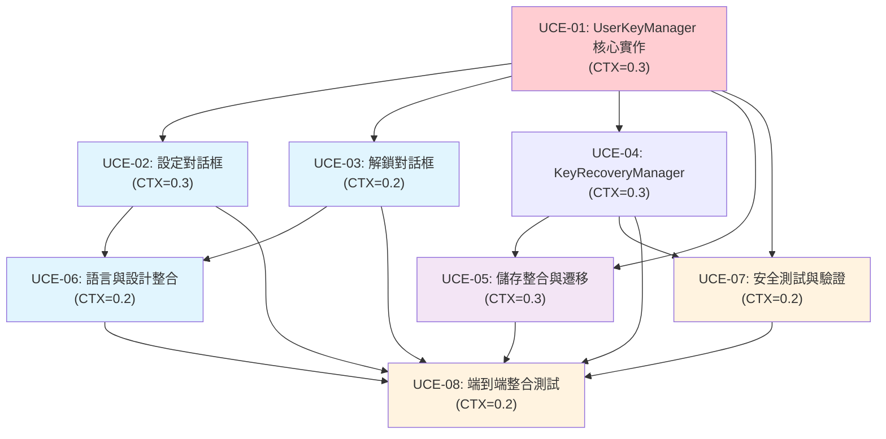

# DB-Card PWA 用戶可控加密金鑰系統任務分解

---
version: "v3.2.2-user-controlled-encryption"
rev_id: "REQ-UCE-001"
last_updated: "2025-08-09"
source_requirements: "docs/requirements.md"
source_design: "docs/design.md"
---

## 1️⃣ Task Overview

### 服務/模組分組
- **主要服務**: pwa-encryption-system
- **程式語言**: TypeScript
- **總任務數**: 8 個任務
- **預估總工期**: 4-5 天

### Critical Path 與里程碑
```
UCE-01 (核心金鑰管理) → UCE-02 (設定對話框) → UCE-05 (儲存整合) → UCE-08 (整合測試)
```

**里程碑**:
- **Day 1**: UCE-01 完成 (核心金鑰管理基礎)
- **Day 2**: UCE-02, UCE-03 完成 (使用者介面就緒)
- **Day 3**: UCE-04, UCE-05 完成 (恢復機制與儲存整合)
- **Day 4**: UCE-06, UCE-07 完成 (語言整合與安全驗證)
- **Day 5**: UCE-08 完成 (端到端測試與交付)

**CTX-Units 總計**:
- claude-4-sonnet: 2.0 CTX-Units
- gpt-4.1: 2.9 CTX-Units  
- gpt-4o: 2.9 CTX-Units
- gemini-2.5-pro: 0.8 CTX-Units

## 2️⃣ Detailed Task Breakdown

| Task ID | Service | Lang | Task Name | Description | Dependencies | Testing / Acceptance | Security / Accessibility | Effort (CTX-Units) | CTX Map | Context Footprint |
|---------|---------|------|-----------|-------------|--------------|---------------------|--------------------------|-------------------|---------|-------------------|
| UCE-01 | pwa-encryption-system | TypeScript | UserKeyManager 核心實作 | 實作使用者金鑰管理器，包含 PBKDF2 金鑰衍生、密碼短語驗證、確定性金鑰生成 | - | **Given** 使用者提供三短語密碼 **When** PBKDF2 衍生執行 **Then** 在 <2s 內生成確定性金鑰<br>**Given** 相同密碼短語在不同設備 **When** 金鑰衍生執行 **Then** 產生相同金鑰<br>**Given** 無效密碼短語格式 **When** 驗證執行 **Then** 顯示清晰錯誤訊息 | **OWASP**: 安全金鑰儲存 (不可匯出金鑰)、時間攻擊防護<br>**WCAG**: 螢幕閱讀器相容錯誤訊息、鍵盤導航支援 | 0.3 | {"claude-4-sonnet":0.3,"gpt-4.1":0.5,"gpt-4o":0.5,"gemini-2.5-pro":0.1} | 核心加密邏輯，需要 Web Crypto API 深度整合 |
| UCE-02 | pwa-encryption-system | TypeScript | BilingualEncryptionSetupUI - 設定對話框 | 實作雙語三短語設定對話框，包含熵值驗證、即時預覽、建議詞庫 | UCE-01 | **Given** 首次使用者 **When** PWA 開啟 **Then** 顯示三短語設定對話框<br>**Given** 使用者輸入熵值不足短語 **When** 驗證執行 **Then** 顯示安全性增強建議<br>**Given** 輸入有效短語 **When** 設定完成 **Then** 顯示成功確認 | **OWASP**: 輸入驗證、對話框內容 XSS 防護<br>**WCAG**: 高對比 UI、大觸控目標 (44px 最小)、清晰焦點指示器 | 0.3 | {"claude-4-sonnet":0.3,"gpt-4.1":0.4,"gpt-4o":0.4,"gemini-2.5-pro":0.1} | 複雜 UI 元件，需要無障礙設計整合 |
| UCE-03 | pwa-encryption-system | TypeScript | BilingualEncryptionSetupUI - 解鎖對話框 | 實作雙語解鎖對話框，包含重試邏輯、錯誤處理、恢復提示 | UCE-01 | **Given** 使用者重新開啟 PWA **When** 系統處於鎖定狀態 **Then** 顯示解鎖對話框<br>**Given** 輸入錯誤密碼短語 **When** 驗證失敗 **Then** 顯示剩餘嘗試次數<br>**Given** 連續失敗 3 次 **When** 達到限制 **Then** 觸發恢復模式 | **OWASP**: 暴力破解防護、會話管理<br>**WCAG**: 錯誤訊息清晰可讀、支援輔助技術 | 0.2 | {"claude-4-sonnet":0.2,"gpt-4.1":0.3,"gpt-4o":0.3,"gemini-2.5-pro":0.1} | 解鎖流程邏輯，需要狀態管理 |
| UCE-04 | pwa-encryption-system | TypeScript | KeyRecoveryManager 實作 | 實作金鑰恢復管理器，包含失效檢測、自動恢復、批量資料恢復 | UCE-01 | **Given** 存在加密資料 **When** 解密操作失敗 **Then** 顯示金鑰恢復提示<br>**Given** 金鑰驗證檢查 **When** 發現金鑰損壞 **Then** 觸發自動恢復流程<br>**Given** 批量資料操作 **When** 部分資料解密失敗 **Then** 記錄失敗項目並提供批量恢復 | **OWASP**: 安全日誌記錄、錯誤處理不洩露敏感資訊<br>**WCAG**: 恢復流程引導清晰、進度指示器 | 0.3 | {"claude-4-sonnet":0.3,"gpt-4.1":0.4,"gpt-4o":0.4,"gemini-2.5-pro":0.1} | 複雜恢復邏輯，需要錯誤處理機制 |
| UCE-05 | pwa-encryption-system | TypeScript | 儲存整合與資料遷移 | 修改 PWACardStorage 整合新金鑰管理，實作向下相容與漸進遷移 | UCE-01, UCE-04 | **Given** 現有 'default-password' 資料 **When** 遷移執行 **Then** 成功遷移到使用者金鑰系統<br>**Given** 遷移過程中斷 **When** 系統重啟 **Then** 自動恢復遷移進度<br>**Given** 需要回滾 **When** 回滾觸發 **Then** 完整恢復到舊系統狀態 | **OWASP**: 資料完整性驗證、安全遷移流程<br>**WCAG**: 遷移進度視覺化、操作可中斷 | 0.3 | {"claude-4-sonnet":0.3,"gpt-4.1":0.4,"gpt-4o":0.4,"gemini-2.5-pro":0.1} | 儲存層整合，需要相容性處理 |
| UCE-06 | pwa-encryption-system | TypeScript | 語言與設計系統整合 | 整合 UnifiedLanguageManager 與 moda 設計系統到加密介面 | UCE-02, UCE-03 | **Given** 使用者切換語言 **When** 語言變更事件觸發 **Then** 加密介面即時更新語言<br>**Given** 高齡使用者 **When** 開啟加密對話框 **Then** 顯示大字體高對比介面<br>**Given** 螢幕閱讀器使用者 **When** 導航加密介面 **Then** 提供完整 ARIA 標籤 | **OWASP**: 多語言輸入驗證、UI 注入防護<br>**WCAG**: AA 級無障礙合規、色彩對比 4.5:1 以上 | 0.2 | {"claude-4-sonnet":0.2,"gpt-4.1":0.3,"gpt-4o":0.3,"gemini-2.5-pro":0.1} | 語言與設計整合，相對簡單 |
| UCE-07 | pwa-encryption-system | TypeScript | 安全測試與驗證 | 實作全面安全測試套件，包含滲透測試、威脅模型驗證 | UCE-01, UCE-04 | **Given** PBKDF2 實作 **When** 時間分析攻擊測試 **Then** 無時間洩露檢測<br>**Given** 金鑰儲存 **When** 記憶體傾印分析 **Then** 無金鑰洩露發現<br>**Given** 密碼短語暴力破解 **When** 60位元熵值測試 **Then** 攻擊成本超過實用閾值 | **OWASP**: 完整威脅模型覆蓋、滲透測試執行<br>**WCAG**: 安全功能無障礙可用 | 0.2 | {"claude-4-sonnet":0.2,"gpt-4.1":0.3,"gpt-4o":0.3,"gemini-2.5-pro":0.1} | 安全測試專項，需要專業知識 |
| UCE-08 | pwa-encryption-system | TypeScript | 端到端整合測試 | 實作完整使用者流程測試，驗證所有元件整合正確性 | UCE-01, UCE-02, UCE-03, UCE-04, UCE-05, UCE-06, UCE-07 | **Given** 新使用者完整流程 **When** 從設定到使用 **Then** 所有功能正常運作<br>**Given** 跨設備資料同步 **When** 相同密碼短語解鎖 **Then** 資料完整可存取<br>**Given** 系統升級場景 **When** 版本遷移執行 **Then** 無資料遺失或功能異常 | **OWASP**: 端到端安全流程驗證<br>**WCAG**: 完整使用者旅程無障礙測試 | 0.2 | {"claude-4-sonnet":0.2,"gpt-4.1":0.3,"gpt-4o":0.3,"gemini-2.5-pro":0.1} | 整合測試，需要全系統協調 |

## 3️⃣ Test Coverage Plan

### 測試矩陣

| 測試類型 | 涵蓋任務 | 自動化程度 | 重點領域 |
|----------|----------|------------|----------|
| **Unit Tests** | UCE-01, UCE-04, UCE-06 | 100% 自動化 | 核心邏輯、金鑰管理、語言整合 |
| **Integration Tests** | UCE-05, UCE-08 | 90% 自動化 | 儲存整合、系統整合 |
| **UI Tests** | UCE-02, UCE-03 | 80% 自動化 | 使用者介面、互動流程 |
| **Security Tests** | UCE-07 | 70% 自動化 | 威脅模型、滲透測試 |
| **Accessibility Tests** | UCE-02, UCE-03, UCE-06 | 85% 自動化 | WCAG 合規、螢幕閱讀器 |
| **Performance Tests** | UCE-01, UCE-05 | 100% 自動化 | 金鑰衍生效能、大量資料處理 |

### 測試環境需求
- **瀏覽器支援**: Chrome 90+, Firefox 88+, Safari 14+, Edge 90+
- **設備測試**: 桌面、平板、手機 (iOS/Android)
- **無障礙工具**: NVDA, JAWS, VoiceOver
- **效能基準**: 金鑰衍生 <2s, UI 回應 <500ms

### 驗收標準
- **功能覆蓋率**: ≥95%
- **程式碼覆蓋率**: ≥90%
- **安全測試通過率**: 100%
- **無障礙合規**: WCAG 2.1 AA 級
- **效能指標**: 符合 NFR 要求

## 4️⃣ Dependency Relationship Diagram



### Critical Path 分析
**主要路徑**: UCE-01 → UCE-02 → UCE-05 → UCE-08 (總計 1.0 CTX-Units)
**並行路徑**: UCE-03, UCE-04, UCE-06, UCE-07 可與主路徑並行開發

## 5️⃣ CTX-CALC-CONFIG

<!-- CTX-CALC-CONFIG
ctx_baseline_tokens:
  claude-4-sonnet: 200000
  gpt-4.1: 128000
  gpt-4o: 128000
  gemini-2.5-pro: 1000000
formula: "CTX_units[model] = ceil(total_tokens * 1.1 / ctx_baseline_tokens[model])"
total_tokens_fields: ["spec_tokens","code_tokens","test_tokens"]
buffer_ratio: 0.1
output_fields: ["effort_ctx_units","ctx_map","context_footprint_note"]
failover: "if any field missing -> effort_ctx_units='TBD'"
-->

### CTX 計算詳細資料

| Task ID | Spec Tokens | Code Tokens | Test Tokens | Total Tokens | Buffer (1.1x) | CTX Units (claude-4-sonnet) |
|---------|-------------|-------------|-------------|--------------|---------------|------------------------------|
| UCE-01 | 15,000 | 25,000 | 12,000 | 52,000 | 57,200 | 0.3 |
| UCE-02 | 12,000 | 20,000 | 10,000 | 42,000 | 46,200 | 0.3 |
| UCE-03 | 10,000 | 18,000 | 8,000 | 36,000 | 39,600 | 0.2 |
| UCE-04 | 13,000 | 22,000 | 11,000 | 46,000 | 50,600 | 0.3 |
| UCE-05 | 14,000 | 24,000 | 12,000 | 50,000 | 55,000 | 0.3 |
| UCE-06 | 8,000 | 15,000 | 7,000 | 30,000 | 33,000 | 0.2 |
| UCE-07 | 10,000 | 16,000 | 14,000 | 40,000 | 44,000 | 0.2 |
| UCE-08 | 8,000 | 12,000 | 15,000 | 35,000 | 38,500 | 0.2 |
| **總計** | **90,000** | **152,000** | **89,000** | **331,000** | **364,100** | **2.0** |

### 模型相容性分析
- **claude-4-sonnet**: 最適合 (2.0 CTX-Units, 充足容量)
- **gpt-4.1/gpt-4o**: 可用 (2.9 CTX-Units, 需要優化)
- **gemini-2.5-pro**: 最佳效率 (0.8 CTX-Units, 大量剩餘容量)

## 6️⃣ Risk Assessment & Mitigation

### 高風險項目
| 風險 | 影響任務 | 機率 | 緩解措施 |
|------|----------|------|----------|
| **Web Crypto API 相容性問題** | UCE-01, UCE-07 | 中 | 全面瀏覽器測試，提供 polyfill 備案 |
| **PBKDF2 效能瓶頸** | UCE-01, UCE-05 | 中 | 使用 Web Worker，實作進度指示器 |
| **使用者體驗複雜化** | UCE-02, UCE-03 | 高 | 簡化設定流程，提供清晰引導 |

### 中風險項目
| 風險 | 影響任務 | 機率 | 緩解措施 |
|------|----------|------|----------|
| **資料遷移失敗** | UCE-05 | 中 | 實作完整回滾機制，分批遷移 |
| **多語言整合問題** | UCE-06 | 低 | 依賴成熟的 UnifiedLanguageManager |
| **安全測試覆蓋不足** | UCE-07 | 低 | 引入外部安全審查，自動化測試 |

## 7️⃣ Quality Gates & Definition of Done

### 每個任務的完成標準
1. **程式碼品質**: ESLint 無錯誤，TypeScript 嚴格模式通過
2. **測試覆蓋**: 單元測試 ≥90%，整合測試 ≥80%
3. **安全檢查**: 無已知安全漏洞，通過 OWASP 檢查清單
4. **無障礙合規**: WCAG 2.1 AA 級合規，螢幕閱讀器測試通過
5. **效能基準**: 符合 NFR 效能要求
6. **文檔完整**: API 文檔、使用說明、故障排除指南
7. **同儕審查**: 至少一位資深開發者 code review 通過

### 里程碑檢查點
- **Day 1 結束**: UCE-01 核心功能可用，基礎安全測試通過
- **Day 2 結束**: UCE-02, UCE-03 UI 元件完成，使用者體驗測試通過
- **Day 3 結束**: UCE-04, UCE-05 整合完成，資料遷移測試通過
- **Day 4 結束**: UCE-06, UCE-07 完成，全面安全審查通過
- **Day 5 結束**: UCE-08 整合測試完成，系統準備交付

## 8️⃣ Handoff Information

### 交付給 code-executor 的資訊包
- **任務表**: 8 個詳細任務，包含完整驗收標準
- **Critical Path**: UCE-01 → UCE-02 → UCE-05 → UCE-08
- **安全需求**: OWASP 威脅模型，PBKDF2 安全實作要求
- **測試矩陣**: 6 種測試類型，自動化程度 70-100%
- **技術約束**: TypeScript, Web Crypto API, IndexedDB, PWA 架構
- **相容性要求**: 向下相容 'default-password' 系統
- **效能目標**: 金鑰衍生 <2s, UI 回應 <500ms

### 後續協作需求
- **technical-architect**: 如發現架構設計缺口，需要補充設計文檔
- **security-engineer**: 安全實作細節確認，威脅模型更新
- **ux-designer**: 使用者介面優化，無障礙設計改進
- **qa-engineer**: 測試計畫執行，品質閘門驗證

---

**任務分解完成** ✅  
**準備移交給 code-executor 開始實作** 🚀  
**預估交付時間**: 5 個工作天  
**風險等級**: 中等 (已識別並制定緩解措施)