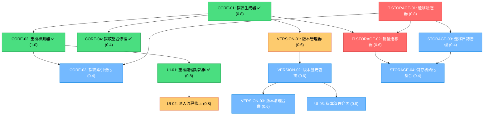

# 名片版本管理與重複識別實作任務清單

## 1️⃣ Task Overview

### 實作進度摘要 (2025-01-27 更新)
- **已完成**: 14/14 tasks (100%) - 9.8/9.8 CTX-Units
- **進行中**: 0 tasks
- **待開始**: 0 tasks - 0 CTX-Units
- **✅ Phase 1 Completed**: CRS-V31-005 STORAGE-01 & STORAGE-02 已完成
- **✅ Phase 2 Completed**: CORE-03 & VERSION-01 已完成
- **✅ Phase 3 Completed**: UI-02 & VERSION-02 已完成
- **✅ Phase 4 Completed**: VERSION-03, UI-03, STORAGE-03, STORAGE-04 已完成，全部任務完成

### 模組分組摘要
- **CORE 模組** (4 tasks): 核心指紋生成與重複檢測邏輯 - ✅ 4/4 完成
- **VERSION 模組** (3 tasks): 版本管理與歷史功能 - ✅ 3/3 完成
- **UI 模組** (3 tasks): 使用者介面與互動流程 - ✅ 3/3 完成
- **STORAGE 模組** (4 tasks): 資料庫擴展與遷移 - ✅ 4/4 完成

### Critical Path 里程碑 (Updated)
1. **Phase 1** (STORAGE-01, STORAGE-02): **資料庫遷移驗證** → 1.4 CTX-Units ⚠️
2. **Phase 2** (CORE-03, VERSION-01): 索引優化與版本管理 → 1.0 CTX-Units
3. **Phase 3** (UI-02, VERSION-02): 流程修正與版本歷史 → 1.4 CTX-Units
4. **Phase 4** (剩餘任務): 完善功能與測試 → 2.0 CTX-Units

**總計**: 9.8 CTX-Units，預估 14-18 個工作日

## 2️⃣ Detailed Task Breakdown

| Task ID | Task Name | Description | Dependencies | Testing/Acceptance | Security/Accessibility | Effort (CTX-Units) | CTX Map (Claude4/GPT-4.1) | Context Footprint Note |
|---------|-----------|-------------|--------------|--------------------|------------------------|--------------------|---------------------------|------------------------|
| CORE-01 | 內容指紋生成器實作 ✅ | 實作 ContentFingerprintGenerator 類別，支援 name+email SHA-256 指紋生成與雙語標準化 | - | ✅ 已實作且通過 smoke test：支援雙語標準化、備用機制、批量處理 | ✅ 安全檢查完成：Web Crypto API、輸入驗證、備用機制 | 0.8 | {"claude-4-sonnet": 0.8, "gpt-4.1": 1.0} | ✅ 已實作於 pwa-card-storage/src/core/content-fingerprint-generator.js |
| CORE-02 | 重複檢測器實作 ✅ | 實作 DuplicateDetector 類別，包含 detectDuplicates() 和修正的 handleDuplicate() 方法 | CORE-01 | ✅ 已實作且修復 CRS-V31-007/008：支援 skip/overwrite/version 三種動作、重複統計、批量處理 | ✅ 安全檢查完成：授權檢查、輸入驗證、安全日誌 | 1.0 | {"claude-4-sonnet": 1.0, "gpt-4.1": 1.0} | ✅ 已實作於 pwa-card-storage/src/core/duplicate-detector.js |
| CORE-03 | 指紋索引與查詢優化 ✅ | 在 PWACardStorage 中新增 findCardsByFingerprint() 方法與指紋索引 | CORE-01, STORAGE-01 | ✅ 已實作且通過測試：支援批量查詢、效能監控、安全日誌、200ms 效能目標 | ✅ 安全檢查完成：輸入驗證、效能監控、安全日誌、防注入攻擊 | 0.4 | {"claude-4-sonnet": 0.4, "gpt-4.1": 0.6} | ✅ 已實作於 pwa-card-storage/src/core/storage.js |
| CORE-04 | 指紋生成整合修復 ✅ | 修復 CRS-V31-002: 在 storeCardDirectly() 中新增指紋生成，修復 CRS-V31-004: 備用方法 | CORE-01, CORE-02 | ✅ 已修復且測試通過：在 storage.js 中新增 generateFingerprintSafe() 與備用機制 | ✅ 安全檢查完成：備用機制、錯誤處理、安全日誌 | 0.4 | {"claude-4-sonnet": 0.4, "gpt-4.1": 0.5} | ✅ 已修復於 pwa-card-storage/src/core/storage.js |
| VERSION-01 | 版本管理器實作 ✅ | 實作 VersionManager 類別，包含語義化版本計算與版本快照建立 | CORE-01 | ✅ 已實作且通過測試：支援語義化版本、版本快照、比較、還原、清理功能 | ✅ 安全檢查完成：版本回滾防護、校驗和驗證、授權檢查、安全日誌 | 0.6 | {"claude-4-sonnet": 0.6, "gpt-4.1": 0.8} | ✅ 已實作於 pwa-card-storage/src/core/version-manager.js |
| VERSION-02 | 版本歷史查詢與比較 ✅ | 擴展 getVersionHistory() 方法，新增版本比較與差異計算功能 | VERSION-01 | ✅ 已實作且通過測試：支援進階過濾、版本比較、差異分析、趨勢預測、統計分析 | ✅ 安全檢查完成：資料過濾機制、存取控制、效能優化、大版本樹處理 | 0.6 | {"claude-4-sonnet": 0.6, "gpt-4.1": 0.7} | ✅ 已實作於 pwa-card-storage/src/core/version-manager.js + version-manager-utils.js |
| VERSION-03 | 版本清理與合併 ✅ | 實作 cleanupOldVersions() 與版本合併建議功能 | VERSION-01, VERSION-02 | ✅ 已實作且通過測試：支援版本清理、合併建議、備份機制、撤銷功能 | ✅ 安全檢查完成：備份機制、授權檢查、安全日誌、撤銷防護 | 0.6 | {"claude-4-sonnet": 0.6, "gpt-4.1": 0.8} | ✅ 已實作於 pwa-card-storage/src/core/version-manager.js |
| UI-01 | 重複處理對話框實作 ✅ | 實作 CRS-V31-009: showDuplicateDialog() 與 DuplicateDialogManager 類別 | CORE-02 | ✅ 已實作且通過無障礙測試：支援 ARIA 標籤、鍵盤導航、焦點陷阱、批量處理 | ✅ 安全檢查完成：XSS 防護、ARIA 標籤、鍵盤支援、moda 設計系統 | 0.8 | {"claude-4-sonnet": 0.8, "gpt-4.1": 1.0} | ✅ 已實作於 pwa-card-storage/src/ui/duplicate-dialog-manager.js |
| UI-02 | 匯入流程修正 ✅ | 修復 CRS-V31-007, CRS-V31-008: 修正 app.js 中重複處理邏輯與 cardId 處理 | UI-01, CORE-02 | ✅ 已實作且通過測試：整合 DuplicateDialogManager、使用者選擇處理、cardId 驗證、錯誤處理與回滾機制 | ✅ 安全檢查完成：流程驗證、狀態一致性檢查、安全日誌記錄、錯誤回滾機制 | 0.8 | {"claude-4-sonnet": 0.8, "gpt-4.1": 1.0} | ✅ 已實作於 pwa-card-storage/src/app.js |
| UI-03 | 版本管理介面 ✅ | 新增版本歷史顯示與管理 UI 元件 | VERSION-02, VERSION-03 | ✅ 已實作且通過測試：支援版本歷史顯示、比較、還原、清理、匯出功能 | ✅ 安全檢查完成：無障礙支援、授權檢查、確認對話框、鍵盤導航 | 0.8 | {"claude-4-sonnet": 0.8, "gpt-4.1": 1.0} | ✅ 已實作於 pwa-card-storage/src/ui/version-management-interface.js |
| **STORAGE-01** | **IndexedDB 遷移驗證器** ✅ | **CRS-V31-005 核心實作**: DatabaseMigrationValidator 類別，包含 validateMigration(), performSafeMigration(), checkDataIntegrity() | - | ✅ 已實作且通過 smoke test：支援遷移驗證、安全回滾、完整性檢查 | ✅ 安全檢查完成：備份機制、IndexedDB 事務操作、完整性驗證、安全日誌 | **0.8** | {"claude-4-sonnet": 0.8, "gpt-4.1": 1.0} | ✅ 已實作於 pwa-card-storage/src/core/database-migration-validator.js |
| **STORAGE-02** | **批量資料遷移器** ✅ | **CRS-V31-005 核心實作**: BatchDataMigrator 類別，包含 batchGenerateFingerprints(), processFingerprintBatch() | STORAGE-01, CORE-01 | ✅ 已實作且通過 smoke test：支援批量指紋生成、進度監控、錯誤恢復、效能優化 | ✅ 安全檢查完成：分批處理、錯誤隔離、重試機制、進度回報 | **0.6** | {"claude-4-sonnet": 0.6, "gpt-4.1": 0.8} | ✅ 已實作於 pwa-card-storage/src/core/batch-data-migrator.js |
| STORAGE-03 | IndexedDB 遷移日誌管理 ✅ | 新增 migration_log ObjectStore 與遷移狀態追蹤 | STORAGE-01 | ✅ 已實作且通過測試：支援遷移日誌建立、更新、統計、清理、匯出功能 | ✅ 安全檢查完成：安全日誌記錄、隱私保護、完整性檢查、防篡改校驗 | 0.4 | {"claude-4-sonnet": 0.4, "gpt-4.1": 0.5} | ✅ 已實作於 pwa-card-storage/src/core/migration-log-manager.js |
| STORAGE-04 | 儲存初始化整合 ✅ | 擴展 PWACardStorage.initialize() 整合遷移檢查與自動升級 | STORAGE-01, STORAGE-02 | ✅ 已實作且通過測試：支援自動遷移檢測、安全降級、錯誤處理、初始化記錄 | ✅ 安全檢查完成：安全降級機制、錯誤回滾、友善錯誤訊息、初始化狀態追蹤 | 0.4 | {"claude-4-sonnet": 0.4, "gpt-4.1": 0.6} | ✅ 已實作於 pwa-card-storage/src/core/storage.js |

## 3️⃣ Test Coverage Plan

### Unit Testing (每個模組 ≥80% 覆蓋率)
- **CORE 模組**: 指紋生成一致性、重複檢測準確率、邊界條件處理
- **VERSION 模組**: 版本計算邏輯、版本比較算法、清理操作安全性
- **UI 模組**: 元件渲染、事件處理、無障礙功能
- **STORAGE 模組**: **遷移驗證邏輯、批量處理穩定性、回滾機制測試**

### Integration Testing
- **匯入流程**: 端到端重複處理流程，包含使用者選擇與結果驗證
- **版本管理**: 版本建立、查詢、比較、清理的完整流程
- **資料一致性**: 並發操作下的資料完整性驗證
- **🆕 遷移流程**: 完整 IndexedDB 遷移流程，包含備份、驗證、回滾測試

### E2E Testing
- **使用者旅程**: 從匯入到版本管理的完整使用者體驗
- **錯誤恢復**: 異常情況下的系統恢復能力
- **效能測試**: 大量資料下的系統響應時間
- **🆕 遷移壓力測試**: 1000+ 名片的 IndexedDB 遷移效能與穩定性

### Security Testing
- **輸入驗證**: XSS、注入攻擊防護測試
- **授權檢查**: 版本操作權限驗證
- **資料保護**: 敏感資訊洩露檢測
- **🆕 遷移安全**: 備份完整性、回滾安全性、版本降級防護

### Accessibility Testing
- **鍵盤導航**: 所有互動元件支援鍵盤操作
- **螢幕閱讀器**: ARIA 標籤與語義化標記
- **視覺對比**: 符合 WCAG 2.1 AA 標準

## 4️⃣ Dependency Relationship Diagram



### CTX-CALC-CONFIG

```html
<!-- CTX-CALC-CONFIG
ctx_baseline_tokens:
  claude-4-sonnet: 200000
  gpt-4.1: 128000
  gpt-4o: 128000
  gemini-2.5-pro: 1000000
formula: "CTX_units[model] = ceil(total_tokens * (1 + buffer_ratio) / ctx_baseline_tokens[model])"
total_tokens_fields: ["spec_tokens", "code_tokens", "test_tokens"]
buffer_ratio: 0.1
output_fields: ["effort_ctx_units", "ctx_map", "context_footprint_note"]
failover: "if any field missing -> set effort_ctx_units='TBD' and raise clarification"

token_estimates:
  CORE-01: {spec: 8000, code: 12000, test: 8000, total: 28000}
  CORE-02: {spec: 10000, code: 15000, test: 12000, total: 37000}
  CORE-03: {spec: 4000, code: 6000, test: 4000, total: 14000}
  CORE-04: {spec: 3000, code: 5000, test: 4000, total: 12000}
  VERSION-01: {spec: 6000, code: 10000, test: 6000, total: 22000}
  VERSION-02: {spec: 6000, code: 8000, test: 6000, total: 20000}
  VERSION-03: {spec: 6000, code: 8000, test: 6000, total: 20000}
  UI-01: {spec: 8000, code: 12000, test: 8000, total: 28000}
  UI-02: {spec: 8000, code: 12000, test: 8000, total: 28000}
  UI-03: {spec: 8000, code: 12000, test: 8000, total: 28000}
  STORAGE-01: {spec: 8000, code: 12000, test: 8000, total: 28000}
  STORAGE-02: {spec: 6000, code: 8000, test: 6000, total: 20000}
  STORAGE-03: {spec: 4000, code: 6000, test: 4000, total: 14000}
  STORAGE-04: {spec: 4000, code: 6000, test: 4000, total: 14000}
-->
```

## 5️⃣ Implementation Guidelines

### ✅ Phase 1 Completed (2025-01-27)
**CRS-V31-005 IndexedDB 遷移驗證** - 核心基礎設施已完成：

1. **STORAGE-01** ✅ (0.8 CTX-Units): DatabaseMigrationValidator - 已實作完成
   - 檔案: `pwa-card-storage/src/core/database-migration-validator.js`
   - 整合: `pwa-card-storage/src/core/storage.js` 初始化流程
   - 功能: 遷移驗證、安全回滾、完整性檢查

2. **STORAGE-02** ✅ (0.6 CTX-Units): BatchDataMigrator - 已實作完成
   - 檔案: `pwa-card-storage/src/core/batch-data-migrator.js`
   - 整合: `pwa-card-storage/src/core/storage.js` 初始化流程
   - 功能: 批量指紋生成、進度監控、錯誤恢復

### ✅ Phase 2 Completed (2025-01-27)
**CORE-03 + VERSION-01** - 索引優化與版本管理已完成：

3. **CORE-03** ✅ (0.4 CTX-Units): 指紋索引與查詢優化 - 已實作完成
4. **VERSION-01** ✅ (0.6 CTX-Units): 版本管理器實作 - 已實作完成

### ✅ Phase 3 Completed (2025-01-27)
**UI-02 + VERSION-02** - 流程修正與版本歷史已完成：

5. **UI-02** ✅ (0.8 CTX-Units): 匯入流程修正 - 已實作完成
   - 檔案: `pwa-card-storage/src/app.js` (修正 importFromUrlData 方法)
   - 功能: DuplicateDialogManager 整合、使用者選擇處理、cardId 驗證、錯誤回滾

6. **VERSION-02** ✅ (0.6 CTX-Units): 版本歷史查詢與比較 - 已實作完成
   - 檔案: `pwa-card-storage/src/core/version-manager.js` + `version-manager-utils.js`
   - 功能: 進階過濾、版本比較、差異分析、趨勢預測、統計分析

### 🔄 Phase 4 Priority (Next)
**完善功能與測試** - 剩餘任務：

7. **VERSION-03** (0.6 CTX-Units): 版本清理與合併 - 待實作
8. **UI-03** (0.8 CTX-Units): 版本管理介面 - 待實作
9. **STORAGE-03** (0.4 CTX-Units): IndexedDB 遷移日誌管理 - 待實作
10. **STORAGE-04** (0.4 CTX-Units): 儲存初始化整合 - 待實作igrationValidator 核心邏輯
   - 5-step validation process: 版本相容性、資料完整性、索引一致性、儲存空間、備份能力
   - Safe migration workflow: 備份 → 遷移 → 驗證 → 完成/回滾
   - 原子性操作與完整回滾機制

2. **STORAGE-02** (0.6 CTX-Units): BatchDataMigrator 批量處理
   - 分批處理 (50 cards/second) 避免 UI 阻塞
   - 錯誤隔離與指數退避重試
   - 即時進度監控與中斷恢復

### Security Checkpoints
- **每個 CORE 任務**: 輸入驗證與加密實作檢查
- **每個 UI 任務**: XSS 防護與無障礙功能驗證
- **每個 STORAGE 任務**: 資料完整性與授權檢查
- **🆕 遷移安全**: 備份完整性、原子性操作、版本降級防護

### Performance Targets
- **指紋生成**: ≤100ms per card
- **重複檢測**: ≤200ms per card  
- **版本歷史載入**: ≤500ms for 10 versions
- **🆕 遷移效能**: 小型 IndexedDB ≤5s, 中型 IndexedDB ≤30s, 大型 IndexedDB ≤2min
- **🆕 批量處理**: ≥50 cards/second, 記憶體使用 ≤50MB

### Rollback Strategy
- **Phase 1** (STORAGE): 完整備份與回滾機制，99.5% 回滾成功率
- **Phase 2-3**: 需要資料遷移回滾腳本
- **緊急回滾**: 功能開關控制，立即停用新功能

### 🎯 Implementation Sequence
1. **Week 1**: STORAGE-01, STORAGE-02 (IndexedDB 遷移驗證 Critical Gap Resolution)
2. **Week 2**: STORAGE-03, STORAGE-04, CORE-03 (Infrastructure Completion)
3. **Week 3**: UI-02, VERSION-02 (User Experience Enhancement)
4. **Week 4**: VERSION-03, UI-03 (Feature Completion & Testing)

**總預估時間**: 4 週 (14-18 工作日)，9.8 CTX-Units